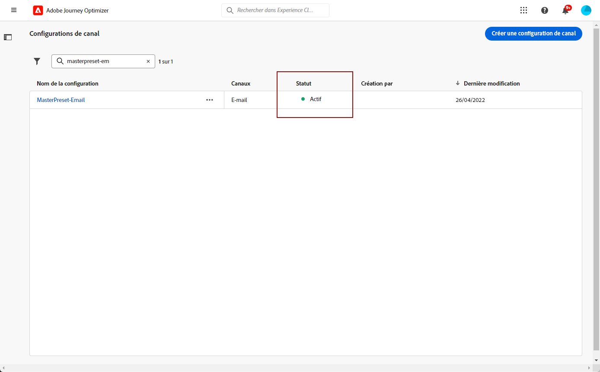
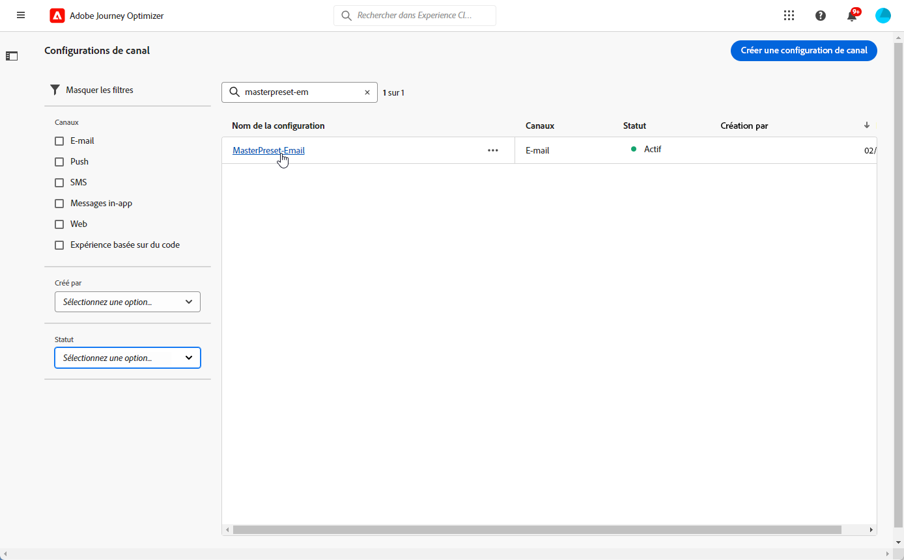

# Configurer des surfaces de canal {#set-up-channel-surfaces}

Avec [!DNL Journey Optimizer], vous pouvez configurer des surfaces de canal (c’est-à-dire des paramètres prédéfinis de message) qui définissent tous les paramètres techniques requis pour vos messages : type de courrier électronique, nom et adresse électronique de l’expéditeur, applications mobiles, etc.

>[!CAUTION]
>
> * Pour créer, modifier et supprimer des surfaces de canal, vous devez disposer de la variable [Gérer la surface du canal](../administration/high-low-permissions.md#manage-channel-surface) autorisation.
>
> * Vous devez effectuer les opérations suivantes : [Configuration des emails](#configure-email-settings), [Configuration push](../configuration/push-configuration.md) et [Configuration des SMS](../configuration/sms-configuration.md) étapes avant de créer des surfaces de canal.

Une fois les surfaces de canal configurées, vous pourrez les sélectionner lors de la création de messages à partir d’un parcours.

<!--
➡️ [Learn how to create and use email surfaces in this video](#video-presets)
-->

## Création d’une surface de canal {#create-channel-surface}

>[!CONTEXTUALHELP]
>id="ajo_admin_message_presets"
>title="Paramètres de surface du canal"
>abstract="Lors de la configuration d’une surface de canal, sélectionnez le canal auquel il s’applique et définissez tous les paramètres techniques requis pour vos messages, tels que le type de message, le sous-domaine, le nom de l’expéditeur, les applications mobiles, etc."

Pour créer une surface de canal, procédez comme suit :

1. Accédez au **[!UICONTROL Canaux]** > **[!UICONTROL Marques]** > **[!UICONTROL Surfaces des canaux]** , puis cliquez sur **[!UICONTROL Créer la surface du canal]**.

   

1. Saisissez un nom et une description (facultatif) pour la surface, puis sélectionnez le ou les canaux à configurer.

   

   >[!NOTE]
   >
   > Les noms doivent commencer par une lettre (A-Z). Ils ne peuvent contenir que des caractères alphanumériques. Vous pouvez également utiliser le trait de soulignement `_`, le point`.` et le trait d&#39;union `-`.

1. Si vous avez sélectionné le canal **[!UICONTROL E-mail]**, configurez vos paramètres comme indiqué dans [cette section](email-settings.md).

   

1. Pour le **[!UICONTROL Notification push]** channel, sélectionnez au moins une plateforme -  **iOS** et/ou **Android** - et les applications mobiles à utiliser pour chaque plateforme.

   

   >[!NOTE]
   >
   >Pour plus d’informations sur la configuration de votre environnement pour envoyer des notifications push, consultez [cette section](push-gs.md).

1. Pour le **[!UICONTROL SMS]** canal, définissez vos paramètres comme décrit dans la section [cette section](sms-configuration.md#message-preset-sms).

   

   >[!NOTE]
   >
   >Pour plus dʼinformations sur la configuration de votre environnement pour envoyer des messages SMS, consultez [cette section](sms-configuration.md).

1. Une fois tous les paramètres configurés, cliquez sur **[!UICONTROL Envoyer]** pour confirmer. Vous pouvez également enregistrer la surface du canal en tant que version préliminaire et reprendre sa configuration ultérieurement.

   

   >[!NOTE]
   >
   >Vous ne pouvez pas poursuivre la création de surface lorsque le pool IP sélectionné se trouve sous [edition](ip-pools.md#edit-ip-pool) (**[!UICONTROL Traitement]** status) et n’a jamais été associé au sous-domaine sélectionné. [En savoir plus](#subdomains-and-ip-pools)
   >
   >Enregistrez la surface en tant que brouillon et attendez que le pool IP ait la propriété **[!UICONTROL Succès]** pour reprendre la création de surface.

1. Une fois la surface du canal créée, elle s’affiche dans la liste avec le **[!UICONTROL Traitement]** statut.

   Au cours de cette étape, plusieurs vérifications seront effectuées afin de vérifier qu&#39;il a été correctement configuré. Le temps de traitement est d’environ **48 h à 72 h** et peut prendre jusqu’à **7 à 10 jours ouvrables**. 

   Ces vérifications comprennent des tests de configuration et des tests techniques effectués par l’équipe dʼAdobe :

   * Validation SPF
   * Validation DKIM
   * Validation des enregistrements MX
   * Vérification de la liste bloquée des adresses IP
   * Vérification de l&#39;hôte Helo
   * Vérification du pool d&#39;adresses IP
   * Enregistrement A/PTR, vérification du sous-domaine t/m/res

   >[!NOTE]
   >
   >Si les vérifications ne réussissent pas, découvrez les raisons possibles de l’échec dans [cette section](#monitor-channel-surfaces).

1. Une fois les vérifications effectuées, la surface du canal reçoit la valeur **[!UICONTROL Principal]** statut. Il est prêt à être utilisé pour diffuser des messages.

   

## Surveiller les surfaces des canaux {#monitor-channel-surfaces}

Toutes les surfaces de vos canaux s’affichent dans la **[!UICONTROL Canaux]** > **[!UICONTROL Surfaces des canaux]** . Des filtres sont disponibles pour vous aider à parcourir la liste (canal, utilisateur, statut).

Une fois créées, les surfaces des canaux peuvent avoir les états suivants :

* **[!UICONTROL Version préliminaire]**: La surface du canal a été enregistrée en tant que brouillon et n’a pas encore été envoyée. Ouvrez-le pour reprendre la configuration.
* **[!UICONTROL Traitement]**: La surface du canal a été envoyée et passe par plusieurs étapes de vérification.
* **[!UICONTROL Principal]**: La surface du canal a été vérifiée et peut être sélectionnée pour créer les messages.
* **[!UICONTROL En échec]**: Une ou plusieurs vérifications ont échoué lors de la vérification de la surface du canal.
* **[!UICONTROL Désactivé]**: La surface du canal est désactivée. Il ne peut pas être utilisé pour créer de nouveaux messages. 

En cas d’échec de la création de surface d’un canal, les détails sur chaque raison d’échec possible sont décrits ci-dessous.

Si l’une de ces erreurs se produit, contactez l’[assistance clientèle d’Adobe](https://helpx.adobe.com/fr/enterprise/admin-guide.html/enterprise/using/support-for-experience-cloud.ug.html){target=&quot;_blank&quot;} pour obtenir de l’aide.

* **Échec de la validation SPF** : SPF (Sender Policy Framework) est un protocole d’authentification d’e-mail qui permet de spécifier des adresses IP autorisées pouvant envoyer des e-mails à partir d’un sous-domaine donné. L’échec de validation SPF signifie que les adresses IP contenues dans l’enregistrement SPF ne correspondent pas aux adresses IP utilisées pour envoyer les e-mails aux fournisseurs de messagerie.

* **Échec de la validation DKIM** : DKIM (DomainKeys Identified Mail) permet au serveur destinataire de vérifier que le message reçu a été envoyé par l’expéditeur véritable du domaine associé et que le contenu du message d’origine n’a pas été modifié en cours de route. L’échec de validation DKIM signifie que les serveurs de messagerie de réception ne peuvent pas vérifier l’authenticité du contenu du message et son association avec le domaine d’envoi.:

* **Échec de la validation des enregistrements MX** : l’échec de la validation des enregistrements MX (Mail eXchange) signifie que les serveurs de messagerie chargés d’accepter les e-mails entrants pour le compte d’un sous-domaine donné ne sont pas correctement configurés.

* **Échec des configurations de délivrabilité** : l’échec des configurations de délivrabilité peut être dû à l’une des raisons suivantes :
   * Placement sur liste bloquée des adresses IP allouées
   * Nom `helo` non valide
   * Emails envoyés à partir d’adresses IP autres que celles spécifiées dans le pool IP de la surface correspondante
   * Impossibilité de diffuser des e-mails vers les boîtes de réception des principaux FAI tels que Gmail et Yahoo

## Modification de la surface d’un canal {#edit-channel-surface}

Pour modifier la surface d’un canal, procédez comme suit.

>[!NOTE]
>
>Vous ne pouvez pas modifier les **[!UICONTROL Paramètres des notifications push]**. Si la surface d&#39;un canal n&#39;est configurée que pour le canal Notification push, elle n&#39;est pas modifiable.

1. Dans la liste, cliquez sur le nom d’une surface de canal pour l’ouvrir.

   

1. Modifiez ses propriétés selon vos besoins.

   >[!NOTE]
   >
   >Si la surface d’un canal contient la propriété **[!UICONTROL Principal]** le statut, **[!UICONTROL Nom]**, **[!UICONTROL Sélectionner le canal]** et **[!UICONTROL Subdomain]** Les champs sont grisés et ne peuvent pas être modifiés.

1. Cliquez sur **[!UICONTROL Soumettre]** pour confirmer vos modifications.

   

   >[!NOTE]
   >
   >Vous pouvez également enregistrer la surface du canal en tant que brouillon et reprendre la mise à jour ultérieurement.

Une fois les modifications envoyées, la surface du canal passe par un cycle de validation similaire à celui en place lorsque [création d’une surface de canal](#create-channel-surface). Le temps de traitement des modifications peut prendre jusqu’à **3 heures**.

>[!NOTE]
>
>Si vous modifiez uniquement les champs **[!UICONTROL Description]**, **[!UICONTROL Type d’e-mail]** et/ou **[!UICONTROL Paramètres de relance de l’e-mail]**, la mise à jour est instantanée. 

### Détails de la mise à jour {#update-details}

Pour les surfaces de canal qui ont la propriété **[!UICONTROL Principal]** , vous pouvez vérifier les détails de la mise à jour. Pour ce faire :

Cliquez sur le bouton **[!UICONTROL Mise à jour récente]** qui s’affiche en regard du nom principal de la surface.

<!--You can also access the update details from an active channel surface while update is in progress.-->

Sur l’écran **[!UICONTROL Mise à jour récente]**, vous pouvez voir des informations telles que le statut de la mise à jour et la liste des modifications demandées. 

### Statuts de mise à jour {#update-statuses}

Une mise à jour de surface de canal peut avoir les états suivants :

* **[!UICONTROL Traitement]**: La mise à jour de la surface du canal a été envoyée et passe par plusieurs étapes de vérification.
* **[!UICONTROL Succès]**: La surface du canal mise à jour a été vérifiée et peut être sélectionnée pour créer les messages.
* **[!UICONTROL En échec]**: Une ou plusieurs vérifications ont échoué lors de la vérification de la mise à jour de la surface du canal.

Chaque statut est présenté ci-dessous.

#### En cours de traitement {#surface-processing}

Plusieurs contrôles de délivrabilité seront effectués pour vérifier que la surface a été correctement mise à jour.

>[!NOTE]
>
>Si vous modifiez uniquement les champs **[!UICONTROL Description]**, **[!UICONTROL Type d’e-mail]** et/ou **[!UICONTROL Paramètres de relance de l’e-mail]**, la mise à jour est instantanée. 

Le temps de traitement peut prendre jusqu’à **3 heures**. En savoir plus sur les contrôles effectués lors du cycle de validation dans [cette section](#create-channel-surface).

Si vous éditez une surface déjà principale :

* Son statut reste **[!UICONTROL Actif]** pendant que le processus de validation est en cours. 

* Le **[!UICONTROL Mise à jour récente]** s’affiche en regard du nom de la surface dans la liste des surfaces du canal.

* Pendant le processus de validation, les messages configurés à l&#39;aide de cette surface utilisent toujours l&#39;ancienne version de la surface.

>[!NOTE]
>
>Vous ne pouvez pas modifier la surface d’un canal pendant la mise à jour. Vous pouvez toujours cliquer sur son nom, mais tous les champs sont grisés. Les modifications ne seront pas répercutées tant que la mise à jour n’aura pas réussi. 

#### Réussite {#success}

Une fois le processus de validation réussi, la nouvelle version de la surface est automatiquement utilisée dans tous les messages utilisant cette surface. Cependant, vous devrez peut-être attendre :
* quelques minutes avant qu’il soit consommé par les messages unitaires, 
* jusqu’au lot suivant pour que la surface soit effective dans les messages par lots.

#### Échec {#failed}

Si le processus de validation échoue, l’ancienne version de la surface est toujours utilisée.

Pour en savoir plus sur les causes possibles d’échec, consultez [cette section](#monitor-channel-surfaces). 

En cas d’échec de la mise à jour, la surface est à nouveau modifiable. Vous pouvez cliquer sur son nom et mettre à jour les paramètres à corriger. 

## Désactivation de la surface d’un canal {#deactivate-a-surface}

Pour créer un **[!UICONTROL Principal]** la surface du canal n’est pas disponible pour créer de nouveaux messages, vous pouvez la désactiver. Toutefois, les messages des parcours qui utilisent actuellement cette surface ne seront pas affectés et continueront à fonctionner.

>[!NOTE]
>
>Vous ne pouvez pas désactiver la surface d’un canal pendant le traitement d’une mise à jour. Vous devez attendre que la mise à jour soit réussie ou qu’elle ait échoué. En savoir plus sur [modification des surfaces des canaux](#edit-channel-surface) et sur le [mettre à jour les états](#update-statuses).

1. Accédez à la liste des surfaces de canal.

1. Pour la principale surface de votre choix, cliquez sur le bouton **[!UICONTROL Autres actions]** bouton .

1. Sélectionnez **[!UICONTROL Désactiver]**.

   

>[!NOTE]
>
>Les surfaces de canal désactivées ne peuvent pas être supprimées pour éviter tout problème dans les parcours utilisant ces surfaces pour envoyer des messages.

Vous ne pouvez pas modifier directement la surface d’un canal désactivé. Cependant, vous pouvez le dupliquer et modifier la copie pour créer une nouvelle version que vous utiliserez pour créer de nouveaux messages. Vous pouvez également l’activer à nouveau et attendre que la mise à jour soit réussie pour le modifier. 

<!--
## How-to video{#video-presets}

Learn how to create channel surfaces, how to use them and how to delegate a subdomain and create an IP pool.

>[!VIDEO](https://video.tv.adobe.com/v/334343?quality=12)
-->
