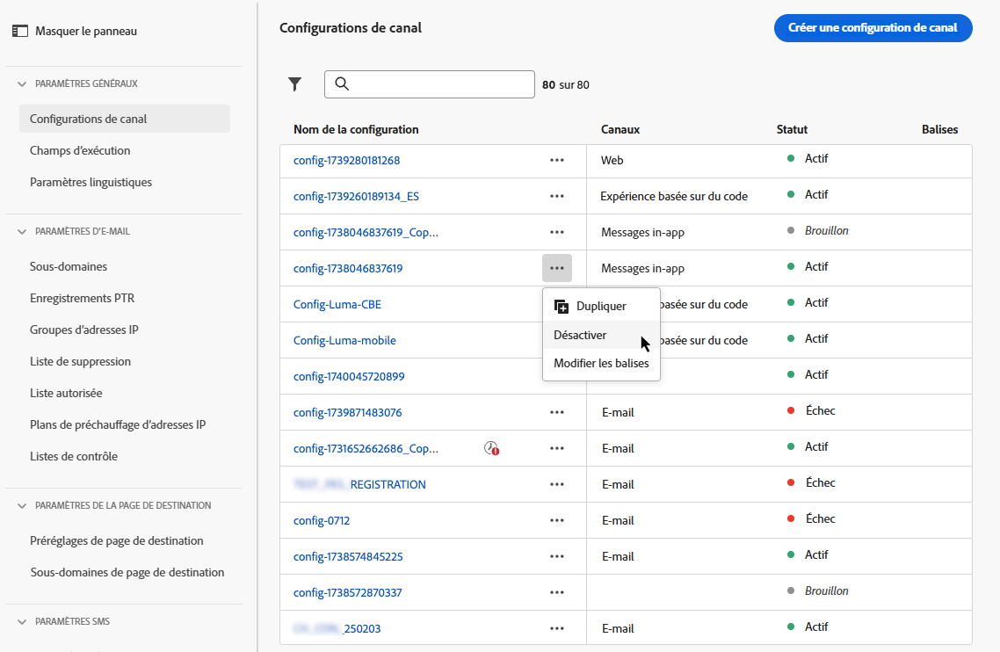

# Configuration des surfaces de canal {#set-up-channel-surfaces}

>[!CONTEXTUALHELP]
>id="ajo_admin_channel_surfaces"
>title="Surface de l’application"
>abstract="Une surface est une configuration qui a été définie par un administrateur système. Il contient tous les paramètres techniques pour l’envoi du message, tels que les paramètres d’en-tête, le sous-domaine, les applications mobiles, etc."

Avec [!DNL Journey Optimizer], vous pouvez configurer des surfaces de canal (c’est-à-dire des paramètres prédéfinis de message) qui définissent tous les paramètres techniques requis pour vos messages : type d’email, nom et adresse email de l’expéditeur, applications mobiles, configuration des SMS, etc.

>[!CAUTION]
>
> * Pour créer, modifier et supprimer des surfaces de canal, vous devez disposer de la variable [Gérer la surface du canal](../administration/high-low-permissions.md#manage-channel-surface) autorisation.
>
> * Vous devez effectuer les opérations suivantes : [Configuration des emails](../email/get-started-email-config.md), [Configuration push](../push/push-configuration.md) et [Configuration des SMS](../sms/sms-configuration.md) étapes avant de créer des surfaces de canal.

Une fois les surfaces de canal configurées, vous pourrez les sélectionner lors de la création de messages à partir d’un parcours ou d’une campagne.

<!--
➡️ [Learn how to create and use email surfaces in this video](#video-presets)
-->

## Création d’une surface de canal {#create-channel-surface}

>[!CONTEXTUALHELP]
>id="ajo_admin_message_presets_header"
>title="Paramètres de surface du canal"
>abstract="Lors de la configuration d’une surface de canal, sélectionnez le canal auquel il s’applique et définissez tous les paramètres techniques requis pour votre envoi, tels que le type d’email, le nom de l’expéditeur, les applications mobiles, la configuration des SMS, etc."

>[!CONTEXTUALHELP]
>id="ajo_admin_message_presets"
>title="Paramètres de surface du canal"
>abstract="Pour pouvoir créer des actions telles que des emails provenant d’un parcours ou d’une campagne, vous devez d’abord créer une surface de canal qui définit tous les paramètres techniques requis pour vos messages. Vous devez disposer de l’autorisation Gérer la surface du canal pour créer, modifier et supprimer les surfaces du canal."

Pour créer une surface de canal, procédez comme suit :

1. Accédez au **[!UICONTROL Channels]** > **[!UICONTROL Branding]** > **[!UICONTROL Channel surfaces]** , puis cliquez sur **[!UICONTROL Create channel surface]**.

   

1. Saisissez un nom et une description (facultatif) pour la surface, puis sélectionnez le ou les canaux à configurer.

   

   >[!NOTE]
   >
   > Les noms doivent commencer par une lettre (A-Z). Elle ne peut contenir que des caractères alphanumériques. Vous pouvez également utiliser des traits de soulignement. `_`, point`.` et trait d’union `-` caractères.

1. Si vous avez sélectionné la variable **[!UICONTROL Email]** canal, configurez vos paramètres comme décrit dans la section [cette section](../email/email-settings.md).

   

1. Pour le **[!UICONTROL Push Notification]** channel, sélectionnez au moins une plateforme -  **iOS** et/ou **Android** - et les applications mobiles à utiliser pour chaque plateforme.

   

   >[!NOTE]
   >
   >Pour plus d&#39;informations sur la configuration de votre environnement pour envoyer des notifications push, reportez-vous à la section [cette section](../push/push-gs.md).

1. Pour le **[!UICONTROL SMS]** canal, définissez vos paramètres comme décrit dans la section [cette section](../sms/sms-configuration.md#message-preset-sms).

   

   >[!NOTE]
   >
   >Pour plus d&#39;informations sur la configuration de votre environnement pour envoyer des SMS, reportez-vous à la section [cette section](../sms/sms-configuration.md).

1. Une fois tous les paramètres configurés, cliquez sur **[!UICONTROL Submit]** pour confirmer. Vous pouvez également enregistrer la surface du canal en tant que version préliminaire et reprendre sa configuration ultérieurement.

   

   >[!NOTE]
   >
   >Vous ne pouvez pas poursuivre la création de surface lorsque le pool IP sélectionné se trouve sous [edition](ip-pools.md#edit-ip-pool) (**[!UICONTROL Processing]** status) et n’a jamais été associé au sous-domaine sélectionné. [En savoir plus](#subdomains-and-ip-pools)
   >
   >Enregistrez la surface en tant que brouillon et attendez que le pool IP ait la propriété **[!UICONTROL Success]** pour reprendre la création de surface.

1. Une fois la surface du canal créée, elle s’affiche dans la liste avec le **[!UICONTROL Processing]** statut.

   Au cours de cette étape, plusieurs vérifications seront effectuées afin de vérifier qu’il a été correctement configuré. <!--The processing time is around **48h-72h**, and can take up to **7-10 business days**.-->

   >[!NOTE]
   >Lors de la création de la première surface d’email pour un sous-domaine donné, le temps de traitement peut prendre **10 minutes à 10 jours**. Si le sous-domaine sélectionné est déjà utilisé dans une autre surface d&#39;email, cela ne prendra que 3 heures.

   Ces contrôles incluent la configuration et les tests techniques effectués par l’équipe Adobe :

   * Validation SPF
   * Validation DKIM
   * Validation des enregistrements MX
   * Vérifier la liste bloquée des adresses IP
   * Vérification de l’hôte Helo
   * Vérification du pool d’adresses IP
   * Enregistrement A/PTR, vérification du sous-domaine t/m/res
   * Enregistrement FBL (cette vérification ne sera effectuée que la première fois qu’une surface d’email est créée pour un sous-domaine donné)

   >[!NOTE]
   >
   >Si les vérifications échouent, découvrez les raisons possibles de l’échec dans la section [cette section](#monitor-channel-surfaces).

1. Une fois les vérifications effectuées, la surface du canal reçoit la valeur **[!UICONTROL Active]** statut. Il est prêt à être utilisé pour diffuser des messages.

   

## Surveiller les surfaces des canaux {#monitor-channel-surfaces}

Toutes les surfaces de vos canaux s’affichent dans la **[!UICONTROL Channels]** > **[!UICONTROL Channel surfaces]** . Des filtres sont disponibles pour vous aider à parcourir la liste (canal, utilisateur, statut).

Une fois créées, les surfaces des canaux peuvent avoir les états suivants :

* **[!UICONTROL Draft]**: La surface du canal a été enregistrée en tant que brouillon et n’a pas encore été envoyée. Ouvrez-le pour reprendre la configuration.
* **[!UICONTROL Processing]**: La surface du canal a été envoyée et passe par plusieurs étapes de vérification.
* **[!UICONTROL Active]**: La surface du canal a été vérifiée et peut être sélectionnée pour créer les messages.
* **[!UICONTROL Failed]**: Une ou plusieurs vérifications ont échoué lors de la vérification de la surface du canal.
* **[!UICONTROL Deactivated]**: La surface du canal est désactivée. Il ne peut pas être utilisé pour créer de nouveaux messages.

En cas d’échec de la création de surface d’un canal, les détails sur chaque raison d’échec possible sont décrits ci-dessous.

Si l’une de ces erreurs se produit, contactez [Assistance clientèle d’Adobe](https://helpx.adobe.com/enterprise/admin-guide.html/enterprise/using/support-for-experience-cloud.ug.html){target=&quot;_blank&quot;} pour obtenir de l’aide.

* **Échec de la validation SPF**: SPF (Sender Policy Framework) est un protocole d’authentification d’email qui permet de spécifier des adresses IP autorisées pouvant envoyer des emails à partir d’un sous-domaine donné. L’échec de validation SPF signifie que les adresses IP contenues dans l’enregistrement SPF ne correspondent pas aux adresses IP utilisées pour envoyer les emails aux fournisseurs de messagerie.

* **Échec de la validation DKIM**: DKIM (DomainKeys Identified Mail) permet au serveur destinataire de vérifier que le message reçu a été envoyé par l&#39;expéditeur véritable du domaine associé et que le contenu du message d&#39;origine n&#39;a pas été modifié en chemin. L&#39;échec de validation DKIM signifie que les serveurs de messagerie de réception ne peuvent pas vérifier l&#39;authenticité du contenu du message et son association avec le domaine d&#39;envoi :

* **Échec de la validation des enregistrements MX**: L’échec de validation des enregistrements MX (Mail eXchange) signifie que les serveurs de messagerie chargés d’accepter les emails entrants pour le compte d’un sous-domaine donné ne sont pas correctement configurés.

* **Échec des configurations de délivrabilité**: L’échec des configurations de délivrabilité peut être dû à l’une des raisons suivantes :
   * Blocage des adresses IP allouées
   * Non valide `helo` name
   * Emails envoyés à partir d’adresses IP autres que celles spécifiées dans le pool IP de la surface correspondante
   * Impossible de diffuser des emails dans les boîtes de réception des principaux FAI

## Modification de la surface d’un canal {#edit-channel-surface}

Pour modifier la surface d’un canal, procédez comme suit.

>[!NOTE]
>
>Vous ne pouvez pas modifier la variable **[!UICONTROL Push notification settings]**. Si la surface d&#39;un canal n&#39;est configurée que pour le canal Notification push, elle n&#39;est pas modifiable.

1. Dans la liste, cliquez sur le nom d’une surface de canal pour l’ouvrir.

   

1. Modifiez ses propriétés selon vos besoins.

   >[!NOTE]
   >
   >Si la surface d’un canal contient la propriété **[!UICONTROL Active]** le statut, **[!UICONTROL Name]**, **[!UICONTROL Select channel]** et **[!UICONTROL Subdomain]** Les champs sont grisés et ne peuvent pas être modifiés.

1. Cliquez sur **[!UICONTROL Submit]** pour confirmer vos modifications.

   >[!NOTE]
   >
   >Vous pouvez également enregistrer la surface du canal en tant que brouillon et reprendre la mise à jour ultérieurement.

Une fois les modifications envoyées, la surface du canal passe par un cycle de validation similaire à celui en place lorsque [création d’une surface de canal](#create-channel-surface). Le temps de traitement de l’édition peut prendre jusqu’à **3 heures**.

>[!NOTE]
>
>Si vous modifiez uniquement la variable **[!UICONTROL Description]**, **[!UICONTROL Email type]** et/ou **[!UICONTROL Email retry parameters]** , la mise à jour est instantanée.

### Mise à jour des détails {#update-details}

Pour les surfaces de canal qui ont la propriété **[!UICONTROL Active]** , vous pouvez vérifier les détails de la mise à jour. Pour ce faire :

Cliquez sur le bouton **[!UICONTROL Recent update]** icône qui s’affiche en regard du nom de la surface active.

<!--You can also access the update details from an active channel surface while update is in progress.-->

Sur le **[!UICONTROL Recent update]** vous pouvez afficher des informations telles que l’état de mise à jour et la liste des modifications demandées.

<!---->

### Mise à jour des états {#update-statuses}

Une mise à jour de surface de canal peut avoir les états suivants :

* **[!UICONTROL Processing]**: La mise à jour de la surface du canal a été envoyée et passe par plusieurs étapes de vérification.
* **[!UICONTROL Success]**: La surface du canal mise à jour a été vérifiée et peut être sélectionnée pour créer les messages.
* **[!UICONTROL Failed]**: Une ou plusieurs vérifications ont échoué lors de la vérification de la mise à jour de la surface du canal.

Chaque état est présenté ci-dessous.

#### Traitement {#surface-processing}

Plusieurs contrôles de délivrabilité seront effectués pour vérifier que la surface a été correctement mise à jour.

>[!NOTE]
>
>Si vous modifiez uniquement la variable **[!UICONTROL Description]**, **[!UICONTROL Email type]** et/ou **[!UICONTROL Email retry parameters]** , la mise à jour est instantanée.

Le temps de traitement peut prendre jusqu’à **3 heures**. En savoir plus sur les contrôles effectués lors du cycle de validation dans [cette section](#create-channel-surface).

Si vous éditez une surface déjà active :

* Son statut reste **[!UICONTROL Active]** pendant que le processus de validation est en cours.

* Le **[!UICONTROL Recent update]** s’affiche en regard du nom de la surface dans la liste des surfaces du canal.

* Pendant le processus de validation, les messages configurés à l&#39;aide de cette surface utilisent toujours l&#39;ancienne version de la surface.

>[!NOTE]
>
>Vous ne pouvez pas modifier la surface d’un canal pendant la mise à jour. Vous pouvez toujours cliquer sur son nom, mais tous les champs sont grisés. Les modifications ne seront pas répercutées tant que la mise à jour n’aura pas été effectuée correctement.

#### Succès {#success}

Une fois le processus de validation réussi, la nouvelle version de la surface est automatiquement utilisée dans tous les messages utilisant cette surface. Cependant, vous devrez peut-être attendre :
* quelques minutes avant d&#39;être consommée par les messages unitaires,
* jusqu’au lot suivant pour que la surface soit effective dans les messages par lots.

#### En échec {#failed}

Si le processus de validation échoue, l’ancienne version de la surface est toujours utilisée.

En savoir plus sur les raisons possibles de l’échec dans [cette section](#monitor-channel-surfaces).

En cas d’échec de la mise à jour, la surface est à nouveau modifiable. Vous pouvez cliquer sur son nom et mettre à jour les paramètres à corriger.

## Désactivation de la surface d’un canal {#deactivate-a-surface}

Pour créer un **[!UICONTROL Active]** la surface du canal n’est pas disponible pour créer de nouveaux messages, vous pouvez la désactiver. Toutefois, les messages des parcours qui utilisent actuellement cette surface ne seront pas affectés et continueront à fonctionner.

>[!NOTE]
>
>Vous ne pouvez pas désactiver la surface d’un canal pendant le traitement d’une mise à jour. Vous devez attendre que la mise à jour soit réussie ou qu’elle ait échoué. En savoir plus sur [modification des surfaces des canaux](#edit-channel-surface) et sur le [mettre à jour les états](#update-statuses).

1. Accédez à la liste des surfaces de canal.

1. Pour la surface active de votre choix, cliquez sur le bouton **[!UICONTROL More actions]** bouton .

1. Sélectionner **[!UICONTROL Deactivate]**.

   

>[!NOTE]
>
>Les surfaces de canal désactivées ne peuvent pas être supprimées pour éviter tout problème dans les parcours utilisant ces surfaces pour envoyer des messages.

Vous ne pouvez pas modifier directement la surface d’un canal désactivé. Cependant, vous pouvez le dupliquer et modifier la copie pour créer une version que vous utiliserez pour créer de nouveaux messages. Vous pouvez également l’activer à nouveau et attendre que la mise à jour soit réussie pour la modifier.

<!--
## How-to video{#video-presets}

Learn how to create channel surfaces, how to use them and how to delegate a subdomain and create an IP pool.

>[!VIDEO](https://video.tv.adobe.com/v/334343?quality=12)
-->
