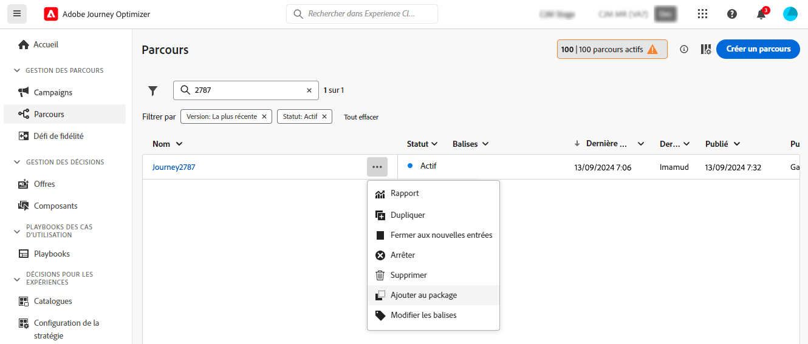
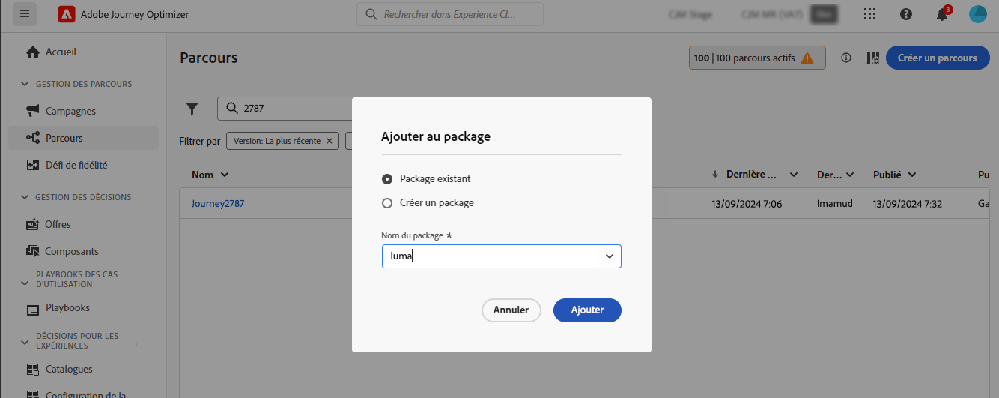
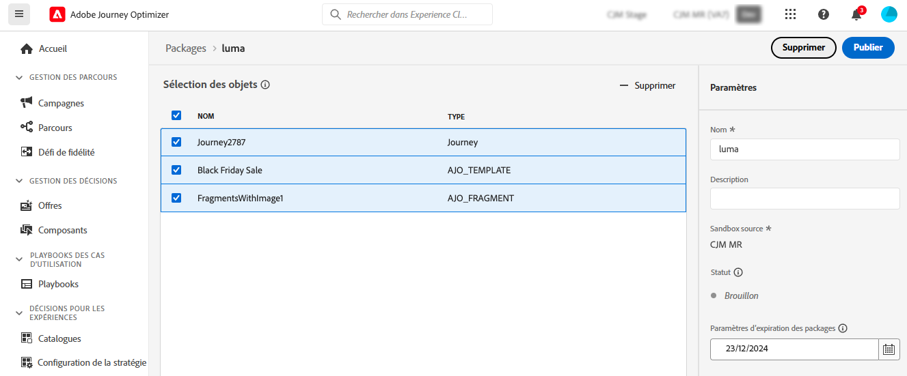
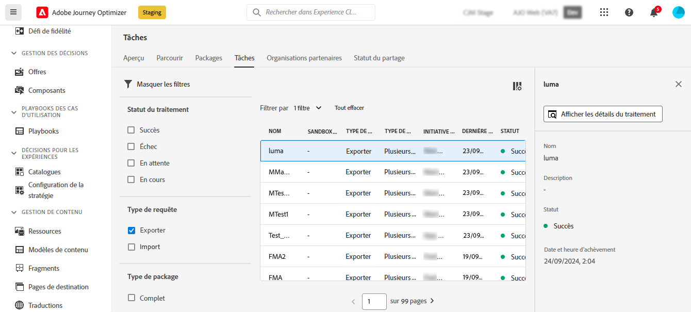
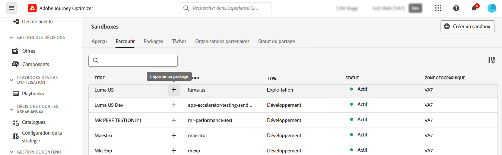
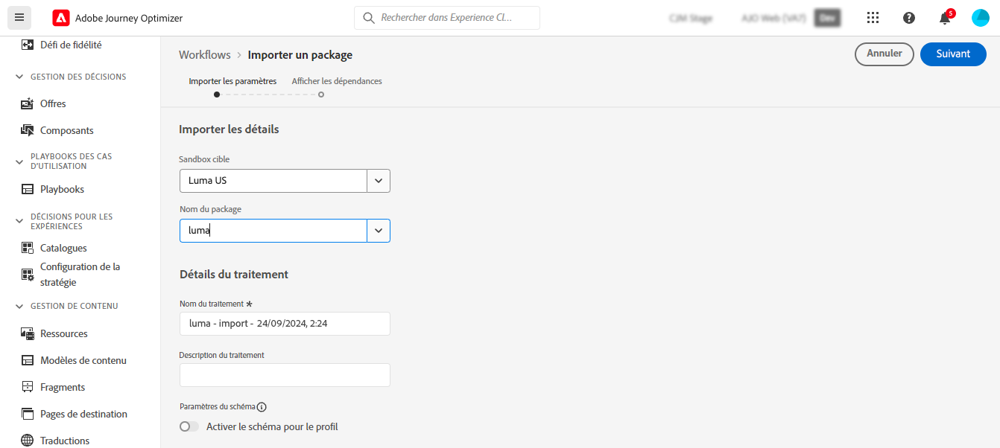
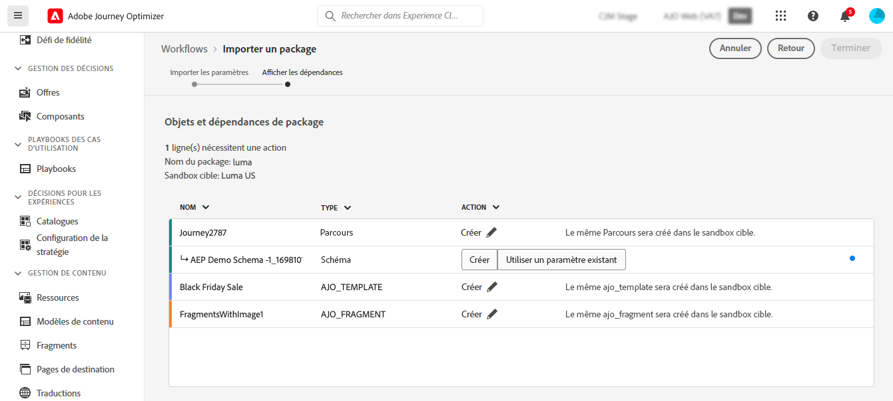
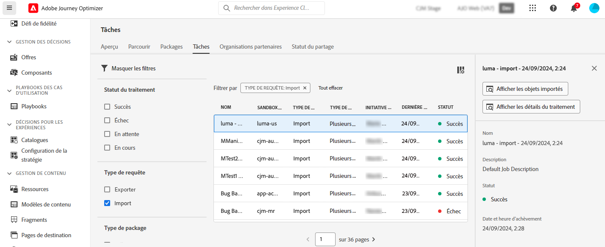

# Exporter des objets vers un autre sandbox {#copy-to-sandbox}

Vous pouvez copier des objets tels que des parcours, des actions personnalisées, des modèles de contenu ou des fragments dans plusieurs sandbox en utilisant les fonctionnalités d’export et d’import de packages. Un package peut se composer d’un ou de plusieurs objets. Tous les objets inclus dans un package doivent provenir du même sandbox.

Cette page décrit le cas d’utilisation de l’outil Sandbox dans le contexte de Journey Optimizer. Pour plus d’informations sur la fonctionnalité elle-même, reportez-vous au [guide des outils Sandbox](https://experienceleague.adobe.com/docs/experience-platform/sandbox/ui/sandbox-tooling.html?lang=fr#abobe-journey-optimizer-objects){target="_blank"} d’Adobe Experience Platform.

>[!NOTE]
>
>Cette fonctionnalité nécessite les autorisations suivantes de la part de la fonctionnalité **Administration des sandbox** : gérer (ou afficher) les sandbox et gérer les packages. [En savoir plus](../administration/ootb-permissions.md)

Le processus de copie est réalisé via un export de package et un import entre les sandbox source et cible. Les étapes générales pour copier un parcours d’un sandbox vers un autre sont les suivantes :

1. [Ajouter l’objet à exporter en tant que package dans le sandbox source](#export)
1. [Publier le package](#publish)
1. [Importer le package dans le sandbox cible](#import)

## Objets exportés et bonnes pratiques {#objects}

Journey Optimizer permet d’exporter des parcours, des actions personnalisées, des modèles de contenu, des fragments et d’autres objets vers un autre sandbox. Les sections suivantes fournissent des informations et des bonnes pratiques pour chaque type d’objet.

### Bonnes pratiques générales {#global}

* Lors de la copie d’un objet, toutes les dépendances (telles que les fragments imbriqués, les audiences de parcours ou les actions) sont correctement mises à jour dans l’objet parent, assurant ainsi un mappage correct dans le sandbox cible.

* Si un objet exporté contient une personnalisation de profil, assurez-vous que le schéma approprié existe dans le sandbox cible afin d’éviter tout problème de personnalisation.

* La migration de pages de destination entre des sandbox n’est actuellement pas prise en charge. Lorsque vous copiez un parcours dans un autre sandbox, toutes les références aux pages de destination dans votre parcours ou dans le contenu des e-mails dirigeront toujours vers les identifiants de page de destination d’origine (source) du sandbox. Après la migration, vous devez mettre à jour manuellement toutes les références de page de destination dans votre parcours et vos contenus d’e-mails afin d’utiliser les identifiants de page de destination corrects du sandbox cible (de destination). Voir [Créer et publier des pages de destination](../landing-pages/create-lp.md).

+++ Parcours

* **Dépendances copiées** : lors de l’export d’un parcours, en plus du parcours lui-même, Journey Optimizer copie également la plupart des objets dont dépend le parcours : audiences, actions personnalisées, schémas, événements et actions. Pour plus d’informations sur les objets copiés, reportez-vous au [guide des outils Sandbox](https://experienceleague.adobe.com/docs/experience-platform/sandbox/ui/sandbox-tooling.html?lang=fr#abobe-journey-optimizer-objects){target="_blank"} d’Adobe Experience Platform.

* **Validation manuelle recommandée** : certains éléments associés peuvent ne pas être copiés dans le sandbox de destination. Nous vous recommandons vivement de vérifier la viabilité du parcours, avant sa publication par exemple. Vous pourrez ainsi identifier tout objet potentiellement manquant.

* **Mode brouillon et unicité** : les objets copiés dans le sandbox cible sont uniques et il n’y a aucun risque de remplacer des éléments existants. Le parcours et tous les messages qu’il contient sont transférés en mode brouillon. Vous pouvez ainsi effectuer une validation approfondie du parcours avant sa publication sur le sandbox cible.

* **Métadonnées** : le processus de copie ne copie que les métadonnées et les objets de ce parcours. Aucune donnée de profil ou de jeu de données n’est copiée dans le cadre de ce processus.

* **Actions personnalisées**

   * Lors de l’export d’actions personnalisées, les paramètres de payload et de configuration d’URL sont copiés. Toutefois, pour des raisons de sécurité, les paramètres d’authentification ne sont pas copiés et sont remplacés par « INSÉRER LE SECRET ICI ». Les valeurs constantes d’en-tête de requête et de paramètre de requête sont également remplacées par « INSÉRER LE SECRET ICI ».

     Cela inclut les actions personnalisées à des fins spéciales ([!DNL Adobe Campaign Standard], [!DNL Campaign Classic], [!DNL Marketo Engage]).

   * Lors de la copie d’un parcours dans un autre sandbox, si vous sélectionnez « Utiliser existant » pour une action personnalisée au cours du processus d’import, l’action personnalisée existante que vous sélectionnez doit être identique à l’action personnalisée source (c’est-à-dire la même configuration, les mêmes paramètres, etc.). Dans le cas contraire, la nouvelle copie de parcours contiendra des erreurs qui ne pourront pas être résolues dans la zone de travail.

* **Sources de données, groupes de champs et événements** : lors de la copie d’un parcours qui utilise des événements, des sources de données ou des groupes de champs, le processus d’import vérifie automatiquement si des composants portant le même nom et du même type existent déjà dans le sandbox cible. Par exemple, un événement unitaire sera remplacé par un événement unitaire dans le sandbox cible portant le même nom. Il en va de même pour les événements métier, les sources de données personnalisées et les groupes de champs basés sur des API et des schémas utilisés dans les parcours. Si un événement unitaire provenant du sandbox source porte le même nom qu’un sandbox de destination d’événement métier, il n’est ni copié ni créé. Cela s’applique également à tous les autres composants.

+++

+++ Campagnes

Les campagnes sont copiées avec tous les éléments liés au profil, à l’audience, au schéma, aux messages intégrés et aux objets dépendants. Toutefois, les éléments suivants **ne sont pas** copiés :

* Variantes multilingues et paramètres de langue
* Règles métier
* Balises
* Libellés DULE (application et libellé d’utilisation des données)

Lors de la copie de campagnes, assurez-vous que les objets répertoriés ci-dessous sont validés dans le sandbox cible afin d’éviter toute erreur de configuration :

* **Configurations de canal** : les configurations de canal sont copiées avec les campagnes. Une fois les campagnes copiées, les configurations de canal doivent être sélectionnées manuellement dans le sandbox cible.
* **Variantes et paramètres d’expérience** : les variantes et paramètres d’expérience sont inclus dans le processus de copie de la campagne. Validez ces paramètres dans le sandbox cible après l’import.
* **Prise de décisions unifiée** : les politiques de décision et les éléments de décision sont pris en charge pour l’export et l’import. Assurez-vous que les dépendances liées aux décisions sont correctement mappées dans le sandbox cible.

+++

+++ Prise de décisions

* Les objets ci-dessous doivent être présents dans le sandbox de destination avant de copier les objets de prise de décisions :

   * les attributs de profil utilisés dans les objets de prise de décisions,
   * le groupe de champs des attributs d’offre personnalisés,
   * les schémas des trains de données utilisés pour les attributs de contexte dans les règles, le classement ou la limitation.

* La copie de sandbox pour les formules de classement avec des modèles d’IA n’est actuellement pas prise en charge.

* Lors de la copie d’une campagne, les éléments de décision (éléments d’offre) ne sont pas automatiquement copiés. Veillez à les copier individuellement à l’aide de l’option « Ajouter au package ».

* Si une politique de décision comporte une stratégie de sélection, les éléments de décision doivent être ajoutés séparément. Si elle comporte des éléments de décision manuels/de secours, ils sont automatiquement ajoutés en tant que dépendances directes.

* Lors de la copie d’entités de prise de décisions, veillez à copier les éléments de décision **avant** tout autre objet. Par exemple, si vous copiez une collection en premier et qu’il n’existe aucune offre dans le nouveau sandbox, cette nouvelle collection reste vide.

* Lors de la copie d’entités avec des dépendances (un schéma, des segments, par exemple), cliquez sur « Créer » en regard de l’entité pour la désélectionner et afficher l’option « Utiliser celui existant » pour les artefacts dépendants. D’autres dépendances peuvent nécessiter de répéter cette étape plus bas dans la hiérarchie.

  Exemple : lors de l’import d’une campagne, pour réutiliser un schéma de train de données dans une règle, cliquez sur « Créer » pour DECISIONING_STRATEGY, puis de nouveau sur DECISIONING_RULES, afin d’afficher l’option « Utiliser celui existant » pour le schéma de train de données.

* Pour les entités qui dépendent d’un schéma contextuel de train de données, vérifiez que le train de données est créé au préalable et sélectionnez un schéma existant pour celui-ci.

* Si vous cliquez directement sur « Terminer » lors de l’import, toutes les dépendances sont recréées.

+++

+++ Modèles de contenu

* Lors de l’export d’un modèle de contenu, tous les fragments imbriqués sont également copiés avec celui-ci.

* L’export de modèles de contenu peut parfois entraîner une duplication de fragments. Par exemple, si deux modèles partagent le même fragment et sont copiés dans des packages distincts, les deux modèles devront réutiliser le même fragment dans le sandbox cible. Pour éviter la duplication, sélectionnez l’option « Utiliser le fragment existant » lors du processus d’import. [Découvrir comment importer un package](#import)

* Pour éviter toute duplication, il est recommandé d’exporter les modèles de contenu dans un seul package. Cela permet au système de gérer efficacement la déduplication.

+++

+++ Fragments

* Les fragments peuvent avoir plusieurs statuts comme Actif, Brouillon et Actif avec brouillon en cours. Lors de l’export d’un fragment, son dernier état Brouillon est copié dans le sandbox cible.

* Lors de l’export d’un fragment, tous les fragments imbriqués sont également copiés avec celui-ci.

+++

## Ajouter des objets en tant que package {#export}

Pour copier des objets dans un autre sandbox, vous devez d’abord les ajouter en tant que package dans le sandbox source. Procédez comme suit :

1. Accédez à l’inventaire où est stocké le premier objet que vous souhaitez copier, comme la liste des parcours. Cliquez sur l’icône **Autres actions** (points de suspension en regard du nom de l’objet) et cliquez sur **Ajouter au package**.

   

1. Dans la fenêtre **Ajouter au package**, choisissez si vous souhaitez ajouter l’objet à un package existant ou créer un package :

   

   * **Package existant** : sélectionnez le package dans le menu déroulant.
   * **Créer un nouveau package** : saisissez le nom du package. Vous pouvez également ajouter une description.

1. Répétez ces étapes pour ajouter tous les objets que vous souhaitez exporter avec votre package.

## Publier le package à exporter {#publish}

Une fois votre package prêt à être exporté, procédez comme suit pour le publier :

1. Accédez au menu **[!UICONTROL Administration]** > **[!UICONTROL Sandbox]** et sélectionnez l’onglet **Packages**.

1. Ouvrez le package à exporter, sélectionnez les objets à exporter et cliquez sur **Publier**.

   Dans cet exemple, nous allons exporter un parcours, un modèle de contenu et un fragment.

   

1. Pour suivre le statut de publication du package depuis l’onglet **[!UICONTROL Traitements]**. Pour plus d’informations sur un traitement, sélectionnez-le dans la liste et cliquez sur le bouton **[!UICONTROL Afficher les détails de l’import]**.

   

## Importer le package dans le sandbox cible {#import}

Une fois le package publié, vous devez l’importer vers le sandbox cible. Procédez comme suit :

1. Accédez au menu **[!UICONTROL Sandbox]** et sélectionnez l’onglet **[!UICONTROL Parcourir]**.

1. Recherchez le sandbox dans lequel vous souhaitez importer le package, puis cliquez sur l’icône + en regard de son nom.

   

   >[!NOTE]
   >
   >Seuls les sandbox de votre organisation sont disponibles.

1. Dans le champ **Sandbox cible**, vérifiez que les sandbox cibles appropriés sont sélectionnés et sélectionnez le package à importer dans la liste déroulante **[!UICONTROL Nom du package]**. Cliquez sur **Suivant**.

   

1. Examinez les objets et les dépendances du package. Il s’agit de la liste des objets qui ont été ajoutés au package, ainsi que d’autres objets dont les parcours dépendent, tels que les audiences, les schémas, les événements ou les actions.

   Pour chaque objet, vous pouvez choisir d’en créer un nouveau ou d’en utiliser un existant dans le sandbox cible. Cela vous permet, par exemple, d’éviter la duplication de fragments qui peut se produire lors de l’import de modèles de contenu à l’aide de fragments communs.

   

1. Cliquez sur le bouton **Terminer** situé dans le coin supérieur droit pour commencer à copier le package dans le sandbox cible. La durée du processus de copie dépend de la complexité des objets et du nombre d’objets à copier.

1. Cliquez sur le traitement d’import pour vérifier le résultat de la copie :

   * Cliquez sur le bouton **Afficher les objets importés** pour afficher chaque objet copié.
   * Cliquez sur **Afficher les détails de l’import** pour vérifier les résultats de l’import de chaque objet.

   

1. Accédez à votre sandbox cible et vérifiez minutieusement que tous les objets sont copiés.
