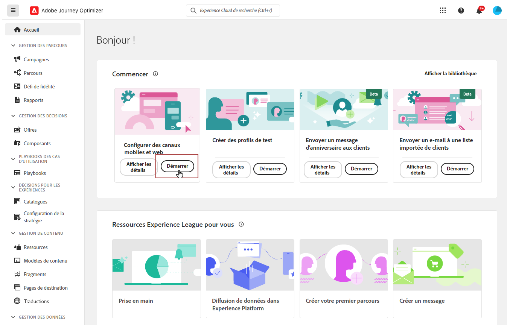
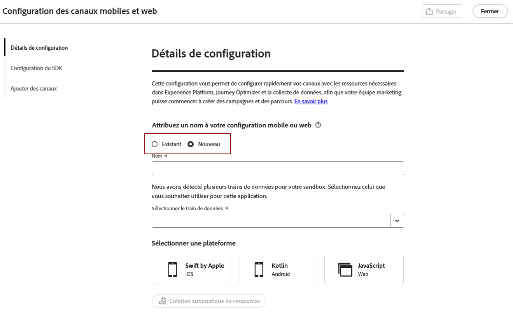

# Créer une configuration de canal {#set-mobile-ios}

>[!CONTEXTUALHELP]
>id="ajo_mobile_web_setup_javascript_code"
>title="Code JavaScript"
>abstract="La balise head contient des métadonnées et des ressources essentielles qui sont chargées avant le contenu principal de votre page web. Le placement du code dans cette section garantit son initialisation correcte et son exécution précoce, ce qui permet à votre page web de se charger et de fonctionner efficacement. En ajoutant du code à la section head, vous améliorez la structure, les performances et l’expérience d’utilisation globale de votre site."

>[!CONTEXTUALHELP]
>id="ajo_mobile_web_setup_push_token"
>title="Récupérer le jeton d’appareil"
>abstract="Pour vous assurer que le jeton push du périphérique est correctement synchronisé avec votre profil Adobe Experience Platform, vous devez incorporer le code suivant dans votre application. Cette intégration est essentielle pour maintenir des fonctionnalités de communication à jour et garantir une expérience d’utilisation transparente."

>[!CONTEXTUALHELP]
>id="ajo_mobile_web_setup_push_xcode"
>title="Lancer l’application à partir de Xcode"
>abstract="Pour obtenir votre jeton push, commencez par lancer votre application à l’aide de Xcode. Une fois l’application lancée, redémarrez-la pour vous assurer que le processus de validation est terminé. Adobe fournira alors votre jeton push dans le cadre des résultats de la validation. Ce jeton est essentiel pour activer les notifications push et s’affiche une fois le paramétrage validé."

>[!CONTEXTUALHELP]
>id="ajo_mobile_web_push_certificate_fcm"
>title="Fournir un certificat push"
>abstract="Effectuez le glisser-déposer de votre fichier de clé privée .json. Ce fichier contient les informations d’authentification requises pour l’intégration et la communication sécurisées entre votre application et le serveur."

>[!CONTEXTUALHELP]
>id="ajo_mobile_web_setup_push_certificate"
>title="Fournir un certificat push"
>abstract="Le fichier de clé .p8 contient une clé privée utilisée pour authentifier votre application auprès des serveurs Apple pour les notifications push sécurisées. Vous pouvez acquérir cette clé à partir de la page Certificats, identifiants et profils de votre compte de développeur ou développeuse."

>[!CONTEXTUALHELP]
>id="ajo_mobile_web_setup_push_key_id"
>title="ID de clé"
>abstract="L’ID de clé, une chaîne de 10 caractères attribuée lors de la création de la clé d’authentification p8, se trouve sous l’onglet **Clés** de la page Certificats, identifiants et profils de votre compte de développeur ou développeuse."

>[!CONTEXTUALHELP]
>id="ajo_mobile_web_setup_push_team_id"
>title="ID d’équipe"
>abstract="L’ID d’équipe, une valeur de chaîne utilisée pour identifier votre équipe, se trouve sous l’onglet **Abonnement** de votre compte de développeur ou développeuse."

Ce paramètre simplifie la configuration rapide de canaux marketing, mettant facilement à disposition toutes les ressources essentielles dans les applications Experience Platform, Journey Optimizer et Collecte de données. Cela permet à votre équipe marketing de commencer rapidement à créer des campagnes et des parcours.

1. Sur la page d’accueil de Journey Optimizer, cliquez sur **[!UICONTROL Commencer]** dans la carte **[!UICONTROL Configurer les canaux mobiles et web]**.

   

1. Créez une **[!UICONTROL nouvelle]** configuration.

   Si vous disposez déjà de configurations, vous pouvez en sélectionner une ou en créer une nouvelle.

   

1. Saisissez un **[!UICONTROL Nom]** pour votre nouvelle configuration et sélectionnez ou créez votre **[!UICONTROL Train de données]**. Ce **[!UICONTROL nom]** sera utilisé pour toutes les ressources créées automatiquement.

1. Si votre entreprise dispose de plusieurs trains de données, sélectionnez-en un parmi les options existantes. Si vous n’en avez pas, un train de données sera créé automatiquement.

1. Sélectionnez votre plateforme et cliquez sur **[!UICONTROL Créer automatiquement des ressources]**.

1. Pour simplifier le processus de configuration, les ressources nécessaires sont automatiquement créées pour vous aider à démarrer. Cela comprend la création d’une **[!UICONTROL propriété de balise mobile]** et l’installation d’extensions.

[En savoir plus sur les ressources générées automatiquement](set-mobile-config.md#auto-create-resources)

1. Une fois la génération des ressources terminée, suivez les instructions de l’interface d’utilisation pour configurer et valider vos SDK et canaux.

1. Une fois la configuration terminée, partagez la **[!UICONTROL configuration de canal]** générée automatiquement avec les personnes membres de l’équipe chargées de créer des parcours et des campagnes.

   {zoomable="yes"}

1. Vous devez désormais référencer la **[!UICONTROL configuration de canal]** dans l’interface Campagnes ou Parcours, ce qui permet une connexion transparente entre votre paramétrage et l’exécution des parcours et campagnes ciblés pour votre audience.

## Modifier une configuration existante mobile {#reconnect}

Une fois votre configuration créée, vous pouvez facilement la revoir à tout moment pour ajouter des canaux supplémentaires ou effectuer d’autres réglages en fonction de vos besoins.

1. Sur la page d’accueil de Journey Optimizer, cliquez sur **[!UICONTROL Commencer]** dans la carte **[!UICONTROL Configurer les canaux mobiles et web]**.

   

1. Sélectionnez **[!UICONTROL Existant]** et choisissez votre **[!UICONTROL propriété de balise]** existante dans la liste déroulante.

   

1. Lors de l’accès à votre configuration existante, vous devez vous reconnecter à Adobe Assurance. Dans le menu Configuration du SDK, cliquez sur **[!UICONTROL Reconnecter]**.

   

1. Sélectionnez votre appareil dans la liste déroulante **[!UICONTROL Périphériques disponibles]** et cliquez sur **[!UICONTROL Connecter]**.

   {zoomable="yes"}

1. Vous pouvez maintenant mettre à jour votre configuration si nécessaire.
