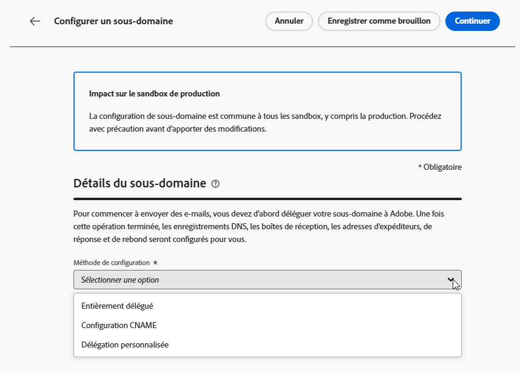
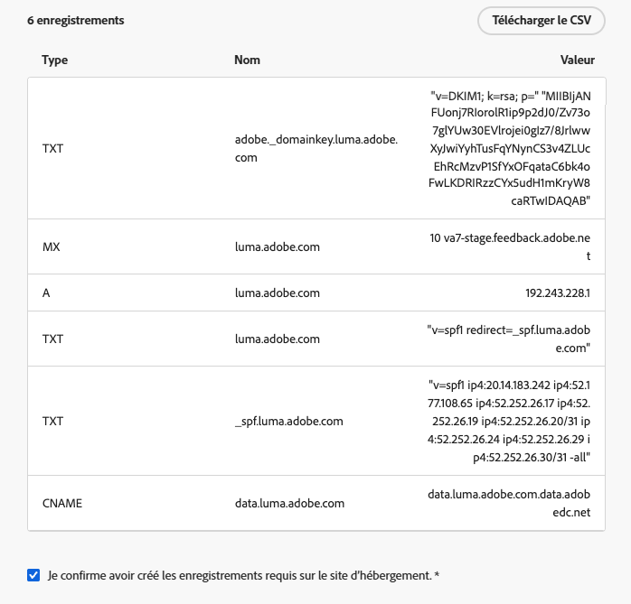
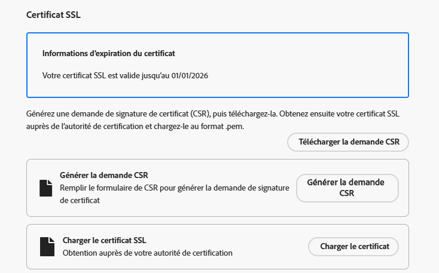
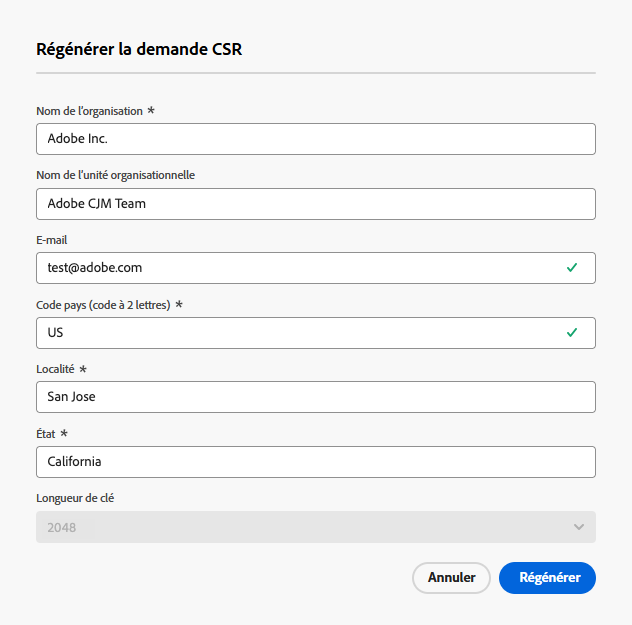

# Configurer un sous-domaine personnalisé {#delegate-custom-subdomain}

>[!AVAILABILITY]
>
>Cette fonctionnalité est en disponibilité limitée. Contactez votre représentant ou représentante Adobe pour en bénéficier.

Au lieu des méthodes [Délégation complète](about-subdomain-delegation.md#full-subdomain-delegation) et [Configuration CNAME](about-subdomain-delegation.md#subdomain-delegation-methods), la méthode **Délégation personnalisée** vous permet de prendre en charge vos sous-domaines dans Journey Optimizer et d’avoir un contrôle total sur les certificats générés.

>[!NOTE]
>
>Si votre sous-domaine est actuellement configuré avec CNAME, vous pouvez également le migrer vers la délégation personnalisée. [En savoir plus](custom-subdomain-migration.md)

Dans le cadre de ce processus, Adobe doit s’assurer que votre DNS est configuré de manière appropriée pour la diffusion, le rendu et le suivi des messages. C’est pourquoi il vous sera demandé de [charger le certificat SSL](#upload-ssl-certificate) obtenu auprès de l’autorité de certification et de suivre les étapes de la [feedback loop](#feedback-loop-steps) en vérifiant la propriété du domaine et l’adresse e-mail de signalement.

Pour configurer un sous-domaine personnalisé, procédez comme suit.

1. Accédez au menu **[!UICONTROL Administration]** > **[!UICONTROL Canaux]** > **[!UICONTROL Paramètres des e-mails]** > **[!UICONTROL Sous-domaines]**.

1. Cliquez sur **[!UICONTROL Configurer le sous-domaine]**.

1. Dans la section **[!UICONTROL Configurer la méthode]**, sélectionnez **[!UICONTROL Délégation personnalisée]**.

   {width=90%}

1. Indiquez le nom du sous-domaine à déléguer.

   >[!CAUTION]
   >
   >Vous ne pouvez pas utiliser le même domaine d’envoi pour envoyer des messages depuis [!DNL Adobe Journey Optimizer] et à partir d’un autre produit, tel que [!DNL Adobe Campaign] ou [!DNL Adobe Marketo Engage].

## Créer des enregistrements DNS {#create-dns-records}

>[!CONTEXTUALHELP]
>id="ajo_admin_subdomain_custom_dns"
>title="Générer les enregistrements DNS correspondants"
>abstract="Pour déléguer un sous-domaine personnalisé à Adobe, vous devez copier-coller les informations du serveur de noms Adobe affichées dans l’interface Journey Optimizer de votre solution d’hébergement de domaine pour générer les enregistrements DNS correspondants."

1. La liste des enregistrements à placer dans vos serveurs DNS s’affiche. Copiez ces enregistrements un par un ou en téléchargeant un fichier CSV.

1. Accédez à votre solution d’hébergement de domaine pour générer les enregistrements DNS correspondants.

1. Assurez-vous que tous les enregistrements DNS ont été générés dans votre solution d&#39;hébergement de domaine.

1. Si tout est correctement configuré, cochez la case « Je confirme... ».

   {width="75%"}

## Charger le certificat SSL {#upload-ssl-certificate}

>[!CONTEXTUALHELP]
>id="ajo_admin_subdomain_custom-ssl"
>title="Générer la demande de signature de certificat"
>abstract="Lors de la configuration d’un nouveau sous-domaine personnalisé, vous devez générer la demande de signature de certificat (CSR), la remplir et l’envoyer à l’autorité de certification pour obtenir le certificat SSL que vous devez charger dans Journey Optimizer."

>[!CONTEXTUALHELP]
>id="ajo_admin_subdomain_key_length"
>title="Sélectionner une longueur de clé"
>abstract="La longueur de la clé peut être de 2 048 ou 4 096 bits uniquement. Elle ne peut plus être modifiée une fois le sous-domaine envoyé."

1. Dans la section **[!UICONTROL Certificat SSL]**, cliquez sur **[!UICONTROL Générer une demande de signature de certificat]**.

   {width="85%"}

   >[!NOTE]
   >
   >La date d’expiration de votre certificat SSL s’affiche. Une fois cette date atteinte, vous devrez charger un nouveau certificat.

1. Remplissez le formulaire qui s’affiche et générez la demande de signature de certificat.

   {width="70%"}

   >[!NOTE]
   >
   >La longueur de la clé peut être de 2 048 ou 4 096 bits uniquement. Elle ne peut plus être modifiée une fois le sous-domaine envoyé.

1. Cliquez sur **[!UICONTROL Télécharger la CSR]** et enregistrez le formulaire sur votre ordinateur local.

1. Envoyez-le à l’autorité de certification pour obtenir votre certificat SSL. Avant d’envoyer cette CSR à votre autorité de certification pour signature, prenez en compte les points suivants :

   * La CSR téléchargée à l’étape 3 est réservée à data.subdomain.com.

   * Toutefois, le certificat doit couvrir à la fois data.subdomain.com et cdn.subdomain.com en tant qu’entrées de noms alternatifs de l’objet (SAN) dans un seul certificat. Par exemple, si vous déléguez example.adobe.com, alors data.subdomain.com correspond à data.example.adobe.com et cdn.subdomain.com correspond à cdn.example.adobe.com.

   * Les sous-domaines de données (data.example.adobe.com) et de CDN (cdn.example.adobe.com) doivent être ajoutés en tant qu’entrées d’homologue dans le même certificat.

   * La plupart des autorités de certification vous permettent d’ajouter des SAN supplémentaires (tels que le sous-domaine du CDN) pendant le processus de signature.

      * Par le biais du portail de l’autorité de certification (recommandé, le cas échéant), ou
      * En faisant une demande manuelle à leur équipe d’assistance si l’option de portail n’est pas disponible.

   * Après la signature, l’autorité de certification émettra un certificat unique couvrant à la fois le domaine de données et le sous-domaine du CDN.

1. Une fois celui-ci récupéré, cliquez sur **[!UICONTROL Charger le certificat SSL]** et chargez le certificat dans [!DNL Journey Optimizer] au format .pem avec la chaîne complète de certificats. Voici un exemple de format de fichier .pem :

   ```
   -----BEGIN CERTIFICATE-----
   MIIDXTCCAkWgAwIBAgIJALc3... (base64 encoded data)
   -----END CERTIFICATE-----
   ```

<!--
>[!CAUTION]
>
>Both Data and CDN subdomains must be included in the same certificate.
-->

## Suivre les étapes de la boucle de commentaires {#feedback-loop-steps}

>[!CONTEXTUALHELP]
>id="ajo_admin_subdomain_feedback-loop"
>title="Suivre les étapes de la boucle de commentaires"
>abstract="Accédez à Yahoo! Sender Hub et remplissez le formulaire pour vérifier la propriété du domaine. Saisissez l’adresse e-mail de reporting FBL indiquée ci-dessous, puis utilisez le mot de passe à usage unique qui sera reçu pour vérifier la propriété sur le Yahoo! Sender Hub."

1. Accédez au site web [Yahoo! Sender Hub](https://senders.yahooinc.com/) et remplissez le formulaire requis pour vérifier votre propriété du domaine.

1. Pour vérifier la propriété du domaine, Yahoo! Sender Hub vous demandera de fournir une adresse e-mail. Saisissez l’adresse e-mail de signalement FBL indiquée sous **[!UICONTROL Valeur]**. Il s’agit d’une adresse e-mail appartenant à Adobe.

1. Lorsque Yahoo! Sender Hub génèrera un mot de passe à usage unique, celui-ci sera envoyé à cette adresse Adobe.

1. Contactez l’équipe chargée de la délivrabilité d’Adobe, qui vous fournira ce mot de passe à usage unique. <!--Specify how to reach out + any information that customer should share in the request to deliverability team to get access to the right OTP-->

   >[!CAUTION]
   >
   >Le mot de passe à usage unique n’est valide que pendant 24 heures. Veillez donc à contacter Adobe aussitôt que le mot de passe à usage unique est généré. <!--TBC?-->
   >
   >La demande de mot de passe à usage unique ne peut être effectuée que durant les jours ouvrés. L’assistance n’est pas disponible pendant le week-end. <!--Add times + timezone-->

1. Saisissez le mot de passe à usage unique sur Yahoo! Sender Hub.

1. Vérifiez que vous avez terminé toutes les étapes du système de la feedback loop.

1. Si tout est correctement configuré, cochez la case « J’ai terminé... ».

   {width="85%"}

## Copiez l’enregistrement de validation de l’URL du réseau CDN SSL {#copy-ssl-cdn-url-record}

1. Cliquez sur **[!UICONTROL Continuer]** et patientez jusquʼà ce quʼAdobe vérifie que ces enregistrements ont été générés sans erreurs sur votre solution dʼhébergement. Cette opération peut prendre jusquʼà 2 minutes.

   >[!NOTE]
   >
   >Vérifiez que tous les enregistrements sont correctement créés avant de continuer.

1. Adobe génère un enregistrement de validation dʼURL (avec protocole SSL sur réseau CDN). Copiez cet enregistrement de validation sur votre plateforme dʼhébergement. Si vous avez terminé la création de cet enregistrement sur votre solution dʼhébergement, cochez la case « Je confirme... ».

1. Cliquez sur **[!UICONTROL Envoyer]** pour qu’Adobe effectue les vérifications nécessaires. [En savoir plus](delegate-subdomain.md#submit-subdomain)

## Liste de contrôle de résolution des problèmes {#check-list}

Si des erreurs se produisent lorsque vous tentez de soumettre votre sous-domaine personnalisé, effectuez les actions de résolution des problèmes répertoriées ci-dessous.

* Vérifiez que tous les enregistrements DNS ont été correctement propagés à l’aide des outils de recherche de DNS.

* Vérifiez que votre certificat répond à toutes les exigences techniques avant de le charger.

* Vérifiez que le certificat a été chargé au bon format.
