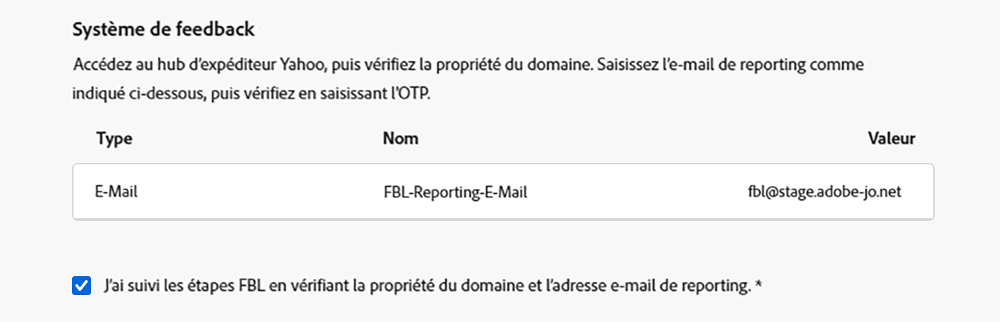

# Configurer un sous-domaine personnalisé {#delegate-custom-subdomain}

Au lieu des méthodes [Délégation complète](about-subdomain-delegation.md#full-subdomain-delegation) et [Configuration CNAME](about-subdomain-delegation.md#cname-subdomain-delegation), la méthode **Délégation personnalisée** vous permet de prendre en charge vos sous-domaines dans Journey Optimizer et d’avoir un contrôle total sur les certificats générés.

Dans le cadre de ce processus, Adobe doit s’assurer que votre DNS est configuré en conséquence pour la diffusion, le rendu et le suivi des messages. C’est pourquoi vous devrez [télécharger le certificat SSL](#upload-ssl-certificate) obtenu auprès de l’autorité de certification et suivre les étapes [Feedback Loop](#feedback-loop-steps) en vérifiant la propriété du domaine et l’adresse e-mail de création de rapports.

Pour configurer un sous-domaine personnalisé, procédez comme suit.

1. Accédez au menu **[!UICONTROL Administration]** > **[!UICONTROL Canaux]** > **[!UICONTROL Paramètres d’e-mail]** > **[!UICONTROL Sous-domaines]**.

1. Cliquez sur **[!UICONTROL Configurer le sous-domaine]**.

1. Dans la section **[!UICONTROL Configurer la méthode]**, sélectionnez **[!UICONTROL Délégation personnalisée]**.

   {width=90%}

1. Indiquez le nom du sous-domaine à déléguer.

   >[!CAUTION]
   >
   >Vous ne pouvez pas utiliser le même domaine d’envoi pour envoyer des messages depuis [!DNL Adobe Journey Optimizer] et à partir d’un autre produit, tel que [!DNL Adobe Campaign] ou [!DNL Adobe Marketo Engage].

## Créer des enregistrements DNS {#create-dns-records}

>[!CONTEXTUALHELP]
>id="ajo_admin_subdomain_custom_dns"
>title="Générer les enregistrements DNS correspondants"
>abstract="Pour déléguer un sous-domaine personnalisé à Adobe, vous devez copier-coller les informations du serveur de noms Adobe affichées dans l’interface Journey Optimizer de votre solution d’hébergement de domaine pour générer les enregistrements DNS correspondants."

1. La liste des enregistrements à placer dans les serveurs DNS s&#39;affiche. Copiez ces enregistrements un par un ou en téléchargeant un fichier CSV.

1. Accédez à votre solution d’hébergement de domaine pour générer les enregistrements DNS correspondants.

1. Assurez-vous que tous les enregistrements DNS ont été générés dans votre solution d’hébergement de domaine.

1. Si tout est correctement configuré, cochez la case « Je confirme... ».

   {width="75%"}

## Charger le certificat SSL {#upload-ssl-certificate}

>[!CONTEXTUALHELP]
>id="ajo_admin_subdomain_custom-ssl"
>title="Générer la demande de signature de certificat"
>abstract="Lors de la configuration d’un nouveau sous-domaine personnalisé, vous devez générer la demande de signature de certificat (CSR), la remplir et l’envoyer à l’autorité de certification pour obtenir le certificat SSL que vous devez charger dans Journey Optimizer."

>[!CONTEXTUALHELP]
>id="ajo_admin_subdomain_key_length"
>title="xxx"
>abstract=""

1. Dans la section **[!UICONTROL Certificat SSL]**, cliquez sur **[!UICONTROL Générer une demande de signature de certificat]**.

   {width="85%"}

   >[!NOTE]
   >
   >La date d’expiration de votre certificat SSL s’affiche. Une fois la date atteinte, vous devez charger un nouveau certificat.

1. Remplissez le formulaire qui s’affiche et générez la demande de signature de certificat (CSR).

   {width="70%"}

   >[!NOTE]
   >
   >La longueur de la clé peut être de 2 048 ou 4 096 bits uniquement. Il ne peut pas être modifié une fois le sous-domaine envoyé.

1. Cliquez sur **[!UICONTROL Télécharger la CSR]** et enregistrez le formulaire sur votre ordinateur local. Envoyez-le à l’autorité de certification pour obtenir votre certificat SSL.

1. Une fois récupéré, cliquez sur **[!UICONTROL Télécharger le certificat SSL]** et téléchargez le certificat vers [!DNL Journey Optimizer] au format .pem.

## Suivre les étapes de la boucle de commentaires {#feedback-loop-steps}

>[!CONTEXTUALHELP]
>id="ajo_admin_subdomain_feedback-loop"
>title="Suivre les étapes de la boucle de commentaires"
>abstract="Accédez à Yahoo! Sender Hub et remplissez le formulaire pour vérifier la propriété du domaine. Saisissez l’adresse e-mail de reporting FBL indiquée ci-dessous, puis utilisez le mot de passe à usage unique qui sera reçu pour vérifier la propriété sur le Yahoo! Sender Hub."

1. Allez au [ Yahoo ! Sender Hub](https://senders.yahooinc.com/) site web et remplissez le formulaire requis pour vérifier le propriétaire de votre domaine.

1. Pour vérifier le propriétaire du domaine, Yahoo ! Sender Hub vous demandera de fournir une adresse e-mail. Saisissez l’adresse e-mail de rapport FBL répertoriée sous **[!UICONTROL Valeur]**. Il s’agit d’une adresse e-mail appartenant à Adobe.

1. Quand Yahoo ! Sender Hub génère un mot de passe à usage unique (OTP) qui sera envoyé à cette adresse Adobe.

1. Contactez l&#39;équipe chargée de la délivrabilité d&#39;Adobe qui vous fournira ce mot de passe à usage unique. <!--Specify how to reach out + any information that customer should share in the request to deliverability team to get access to the right OTP-->

   >[!CAUTION]
   >
   >Le mot de passe à usage unique n’est valide que pendant 24 heures. Veillez donc à contacter Adobe dès que le mot de passe à usage unique est généré. <!--TBC?-->
   >
   >La requête OTP ne peut être effectuée que les jours de la semaine. Il n&#39;y a pas de support le week-end. <!--Add times + timezone-->

1. Entrez dans le OTP sur Yahoo ! Sender Hub.

1. Vérifiez que vous avez terminé toutes les étapes de Feedback Loop.

1. Si tout est correctement configuré, cochez la case « J’ai terminé... ».

   {width="85%"}

1. Cliquez sur **[!UICONTROL Continuer]** et attendez qu’Adobe vérifie que les enregistrements sont générés sans erreur sur votre solution d’hébergement. Cette opération peut prendre jusquʼà 2 minutes.

   >[!NOTE]
   >
   >Assurez-vous que tous les enregistrements sont correctement créés avant de continuer.

   Adobe génère un enregistrement de validation dʼURL (avec protocole SSL sur réseau CDN). Copiez cet enregistrement de validation sur votre plateforme dʼhébergement. Si vous avez correctement créé cet enregistrement sur votre solution d&#39;hébergement, cochez la case « Je confirme... ».

1. Cliquez sur **[!UICONTROL Envoyer]** pour que Adobe effectue les vérifications nécessaires. [En savoir plus](#submit-subdomain)

## Liste de contrôle de dépannage {#check-list}

Si des erreurs se produisent lors de la tentative d’envoi de votre sous-domaine personnalisé, effectuez les actions de dépannage répertoriées ci-dessous.

* Vérifiez que tous les enregistrements DNS se sont correctement propagés à l’aide des outils de recherche DNS.

* Vérifiez que votre certificat répond à toutes les exigences techniques avant de le charger.

* Vérifiez que le certificat a été chargé au bon format.

