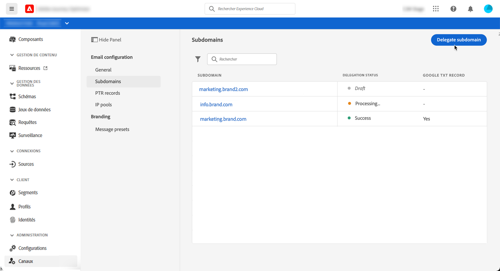
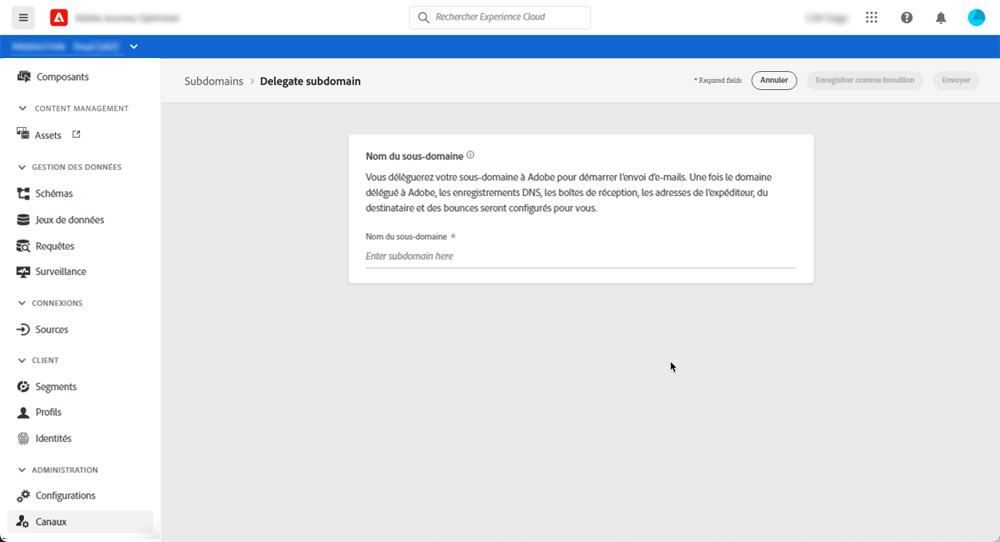
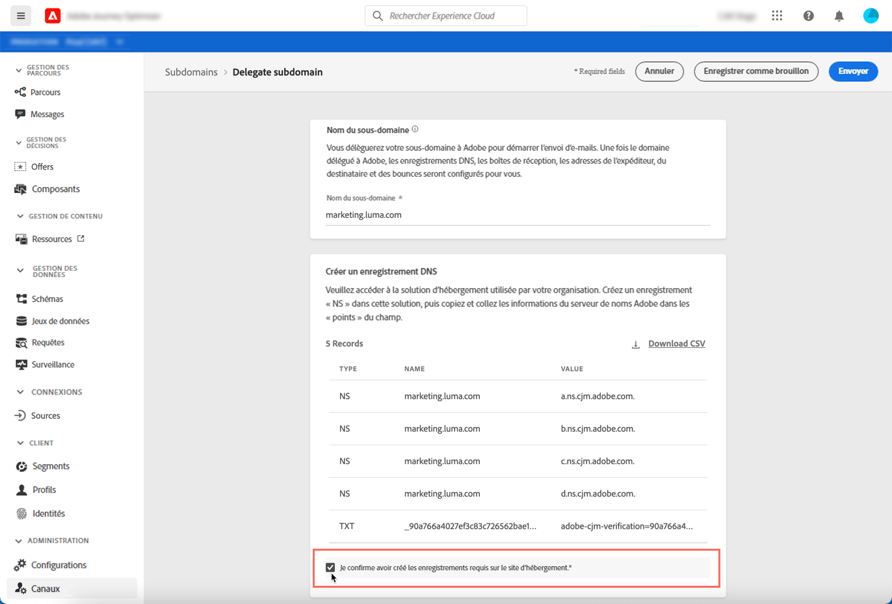
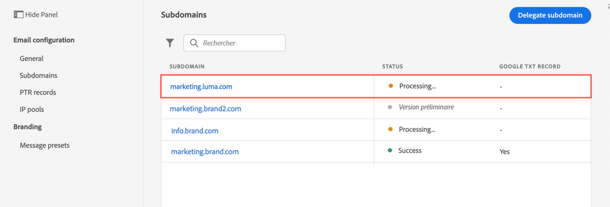
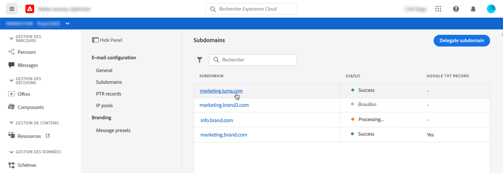
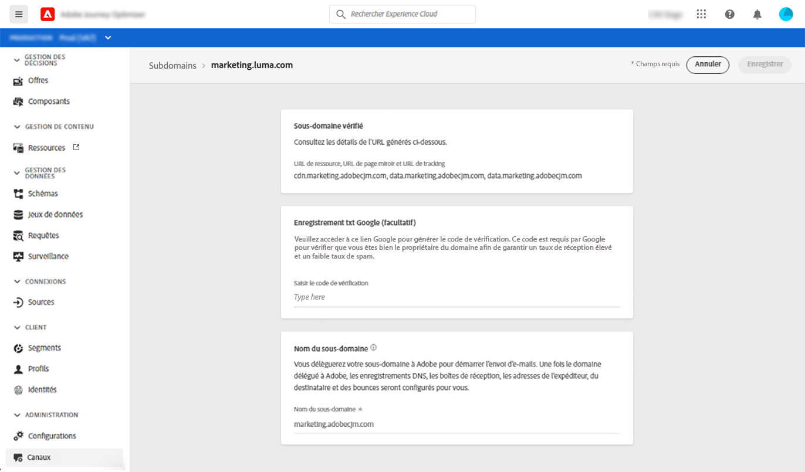

# Délégation d’un sous-domaine

Journey Optimizer vous permet de déléguer entièrement vos sous-domaines à l’Adobe. Ce faisant, l&#39;Adobe sera en mesure de diffuser des messages en tant que service géré en contrôlant et en conservant tous les aspects du DNS requis pour la diffusion, le rendu et le suivi des campagnes par courrier électronique.

>[!NOTE]
>
>Vous pouvez déléguer jusqu’à 10 sous-domaines.
>
>Journey Optimizer ne prend actuellement pas en charge l’utilisation de CNAME pour la délégation de sous-domaines.

Pour déléguer un nouveau sous-domaine, procédez comme suit :

1. Accédez au menu **[!UICONTROL Canaux]** / **[!UICONTROL Sous-domaines]**, puis cliquez sur **[!UICONTROL Déléguer le sous-domaine]**.

   

1. Spécifiez le nom du sous-domaine à déléguer.

   

1. La liste des enregistrements à placer dans les serveurs DNS s’affiche. Copiez ces enregistrements un par un ou en téléchargeant un fichier CSV, puis accédez à votre solution d’hébergement de domaine pour générer les enregistrements DNS correspondants.

   Assurez-vous que tous les enregistrements DNS ont été générés dans votre solution d’hébergement de domaine. Si tout est correctement configuré, cochez la case &quot;Je confirme...&quot;, puis cliquez sur **[!UICONTROL Envoyer]**.

   

   >[!NOTE]
   >
   >Vous pouvez créer les enregistrements et envoyer la configuration du sous-domaine ultérieurement à l’aide du bouton **[!UICONTROL Enregistrer en tant que brouillon]**. Vous pourrez alors reprendre la délégation de sous-domaines en l&#39;ouvrant à partir de la liste de sous-domaines.

1. Une fois la délégation de sous-domaine envoyée, le sous-domaine s’affiche dans la liste avec l’état **[!UICONTROL Traitement]**. Pour plus d&#39;informations sur les états des sous-domaines, consultez [cette section](access-subdomains.md).

   Les vérifications de configuration ci-dessous seront effectuées jusqu&#39;à ce que le sous-domaine soit vérifié et peuvent être utilisées pour configurer les paramètres prédéfinis des messages afin d&#39;envoyer des messages :

   1. enregistrements NS,
   1. création de DNS,
   1. Configuration des URL,
   1. Audit de la délivrabilité.

   

1. Une fois les vérifications effectuées, vous êtes informé par une notification **[!DNL Journey Optimizer]** et le sous-domaine obtient l’état **[!UICONTROL Success]**. Il est maintenant prêt à être utilisé pour diffuser des messages.

   Pour plus d&#39;informations sur les états des sous-domaines, consultez [cette section](access-subdomains.md).

   

   Vous pouvez accéder à des informations détaillées sur le sous-domaine en l’ouvrant à partir de la liste. Vous pouvez ainsi :

   * Récupérez le nom de sous-domaine (lecture seule) configuré pendant le processus de délégation, ainsi que les URL générées (ressources, page miroir, URL de suivi),
   * Ajoutez un enregistrement TXT de vérification de site Google sur votre sous-domaine pour vous assurer qu’il est vérifié (voir [Ajouter un enregistrement TXT Google à un sous-domaine](google-txt.md)).
   
