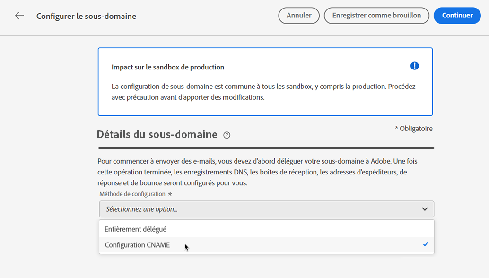

# Déléguer un sous-domaine {#delegate-subdomain}

>[!CONTEXTUALHELP]
>id="ajo_admin_subdomainname"
>title="Délégation de sous-domaines"
>abstract="Journey Optimizer vous permet de déléguer vos sous-domaines à Adobe. Vous pouvez déléguer entièrement un sous-domaine à Adobe, ce qui est la méthode recommandée. Vous pouvez également créer un sous-domaine à l’aide de CNAME pour pointer vers des enregistrements spécifiques à Adobe. Toutefois, cette approche nécessite que vous entreteniez et gériez les enregistrements DNS vous-même."
>additional-url="https://experienceleague.adobe.com/fr/docs/journey-optimizer/using/configuration/delegate-subdomains/about-subdomain-delegation#subdomain-delegation-methods" text="Méthodes de configuration de sous-domaine"

>[!CONTEXTUALHELP]
>id="ajo_admin_subdomainname_header"
>title="Délégation de sous-domaines"
>abstract="Pour commencer à envoyer des e-mails, vous devez d’abord déléguer votre sous-domaine à Adobe. Une fois cette opération terminée, les enregistrements DNS, les boîtes de réception, les adresses d’expéditeurs, de réponse et de rebond seront configurés pour vous."

## Prise en main des sous-domaines de messagerie {#gs-delegate-subdomain}

La délégation de noms de domaine est une méthode qui permet au propriétaire d’un nom de domaine (techniquement : une zone DNS) de déléguer une sous-division de celui-ci (techniquement : une zone DNS sous celui-ci, qui peut être appelée sous-zone) à une autre entité. En tant que client, si vous gérez la zone « exemple.com », vous pouvez déléguer la sous-zone « marketing.exemple.com » à Adobe. En savoir plus sur la [délégation de sous-domaine](about-subdomain-delegation.md)

Par défaut, [!DNL Journey Optimizer] vous permet de déléguer **jusqu&#39;à 10 sous-domaines**. Cependant, en fonction de votre contrat de licence, vous pouvez déléguer jusqu’à 100 sous-domaines. Contactez votre personne référente chez Adobe pour connaître le nombre de sous-domaines auxquels vous avez droit.

Vous pouvez entièrement déléguer un sous-domaine ou créer un sous-domaine à l’aide de CNAME pour pointer vers des enregistrements spécifiques à Adobe.

La délégation complète de sous-domaine est la méthode recommandée. En savoir plus sur les différences entre les deux [méthodes de configuration de sous-domaine](about-subdomain-delegation.md#subdomain-delegation-methods).

La configuration de sous-domaine est **commune à tous les environnements**. Par conséquent, toute modification apportée à un sous-domaine a également un impact sur les sandbox de production.

>[!CAUTION]
>
>L’envoi parallèle de sous-domaines n’est pas pris en charge dans [!DNL Journey Optimizer]. Si vous essayez d’envoyer un sous-domaine pour délégation alors qu’un autre est dans l’état **[!UICONTROL Traitement]**, un message d’erreur s’affiche.

## Déléguer entièrement un sous-domaine à Adobe {#full-subdomain-delegation}

>[!CONTEXTUALHELP]
>id="ajo_admin_subdomain_dns"
>title="Générer les enregistrements DNS correspondants"
>abstract="Pour déléguer entièrement un nouveau sous-domaine à Adobe, vous devez copier-coller les informations du serveur de noms Adobe affichées dans l’interface Journey Optimizer dans votre solution d’hébergement de domaine pour générer les enregistrements DNS correspondants. Pour déléguer un sous-domaine à l’aide de CNAME, vous devez également copier-coller l’enregistrement de validation de l’URL CDN SSL. Une fois les vérifications effectuées, le sous-domaine est prêt à être utilisé pour diffuser les messages."
>additional-url="https://experienceleague.adobe.com/fr/docs/journey-optimizer/using/configuration/delegate-subdomains/delegate-subdomain#cname-subdomain-delegation" text="Délégation de sous-domaines CNAME"

[!DNL Journey Optimizer] vous permet de déléguer entièrement vos sous-domaines à Adobe directement à partir de l&#39;interface du produit. Ainsi, Adobe sera en mesure de diffuser des messages en tant que service géré en contrôlant et en gérant tous les aspects du DNS nécessaires à la diffusion, au rendu et au suivi des campagnes par e-mail.

Vous pouvez compter sur Adobe pour gérer lʼinfrastructure DNS requise afin de répondre aux exigences de délivrabilité standard de vos domaines de marketing par e-mail, tout en continuant à gérer et à contrôler le DNS de leurs domaines de messagerie internes.

Pour déléguer complètement un nouveau sous-domaine à Adobe, procédez comme suit :

1. Accédez au menu **[!UICONTROL Administration]** > **[!UICONTROL Canaux]** > **[!UICONTROL Paramètres des e-mails]** > **[!UICONTROL Sous-domaines]**, puis cliquez sur **[!UICONTROL Configurer le sous-domaine]**.

   

1. Sélectionnez **[!UICONTROL Délégation complète]** dans la section **[!UICONTROL Configurer la méthode]**.

   

1. Indiquez le nom du sous-domaine à déléguer.

   

   >[!CAUTION]
   >
   >La délégation d’un sous-domaine non valide à Adobe n’est pas autorisée. Veillez à saisir un sous-domaine valide détenu par votre entreprise, tel que marketing.votre_entreprise.com.

   <!--Capital letters are not allowed in subdomains. TBC by PM-->

1. La liste des enregistrements à placer dans les serveurs DNS s&#39;affiche. Copiez ces enregistrements un par un ou en téléchargeant un fichier CSV, puis accédez à votre solution d&#39;hébergement de domaine pour générer les enregistrements DNS correspondants.

1. Assurez-vous que tous les enregistrements DNS ont été générés dans votre solution d&#39;hébergement de domaine. Si tout est correctement configuré, cochez la case « Je confirme... ».

   

1. Configurez un enregistrement DMARC. Si le sous-domaine comporte un enregistrement DMARC existant et qu’il est récupéré par [!DNL Journey Optimizer], vous pouvez utiliser les mêmes valeurs ou les modifier selon vos besoins. Si vous n’ajoutez pas de valeurs, les valeurs par défaut seront utilisées. [En savoir plus](dmarc-record.md)

   

1. Cliquez sur **[!UICONTROL Envoyer]**.

   Vous pouvez créer les enregistrements et soumettre ultérieurement la configuration du sous-domaine à l&#39;aide du bouton **[!UICONTROL Enregistrer en tant que brouillon]**. Vous pourrez ensuite reprendre la délégation de sous-domaine en l&#39;ouvrant à partir de la liste de sous-domaines.

1. Le sous-domaine s’affiche dans la liste avec le statut **[!UICONTROL Traitement]**. Pour en savoir plus sur les statuts des sous-domaines, consultez [cette section](about-subdomain-delegation.md#access-delegated-subdomains).

   

   Avant de pouvoir utiliser ce sous-domaine pour envoyer des messages, vous devez attendre qu’Adobe effectue les vérifications nécessaires, ce qui peut prendre jusqu’à 3 heures. En savoir plus dans [cette section](#subdomain-validation).

   >[!NOTE]
   >
   >Les enregistrements manquants, cʼest-à-dire ceux qui nʼont pas encore été créés sur votre solution dʼhébergement, seront répertoriés.

1. Une fois les vérifications effectuées, le sous-domaine obtient le statut **[!UICONTROL Succès]**. Elle est prête à être utilisée pour diffuser des messages.

   Le statut du sous-domaine sera marqué comme **[!UICONTROL Échec]** si la création de lʼenregistrement de validation sur votre solution dʼhébergement nʼa pas réussi.

Une fois qu’un sous-domaine est délégué à Adobe dans [!DNL Journey Optimizer], un enregistrement PTR est automatiquement créé et associé à ce sous-domaine. [En savoir plus](ptr-records.md)

## Configurer un sous-domaine avec des CNAME {#cname-subdomain-delegation}

>[!CONTEXTUALHELP]
>id="ajo_admin_subdomain_dns_cname"
>title="Générer les enregistrements DNS et de validation correspondants"
>abstract="Pour déléguer un sous-domaine à l’aide de CNAME, vous devez copier-coller les informations du serveur de noms d’Adobe et l’enregistrement de validation d’URL CDN SSL affiché dans l’interface de Journey Optimizer dans votre plateforme d’hébergement. Une fois les vérifications effectuées, le sous-domaine est prêt à être utilisé pour diffuser les messages."

>[!CONTEXTUALHELP]
>id="ajo_admin_subdomain_cdn_cname"
>title="Copiez l’enregistrement de validation."
>abstract="Adobe génère un enregistrement de validation. Vous devez créer l’enregistrement correspondant sur votre plateforme d’hébergement pour la validation des URL du réseau CDN."

Si des politiques de restriction par domaine sont en vigueur et que vous souhaitez quʼAdobe nʼait quʼun contrôle partiel sur le DNS, vous pouvez choisir dʼeffectuer toutes les activités liées au DNS de votre côté.

La configuration de sous-domaines CNAME permet de créer un sous-domaine et d’utiliser des CNAME pour pointer vers des enregistrements spécifiques à Adobe. Grâce à cette configuration, vous partagez avec Adobe la responsabilité de la maintenance du DNS afin de configurer un environnement pour l’envoi, le rendu et le tracking des e-mails.

>[!CAUTION]
>
>La méthode CNAME est recommandée si les politiques de votre organisation interdisent la méthode de délégation complète de sous-domaine. En conséquence, vous devrez assumer la mise à jour et la gestion des enregistrements DNS. Adobe ne pourra pas vous aider à modifier, tenir à jour ou gérer le DNS dʼun sous-domaine configuré par la méthode CNAME.

➡️ [Découvrez comment créer un sous-domaine à l’aide de la méthode CNAME pour pointer vers des enregistrements spécifiques à Adobe dans cette vidéo](#video)

Pour configurer un sous-domaine à l’aide de CNAME, procédez comme suit :

1. Accédez au menu **[!UICONTROL Administration]** > **[!UICONTROL Canaux]** > **[!UICONTROL Paramètres des e-mails]** > **[!UICONTROL Sous-domaines]**, puis cliquez sur **[!UICONTROL Configurer le sous-domaine]**.

1. Sélectionnez la méthode **[!UICONTROL Configuration CNAME]**.

   

1. Indiquez le nom du sous-domaine à déléguer.

   >[!CAUTION]
   >
   >Vous ne devez pas déléguer de sous-domaine non valide à Adobe. Veillez à saisir un sous-domaine valide qui est **détenu par votre organisation**, tel que marketing.yourcompany.com.

   <!--Capital letters are not allowed in subdomains. TBC by PM-->

1. La liste des enregistrements à placer dans les serveurs DNS s&#39;affiche. Copiez ces enregistrements un par un ou en téléchargeant un fichier CSV, puis accédez à votre solution d&#39;hébergement de domaine pour générer les enregistrements DNS correspondants.

1. Assurez-vous que tous les enregistrements DNS ont été générés dans votre solution d&#39;hébergement de domaine. Si tout est correctement configuré, cochez la case « Je confirme... ».

   

1. Configurez-le comme enregistrement DMARC. Si le sous-domaine comporte un enregistrement DMARC existant et qu’il est récupéré par [!DNL Journey Optimizer], vous pouvez utiliser les mêmes valeurs ou les modifier selon vos besoins. Si vous n’ajoutez pas de valeurs, les valeurs par défaut seront utilisées. [En savoir plus](dmarc-record.md)

   

1. Cliquez sur **[!UICONTROL Continuer]**.

   Vous pouvez créer des enregistrements ultérieurement à lʼaide du bouton **[!UICONTROL Enregistrer en tant que brouillon]**. Vous pourrez ensuite reprendre la délégation de sous-domaine à ce stade en lʼouvrant à partir de la liste de sous-domaines.

1. Patientez jusquʼà ce quʼAdobe sʼassure que ces enregistrements ont été générés sans erreurs sur votre solution dʼhébergement. Cette opération peut prendre jusquʼà 2 minutes.

   >[!NOTE]
   >
   >Les enregistrements manquants, cʼest-à-dire ceux qui nʼont pas encore été créés sur votre solution dʼhébergement, seront répertoriés.

1. Adobe génère un enregistrement de validation dʼURL (avec protocole SSL sur réseau CDN). Copiez cet enregistrement de validation sur votre plateforme dʼhébergement. Si vous avez terminé la création de cet enregistrement sur votre solution dʼhébergement, cochez la case « Je confirme... », puis cliquez sur **[!UICONTROL Envoyer]**.

   <!---->

1. Une fois la délégation de sous-domaine CNAME envoyée, le sous-domaine sʼaffiche dans la liste avec le statut **[!UICONTROL Traitement]**. Pour en savoir plus sur les statuts des sous-domaines, consultez [cette section](about-subdomain-delegation.md#access-delegated-subdomains).

   

   Avant de pouvoir utiliser ce sous-domaine pour envoyer des messages, vous devez attendre quʼAdobe effectue les vérifications nécessaires, ce qui prend généralement 2 à 3 heures. En savoir plus dans [cette section](#subdomain-validation).

1. Une fois les vérifications effectuées<!--i.e Adobe validates the record you created and installs it-->, le sous-domaine obtient le statut **[!UICONTROL Succès]**. Elle est prête à être utilisée pour diffuser des messages.

   Le statut du sous-domaine sera marqué comme **[!UICONTROL Échec]** si la création de lʼenregistrement de validation sur votre solution dʼhébergement nʼa pas réussi.

Dès la validation de lʼenregistrement et lʼinstallation du certificat terminées, Adobe crée automatiquement lʼenregistrement PTR pour le sous-domaine CNAME. [En savoir plus](ptr-records.md)

## Validation de sous-domaine {#subdomain-validation}

Les vérifications et actions ci-dessous sont exécutées jusqu’à ce que le sous-domaine soit vérifié et puisse être utilisé pour envoyer des messages.

Ces étapes sont effectuées par Adobe et peuvent prendre jusqu’**3 heures**.

1. **Pré-validation** : Adobe vérifie si le sous-domaine a été délégué au DNS Adobe (enregistrement NS, enregistrement SOA, configuration de zone, enregistrement propriétaire). Si l’étape de pré-validation échoue, une erreur est renvoyée avec la raison correspondante, sinon Adobe passe à l’étape suivante.

1. **Configuration du DNS pour le domaine**:

   * **Enregistrement MX** (enregistrement Mail eXchange) : enregistrement du serveur de messagerie qui traite les e-mails entrants envoyés au sous-domaine.
   * **Enregistrement SPF** (enregistrement Sender Policy Framework) : répertorie les adresses IP des serveurs de messagerie qui peuvent envoyer des e-mails à partir du sous-domaine.
   * **Enregistrement DKIM** (enregistrement standard DomainKeys Identified Mail) : utilise le chiffrement de la clé publique-privée pour authentifier le message afin d’éviter les usurpations.
   * **A** : mappage IP par défaut.
   * **CNAME** : un enregistrement de nom canonique ou CNAME est un type d’enregistrement DNS qui mappe un nom d’alias à un nom de domaine réel ou canonique.

1. **Création des URL de tracking et miroir** : si le domaine est email.example.com, le domaine tracking/mirror sera data.email.example.com. La sécurité est assurée par l’installation du certificat SSL.

1. **Approvisionnement de CDN CloudFront** : si le réseau CDN n’est pas déjà configuré, Adobe l’approvisionne pour l’ID de votre organisation.

1. **Création d’un domaine CDN** : si le domaine est email.example.com, le domaine CDN sera cdn.email.example.com.

1. **Création et association d’un certificat SSL CDN** : Adobe crée le certificat CDN pour le domaine CDN et associe le certificat au domaine CDN.

1. **Création d’un DNS forward** : s’il s’agit du premier sous-domaine que vous déléguez, Adobe crée le DNS forward qui est requis pour créer des enregistrements PTR, un pour chacune de vos adresses IP.

1. **Création d’un enregistrement PTR** : l’enregistrement PTR, également appelé enregistrement DNS inversé, est requis par les FAI pour qu’ils ne marquent pas les e-mails comme spam. Gmail recommande également d’avoir des enregistrements PTR pour chaque adresse IP. Adobe crée des enregistrements PTR uniquement lorsque vous déléguez un sous-domaine pour la première fois, un pour chaque adresse IP, toutes les adresses IP pointant vers ce sous-domaine. Par exemple, si l’adresse IP est *192.1.2.1* et que le sous-domaine est *email.example.com*, l’enregistrement PTR est : *192.1.2.1PTR r1.email.example.com*. Vous pouvez mettre à jour l’enregistrement PTR par la suite pour pointer vers le nouveau domaine délégué. [En savoir plus sur les enregistrements PTR](ptr-records.md)

## Annulation de la délégation d’un sous-domaine {#undelegate-subdomain}

Si vous souhaitez annuler la délégation d’un sous-domaine, contactez votre représentant Adobe.

Cependant, vous devez effectuer plusieurs étapes dans l’interface utilisateur avant de contacter Adobe.

>[!NOTE]
>
>Vous pouvez uniquement annuler la délégation de sous-domaines avec le statut **[!UICONTROL Succès]**. Les sous-domaines avec les statuts **[!UICONTROL Brouillon]** et **[!UICONTROL Échec]** peuvent simplement être supprimés de l’interface utilisateur.

Tout d’abord, effectuez les étapes suivantes dans [!DNL Journey Optimizer] :

1. Désactivez toutes les configurations de canal associées au sous-domaine. [Voici comment procéder](../configuration/channel-surfaces.md#deactivate-a-surface)

1. Annulez la délégation de tous les sous-domaines de page de destination, sous-domaines SMS et sous-domaines web associés à ce sous-domaine.

   Vous devez envoyer une requête dédiée pour chaque [page de destination](../landing-pages/lp-subdomains.md#undelegate-subdomain), [SMS](../sms/sms-subdomains.md#undelegate-subdomain) ou [sous-domaine web](../web/web-delegated-subdomains.md#undelegate-subdomain).

1. Arrêtez les campagnes actives associées aux sous-domaines. [Voici comment procéder](../campaigns/modify-stop-campaign.md#stop)

1. Arrêtez les parcours actifs associés aux sous-domaines. [Voici comment procéder](../building-journeys/end-journey.md#stop-journey)

1. Pointez les [enregistrements PTR](ptr-records.md#edit-ptr-record) liés au sous-domaine vers un autre sous-domaine.

   S’il s’agit du seul sous-domaine délégué, vous pouvez ignorer cette étape.

Une fois cette opération terminée, contactez votre représentant Adobe avec le sous-domaine dont vous souhaitez annuler la délégation.

Une fois que votre demande est gérée par Adobe, le domaine non délégué ne s’affiche plus sur la page d’inventaire des sous-domaines.

>[!CAUTION]
>
>Après la suppression de la délégation d’un sous-domaine :
>
>   * Vous ne pouvez pas réactiver les configurations de canal qui utilisaient ce sous-domaine.
>   * Vous ne pouvez pas déléguer à nouveau le sous-domaine exact via l’interface utilisateur. Si vous souhaitez le faire, contactez votre représentant ou représentante Adobe.

## Vidéo pratique{#video}

Découvrez comment créer un sous-domaine à l&#39;aide de la méthode CNAME pour pointer vers des enregistrements spécifiques à Adobe.

>[!VIDEO](https://video.tv.adobe.com/v/342230?quality=12&captions=fre_fr)
