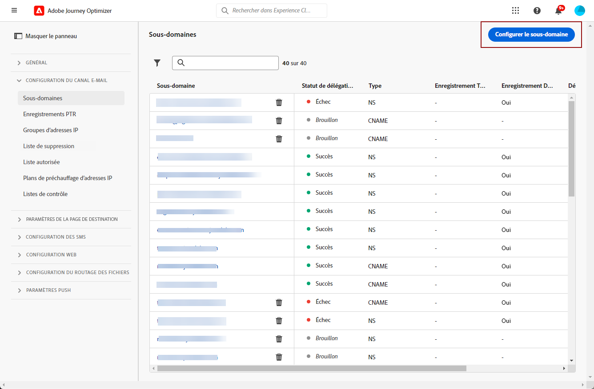

# Délégation d’un sous-domaine {#delegate-subdomain}

>[!CONTEXTUALHELP]
>id="ajo_admin_subdomainname"
>title="Délégation de sous-domaine"
>abstract="Journey Optimizer vous permet de déléguer vos sous-domaines à l’Adobe. Vous pouvez déléguer entièrement un sous-domaine à Adobe, ce qui est la méthode recommandée. Vous pouvez également créer un sous-domaine à l’aide de CNAME pour pointer vers des enregistrements spécifiques à un Adobe. Toutefois, cette approche nécessite que vous conteniez et gériez les enregistrements DNS vous-même."
>additional-url="https://experienceleague.adobe.com/docs/journey-optimizer/using/configuration/configuration-message/email-configuration/delegate-subdomains/about-subdomain-delegation.html#subdomain-delegation-methods" text="Méthodes de configuration de sous-domaine"

La délégation de noms de domaine est une méthode qui permet au propriétaire d’un nom de domaine (techniquement : une zone DNS) de déléguer une sous-division de celui-ci (techniquement : une zone DNS sous celui-ci, qui peut être appelée sous-zone) à une autre entité. En tant que client, si vous gérez la zone « example.com », vous pouvez déléguer la sous-zone « marketing.example.com » à Adobe. En savoir plus sur [délégation de sous-domaine](about-subdomain-delegation.md)

>[!NOTE]
>
>Par défaut, le contrat de licence [!DNL Journey Optimizer] vous permet de déléguer jusqu&#39;à 10 sous-domaines. Contactez votre contact Adobe si vous souhaitez augmenter cette limite.

Vous pouvez déléguer entièrement un sous-domaine ou créer un sous-domaine à l’aide de CNAME pour pointer vers des enregistrements spécifiques à un Adobe.

>[!CAUTION]
>
>La délégation complète de sous-domaine est la méthode recommandée. En savoir plus sur les différences entre les deux [Méthodes de configuration de sous-domaine](about-subdomain-delegation.md#subdomain-delegation-methods).

## Délégation complète de sous-domaine {#full-subdomain-delegation}

>[!CONTEXTUALHELP]
>id="ajo_admin_subdomain_dns"
>title="Générer les enregistrements DNS correspondants"
>abstract="Pour déléguer entièrement un nouveau sous-domaine à Adobe, vous devez copier les informations du serveur de noms d’Adobe affichées dans l’interface Journey Optimizer et les coller dans votre solution d’hébergement de domaine pour générer les enregistrements DNS correspondants. Une fois les vérifications effectuées, le sous-domaine est prêt à être utilisé pour diffuser les messages."

[!DNL Journey Optimizer] vous permet de déléguer entièrement vos sous-domaines à Adobe directement à partir de l&#39;interface du produit. Ainsi, Adobe sera en mesure de diffuser des messages en tant que service géré en contrôlant et en gérant tous les aspects du DNS nécessaires à la diffusion, au rendu et au suivi des campagnes par e-mail.

Vous pouvez vous fier à Adobe pour gérer l’infrastructure DNS nécessaire pour répondre aux exigences de délivrabilité standard de votre secteur pour vos domaines d’envoi de marketing par e-mail, tout en continuant à gérer et à contrôler le DNS de vos domaines d’email internes.

Pour déléguer complètement un nouveau sous-domaine à Adobe, procédez comme suit :

1. Accédez au menu **[!UICONTROL Administration]** > **[!UICONTROL Canaux]** > **[!UICONTROL Sous-domaines]**, puis cliquez sur **[!UICONTROL Configurer le sous-domaine]**.

   

1. Sélectionnez **[!UICONTROL Délégation complète]** dans la section **[!UICONTROL Configurer la méthode]**.

   

1. Indiquez le nom du sous-domaine à déléguer.

   

   >[!CAUTION]
   >
   >La délégation d’un sous-domaine non valide à Adobe n’est pas autorisée. Veillez à saisir un sous-domaine valide détenu par votre entreprise, tel que marketing.votre_entreprise.com.
   >
   >Veuillez noter que les sous-domaines à plusieurs niveaux tels que email.marketing.votre_entreprise.com ne sont actuellement pas pris en charge.

1. La liste des enregistrements à placer dans les serveurs DNS s&#39;affiche. Copiez ces enregistrements un par un ou en téléchargeant un fichier CSV, puis accédez à votre solution d&#39;hébergement de domaine pour générer les enregistrements DNS correspondants.

1. Assurez-vous que tous les enregistrements DNS ont été générés dans votre solution d&#39;hébergement de domaine. Si tout est correctement configuré, cochez la case &quot;Je confirme...&quot;, puis cliquez sur **[!UICONTROL Envoyer]**.

   

   >[!NOTE]
   >
   >Vous pouvez créer les enregistrements et soumettre ultérieurement la configuration du sous-domaine à l&#39;aide du bouton **[!UICONTROL Enregistrer en tant que brouillon]**.
Vous pourrez ensuite reprendre la délégation de sous-domaine en l&#39;ouvrant à partir de la liste de sous-domaines.

1. Une fois la délégation de sous-domaine complète envoyée, le sous-domaine sʼaffiche dans la liste avec le statut **[!UICONTROL Traitement]**. Pour en savoir plus sur les statuts des sous-domaines, consultez [cette section](access-subdomains.md).

   

   Avant de pouvoir utiliser ce sous-domaine pour envoyer des messages, vous devez attendre qu’Adobe effectue les vérifications nécessaires, ce qui peut prendre jusqu’à 3 heures. En savoir plus dans [cette section](#subdomain-validation).

   >[!NOTE]
   >
   >Les enregistrements manquants, cʼest-à-dire ceux qui nʼont pas encore été créés sur votre solution dʼhébergement, seront répertoriés.

1. Une fois les vérifications effectuées, le sous-domaine obtient le statut **[!UICONTROL Succès]**. Il est prêt à être utilisé pour diffuser des messages.

   >[!NOTE]
   >
   >Le statut du sous-domaine sera marqué comme **[!UICONTROL Échec]** si la création de lʼenregistrement de validation sur votre solution dʼhébergement nʼa pas réussi.

   <!-- later on, users will be notified in Pulse -->

Une fois qu’un sous-domaine est délégué à Adobe dans [!DNL Journey Optimizer], un enregistrement PTR est automatiquement créé et associé à ce sous-domaine. [En savoir plus](ptr-records.md)

>[!CAUTION]
>
>L’exécution parallèle de sous-domaines n’est actuellement pas prise en charge dans [!DNL Journey Optimizer]. Si vous tentez d’envoyer un sous-domaine pour délégation alors quʼun autre se trouve à lʼétat **[!UICONTROL En cours de traitement]**, un message d’erreur sʼaffiche.

## Délégation de sous-domaines CNAME {#cname-subdomain-delegation}

>[!CONTEXTUALHELP]
>id="ajo_admin_subdomain_dns_cname"
>title="Générer les enregistrements DNS et de validation correspondants"
>abstract="Pour déléguer un sous-domaine à l’aide de CNAME, vous devez copier-coller les informations du serveur de noms d’Adobe et l’enregistrement de validation d’URL CDN SSL affiché dans l’interface de Journey Optimizer dans votre plateforme d’hébergement. Une fois les vérifications effectuées, le sous-domaine est prêt à être utilisé pour diffuser les messages."

Si des stratégies de restriction par domaine sont en vigueur et que vous souhaitez quʼAdobe nʼait quʼun contrôle partiel sur le DNS, vous pouvez choisir dʼeffectuer toutes les activités liées au DNS de votre côté.

La délégation de sous-domaines CNAME permet de créer un sous-domaine et d’utiliser des CNAME pour pointer vers des enregistrements spécifiques à Adobe. Grâce à cette configuration, vous partagez avec Adobe la responsabilité de la maintenance du DNS afin de configurer un environnement pour l’envoi, le rendu et le suivi des e-mails.

>[!CAUTION]
>
>Cette méthode est recommandée si les stratégies de votre organisation interdisent la méthode de délégation de sous-domaine complète. En conséquence, vous devrez assumer la mise à jour et la gestion des enregistrements DNS. Adobe ne pourra pas vous aider à modifier, tenir à jour ou gérer le DNS dʼun sous-domaine configuré par la méthode CNAME.

➡️ [Découvrez comment créer un sous-domaine à l&#39;aide de la méthode CNAME pour pointer vers des enregistrements spécifiques à Adobe dans cette vidéo](#video)

Pour déléguer un sous-domaine à l’aide de CNAME, procédez comme suit :

1. Accédez au menu **[!UICONTROL Administration]** > **[!UICONTROL Canaux]** > **[!UICONTROL Sous-domaines]**, puis cliquez sur **[!UICONTROL Configurer le sous-domaine]**.

1. Sélectionnez la méthode **[!UICONTROL Configuration CNAME]**.

   

1. Indiquez le nom du sous-domaine à déléguer.

   >[!CAUTION]
   >
   >La délégation d’un sous-domaine non valide à Adobe n’est pas autorisée. Veillez à saisir un sous-domaine valide détenu par votre entreprise, tel que marketing.votre_entreprise.com.
   >
   >Veuillez noter que les sous-domaines à plusieurs niveaux tels que email.marketing.votre_entreprise.com ne sont actuellement pas pris en charge.

1. La liste des enregistrements à placer dans les serveurs DNS s&#39;affiche. Copiez ces enregistrements un par un ou en téléchargeant un fichier CSV, puis accédez à votre solution d&#39;hébergement de domaine pour générer les enregistrements DNS correspondants.

1. Assurez-vous que tous les enregistrements DNS ont été générés dans votre solution d&#39;hébergement de domaine. Si tout est correctement configuré, cochez la case « Je confirme... ».

   

   >[!NOTE]
   >
   >Vous pouvez créer des enregistrements ultérieurement à lʼaide du bouton **[!UICONTROL Enregistrer en tant que brouillon]**.
Vous pourrez ensuite reprendre la délégation de sous-domaine à ce stade en lʼouvrant à partir de la liste de sous-domaines.

1. Patientez jusquʼà ce quʼAdobe sʼassure que ces enregistrements ont été générés sans erreurs sur votre solution dʼhébergement. Cette opération peut prendre jusquʼà 2 minutes.

   >[!NOTE]
   >
   >Les enregistrements manquants, cʼest-à-dire ceux qui nʼont pas encore été créés sur votre solution dʼhébergement, seront répertoriés.

1. Adobe génère un enregistrement de validation dʼURL (avec protocole SSL sur réseau CDN). Copiez cet enregistrement de validation sur votre plateforme dʼhébergement. Si vous avez terminé la création de cet enregistrement sur votre solution dʼhébergement, cochez la case « Je confirme... », puis cliquez sur **[!UICONTROL Envoyer]**.

   

   >[!NOTE]
   >
   >Vous pouvez également créer lʼenregistrement de validation et envoyer ultérieurement la configuration du sous-domaine à lʼaide du bouton **[!UICONTROL Enregistrer en tant que brouillon]**. Vous pourrez ensuite reprendre la délégation de sous-domaine en lʼouvrant à partir de la liste de sous-domaines.

1. Une fois la délégation de sous-domaine CNAME envoyée, le sous-domaine sʼaffiche dans la liste avec le statut **[!UICONTROL Traitement]**. Pour en savoir plus sur les statuts des sous-domaines, consultez [cette section](access-subdomains.md).

   Avant de pouvoir utiliser ce sous-domaine pour envoyer des messages, vous devez attendre quʼAdobe effectue les vérifications nécessaires, ce qui prend généralement 2 à 3 heures. En savoir plus dans [cette section](#subdomain-validation).

1. Une fois les vérifications effectuées<!--i.e Adobe validates the record you created and installs it-->, le sous-domaine obtient le statut **[!UICONTROL Succès]**. Il est prêt à être utilisé pour diffuser des messages.

   >[!NOTE]
   >
   >Le statut du sous-domaine sera marqué comme **[!UICONTROL Échec]** si la création de lʼenregistrement de validation sur votre solution dʼhébergement nʼa pas réussi.

Dès la validation de lʼenregistrement et lʼinstallation du certificat terminées, Adobe crée automatiquement lʼenregistrement PTR pour le sous-domaine CNAME. [En savoir plus](ptr-records.md)

>[!CAUTION]
>
>L’exécution parallèle de sous-domaines n’est actuellement pas prise en charge dans [!DNL Journey Optimizer]. Si vous tentez d’envoyer un sous-domaine pour délégation alors qu’un autre se trouve à lʼétat **[!UICONTROL En cours de traitement]**, un message d’erreur sʼaffiche.

## Validation de sous-domaine {#subdomain-validation}

Les vérifications et actions ci-dessous seront effectuées jusqu&#39;à ce que le sous-domaine soit vérifié et puisse être utilisé pour envoyer des messages.

>[!NOTE]
>
>Ces étapes sont effectuées par Adobe et peuvent prendre jusqu&#39;à 3 heures.

1. **Pré-validation** : Adobe vérifie si le sous-domaine a été délégué au DNS Adobe (enregistrement NS, enregistrement SOA, configuration de zone, enregistrement propriétaire). Si l’étape de pré-validation échoue, une erreur est renvoyée avec la raison correspondante, sinon Adobe passe à l’étape suivante.

1. **Configuration du DNS pour le domaine**:

   * **Enregistrement MX** (enregistrement Mail eXchange) : enregistrement du serveur de messagerie qui traite les e-mails entrants envoyés au sous-domaine.
   * **Enregistrement SPF** (enregistrement Sender Policy Framework) : répertorie les adresses IP des serveurs de messagerie qui peuvent envoyer des e-mails à partir du sous-domaine.
   * **Enregistrement DKIM** (enregistrement standard DomainKeys Identified Mail) : utilise le chiffrement de la clé publique-privée pour authentifier le message afin d’éviter les usurpations.
   * **A** : mappage IP par défaut.
   * **CNAME** : un enregistrement de nom canonique ou CNAME est un type d’enregistrement DNS qui mappe un nom d’alias à un nom de domaine réel ou canonique.

1. **Création des URL de tracking et miroir** : si le domaine est email.example.com, le domaine tracking/mirror sera data.email.example.com. La sécurité est assurée par l’installation du certificat SSL.

1. **Approvisionnement de CDN CloudFront** : si le réseau CDN n’est pas déjà configuré, Adobe l’approvisionne pour l’imsorg.

1. **Création d’un domaine CDN** : si le domaine est email.example.com, le domaine CDN sera cdn.email.example.com.

1. **Création et association d’un certificat SSL CDN** : Adobe crée le certificat CDN pour le domaine CDN et associe le certificat au domaine CDN.

1. **Création d’un DNS forward** : s’il s’agit du premier sous-domaine que vous déléguez, Adobe crée le DNS forward qui est requis pour créer des enregistrements PTR, un pour chacune de vos adresses IP.

1. **Création d’un enregistrement PTR** : l’enregistrement PTR, également appelé enregistrement DNS inversé, est requis par les FAI pour qu’ils ne marquent pas les e-mails comme spam. Gmail recommande également d’avoir des enregistrements PTR pour chaque adresse IP. Adobe crée des enregistrements PTR uniquement lorsque vous déléguez un sous-domaine pour la première fois, un pour chaque adresse IP, toutes les adresses IP pointant vers ce sous-domaine. Par exemple, si l’adresse IP est *192.1.2.1* et que le sous-domaine est *email.example.com*, l’enregistrement PTR est : *192.1.2.1 PTR r1.email.example.com*. Vous pouvez mettre à jour l’enregistrement PTR par la suite pour pointer vers le nouveau domaine délégué. [En savoir plus sur les enregistrements PTR](ptr-records.md)

## Vidéo pratique{#video}

Découvrez comment créer un sous-domaine à l&#39;aide de la méthode CNAME pour pointer vers des enregistrements spécifiques à Adobe.

>[!VIDEO](https://video.tv.adobe.com/v/339484?quality=12)
