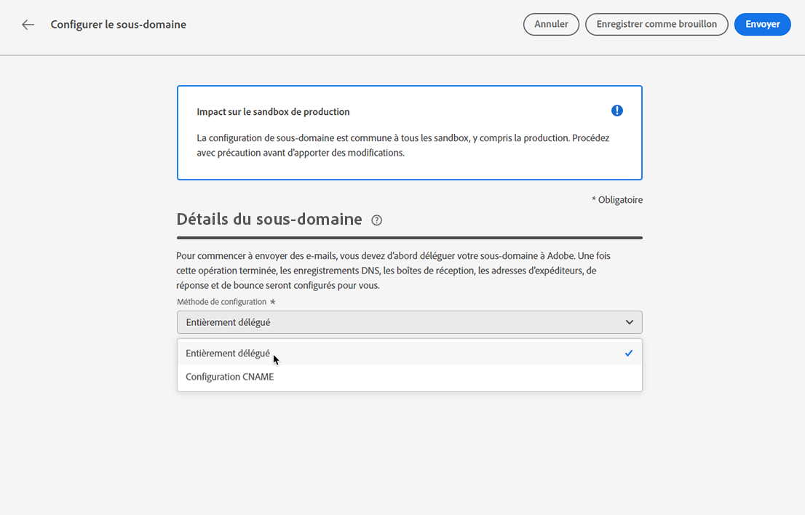
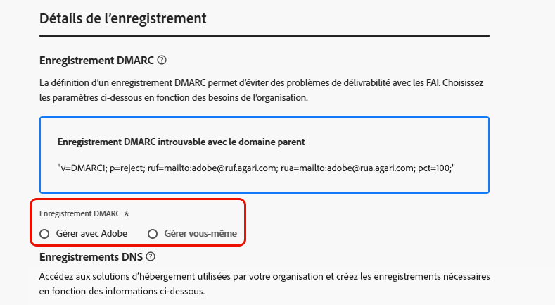

# Déléguer un sous-domaine {#delegate-subdomain}

>[!CONTEXTUALHELP]
>id="ajo_admin_subdomainname"
>title="Délégation de sous-domaines"
>abstract="Journey Optimizer vous permet de déléguer vos sous-domaines à Adobe. Vous pouvez déléguer entièrement un sous-domaine à Adobe, ce qui est la méthode recommandée.  Vous pouvez également créer un sous-domaine à l’aide de CNAME pour pointer vers des enregistrements spécifiques à Adobe. Toutefois, cette approche nécessite que vous entreteniez et gériez les enregistrements DNS vous-même."
>additional-url="https://experienceleague.adobe.com/fr/docs/journey-optimizer/using/configuration/delegate-subdomains/about-subdomain-delegation#subdomain-delegation-methods" text="Méthodes de configuration de sous-domaine"

>[!CONTEXTUALHELP]
>id="ajo_admin_subdomainname_header"
>title="Délégation de sous-domaines"
>abstract="Pour commencer à envoyer des e-mails, vous devez d’abord déléguer votre sous-domaine à Adobe. Une fois cette opération terminée, les enregistrements DNS, les boîtes de réception, les adresses d’expéditeurs, de réponse et de rebond seront configurés pour vous."

La délégation de noms de domaine est une méthode qui permet au propriétaire d’un nom de domaine (techniquement : une zone DNS) de déléguer une sous-division de celui-ci (techniquement : une zone DNS sous celui-ci, qui peut être appelée sous-zone) à une autre entité. En tant que client ou cliente, si vous gérez la zone « example.com », vous pouvez déléguer la sous-zone « marketing.example.com » à Adobe.

>[!NOTE]
>
>Pour en savoir plus sur la délégation de sous-domaine et les différentes méthodes disponibles avec [!DNL Journey Optimizer], consultez [cette section](about-subdomain-delegation.md).

Vous pouvez effectuer l’une des actions suivantes :

* Déléguer entièrement un sous-domaine : [en savoir plus](#set-up-subdomain)
* Créer un sous-domaine à l’aide de CNAME pour pointer vers des enregistrements spécifiques à Adobe : [en savoir plus](#set-up-subdomain)

La **délégation complète de sous-domaine** est la méthode recommandée. Pour en savoir plus sur les différences entre les diverses méthodes de configuration de sous-domaine, consultez [cette section](about-subdomain-delegation.md#subdomain-delegation-methods).

## Mécanismes de sécurisation {#guardrails}

Lors de la configuration de sous-domaines dans [!DNL Journey Optimizer], suivez les mécanismes de sécurisation et les recommandations décrits ci-dessous.

* Par défaut, [!DNL Journey Optimizer] vous permet de déléguer **jusqu’à 10 sous-domaines**. Cependant, en fonction de votre contrat de licence, vous pouvez déléguer jusqu’à 100 sous-domaines. Contactez votre personne référente chez Adobe pour connaître le nombre de sous-domaines auxquels vous avez droit.

* La soumission parallèle de sous-domaines n’est actuellement pas prise en charge dans [!DNL Journey Optimizer]. Si vous tentez d’envoyer un sous-domaine pour délégation alors qu’un autre se trouve à lʼétat **[!UICONTROL En cours de traitement]**, un message d’erreur sʼaffiche.

* La délégation d’un sous-domaine non valide à Adobe n’est pas autorisée. Veillez à saisir un sous-domaine valide détenu par votre entreprise, tel que marketing.votre_entreprise.com.

* Vous ne pouvez pas utiliser le même domaine d’envoi pour envoyer des messages depuis [!DNL Adobe Journey Optimizer] et à partir d’un autre produit, tel que [!DNL Adobe Campaign] ou [!DNL Adobe Marketo Engage].

* La délégation d’un parent et d’un sous-domaine n’est pas prise en charge. Par exemple, si vous avez délégué subdomain.domain.com, vous ne pouvez pas déléguer email.subdomain.domain.com. De même, si vous avez délégué email.subdomain.domain.com, vous ne pouvez pas déléguer subdomain.domain.com.

## Accéder aux sous-domaines délégués {#access-delegated-subdomains}

Tous les sous-domaines délégués s’affichent dans le menu **[!UICONTROL Administration]** > **[!UICONTROL Canaux]** > **[!UICONTROL Sous-domaines]**. Des filtres sont disponibles pour vous aider à affiner la liste (date de délégation, utilisateur ou statut).

<!---->

La colonne **[!UICONTROL Statut]** fournit des informations sur le processus de délégation de sous-domaine :

* **[!UICONTROL Brouillon]** : la délégation de sous-domaine a été enregistrée en tant que brouillon. Cliquez sur le nom du sous-domaine pour reprendre le processus de délégation,
* **[!UICONTROL Traitement]** : le sous-domaine fait l&#39;objet de plusieurs contrôles de configuration avant de pouvoir être utilisé,
* **[!UICONTROL Succès]** : le sous-domaine a passé les contrôles avec succès et peut être utilisé pour diffuser des messages,
* **[!UICONTROL Échec]** : un ou plusieurs contrôles ont échoué après l&#39;envoi de la délégation de sous-domaine.

Pour accéder à des informations détaillées sur un sous-domaine avec le statut **[!UICONTROL Succès]**, ouvrez-le depuis la liste.

Vous pouvez :

* Récupérer le nom du sous-domaine (lecture seule) configuré pendant le processus de délégation, ainsi que les URL générées (ressources, pages miroir, URL de tracking),

* Ajouter un enregistrement TXT de vérification de site Google à votre sous-domaine pour vous assurer qu&#39;il est vérifié (voir [Ajout d&#39;un enregistrement TXT Google à un sous-domaine](google-txt.md)).

>[!CAUTION]
>
>La configuration de sous-domaines est **commune à tous les environnements**. Par conséquent, toute modification apportée à un sous-domaine aura également un impact sur les sandbox de production.

## Configurer un sous-domaine dans Journey Optimizer {#set-up-subdomain}

>[!CONTEXTUALHELP]
>id="ajo_admin_subdomain_dns"
>title="Générer les enregistrements DNS correspondants"
>abstract="Pour déléguer entièrement un nouveau sous-domaine à Adobe, vous devez copier-coller les informations du serveur de noms Adobe affichées dans l’interface Journey Optimizer dans votre solution d’hébergement de domaine pour générer les enregistrements DNS correspondants. Pour déléguer un sous-domaine à l’aide de CNAME, vous devez également copier-coller l’enregistrement de validation de l’URL CDN SSL. Une fois les vérifications effectuées, le sous-domaine est prêt à être utilisé pour diffuser les messages."

Pour configurer un nouveau sous-domaine dans [!DNL Journey Optimizer], procédez comme suit.
<!--
>[!NOTE]
>
>This section describes how to set up a subdomain using the full delegation. The custom delegation method is detailed in [this section](#setup-custom-subdomain).-->

1. Accédez au menu **[!UICONTROL Administration]** > **[!UICONTROL Canaux]** > **[!UICONTROL Paramètres des e-mails]** > **[!UICONTROL Sous-domaines]**, puis cliquez sur **[!UICONTROL Configurer le sous-domaine]**.

   <!---->

1. Dans la section **[!UICONTROL Configurer la méthode]**, sélectionnez l’une des options suivantes :

   * Délégation complète : [en savoir plus](about-subdomain-delegation.md#full-subdomain-delegation)
   * Configuration CNAME : [en savoir plus](about-subdomain-delegation.md#cname-subdomain-setup)

     Découvrez comment configurer des sous-domaines avec des CNAME dans cette [section dédiée](#cname-subdomain-setup).

   * Délégation personnalisée - [En savoir plus](about-subdomain-delegation.md#custom-subdomain-delegation)

     Découvrez comment configurer des sous-domaines personnalisés dans cette [section dédiée](delegate-custom-subdomain.md).

   <!---->

1. Indiquez le nom du sous-domaine à déléguer.

   

<!-- >[!CAUTION]
    >
    >Delegating an invalid subdomain to Adobe is not allowed. Make sure you enter a valid subdomain which is owned by your organization, such as marketing.yourcompany.com.
    >
    >You cannot use the same sending domain to send out messages from [!DNL Adobe Journey Optimizer] and from another product, such as [!DNL Adobe Campaign] or [!DNL Adobe Marketo Engage].

    Capital letters are not allowed in subdomains. TBC by PM
-->

    >[!REMARQUE]
    >
    >Après avoir créé un nouveau sous-domaine chez votre fournisseur DNS, attendez 24 à 48 heures pour la propagation DNS avant de déléguer à Adobe.

1. Configurez l’**[!UICONTROL enregistrement DMARC]** dans la section dédiée. Si le sous-domaine comporte un [enregistrement DMARC](dmarc-record.md) existant et qu’il est récupéré par [!DNL Journey Optimizer], vous pouvez utiliser les mêmes valeurs ou les modifier selon vos besoins. Si vous n’ajoutez pas de valeurs, les valeurs par défaut seront utilisées. [Découvrez comment gérer l’enregistrement DMARC](dmarc-record.md#set-up-dmarc).

   

1. Dans la section **[!UICONTROL Enregistrement DNS]**, la liste des enregistrements à placer dans vos serveurs DNS s’affiche. Copiez ces enregistrements un par un ou en téléchargeant un fichier CSV, puis accédez à votre solution d&#39;hébergement de domaine pour générer les enregistrements DNS correspondants.

1. Assurez-vous que tous les enregistrements DNS ont été générés dans votre solution d&#39;hébergement de domaine. Si tout est correctement configuré, cochez la case « Je confirme... ».

   

1. Si vous configurez un sous-domaine avec des **CNAME**, accédez à [cette section](#cname-subdomain-setup).

1. Cliquez sur **[!UICONTROL Envoyer]** pour qu’Adobe effectue les vérifications nécessaires. [En savoir plus](#submit-subdomain)

## Configurer un sous-domaine avec des CNAME {#cname-subdomain-setup}

>[!CONTEXTUALHELP]
>id="ajo_admin_subdomain_dns_cname"
>title="Générer les enregistrements DNS et de validation correspondants"
>abstract="Pour déléguer un sous-domaine à l’aide de CNAME, vous devez copier-coller les informations du serveur de noms d’Adobe et l’enregistrement de validation d’URL CDN SSL affiché dans l’interface de Journey Optimizer dans votre plateforme d’hébergement. Une fois les vérifications effectuées, le sous-domaine est prêt à être utilisé pour diffuser les messages."

>[!CONTEXTUALHELP]
>id="ajo_admin_subdomain_cdn_cname"
>title="Copiez l’enregistrement de validation."
>abstract="Adobe génère un enregistrement de validation. Vous devez créer l’enregistrement correspondant sur votre plateforme d’hébergement pour la validation des URL du réseau CDN."

Lors de la configuration d’un sous-domaine, vous pouvez utiliser des CNAME pour pointer vers des enregistrements spécifiques à Adobe. Avec cette configuration, vous partagez avec Adobe la responsabilité de la maintenance du DNS.

>[!CAUTION]
>
>La méthode CNAME est recommandée si les politiques de votre organisation interdisent la méthode de délégation complète de sous-domaine. Cette approche nécessite que vous mainteniez et gériez les enregistrements DNS vous-même.
>
>Adobe ne pourra pas vous aider à modifier, tenir à jour ou gérer le DNS dʼun sous-domaine configuré par la méthode CNAME.

Pour configurer un sous-domaine à l’aide de CNAME, procédez comme suit :

1. Effectuez toutes les étapes décrites dans [cette section](#set-up-subdomain).

1. Avant d’envoyer la configuration de votre sous-domaine, il vous reste une étape à effectuer : cliquez sur **[!UICONTROL Continuer]**. Patientez jusquʼà ce quʼAdobe sʼassure que ces enregistrements ont été générés sans erreurs sur votre solution dʼhébergement. Cette opération peut prendre jusquʼà 2 minutes.

   >[!NOTE]
   >
   >Vérifiez que tous les enregistrements sont correctement créés avant de continuer.

1. Adobe génère un enregistrement de validation dʼURL (avec protocole SSL sur réseau CDN). Copiez cet enregistrement de validation sur votre plateforme dʼhébergement. Si vous avez terminé la création de cet enregistrement sur votre solution dʼhébergement, cochez la case « Je confirme... ».

1. Cliquez sur **[!UICONTROL Envoyer]** pour qu’Adobe effectue les vérifications nécessaires. [En savoir plus](#submit-subdomain)

➡️ [Découvrez comment créer un sous-domaine à l’aide de CNAME pour pointer vers des enregistrements spécifiques à Adobe dans cette vidéo](#video).

## Envoyer la configuration de votre sous-domaine {#submit-subdomain}

Pour terminer la délégation de votre sous-domaine, procédez comme suit.

1. Cliquez sur **[!UICONTROL Envoyer]**.
<!--
    >[!NOTE]
    >
    >If an error occurs while trying to submit a custom subdomain, refer to [this section](delegate-custom-subdomain.md#check-list).-->

1. Vous pouvez créer les enregistrements et envoyer ultérieurement la configuration du sous-domaine à l’aide du bouton **[!UICONTROL Enregistrer en tant que brouillon]**.

   >[!NOTE]
   >
   >Vous pourrez ensuite reprendre la délégation de sous-domaine en lʼouvrant à partir de la liste de sous-domaines.

1. Le sous-domaine s’affiche dans la liste avec le statut **[!UICONTROL Traitement]**. Pour en savoir plus sur les statuts des sous-domaines, consultez [cette section](#access-delegated-subdomains).

   <!---->

1. Avant de pouvoir utiliser ce sous-domaine pour envoyer des messages, vous devez attendre qu’Adobe effectue les vérifications nécessaires, ce qui peut prendre jusqu’à 3 heures. [En savoir plus](#subdomain-validation).

   >[!NOTE]
   >
   >Vérifiez que tous les enregistrements sont correctement créés avant de continuer.

### Validation de sous-domaine {#subdomain-validation}

Les vérifications et actions ci-dessous seront effectuées jusqu’à ce que le sous-domaine soit vérifié et puisse être utilisé pour envoyer des messages.

Ces étapes sont effectuées par Adobe et peuvent prendre **jusqu’à 3 heures**.

1. **Pré-validation** : Adobe vérifie si le sous-domaine a été délégué au DNS Adobe (enregistrement NS, enregistrement SOA, configuration de zone, enregistrement propriétaire). Si l’étape de pré-validation échoue, une erreur est renvoyée avec la raison correspondante, sinon Adobe passe à l’étape suivante.

1. **Configuration du DNS pour le domaine**:

   * **Enregistrement MX** (enregistrement Mail eXchange) : enregistrement du serveur de messagerie qui traite les e-mails entrants envoyés au sous-domaine.
   * **Enregistrement SPF** (enregistrement Sender Policy Framework) : répertorie les adresses IP des serveurs de messagerie qui peuvent envoyer des e-mails à partir du sous-domaine.
   * **Enregistrement DKIM** (enregistrement standard DomainKeys Identified Mail) : utilise le chiffrement de la clé publique-privée pour authentifier le message afin d’éviter les usurpations.
   * **A** : mapping IP par défaut.
   * **CNAME** : un enregistrement de nom canonique ou CNAME est un type d’enregistrement DNS qui mappe un nom d’alias à un nom de domaine réel ou canonique.

1. **Création des URL de tracking et miroir** : si le domaine est email.example.com, le domaine tracking/mirror sera data.email.example.com. La sécurité est assurée par l’installation du certificat SSL.

1. **Approvisionnement de CDN CloudFront** : si le réseau CDN n’est pas déjà configuré, Adobe l’approvisionne pour l’ID de votre organisation.

1. **Création d’un domaine CDN** : si le domaine est email.example.com, le domaine CDN sera cdn.email.example.com.

1. **Création et association d’un certificat SSL CDN** : Adobe crée le certificat CDN pour le domaine CDN et associe le certificat au domaine CDN.

1. **Création d’un DNS forward** : s’il s’agit du premier sous-domaine que vous déléguez, Adobe crée le DNS forward qui est requis pour créer des enregistrements PTR, un pour chacune de vos adresses IP.

1. **Création d’un enregistrement PTR** : l’enregistrement PTR, également appelé enregistrement DNS inversé, est requis par les FAI pour qu’ils ne marquent pas les e-mails comme spam. Gmail recommande également d’avoir des enregistrements PTR pour chaque adresse IP. Adobe crée des enregistrements PTR uniquement lorsque vous déléguez un sous-domaine pour la première fois, un pour chaque adresse IP, toutes les adresses IP pointant vers ce sous-domaine. Par exemple, si l’adresse IP est *192.1.2.1* et que le sous-domaine est *email.example.com*, l’enregistrement PTR est : *192.1.2.1PTR r1.email.example.com*. Vous pouvez mettre à jour l’enregistrement PTR par la suite pour pointer vers le nouveau domaine délégué. [En savoir plus sur les enregistrements PTR](ptr-records.md)

Une fois les vérifications effectuées, le sous-domaine obtient le statut **[!UICONTROL Succès]**. Elle est prête à être utilisée pour diffuser des messages.

Le statut du sous-domaine sera marqué comme **[!UICONTROL Échec]** si la création de lʼenregistrement de validation sur votre solution dʼhébergement nʼa pas réussi.

Dès la validation de lʼenregistrement, Adobe crée automatiquement lʼenregistrement PTR pour le sous-domaine. [En savoir plus](ptr-records.md)

## Annuler la délégation d’un sous-domaine {#undelegate-subdomain}

Si vous souhaitez annuler la délégation d’un sous-domaine, contactez votre représentant ou représentante Adobe.

Cependant, vous devez suivre plusieurs étapes dans l’interface d’utilisation avant de contacter Adobe.

>[!NOTE]
>
>Vous pouvez uniquement annuler la délégation de sous-domaines ayant le statut **[!UICONTROL Succès]**. Les sous-domaines ayant le statut **[!UICONTROL Brouillon]** ou **[!UICONTROL Échec]** peuvent simplement être supprimés de l’interface utilisation.

Tout d’abord, effectuez les étapes suivantes dans [!DNL Journey Optimizer] :

1. Désactivez toutes les configurations de canaux associées au sous-domaine. [Voici comment procéder](../configuration/channel-surfaces.md#deactivate-a-surface)

1. Annulez la délégation de tous les sous-domaines de page de destination, de SMS et web associés à ce sous-domaine.

   Vous devez envoyer une demande pour chaque sous-domaine de [page de destination](../landing-pages/lp-subdomains.md#undelegate-subdomain), de [SMS](../sms/sms-subdomains.md#undelegate-subdomain) ou [web](../web/web-delegated-subdomains.md#undelegate-subdomain).

1. Arrêtez les campagnes actives associées aux sous-domaines. [Voici comment procéder](../campaigns/manage-campaigns.md#stop)

1. Arrêtez les parcours actifs associés aux sous-domaines. [Voici comment procéder](../building-journeys/end-journey.md#stop-journey)

1. Faites pointer les [enregistrements PTR](ptr-records.md#edit-ptr-record) liés au sous-domaine vers un autre sous-domaine.

   S’il s’agit du seul sous-domaine délégué, vous pouvez ignorer cette étape.

Une fois ces étapes terminées, contactez votre représentant ou représentante Adobe en indiquant le sous-domaine pour lequel vous souhaitez annuler la délégation.

Une fois que votre demande est gérée par Adobe, le domaine dont la délégation a été annulée ne s’affiche plus sur la page d’inventaire des sous-domaines.

>[!CAUTION]
>
>Après l’annulation de la délégation d’un sous-domaine, les conditions suivantes s’appliquent :
>
>* Vous ne pouvez pas réactiver les configurations de canal qui utilisaient ce sous-domaine.
>* Vous ne pouvez pas déléguer à nouveau le même sous-domaine via l’interface d’utilisation. Si vous souhaitez le faire, contactez votre représentant ou représentante Adobe.

## Vidéo pratique{#video}

Découvrez comment créer un sous-domaine à l&#39;aide de la méthode CNAME pour pointer vers des enregistrements spécifiques à Adobe.

>[!VIDEO](https://video.tv.adobe.com/v/339484?quality=12)
