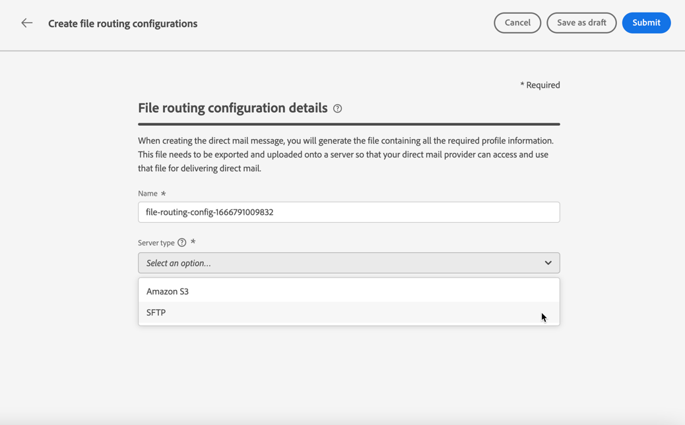

# Configuration du courrier {#direct-mail-configuration}

[!DNL Journey Optimizer] vous permet de personnaliser et de générer les fichiers requis par les opérateurs de services postaux pour envoyer du courrier à vos clients.

When [création d&#39;un message](../messages/create-direct-mail.md), vous définissez les données de l’audience ciblée, y compris les informations de contact sélectionnées (adresse postale par exemple). Un fichier contenant ces données sera alors automatiquement généré et exporté vers un serveur, où votre opérateur de services postaux pourra les récupérer et prendre en charge l&#39;envoi.

Avant de pouvoir générer ce fichier, vous devez créer :

1. A [configuration du routage des fichiers](#file-routing-configuration) pour spécifier le serveur sur lequel le fichier sera exporté.

1. A [surface courrier](#direct-mail-surface) qui fera référence à la configuration de routage des fichiers.

>[!CAUTION]
>
>Si vous n&#39;avez configuré aucune option de routage de fichier, vous ne pourrez pas créer de surface de courrier.

## Configuration du routage des fichiers {#file-routing-configuration}

>[!CONTEXTUALHELP]
>id="ajo_dm_file_routing_details"
>title="Définition de la configuration du routage des fichiers"
>abstract="Une fois que vous avez créé un courrier, le fichier contenant les données de l&#39;audience ciblée sera généré et exporté vers un serveur. Vous devez spécifier les détails du serveur afin que votre opérateur de services postaux puisse accéder à ce fichier et l’utiliser pour diffuser du courrier."
>additional-url="https://experienceleague.adobe.com/docs/journey-optimizer/using/messages/create-direct-mail.html" text="Créer un message de courrier"

>[!CONTEXTUALHELP]
>id="ajo_dm_file_routing_details_header"
>title="Définition de la configuration du routage des fichiers"
>abstract="Vous devez définir l&#39;endroit où le fichier sera exporté pour que votre opérateur de services postaux puisse l&#39;utiliser."

>[!CONTEXTUALHELP]
>id="ajo_dm_select_file_routing"
>title="Configuration du routage des fichiers"
>abstract="Sélectionnez la configuration de routage des fichiers de votre choix, qui définit l&#39;endroit où le fichier sera exporté pour que votre opérateur de services postaux l&#39;utilise."

>[!CONTEXTUALHELP]
>id="ajo_dm_file_routing_type"
>title="Sélectionnez le type de serveur pour votre fichier ."
>abstract="Choisissez le type de serveur à utiliser pour l&#39;export de vos fichiers de courrier. Actuellement, seuls Amazon S3 et SFTP sont pris en charge par Journey Optimizer."

>[!CONTEXTUALHELP]
>id="ajo_dm_file_routing_aws_region"
>title="Choisissez la région AWS"
>abstract="Sélectionnez la région géographique du serveur AWS où vous souhaitez exporter vos fichiers de courrier. En règle générale, il est préférable de choisir la région la plus proche du lieu où se trouve votre opérateur de services postaux."

Pour diffuser un courrier, [!DNL Journey Optimizer] génère et exporte vers un serveur le fichier contenant les données de votre audience ciblée.

Vous devez spécifier les détails du serveur afin que votre opérateur de services postaux puisse accéder à ce fichier et l’utiliser pour diffuser du courrier.

Pour configurer le routage des fichiers, procédez comme suit.

1. Accédez au **[!UICONTROL Administration]** > **[!UICONTROL Canaux]** > **[!UICONTROL Configuration du routage des fichiers]** > **[!UICONTROL Routage de fichier]** , puis cliquez sur **[!UICONTROL Création d’une configuration de routage]**.

   

1. Attribuez un nom à votre configuration.

1. Sélectionnez la **[!UICONTROL Type de serveur]** que vous souhaitez utiliser pour exporter les fichiers de courrier.

   

   >[!NOTE]
   >
   >Actuellement, seuls Amazon S3 et SFTP sont pris en charge dans [!DNL Journey Optimizer].

1. Renseignez les détails et les informations d’identification de votre serveur, telles que l’adresse du serveur, la clé d’accès, etc.

   

1. Si vous avez sélectionné **[!UICONTROL Amazon S3]**, choisissez la variable **[!UICONTROL Région AWS]** où se trouve l’infrastructure du serveur.

   

   >[!NOTE]
   >
   >Les régions AWS sont des zones géographiques qu’AWS utilise pour héberger ses infrastructures cloud. En règle générale, il est préférable de choisir la région la plus proche de l’emplacement de votre opérateur de services postaux.

1. Sélectionnez **[!UICONTROL Envoyer]**. La configuration de routage des fichiers est créée avec l’événement **[!UICONTROL Principal]** statut. Il est maintenant prêt à être utilisé dans une [surface courrier](#direct-mail-surface).

   >[!NOTE]
   >
   >Vous pouvez également sélectionner **[!UICONTROL Enregistrer en tant que brouillon]** pour créer la configuration de routage des fichiers, mais vous ne pourrez pas la sélectionner en surface tant qu&#39;elle n&#39;est pas **[!UICONTROL Principal]**.

## Créer une surface de courrier {#direct-mail-surface}

>[!CONTEXTUALHELP]
>id="ajo_dm_surface_settings"
>title="Définition des paramètres du courrier"
>abstract="Une surface de courrier contient les paramètres de formatage du fichier qui contient les données d&#39;audience ciblées et qui seront utilisés par le prestataire de services postaux. Vous devez également définir l’endroit où le fichier sera exporté en sélectionnant la configuration de routage du fichier."
>additional-url="https://experienceleague.adobe.com/docs/journey-optimizer/using/configuration/configuration-message/direct-mail-configuration.html#file-routing-configuration" text="Configuration du routage des fichiers"

<!--
>[!CONTEXTUALHELP]
>id="ajo_dm_surface_sort"
>title="Define the sort order"
>abstract="If you select this option, the sort will be by profile ID, ascending or descending. If you unselect it, the sorting configuration defined when creating the direct mail message within a journey or a campaign."-->

>[!CONTEXTUALHELP]
>id="ajo_dm_surface_split"
>title="Définition du seuil de partage de fichiers"
>abstract="Vous devez définir le nombre maximum d&#39;enregistrements pour chaque fichier contenant les données d&#39;audience. Vous pouvez sélectionner un nombre compris entre 1 et 200 000 enregistrements. Une fois le seuil spécifié atteint, un autre fichier sera créé pour les enregistrements restants."

Pour pouvoir diffuser du courrier avec [!DNL Journey Optimizer], vous devez créer une surface de canal pour définir les paramètres de formatage du fichier qui sera utilisé par le fournisseur de services de messagerie.

Une surface de courrier doit également inclure la configuration de routage des fichiers qui définit le serveur sur lequel votre fichier de courrier sera exporté.

1. Création d’une surface de canal. [En savoir plus](channel-surfaces.md)

1. Sélectionnez la **[!UICONTROL Canal Courrier]** canal.

   

1. Définissez les paramètres du courrier dans la section dédiée de la configuration de la surface du canal.

   

   <!---->

1. Sélectionnez le format du fichier : **[!UICONTROL CSV]** ou **[!UICONTROL Texte délimité]**.

1. Sélectionnez la **[!UICONTROL Configuration du routage des fichiers]** parmi celles que vous avez créées. Cette option définit l’endroit où le fichier sera exporté pour que votre opérateur de services postaux l’utilise.

   >[!CAUTION]
   >
   >Si vous n&#39;avez configuré aucune option de routage de fichier, vous ne pourrez pas créer de surface de courrier. [En savoir plus](#file-routing-configuration)

   

   <!---->

1. Envoyez la surface du courrier.

Vous pouvez désormais [créer un message de courrier](../messages/create-direct-mail.md) dans une campagne. Une fois l&#39;opération lancée, le fichier contenant les données de l&#39;audience ciblée sera automatiquement exporté vers le serveur que vous avez défini. Le prestataire de services postaux pourra alors récupérer ce fichier et poursuivre la diffusion courrier.

>[!NOTE]
>
>Les lignes en double sont automatiquement supprimées.
>
>Si le nombre maximum d&#39;enregistrements (c&#39;est-à-dire des lignes) pour chaque fichier contenant des données de profil est trop élevé, un autre fichier sera automatiquement créé pour les enregistrements restants.

<!--
    In the **[!UICONTROL Insertion]** section, you can choose to automatically remove duplicate rows.

    Define the maximum number of records (i.e. rows) for each file containing profile data. After the specified threshold is reached, another file will be created for the remaining records.

    

    For example, if there are 100,000 records in the file and the threshold limit is set to 60,000, the records will be split into two files. The first file will contain 60,000 rows, and the second file will contain the remaining 40,000 rows.

    >[!NOTE]
    >
    >NOTE You can set any number between 1 and 200,000 records, meaning each file must contain at least 1 row and no more than 200,000 rows.

-->