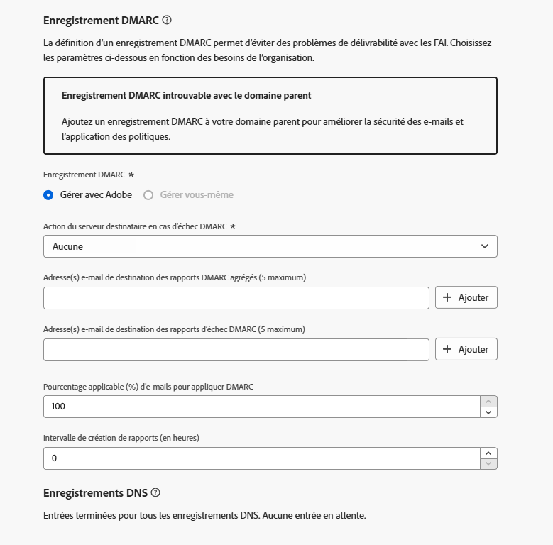

# Enregistrement DMARC {#dmarc-record}

>[!CONTEXTUALHELP]
>id="ajo_admin_dmarc_record"
>title="Configurer l’enregistrement DMARC"
>abstract="DMARC est une méthode d’authentification e-mail qui permet aux personnes propriétaires de domaine de protéger leur domaine d’une utilisation non autorisée et d’éviter les problèmes de délivrabilité avec les fournisseurs de messagerie. Dans le cadre de l’application des bonnes pratiques du secteur, Google et Yahoo! exigent que vous disposiez d’un enregistrement DMARC pour tout domaine utilisé pour leur envoyer des e-mails."

## Qu’est-ce que DMARC ? {#what-is-dmarc}

DMARC (Domain-based Message Authentication, Reporting, and Conformance, soit Authentification, création de rapports et conformité des messages basés sur le domaine) est une méthode d’authentification d’e-mail qui permet aux personnes propriétaires de domaine de protéger leur domaine d’une utilisation non autorisée. En fournissant une politique claire aux fournisseurs de messagerie et aux fournisseurs d’accès à Internet (FAI), elle permet d’empêcher des entités malveillantes d’envoyer des e-mails prétendant provenir de votre domaine. L’implémentation de DMARC réduit le risque que les e-mails légitimes soient marqués comme spam ou rejetés et améliore la délivrabilité de vos e-mails.

DMARC propose également des rapports sur les messages dont l’authentification échoue, ainsi qu’un contrôle sur la gestion des e-mails qui ne sont pas conformes à la validation DMARC. Selon la [politique DMARC](#dmarc-policies) implémentée, ces e-mails peuvent être surveillés, mis en quarantaine ou refusés. Ces fonctionnalités vous permettent de prendre des mesures pour atténuer les erreurs potentielles et les corriger.

Pour éviter les problèmes de délivrabilité tout en prenant le contrôle des e-mails qui ne parviennent pas à être authentifiés, [!DNL Journey Optimizer] prend désormais en charge la technologie DMARC directement dans son interface d’administration. [En savoir plus](#implement-dmarc)

### Comment DMARC fonctionne-t-il ? {#how-dmarc-works}

SPF et DKIM sont tous deux utilisés pour associer un e-mail à un domaine et permettent d’authentifier les e-mails. DMARC va plus loin et contribue à empêcher les usurpations en faisant correspondre le domaine vérifié par DKIM et SPF.

>[!NOTE]
>
>Dans Journey Optimizer, SPF et DKIM sont configurés pour vous.

Pour être conforme à DMARC, un message doit être conforme à SPF ou DKIM.

* SPF (Sender Policy Framework) aide à vérifier que l’e-mail provient d’une source autorisée en comparant l’adresse IP du serveur d’envoi à une liste d’adresses IP autorisées pour le domaine.
* DKIM (DomainKeys Identified Mail) ajoute une signature numérique aux e-mails, permettant aux personnes destinataires de vérifier l’intégrité et l’authenticité du message.

Si l’authentification des deux échoue, DMARC échoue et l’e-mail est diffusé conformément à la politique DMARC que vous avez sélectionnée.

<!--DMARC requires alignment between the 'From" and 'Return-Path' address.-->

### Politiques DMARC {#dmarc-policies}

Si un e-mail ne parvient pas à s’authentifier auprès de DMARC, vous pouvez décider quelle action sera appliquée à ce message. DMARC propose trois options de politique :

* Surveiller (p=none) : indique au fournisseur de messagerie/FAI d’appliquer la procédure normale au message.
* Quarantaine (p=quarantine) : indique au fournisseur de messagerie/FAI d’envoyer les e-mails qui ne passent pas DMARC vers le dossier spam ou de courrier indésirable des personnes destinataires.
* Rejeter (p=reject) : indique au fournisseur de messagerie/FAI de bloquer les e-mails qui ne passent pas DMARC, ce qui entraîne un rebond.

>[!NOTE]
>
>Découvrez comment définir la politique DMARC avec [!DNL Journey Optimizer] dans [cette section](#set-up-dmarc).

## Mise à jour des exigences DMARC {#dmarc-update}

Dans le cadre de l’application des bonnes pratiques du secteur, Google et Yahoo! exigent tous deux que vous disposiez d’un **enregistrement DMARC** pour tout domaine utilisé pour leur envoyer des e-mails. Cette nouvelle exigence s’applique dès le **1er février 2024**.

>[!CAUTION]
>
>Ne pas se conformer à cette nouvelle exigence de Gmail et Yahoo! est susceptible d’entraîner la réception des e-mails dans le dossier de spam ou leur blocage.

Par conséquent, Adobe vous recommande vivement de prendre les mesures suivantes :

* Assurez-vous que l’**enregistrement DMARC** est configuré pour **tous les sous-domaines que vous avez délégués** à Adobe dans [!DNL Journey Optimizer]. [Voici comment procéder](#check-subdomains-for-dmarc)

* Lorsque vous **déléguez un nouveau sous-domaine** à Adobe, vous pouvez **configurer DMARC** directement dans l’interface d’administration [!DNL Journey Optimizer]. [Voici comment procéder](#set-up-dmarc)

## Implémenter DMARC dans [!DNL Journey Optimizer] {#implement-dmarc}

L’interface d’administration [!DNL Journey Optimizer] vous permet de configurer l’enregistrement DMARC pour tous les sous-domaines que vous avez déjà délégués ou que vous souhaitez déléguer à Adobe. Les étapes détaillées sont décrites ci-dessous.

### Vérifier vos sous-domaines existants pour DMARC {#check-subdomains-for-dmarc}

Pour vous assurer que l’enregistrement DMARC est configuré pour tous les sous-domaines que vous avez délégués à [!DNL Journey Optimizer], suivez les étapes ci-dessous.

1. Accédez au menu **[!UICONTROL Administration]** > **[!UICONTROL Canaux]** > **[!UICONTROL Paramètres des e-mails]** > **[!UICONTROL Sous-domaines]**, puis cliquez sur **[!UICONTROL Configurer le sous-domaine]**.

1. Pour chaque sous-domaine délégué, vérifiez la colonne **[!UICONTROL Enregistrement DMARC]**. Si aucun enregistrement n’a été trouvé pour un sous-domaine donné, une alerte s’affiche.

   

   >[!CAUTION]
   >
   >Pour se conformer à la nouvelle exigence de Gmail et Yahoo! et éviter des problèmes de délivrabilité avec les principaux FAI, il est recommandé de configurer un enregistrement DMARC pour tous les sous-domaines délégués. [En savoir plus](dmarc-record-update.md)

1. Sélectionnez un sous-domaine auquel aucun enregistrement DMARC n’est associé et renseignez les champs **[!UICONTROL Enregistrement DMARC]** en fonction des besoins de votre entreprise. Les étapes pour renseigner les champs de l’enregistrement DMARC sont présentées dans [cette section](#set-up-dmarc).

   <!---->

   >[!NOTE]
   >
   >Si un domaine parent comporte un enregistrement DMARC, vous pouvez choisir d’utiliser les valeurs de ce domaine ou de laisser Adobe gérer l’enregistrement DMARC. [En savoir plus](#manage-dmarc-with-adobe)

1. Si vous modifiez un sous-domaine qui est :

   * Il est [Entièrement délégué](delegate-subdomain.md#set-up-subdomain) à Adobe, aucune autre action n’est requise.

   * Si vous modifiez un [CNAME](delegate-subdomain.md#cname-subdomain-setup), vous devez copier l’enregistrement DNS pour DMARC dans votre solution d’hébergement afin de générer les enregistrements DNS correspondants.

     

     Vérifiez que l’enregistrement DNS a été généré dans votre solution d’hébergement de domaine et cochez la case « Je confirme... ».

1. Enregistrez vos modifications.

### Configurer DMARC pour les nouveaux sous-domaines {#set-up-dmarc}

Lors de la délégation de nouveaux sous-domaines à Adobe dans [!DNL Journey Optimizer], un enregistrement DMARC sera créé dans DNS pour votre domaine. Suivez les étapes ci-dessous pour mettre en œuvre DMARC.

>[!CAUTION]
>
>Pour se conformer à la nouvelle exigence de Gmail et Yahoo! et éviter des problèmes de délivrabilité avec les principaux FAI, il est recommandé de configurer un enregistrement DMARC pour tous les sous-domaines délégués. [En savoir plus](dmarc-record-update.md)

<!--If you fail to comply with the new requirement from Gmail and Yahoo! to have DMARC record for all sending domains, your emails are expected to land into the spam folder or to get blocked.-->

1. Configurez un nouveau sous-domaine. [Voici comment procéder](delegate-subdomain.md)

1. Accédez à la section **[!UICONTROL Enregistrement DMARC]**.

1. Si un enregistrement DMARC est disponible sur le domaine parent associé à votre sous-domaine, deux options s’affichent :

   

   * **[!UICONTROL Gérer avec Adobe]** : Adobe peut gérer l’enregistrement DMARC pour votre sous-domaine. Suivez les étapes présentées dans [cette section](#manage-dmarc-with-adobe).

   * **[!UICONTROL Gérer soi-même]** : <!--This option is selected by default.-->cette option vous permet de gérer l’enregistrement DMARC en dehors de [!DNL Journey Optimizer], à l’aide des valeurs de votre domaine parent. Ces valeurs s’affichent dans l’interface, mais vous ne pouvez pas les modifier.

     {width="80%"}

1. Si le domaine parent ne comporte aucun enregistrement DMARC, seule l’option **[!UICONTROL Gérer avec Adobe]** est disponible. Suivez les étapes [ci-dessous](#manage-dmarc-with-adobe) pour configurer l’enregistrement DMARC de votre sous-domaine.

   {width="80%"}

### Gérer l’enregistrement DMARC avec Adobe {#manage-dmarc-with-adobe}

Pour permettre à Adobe de gérer l’enregistrement DMARC à votre place, sélectionnez l’option **[!UICONTROL Gérer avec Adobe]** et procédez comme suit.

>[!NOTE]
>
>Si [!DNL Journey Optimizer] effectue la récupération, vous pouvez utiliser les mêmes valeurs que celles mises en surbrillance dans l’interface ou les modifier si nécessaire.

{width="80%"}

>[!NOTE]
>
>Si vous n’ajoutez pas de valeurs, les valeurs préremplies par défaut seront utilisées.

1. Définissez l’action que le serveur de la personne destinataire doit effectuer en cas d’échec de DMARC. Selon la [politique DMARC](#dmarc-policies) que vous souhaitez appliquer, sélectionnez l’une des trois options :

   * **[!UICONTROL Aucune]** (valeur par défaut) : indique à la personne destinataire de n’effectuer aucune action sur les messages qui ne passent pas l’authentification DMARC, tout en envoyant des rapports d’e-mail à l’expéditeur ou à l’expéditrice.
   * **[!UICONTROL Quarantaine]** : indique au serveur de réception de mettre en quarantaine les e-mails qui ne passent pas l’authentification DMARC. Cela signifie généralement de placer ces messages dans le dossier spam ou courrier indésirable de la personne destinataire.
   * **[!UICONTROL Refus]** : indique à la personne destinataire de refuser complètement (rebond) tout e-mail pour le domaine qui ne réussit pas l’authentification. Lorsque cette politique est activée, seul un e-mail qui est vérifié comme étant authentifié à 100 % par votre domaine aura une chance d’être placé en boîte de réception.

   >[!NOTE]
   >
   >Il est recommandé de déployer lentement la mise en œuvre de DMARC en faisant passer votre politique DMARC de **Aucune** à **Quarantaine**, puis à **Refus**, à mesure que vous comprenez l’impact potentiel de DMARC.

1. Vous pouvez éventuellement ajouter une ou plusieurs adresses e-mail de votre choix pour indiquer où stocker les **rapports DMARC** des e-mails qui [ne réussissent pas l’authentification](#how-dmarc-works) dans votre entreprise. Vous pouvez ajouter jusqu’à cinq adresses pour chaque rapport.

   >[!NOTE]
   >
   >Assurez-vous que vous contrôlez une véritable boîte de réception (hors Adobe) dans laquelle vous pouvez recevoir ces rapports.

   Il existe deux rapports différents générés par les FAI que les expéditeurs et expéditrices peuvent recevoir par le biais des balises RUA/RUF dans leur politique DMARC :

   * **Rapports agrégés** (RUA) : ils ne contiennent aucune information d’identification personnelle qui pourrait être sensible au RGPD.
   * **Rapports d’échec** (RUF) : ils contiennent des adresses e-mail sensibles au RGPD. Avant de les utiliser, vérifiez en interne comment traiter les informations qui doivent être conformes au RGPD.

   >[!NOTE]
   >
   >Ces rapports hautement techniques fournissent une vue d’ensemble des e-mails qui ont fait l’objet d’une tentative d’usurpation. Il est préférable de les digérer à l’aide d’un outil tiers.

1. Sélectionnez le **pourcentage applicable** des e-mails pour DMARC.

   Ce pourcentage dépend de votre confiance dans votre infrastructure de messagerie et de la tolérance envers les faux positifs (e-mails légitimes marqués comme frauduleux). Il est courant que les organisations commencent par définir la politique DMARC sur **Aucune**. Augmentez progressivement le pourcentage de la politique DMARC et surveillez de près l’impact sur la bonne diffusion des e-mails.

   >[!NOTE]
   >
   >Collaborez avec vos administrateurs et vos administratrices de messagerie ainsi que votre équipe informatique pour augmenter progressivement le pourcentage lorsque vous prenez confiance dans vos pratiques d’authentification des e-mails.

   Une bonne pratique consiste à viser un taux de conformité DMARC élevé, idéalement proche de 100 %, afin de maximiser les avantages de sécurité tout en réduisant le risque de faux positifs.

1. Sélectionnez une **intervalle de rapports** entre 24 et 168 heures. Cela permet aux personnes propriétaires de domaine de recevoir des mises à jour régulières des résultats de l’authentification des e-mails et de prendre les mesures nécessaires pour améliorer la sécurité des e-mails.

### Résolution des problèmes {#troubleshooting}

Lors de la configuration d’un enregistrement DMARC, un enregistrement TXT DNS est ajouté aux paramètres DNS de votre domaine en spécifiant votre politique DMARC.

**Délai de propagation DNS**

Les modifications DNS prennent du temps à se propager sur Internet, généralement entre quelques minutes et 48 heures. Si vous venez d’apporter une modification à la configuration DMARC et que vous tentez de vérifier immédiatement la mise à jour, des erreurs s’affichent ou les modifications peuvent ne pas encore être détectées.

Prévoyez suffisamment de temps pour que les enregistrements DNS se propagent avant d’essayer de vérifier votre configuration DMARC. Si le problème persistent après 48 heures, vérifiez que les enregistrements DNS ont été correctement ajoutés à votre solution d’hébergement.

<!--The DMARC reporting interval is specified in the DMARC policy published in the DNS (Domain Name System) records for a domain. The reporting interval can be set to daily, weekly, or another specified frequency, depending on the domain owner's preferences.

The default value (24 hours) is generally the email providers' expectation.-->

<!--

## What are the benefits of DMARC? {#dmarc-benefits}

The key benefits or DMARC are as folllows:

* Setting up a DMARC record involves adding a DNS TXT record to your domain's DNS settings. This record specifies your DMARC policy, such as whether to quarantine or reject messages that fail authentication. Implementing DMARC is a proactive step towards enhancing email security and protecting both your organization and your recipients from email-based threats.

* DMARC helps prevent malicious actors from sending emails that appear to come from your domain. By setting up DMARC, you can specify how email providers should handle messages that fail authentication checks, reducing the likelihood that phishing emails will reach recipients.

* DMARC helps improve email deliverability by providing a clear policy for email providers to follow when encountering messages claiming to be from your domain. This can reduce the chances of legitimate emails being marked as spam or rejected.

* DMARC helps protect against email spoofing, phishing, and other fraudulent activities.

* It allows you to decide how a mailbox provider should handle emails that fail SPF and DKIM checks, providing a way to authenticate the sender's domain and prevent unauthorized use of the domain for malicious purposes.

* DMARC allows email receivers to easily identify the authentication of emails, which could potentially improve delivery.

* It offers reporting on which messages fail SPF and/or DKIM, enabling senders to gain visibility.

* This increased visibility allows for steps to be taken to mitigate further errors. It gives senders a degree of control over what happens with mail that does not pass either of these authentication methods.-->
