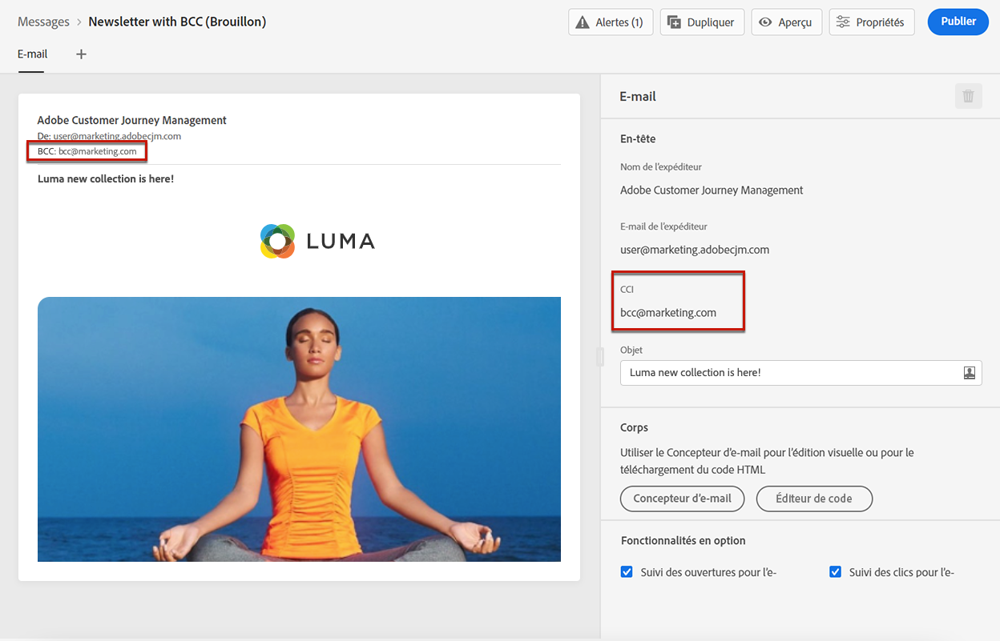

# Configurer les paramètres d’e-mail {#email-settings}

Définissez les paramètres d&#39;email dans la section dédiée de la configuration des paramètres prédéfinis du message. Découvrez comment créer des paramètres prédéfinis de message dans [cette section](message-presets.md).


## Type d’e-mail {#email-type}

>[!CONTEXTUALHELP]
>id="ajo_admin_presets_emailtype"
>title="Définition de la catégorie d’e-mail"
>abstract="Sélectionnez le type de messages qui sera envoyé lors de l&#39;utilisation de ce préréglage : Marketing pour les messages promotionnels, qui nécessitent un consentement de l’utilisateur, ou Transactionnel pour les messages non commerciaux, qui peuvent également être envoyés aux profils désabonnés dans des contextes spécifiques."

Dans la section **TYPE DʼE-MAIL**, sélectionnez le type de message à envoyer grâce au préréglage : **Marketing** ou **Transactionnel**.

* Choisissez **Marketing** pour les messages promotionnels : ces messages nécessitent le consentement de l’utilisateur.

* Choisissez **Transactionnel** pour les messages non commerciaux tels que la confirmation de commande, les notifications de réinitialisation de mot de passe ou les informations de diffusion, par exemple.

>[!CAUTION]
>
>Les messages **transactionnels** peuvent être envoyés aux profils qui se sont désabonnés des communications marketing. Ces messages ne peuvent être envoyés que dans des contextes spécifiques.

Lors de la [création d’un message](../messages/get-started-content.md#create-new-message), vous devez choisir un préréglage de message valide correspondant à la catégorie que vous avez sélectionnée pour votre message.

## Sous-domaine et groupes d’adresses IP {#subdomains-and-ip-pools}

Dans la section **DÉTAILS DU SOUS-DOMAINE ET DU GROUPE DʼADRESSES IP**, vous devez effectuer les actions suivantes :

1. Sélectionnez le sous-domaine à utiliser pour envoyer les e-mails. [En savoir plus](about-subdomain-delegation.md)

1. Sélectionnez le pool d&#39;adresses IP à associer au préréglage. [En savoir plus](ip-pools.md)


Vous ne pouvez pas poursuivre la création du préréglage lorsque le groupe d’adresses IP sélectionné est en cours d’[édition](ip-pools.md#edit-ip-pool) (statut **[!UICONTROL Traitement en cours]**) et n’a jamais été associé au sous-domaine sélectionné. Sinon, la version la plus ancienne de l’association groupe d’adresses IP/sous-domaine sera toujours utilisée. Si c’est le cas, enregistrez le préréglage en tant que brouillon, puis réessayez une fois que le groupe d’adresses IP a le statut **[!UICONTROL Succès]**.

>[!NOTE]
>
>Pour les environnements hors production, Adobe ne crée pas de sous-domaines de test d’usine et n’accorde pas l’accès à un groupe d’adresses IP d’envoi partagé. Vous devez [déléguer vos propres sous-domaines](delegate-subdomain.md) et utiliser les adresses IP du groupe affecté à votre organisation.

## List-Unsubscribe {#list-unsubscribe}

Si vous choisissez [sélection d&#39;un sous-domaine](#subdomains-and-ip-pools) dans la liste, l&#39;option **[!UICONTROL Activer List-Unsubscribe]** s&#39;affiche.


Cette option est affichée par défaut.

Si vous la laissez activée, un lien de désabonnement sera automatiquement inclus dans l&#39;en-tête de l&#39;e-mail, par exemple :


Si vous désactivez cette option, aucun lien de désabonnement ne s&#39;affichera dans l&#39;en-tête de l&#39;e-mail.

Le lien de désabonnement se compose de deux éléments :

* Une **adresse e-mail de désabonnement**, à laquelle toutes les requêtes de désabonnement sont envoyées.

   Dans [!DNL Journey Optimizer], l&#39;adresse e-mail de désabonnement est l&#39;adresse par défaut **[!UICONTROL Mailto (unsubscribe)]** affichée dans le paramètre prédéfini du message, en fonction du [sous-domaine sélectionné](#subdomains-and-ip-pools).

   

* L&#39;**URL de désabonnement**, qui est l&#39;URL de la page de destination vers laquelle l&#39;utilisateur sera redirigé une fois désabonné.

   Si vous ajoutez un [lien de désinscription en un clic](../messages/consent.md#one-click-opt-out) pour un message créé à l&#39;aide de ce paramètre prédéfini, l&#39;URL de désabonnement sera l&#39;URL définie pour le lien de désinscrptioni en un clic.

   

   >[!NOTE]
   >
   >Si vous n&#39;ajoutez pas de lien de désinscription en un clic dans le contenu de votre message, aucune page de destination ne sera affichée pour l&#39;utilisateur.

Apprenez-en davantage sur l&#39;ajout d’un lien de désinscription dans l&#39;en-tête de vos messages dans [cette section](../messages/consent.md#unsubscribe-header).

<!--Select the **[!UICONTROL Custom List-Unsubscribe]** option to enter your own Unsubscribe URL and/or your own Unsubscribe email address.(to add later)-->

## Paramètres d’en-tête{#email-header}

Dans la section **[!UICONTROL PARAMÈTRES D&#39;EN-TÊTE]**, saisissez les noms et adresses e-mail de l&#39;expéditeur associés au type de messages envoyés à l&#39;aide de ce paramètre prédéfini.

>[!CAUTION]
>
>Les adresses e-mail doivent utiliser le [sous-domaine délégué](about-subdomain-delegation.md) actuellement sélectionné.

* **[!UICONTROL Nom de l’expéditeur]** : le nom de l&#39;expéditeur, tel que le nom de votre marque.

* **[!UICONTROL E-mail de l&#39;expéditeur]** : adresse e-mail que vous souhaitez utiliser pour vos communications. Par exemple, si le sous-domaine délégué est *marketing.luma.com*, vous pouvez utiliser *contact@marketing.luma.com*.

* **[!UICONTROL Répondre à (nom)]** : le nom qui sera utilisé lorsque le destinataire clique sur le bouton **Répondre** de son logiciel de messagerie.

* **[!UICONTROL Répondre à (e-mail)]** : adresse e-mail qui sera utilisée lorsque le destinataire clique sur le bouton **Répondre** de son logiciel de messagerie. Vous devez utiliser une adresse définie sur le sous-domaine délégué (par exemple, *reply@marketing.luma.com*), sinon les e-mails seront ignorés.

* **[!UICONTROL Message d’erreur]** : toutes les erreurs générées par les FAI après quelques jours de diffusion de l’e-mail (bounces asynchrones) sont reçues sur cette adresse.


>[!NOTE]
>
>Les adresses doivent commencer par une lettre (A-Z) et ne peuvent contenir que des caractères alphanumériques. Vous pouvez également utiliser le trait de soulignement `_`, le point`.` et le trait dʼunion `-`.

### Transférer l’email {#forward-email}

Si vous souhaitez transférer vers une adresse de courriel spécifique tous les courriers électroniques reçus par [!DNL Journey Optimizer] pour le sous-domaine délégué, contactez l’assistance clientèle d’Adobe. Vous devrez fournir les éléments suivants :

* Adresse électronique de transfert de votre choix. Notez que le domaine de l’adresse électronique de transfert ne peut correspondre à aucun sous-domaine délégué à l’Adobe.
* Nom de votre environnement de test.
* Nom prédéfini pour lequel l’adresse électronique de transfert (ou &quot;réponse à&quot;) sera utilisée.
* La variable **[!UICONTROL Répondre à (email)]** adresse définie au niveau du paramètre prédéfini.

>[!NOTE]
>
>Il ne peut y avoir qu’une seule adresse électronique de transfert par sous-domaine. Par conséquent, si plusieurs paramètres prédéfinis utilisent le même sous-domaine, la même adresse électronique doit être utilisée pour tous les sous-domaines.

L’adresse email de transfert sera configurée par Adobe. Cela peut prendre de 3 à 4 jours.

## Email Cci {#bcc-email}

>[!CONTEXTUALHELP]
>id="ajo_admin_preset_bcc"
>title="Définition d’une adresse email en Cci"
>abstract="Vous pouvez conserver une copie des emails envoyés en les envoyant à une boîte de réception en Cci. Saisissez l&#39;adresse email de votre choix afin que chaque email envoyé soit copié en aveugle vers cette adresse Cci. Cette fonctionnalité est facultative pour "

Vous pouvez envoyer une copie identique (ou une copie en carbone invisible) d’un email envoyé par [!DNL Journey Optimizer] dans une boîte de réception Cci. Cette fonctionnalité facultative vous permet de conserver des copies des communications par e-mail que vous envoyez à vos utilisateurs à des fins de conformité et/ou d’archivage. Cela sera invisible pour les destinataires de la diffusion.

### Activer les emails en Cci {#enable-bcc}

Pour activer la variable **[!UICONTROL Email Cci]** , saisissez l&#39;adresse email de votre choix dans le champ dédié. Vous pouvez spécifier n’importe quelle adresse externe au format correct, à l’exception d’une adresse électronique définie sur le sous-domaine délégué. Par exemple, si le sous-domaine délégué est *marketing.luma.com*, toute adresse telle que *abc@marketing.luma.com* est interdite.

>[!NOTE]
>
>Vous ne pouvez définir qu&#39;une seule adresse email en Cci. Assurez-vous que l&#39;adresse en Cci dispose d&#39;une capacité de réception suffisante pour stocker tous les emails envoyés à l&#39;aide du paramètre prédéfini actuel.


Tous les emails utilisant ce paramètre prédéfini seront copiés en aveugle vers l’adresse email en Cci que vous avez saisie. De là, ils peuvent être traités et archivés à l’aide d’un système externe.

>[!CAUTION]
>
>Votre utilisation de la fonctionnalité en Cci sera prise en compte par rapport au nombre de messages pour lesquels vous disposez d’une licence. Par conséquent, activez-la uniquement dans les paramètres prédéfinis utilisés pour les communications critiques que vous souhaitez archiver. Vérifiez votre contrat pour les volumes sous licence.

Le paramètre d’adresse email en Cci est immédiatement enregistré et traité au niveau du paramètre prédéfini. Lorsque vous [créer un message](../messages/get-started-content.md#create-new-message) avec ce paramètre prédéfini, l&#39;adresse email en Cci s&#39;affiche automatiquement.



Cependant, l’adresse en Cci est sélectionnée pour l’envoi de communications en suivant la logique ci-dessous :

* Pour les parcours de lot et d’éclatement, cela ne s’applique pas à l’exécution par lots ou par éclats qui avaient déjà démarré avant que le paramètre Cci ne soit défini. La modification sera récupérée lors de la prochaine périodicité ou de la nouvelle exécution.

* Pour les messages transactionnels, la modification est immédiatement récupérée pour la communication suivante (délai d’une minute maximum).

>[!NOTE]
>
>Vous n’avez pas besoin de republier un message ou un parcours pour que le paramètre Cci soit sélectionné.

### Recommandations et limitations {#recommendations-limitations}

* Assurez-vous que l&#39;adresse email en Cci est correctement définie. Si ce n’est pas le cas, les informations d’identification personnelle de vos clients peuvent être envoyées à une adresse indésirable.

* Pour des raisons de confidentialité, les emails en Cci doivent être traités dans un système d’archivage capable de stocker en toute sécurité les informations d’identification personnelles (PII).

* Cette fonctionnalité peut diffuser l’adresse email en Cci avant la diffusion aux destinataires, ce qui peut entraîner l’envoi de messages en Cci même si les diffusions d’origine peuvent avoir [bounce](../reports/suppression-list.md#delivery-failures).

   <!--OR: Only successfully sent emails are taken in account. [Bounces](../reports/suppression-list.md#delivery-failures) are not. TO CHECK -->

* Si les emails envoyés à l&#39;adresse en Cci sont ouverts et font l&#39;objet de clics, cela sera pris en compte dans le total des ouvertures et des clics de l&#39;analyse d&#39;envoi, ce qui pourrait entraîner des erreurs de calcul dans [rapports](../reports/message-monitoring.md). De même, le marquage des emails en Cci entrant dans votre boîte de réception comme spam peut entraîner l’entrée des emails dans le dossier spam de votre boîte de réception.

* Votre boîte de réception utilisée pour la fonctionnalité Cci doit être correctement gérée pour l’espace et la diffusion. Si la boîte de réception renvoie des rebonds, certains emails peuvent ne pas être reçus et ne seront donc pas archivés.

>[!CAUTION]
>
>Évitez de cliquer sur le lien de désabonnement dans les emails envoyés à l&#39;adresse en Cci, car vous désabonnez immédiatement les destinataires correspondants.

### Conformité au RGPD {#gdpr-compliance}

Les réglementations telles que le RGPD stipulent que les titulaires de données doivent pouvoir modifier leur consentement à tout moment. Comme les emails en Cci que vous envoyez avec Journey Optimizer contiennent des informations d’identification personnelles (PII) en toute sécurité, vous devez modifier la variable **[!UICONTROL Schéma d’événement de retour CJM Email Cci]** être en mesure de gérer ces informations d’identification personnelle conformément au RGPD et aux règlements similaires.

Pour ce faire, suivez les étapes ci-après.

1. Accédez à **[!UICONTROL Gestion des données]** > **[!UICONTROL Schémas]** > **[!UICONTROL Parcourir]** et sélectionnez **[!UICONTROL Schéma d’événement de retour CJM Email Cci]**.

   

1. Cliquez pour développer **[!UICONTROL _experience]**, **[!UICONTROL customerJourneyManagement]** then **[!UICONTROL secondaryRecipientDetail]**.

1. Sélectionner **[!UICONTROL originalRecipientAddress]**.

1. Dans le **[!UICONTROL Propriétés du champ]** à droite, faites défiler l’écran jusqu’à la **[!UICONTROL Identité]** .

1. Sélectionnez-le et sélectionnez également **[!UICONTROL Identité Principal]**.

1. Sélectionnez un espace de noms dans la liste déroulante.

   

1. Cliquez sur **[!UICONTROL Appliquer]**.

>[!NOTE]
>
>Pour en savoir plus sur la gestion de la confidentialité et les réglementations applicables, consultez la [documentation Experience Platform](https://experienceleague.adobe.com/docs/experience-platform/privacy/home.html?lang=fr){target=&quot;_blank&quot;}.

### Données de reporting en Cci {#bcc-reporting}

Le reporting en tant que tel en Cci n&#39;est pas disponible dans les rapports parcours et message. Toutefois, les informations sont stockées dans un jeu de données système appelé **[!UICONTROL Jeu de données d’événement de retour AJO Cci]**. Vous pouvez exécuter des requêtes sur ce jeu de données pour trouver des informations utiles à des fins de débogage, par exemple.

Vous pouvez accéder à ce jeu de données par le biais de l’interface utilisateur. Sélectionner **[!UICONTROL Gestion des données]** > **[!UICONTROL Jeux de données]** > **[!UICONTROL Parcourir]** et activez la variable **[!UICONTROL Affichage des jeux de données système]** basculez à partir du filtre pour afficher les jeux de données générés par le système. En savoir plus sur l’accès aux jeux de données dans [cette section](../start/get-started-datasets.md#access-datasets).


Pour exécuter des requêtes sur ce jeu de données, vous pouvez utiliser l’éditeur de requêtes fourni par la variable [Adobe Experience Platform Query Service](https://experienceleague.adobe.com/docs/experience-platform/query/api/getting-started.html?lang=fr){target=&quot;_blank&quot;}. Pour y accéder, sélectionnez **[!UICONTROL Gestion des données]** > **[!UICONTROL Requêtes]** et cliquez sur **[!UICONTROL Créer une requête]**. [En savoir plus](../start/get-started-queries.md)


Selon les informations que vous recherchez, vous pouvez exécuter les requêtes suivantes.

1. Pour toutes les autres requêtes ci-dessous, vous aurez besoin de l’ID d’action de parcours. Exécutez cette requête pour récupérer tous les identifiants d’action associés à un identifiant de version de parcours spécifique au cours des 2 derniers jours :

       &quot;
       SELECT
       DISTINCT
       CAST(TIMESTAMP EN TANT QUE DATE) COMME EventTime,
       _experience.journeyOrchestration.stepEvents.journeyVersionID,
       _experience.journeyOrchestration.stepEvents.actionName,
       _experience.journeyOrchestration.stepEvents.actionID
       FROM parcours_step_events
       WHERE
       _experience.journeyOrchestration.stepEvents.journeyVersionID = &#39;&lt;journey version=&quot;&quot; id=&quot;&quot;>&#39; AND
       _experience.journeyOrchestration.stepEvents.actionID n’est pas NULL AND
       HORODATAGE > NOW() - INTERVALLE &quot;2&quot; JOUR
       ORDER PAR EventTime DESC ;
       &quot;
   
   >[!NOTE]
   >
   >Pour obtenir le `<journey version id>`, sélectionnez le paramètre correspondant. [Version du parcours](../building-journeys/journey-versions.md) de la **[!UICONTROL Gestion des parcours]** > **[!UICONTROL Parcours]** . L’ID de version du parcours s’affiche à la fin de l’URL affichée dans votre navigateur web.
   >
   >

1. Exécutez cette requête pour récupérer tous les événements de retour de message (en particulier l’état des retours) générés pour un message spécifique ciblé sur un utilisateur spécifique au cours des 2 derniers jours :

       &quot;
       SELECT
       _experience.customerJourneyManagement.messageExecution.journeyVersionID AS JourneyVersionID,
       _experience.customerJourneyManagement.messageExecution.journeyActionID AS JourneyActionID,
       timestamp AS EventTime,
       _experience.customerJourneyManagement.emailChannelContext.address AS RecipientAddress,
       _experience.customerjourneymanagement.messagedeliveryfeedback.feedbackStatus AS FeedbackStatus,
       CASE_experience.customerjourneymanagement.messagedeliveryfeedback.feedbackStatus
       LORSQUE &quot;envoyé&quot; PUIS &quot;Envoyé&quot;
       LORSQUE &quot;delay&quot; PUIS &quot;Retry&quot;
       QUAND &#39;out_of_band&#39; PUIS &#39;Bounce&#39;
       LORSQUE &quot;rebond&quot; PUIS &quot;rebond&quot;
       END AS FeedbackStatusCategory
       FROM cjm_message_feedback_event_dataset
       WHERE
       timestamp > now() - INTERVALLE &quot;2&quot; day AND
       _experience.customerJourneyManagement.messageExecution.journeyVersionID = &#39;&lt;journey version=&quot;&quot; id=&quot;&quot;>&#39; AND
       _experience.customerJourneyManagement.messageExecution.journeyActionID = &#39;&lt;journey action=&quot;&quot; id=&quot;&quot;>&#39; AND
       _experience.customerJourneyManagement.emailChannelContext.address = &#39;&lt;recipient email=&quot;&quot; address=&quot;&quot;>&#39;
       ORDER PAR EventTime DESC ;
       &quot;
   
   >[!NOTE]
   >
   >Pour obtenir le `<journey action id>` , exécutez la première requête décrite ci-dessus à l’aide de l’identifiant de version de parcours. Le `<recipient email address>` est l’adresse électronique du destinataire ciblé ou réel.

1. Exécutez cette requête pour récupérer tous les événements de retour de message en Cci générés pour un message spécifique ciblé sur un utilisateur spécifique au cours des deux derniers jours :

   ```
   SELECT   
   _experience.customerJourneyManagement.messageExecution.journeyVersionID AS JourneyVersionID, 
   _experience.customerJourneyManagement.messageExecution.journeyActionID AS JourneyActionID, 
   _experience.customerJourneyManagement.emailChannelContext.address AS BccEmailAddress,
   timestamp AS EventTime, 
   _experience.customerJourneyManagement.secondaryRecipientDetail.originalRecipientAddress AS RecipientAddress, 
   _experience.customerjourneymanagement.messagedeliveryfeedback.feedbackStatus AS FeedbackStatus,
   CASE _experience.customerjourneymanagement.messagedeliveryfeedback.feedbackStatus
               WHEN 'sent' THEN 'Sent'
               WHEN 'delay' THEN 'Retry'
               WHEN 'out_of_band' THEN 'Bounce' 
               WHEN 'bounce' THEN 'Bounce'
           END AS FeedbackStatusCategory 
   FROM ajo_bcc_feedback_event_dataset  
   WHERE  
   timestamp > now() - INTERVAL '2' day  AND
   _experience.customerJourneyManagement.messageExecution.journeyVersionID = '<journey version id>' AND 
   _experience.customerJourneyManagement.messageExecution.journeyActionID = '<journeyaction id>' AND 
   _experience.customerJourneyManagement.secondaryRecipientDetail.originalRecipientAddress = '<recipient email address>'
   ORDER BY EventTime DESC;
   ```

1. Exécutez cette requête pour récupérer toutes les adresses des destinataires qui n&#39;ont pas reçu le message alors que son entrée en Cci existe au cours des 30 derniers jours :

   ```
   SELECT
       DISTINCT 
   bcc._experience.customerJourneyManagement.secondaryRecipientDetail.originalRecipientAddress AS RecipientAddressesNotRecievedMessage
   FROM ajo_bcc_feedback_event_dataset bcc
   LEFT JOIN cjm_message_feedback_event_dataset mfe
   ON 
   bcc._experience.customerJourneyManagement.messageExecution.journeyVersionID =
           mfe._experience.customerJourneyManagement.messageExecution.journeyVersionID AND    bcc._experience.customerJourneyManagement.messageExecution.journeyActionID = mfe._experience.customerJourneyManagement.messageExecution.journeyActionID AND 
   bcc._experience.customerJourneyManagement.secondaryRecipientDetail.originalRecipientAddress = mfe._experience.customerJourneyManagement.emailChannelContext.address AND
   mfe._experience.customerJourneyManagement.messageExecution.journeyVersionID = '<journey version id>' AND 
   mfe._experience.customerJourneyManagement.messageExecution.journeyActionID = '<journey action id>' AND
   mfe.timestamp > now() - INTERVAL '30' DAY AND
   mfe._experience.customerjourneymanagement.messagedeliveryfeedback.feedbackstatus IN ('bounce', 'out_of_band') 
   WHERE bcc.timestamp > now() - INTERVAL '30' DAY;
   ```

## Paramètres de reprise de lʼe-mail {#email-retry}

>[!CONTEXTUALHELP]
>id="ajo_admin_presets_retryperiod"
>title="Réglage de la période de reprise"
>abstract="Les reprises sont effectuées pendant 3,5 jours (84 heures) lorsqu’un e-mail échoue en raison d’une erreur de soft bounce temporaire. Vous pouvez ajuster cette période de reprise par défaut en fonction de vos besoins."
>additional-url="https://experienceleague.adobe.com/docs/journey-optimizer/using/configuration/configuration-message/email-configuration/monitor-reputation/retries.html?lang=fr" text="À propos des reprises"

Vous pouvez configurer les **Paramètres de reprise de lʼe-mail**.


Par défaut, la [période de reprise](retries.md#retry-duration) est définie sur 84 heures, mais vous pouvez ajuster ce paramètre pour mieux l’adapter à vos besoins.

Vous devez saisir une valeur entière (en heures ou minutes) dans la plage suivante :

* Pour les e-mails marketing, la période de reprise minimale est de 6 heures.
* Pour les e-mails transactionnels, la période de reprise minimale est de 10 minutes.
* Pour les deux types d’e-mail, la période de reprise maximale est de 84 heures (soit 5 040 minutes).

En savoir plus sur les reprises dans [cette section](retries.md).

## Tracking des URL {#url-tracking}

>[!CONTEXTUALHELP]
>id="ajo_admin_preset_utm"
>title="Paramètres de suivi des URL"
>abstract="Utilisez cette section pour ajouter automatiquement des paramètres de suivi aux URL de campagne présentes dans le contenu de votre email."

Vous pouvez utiliser **[!UICONTROL Paramètres de suivi d’URL]** pour mesurer l’efficacité de vos efforts marketing sur l’ensemble des canaux. Cette fonctionnalité est facultative pour 

Les paramètres définis dans cette section seront ajoutés à la fin des URL incluses dans le contenu de votre email. Vous pouvez ensuite capturer ces paramètres dans des outils d’analyse web tels qu’Adobe Analytics ou les Google Analytics, et créer divers rapports de performances.


Trois paramètres de suivi d’URL sont automatiquement renseignés par exemple lorsque vous créez un paramètre de message prédéfini. Vous pouvez les modifier et ajouter jusqu’à 10 paramètres de suivi à l’aide du **[!UICONTROL Ajouter un nouveau paramètre]** bouton .

Pour configurer un paramètre de suivi d’URL, vous pouvez entrer directement les valeurs souhaitées dans la variable **[!UICONTROL Nom]** et **[!UICONTROL Valeur]** ou effectuez une sélection dans une liste de valeurs prédéfinies en accédant aux objets suivants :

* Attributs de parcours : **Identifiant de la source**, **Nom de la source**, **Identifiant de la version de la source**
* Attributs d’action : **Action id**, **Nom de l’action**
* Attributs d’Offer Decisioning : **Identifiant de l’offre**, **Nom de l’offre**


>[!CAUTION]
>
>Ne sélectionnez pas de dossier : veillez à accéder au dossier nécessaire et sélectionnez un attribut de profil à utiliser comme valeur de paramètre de suivi.

Vous trouverez ci-dessous des exemples d’URL compatibles avec Adobe Analytics et Google Analytics.

* URL compatible avec Adobe Analytics : `www.YourLandingURL.com?cid=email_AJO_{{context.system.source.id}}_image_{{context.system.source.name}}`

* URL compatible avec les Google Analytics : `www.YourLandingURL.com?utm_medium=email&utm_source=AJO&utm_campaign={{context.system.source.id}}&utm_content=image`

>[!NOTE]
>
>Vous pouvez combiner des valeurs de saisie de texte et la sélection de valeurs prédéfinies. Chaque champ **[!UICONTROL Valeur]** peut contenir jusqu’à 255 caractères au total.
