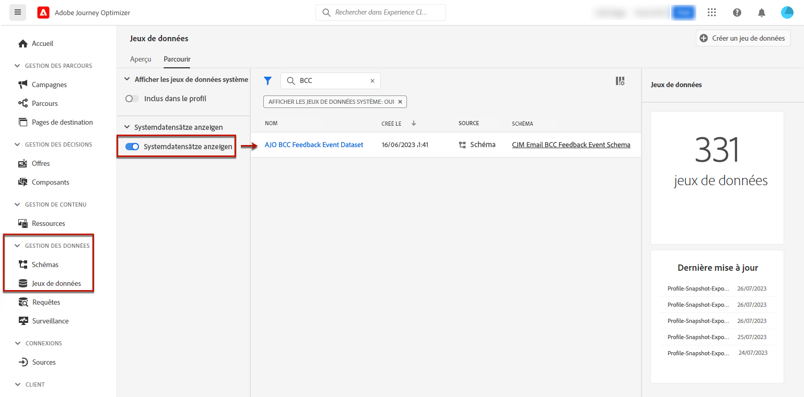

# Configurer les paramètres d’e-mail {#email-settings}

Définissez les paramètres d&#39;e-mail dans la section dédiée de la configuration des préréglages de message. Découvrez comment créer des préréglages de message dans [cette section](message-presets.md).


## Type d’e-mail {#email-type}

>[!CONTEXTUALHELP]
>id="ajo_admin_presets_emailtype"
>title="Définition de la catégorie d’e-mail"
>abstract="Sélectionnez le type de messages qui sera envoyé lors de l&#39;utilisation de ce préréglage : Marketing pour les messages promotionnels, qui nécessitent un consentement de l’utilisateur, ou Transactionnel pour les messages non commerciaux, qui peuvent également être envoyés aux profils désabonnés dans des contextes spécifiques."

Dans la section **TYPE DʼE-MAIL**, sélectionnez le type de message à envoyer grâce au préréglage : **Marketing** ou **Transactionnel**.

* Choisissez **Marketing** pour les messages promotionnels : ces messages nécessitent le consentement de l’utilisateur.

* Choisissez **Transactionnel** pour les messages non commerciaux tels que la confirmation de commande, les notifications de réinitialisation de mot de passe ou les informations de diffusion, par exemple.

>[!CAUTION]
>
>Les messages **transactionnels** peuvent être envoyés aux profils qui se sont désabonnés des communications marketing. Ces messages ne peuvent être envoyés que dans des contextes spécifiques.

Lors de la [création d’un message](../messages/get-started-content.md#create-new-message), vous devez choisir un préréglage de message valide correspondant à la catégorie que vous avez sélectionnée pour votre message.

## Sous-domaine et groupes d’adresses IP {#subdomains-and-ip-pools}

Dans la section **DÉTAILS DU SOUS-DOMAINE ET DU GROUPE DʼADRESSES IP**, vous devez effectuer les actions suivantes :

1. Sélectionnez le sous-domaine à utiliser pour envoyer les e-mails. [En savoir plus](about-subdomain-delegation.md)

1. Sélectionnez le pool d&#39;adresses IP à associer au préréglage. [En savoir plus](ip-pools.md)


Vous ne pouvez pas poursuivre la création du préréglage lorsque le groupe d’adresses IP sélectionné est en cours d’[édition](ip-pools.md#edit-ip-pool) (statut **[!UICONTROL Traitement en cours]**) et n’a jamais été associé au sous-domaine sélectionné. Sinon, la version la plus ancienne de l’association groupe d’adresses IP/sous-domaine sera toujours utilisée. Si c’est le cas, enregistrez le préréglage en tant que brouillon, puis réessayez une fois que le groupe d’adresses IP a le statut **[!UICONTROL Succès]**.

>[!NOTE]
>
>Pour les environnements hors production, Adobe ne crée pas de sous-domaines de test d’usine et n’accorde pas l’accès à un groupe d’adresses IP d’envoi partagé. Vous devez [déléguer vos propres sous-domaines](delegate-subdomain.md) et utiliser les adresses IP du groupe affecté à votre organisation.

## List-Unsubscribe {#list-unsubscribe}

Si vous choisissez [sélection d&#39;un sous-domaine](#subdomains-and-ip-pools) dans la liste, l&#39;option **[!UICONTROL Activer List-Unsubscribe]** s&#39;affiche.


Cette option est affichée par défaut.

Si vous la laissez activée, un lien de désabonnement sera automatiquement inclus dans l&#39;en-tête de l&#39;e-mail, par exemple :


Si vous désactivez cette option, aucun lien de désabonnement ne s&#39;affichera dans l&#39;en-tête de l&#39;e-mail.

Le lien de désabonnement se compose de deux éléments :

* Une **adresse e-mail de désabonnement**, à laquelle toutes les requêtes de désabonnement sont envoyées.

   Dans [!DNL Journey Optimizer], l&#39;adresse e-mail de désabonnement est l&#39;adresse par défaut **[!UICONTROL Mailto (unsubscribe)]** affichée dans le paramètre prédéfini du message, en fonction du [sous-domaine sélectionné](#subdomains-and-ip-pools).

   

* L&#39;**URL de désabonnement**, qui est l&#39;URL de la page de destination vers laquelle l&#39;utilisateur sera redirigé une fois désabonné.

   Si vous ajoutez un [lien de désinscription en un clic](../messages/consent.md#one-click-opt-out) pour un message créé à l&#39;aide de ce paramètre prédéfini, l&#39;URL de désabonnement sera l&#39;URL définie pour le lien de désinscrptioni en un clic.

   

   >[!NOTE]
   >
   >Si vous n&#39;ajoutez pas de lien de désinscription en un clic dans le contenu de votre message, aucune page de destination ne sera affichée pour l&#39;utilisateur.

Apprenez-en davantage sur l&#39;ajout d’un lien de désinscription dans l&#39;en-tête de vos messages dans [cette section](../messages/consent.md#unsubscribe-header).

<!--Select the **[!UICONTROL Custom List-Unsubscribe]** option to enter your own Unsubscribe URL and/or your own Unsubscribe email address.(to add later)-->

## Paramètres d’en-tête{#email-header}

Dans la section **[!UICONTROL PARAMÈTRES D&#39;EN-TÊTE]**, saisissez les noms et adresses e-mail de l&#39;expéditeur associés au type de messages envoyés à l&#39;aide de ce paramètre prédéfini.

>[!CAUTION]
>
>Les adresses e-mail doivent utiliser le [sous-domaine délégué](about-subdomain-delegation.md) actuellement sélectionné.

* **[!UICONTROL Nom de l’expéditeur]** : le nom de l&#39;expéditeur, tel que le nom de votre marque.

* **[!UICONTROL E-mail de l&#39;expéditeur]** : adresse e-mail que vous souhaitez utiliser pour vos communications. Par exemple, si le sous-domaine délégué est *marketing.luma.com*, vous pouvez utiliser *contact@marketing.luma.com*.

* **[!UICONTROL Répondre à (nom)]** : le nom qui sera utilisé lorsque le destinataire clique sur le bouton **Répondre** de son logiciel de messagerie.

* **[!UICONTROL Répondre à (e-mail)]** : adresse e-mail qui sera utilisée lorsque le destinataire clique sur le bouton **Répondre** de son logiciel de messagerie. Vous devez utiliser une adresse définie sur le sous-domaine délégué (par exemple, *reply@marketing.luma.com*), sinon les e-mails seront ignorés.

* **[!UICONTROL Message d’erreur]** : toutes les erreurs générées par les FAI après quelques jours de diffusion de l’e-mail (bounces asynchrones) sont reçues sur cette adresse.


>[!NOTE]
>
>Les adresses doivent commencer par une lettre (A-Z) et ne peuvent contenir que des caractères alphanumériques. Vous pouvez également utiliser le trait de soulignement `_`, le point`.` et le trait dʼunion `-`.

### Transférer un e-mail {#forward-email}

Si vous souhaitez transférer vers une adresse e-mail spécifique tous les e-mails reçus par [!DNL Journey Optimizer] pour le sous-domaine délégué, contactez l’Assistance clientèle d’Adobe. Vous devrez fournir les éléments suivants :

* Adresse e-mail de transfert de votre choix. Notez que le domaine de l’adresse e-mail de transfert ne peut correspondre à aucun sous-domaine délégué à Adobe.
* Nom de votre sandbox.
* Nom du paramètre prédéfini pour lequel l’adresse électronique de transfert sera utilisée.
* L’adresse **[!UICONTROL Répondre à (e-mail)]** actuelle définie au niveau du préréglage.

>[!NOTE]
>
>Il ne peut y avoir qu’une seule adresse e-mail de transfert par sous-domaine. Par conséquent, si plusieurs préréglages utilisent le même sous-domaine, la même adresse e-mail de transfert doit être utilisée pour tous les sous-domaines.

L’adresse e-mail de transfert sera configurée par Adobe. Cela peut prendre 3 à 4 jours.

<!--
## BCC email {#bcc-email}

>[!CONTEXTUALHELP]
>id="ajo_admin_preset_bcc"
>title="Define a BCC email address"
>abstract="You can keep a copy of sent emails by sending them to a BCC inbox. Enter the email address of your choice so that every email sent is blind-copied to this BCC address. This feature is optional."

You can send an identical copy (or blind carbon copy) of an email sent by [!DNL Journey Optimizer] to a BCC inbox. This optional feature allows you to retain copies of email communications you send to your users for compliance and/or archival purposes. This will be invisible to the delivery recipients.

>[!CAUTION]
>
>This capability will be available starting **May, 31**.

### Enable BCC email {#enable-bcc}

To enable the **[!UICONTROL BCC email]** option, enter the email address of your choice in the dedicated field. You can specify any external address in correct format, except an email address defined on the delegated subdomain. For example, if the delegated subdomain is *marketing.luma.com*, any address like *abc@marketing.luma.com* is prohibited.

>[!NOTE]
>
>You can only define one BCC email address. Make sure the BCC address has enough reception capacity to store all the emails that are sent using the current preset.
>
>More recommendations are listed in [this section](#bcc-recommendations-limitations).


All email messages using this preset will be blind-copied to the BCC email address you entered. From there, they can be processed and archived using an external system.

>[!CAUTION]
>
>Your BCC feature usage will be counted against the number of messages you are licensed for. Hence, only enable it in the presets used for critical communications that you wish to archive. Check your contract for licensed volumes.

The BCC email address setting is immediately saved and processed at the preset level. When you [create a new message](../messages/get-started-content.md#create-new-message) using this preset, the BCC email address is automatically displayed.


However, the BCC address gets picked up for sending communications following the logic below:

* For batch and burst journeys, it does not apply to batch or burst execution that had already started before the BCC setting is made. The change will be picked up at the next recurrence or new execution.

* For transactional messages, the change is picked up immediately for the next communication (up to one minute delay).

>[!NOTE]
>
>You do not need to republish a message or journey for the BCC setting to be picked up.

### Recommendations and limitations {#bcc-recommendations-limitations}

* To ensure your privacy compliance, BCC emails must be processed by an archiving system capable of storing securely personally identifiable information (PII).

* As messages can contain sensitive or private data, such as personally identifiable information (PII), make sure the BCC address is correct, and secure the access to messages.

* Your inbox used for BCC should be properly managed for space and delivery. If the inbox returns bounces, some emails may not be received and therefore will fail to get archived.

* Messages may be delivered to the BCC email address before the target recipients. BCC messages can also been sent even though the original messages may have [bounced](../reports/suppression-list.md#delivery-failures).

    //////OR: Only successfully sent emails are taken in account. [Bounces](../reports/suppression-list.md#delivery-failures) are not. TO CHECK /////////

* Do not open or click through the emails sent to the BCC address as it is taken into account in the total opens and clicks from the send analysis, which could cause some miscalculations in [reports](../reports/message-monitoring.md). 

* Do not mark messages as spam in the BCC inbox, as it will impact all the other emails sent to this address.


>[!CAUTION]
>
>Do not click the unsubscribe link in the emails sent to the BCC address as you will immediately unsubscribe the corresponding recipients.

### GDPR compliance {#gdpr-compliance}

Regulations such as GDPR state that Data Subjects should be able to modify their consent at any time. Because the BCC emails you are sending with Journey Optimizer include securely personally identifiable information (PII), you must edit the **[!UICONTROL CJM Email BCC Feedback Event Schema]** to be able to manage these PII in compliance with GDPR and similar regulations.

To do this, follow the steps below.

1. Go to **[!UICONTROL Data management]** > **[!UICONTROL Schemas]** > **[!UICONTROL Browse]** and select **[!UICONTROL CJM Email BCC Feedback Event Schema]**.

    

1. Click to expand **[!UICONTROL _experience]**, **[!UICONTROL customerJourneyManagment]** then **[!UICONTROL secondaryRecipientDetail]**.

1. Select **[!UICONTROL originalRecipientAddress]**.

1. In the **[!UICONTROL Field properties]** on the right, scroll down to the **[!UICONTROL Identity]** checkbox.

1. Select it and also select **[!UICONTROL Primary identity]**.

1. Select a namespace from the drop-down list.

    

1. Click **[!UICONTROL Apply]**.

>[!NOTE]
>
>Learn more on managing Privacy and the applicable regulations in the [Experience Platform documentation](https://experienceleague.adobe.com/docs/experience-platform/privacy/home.html){target="_blank"}.

### BCC reporting data {#bcc-reporting}

Reporting as such on BCC is not available in the journey and message reports. However, information is stored on a system dataset called **[!UICONTROL AJO BCC Feedback Event Dataset]**. You can run queries against this dataset to find useful information for debugging purpose for example.

You can access this dataset through the user interface. Select **[!UICONTROL Data management]** > **[!UICONTROL Datasets]** > **[!UICONTROL Browse]** and enable the **[!UICONTROL Show system datasets]** toggle from the filter to display the system-generated datasets. Learn more on how to access datasets in [this section](../start/get-started-datasets.md#access-datasets).



To run queries against this dataset, you can use the Query Editor provided by the [Adobe Experience Platform Query Service](https://experienceleague.adobe.com/docs/experience-platform/query/api/getting-started.html){target="_blank"}. To access it, select **[!UICONTROL Data management]** > **[!UICONTROL Queries]** and click **[!UICONTROL Create query]**. [Learn more](../start/get-started-queries.md)


Depending on what information you are looking for, you can run the following queries.

1. For all the other queries below, you will need the journey action ID. Run this query to fetch all action IDs associated with a particular journey version ID within the last 2 days:

        ```
        SELECT
        DISTINCT
        CAST(TIMESTAMP AS DATE) AS EventTime,
        _experience.journeyOrchestration.stepEvents.journeyVersionID,
        _experience.journeyOrchestration.stepEvents.actionName, 
        _experience.journeyOrchestration.stepEvents.actionID 
        FROM journey_step_events 
        WHERE 
        _experience.journeyOrchestration.stepEvents.journeyVersionID = '<journey version id>' AND 
        _experience.journeyOrchestration.stepEvents.actionID is not NULL AND 
        TIMESTAMP > NOW() - INTERVAL '2' DAY 
        ORDER BY EventTime DESC;
        ```

    >[!NOTE]
    >
    >To get the `<journey version id>`parameter, select the corresponding [journey version](../building-journeys/journey-versions.md) from the **[!UICONTROL Journey management]** > **[!UICONTROL Journeys]** menu. The journey version ID is displayed at the end of the URL displayed in your web browser.
    >
    >

1. Run this query to fetch all message feedback events (especially feedback status) generated for a particular message targeted to a specific user within the last 2 days:

        ```
        SELECT  
        _experience.customerJourneyManagement.messageExecution.journeyVersionID AS JourneyVersionID, 
        _experience.customerJourneyManagement.messageExecution.journeyActionID AS JourneyActionID, 
        timestamp AS EventTime, 
        _experience.customerJourneyManagement.emailChannelContext.address AS RecipientAddress, 
        _experience.customerjourneymanagement.messagedeliveryfeedback.feedbackStatus AS FeedbackStatus,
        CASE _experience.customerjourneymanagement.messagedeliveryfeedback.feedbackStatus
            WHEN 'sent' THEN 'Sent'
            WHEN 'delay' THEN 'Retry'
            WHEN 'out_of_band' THEN 'Bounce' 
            WHEN 'bounce' THEN 'Bounce'
        END AS FeedbackStatusCategory
        FROM cjm_message_feedback_event_dataset 
        WHERE  
            timestamp > now() - INTERVAL '2' day  AND
            _experience.customerJourneyManagement.messageExecution.journeyVersionID = '<journey version id>' AND 
            _experience.customerJourneyManagement.messageExecution.journeyActionID = '<journey action id>' AND  
            _experience.customerJourneyManagement.emailChannelContext.address = '<recipient email address>'
            ORDER BY EventTime DESC;
        ```

    >[!NOTE]
    >
    >To get the `<journey action id>` parameter, run the first query described above using the journey version id. The `<recipient email address>` parameter is the targeted or actual recipient's email address.

1. Run this query to fetch all BCC message feedback events generated for a particular message targeted to a specific user within the last 2 days:

    ```
    SELECT   
    _experience.customerJourneyManagement.messageExecution.journeyVersionID AS JourneyVersionID, 
    _experience.customerJourneyManagement.messageExecution.journeyActionID AS JourneyActionID, 
    _experience.customerJourneyManagement.emailChannelContext.address AS BccEmailAddress,
    timestamp AS EventTime, 
    _experience.customerJourneyManagement.secondaryRecipientDetail.originalRecipientAddress AS RecipientAddress, 
    _experience.customerjourneymanagement.messagedeliveryfeedback.feedbackStatus AS FeedbackStatus,
    CASE _experience.customerjourneymanagement.messagedeliveryfeedback.feedbackStatus
                WHEN 'sent' THEN 'Sent'
                WHEN 'delay' THEN 'Retry'
                WHEN 'out_of_band' THEN 'Bounce' 
                WHEN 'bounce' THEN 'Bounce'
            END AS FeedbackStatusCategory 
    FROM ajo_bcc_feedback_event_dataset  
    WHERE  
    timestamp > now() - INTERVAL '2' day  AND
    _experience.customerJourneyManagement.messageExecution.journeyVersionID = '<journey version id>' AND 
    _experience.customerJourneyManagement.messageExecution.journeyActionID = '<journeyaction id>' AND 
    _experience.customerJourneyManagement.secondaryRecipientDetail.originalRecipientAddress = '<recipient email address>'
    ORDER BY EventTime DESC;
    ```

1. Run this query to fetch all recipient addresses who have not received the message whereas its BCC entry exists within the last 30 days:

    ```
    SELECT
        DISTINCT 
    bcc._experience.customerJourneyManagement.secondaryRecipientDetail.originalRecipientAddress AS RecipientAddressesNotRecievedMessage
    FROM ajo_bcc_feedback_event_dataset bcc
    LEFT JOIN cjm_message_feedback_event_dataset mfe
    ON 
   bcc._experience.customerJourneyManagement.messageExecution.journeyVersionID =
            mfe._experience.customerJourneyManagement.messageExecution.journeyVersionID AND    bcc._experience.customerJourneyManagement.messageExecution.journeyActionID = mfe._experience.customerJourneyManagement.messageExecution.journeyActionID AND 
   bcc._experience.customerJourneyManagement.secondaryRecipientDetail.originalRecipientAddress = mfe._experience.customerJourneyManagement.emailChannelContext.address AND
   mfe._experience.customerJourneyManagement.messageExecution.journeyVersionID = '<journey version id>' AND 
   mfe._experience.customerJourneyManagement.messageExecution.journeyActionID = '<journey action id>' AND
   mfe.timestamp > now() - INTERVAL '30' DAY AND
   mfe._experience.customerjourneymanagement.messagedeliveryfeedback.feedbackstatus IN ('bounce', 'out_of_band') 
    WHERE bcc.timestamp > now() - INTERVAL '30' DAY;
    ```
-->

## Paramètres de reprise de lʼe-mail {#email-retry}

>[!CONTEXTUALHELP]
>id="ajo_admin_presets_retryperiod"
>title="Réglage de la période de reprise"
>abstract="Les reprises sont effectuées pendant 3,5 jours (84 heures) lorsqu’un e-mail échoue en raison d’une erreur de soft bounce temporaire. Vous pouvez ajuster cette période de reprise par défaut en fonction de vos besoins."
>additional-url="https://experienceleague.adobe.com/docs/journey-optimizer/using/configuration/configuration-message/email-configuration/monitor-reputation/retries.html?lang=fr" text="À propos des reprises"

Vous pouvez configurer les **Paramètres de reprise de lʼe-mail**.


Par défaut, la [période de reprise](retries.md#retry-duration) est définie sur 84 heures, mais vous pouvez ajuster ce paramètre pour mieux l’adapter à vos besoins.

Vous devez saisir une valeur entière (en heures ou minutes) dans la plage suivante :

* Pour les e-mails marketing, la période de reprise minimale est de 6 heures.
* Pour les e-mails transactionnels, la période de reprise minimale est de 10 minutes.
* Pour les deux types d’e-mail, la période de reprise maximale est de 84 heures (soit 5 040 minutes).

En savoir plus sur les reprises dans [cette section](retries.md).

## Tracking des URL {#url-tracking}

>[!CONTEXTUALHELP]
>id="ajo_admin_preset_utm"
>title="Paramètres de tracking des URL"
>abstract="Utilisez cette section pour ajouter automatiquement des paramètres de tracking aux URL de campagne présentes dans votre contenu d’e-mail."

Vous pouvez utiliser les **[!UICONTROL paramètres de tracking d’URL]** pour mesurer l’efficacité de vos efforts marketing sur l’ensemble des canaux. Cette fonctionnalité est facultative.

Les paramètres définis dans cette section seront ajoutés à la fin des URL incluses dans le contenu de votre e-mail. Vous pouvez ensuite capturer ces paramètres dans des outils d’analyse web tels qu’Adobe Analytics ou Google Analytics, et créer divers rapports de performances.


Trois paramètres de tracking d’URL sont automatiquement renseignés par exemple lorsque vous créez un préréglage de message. Vous pouvez les modifier et ajouter jusqu’à 10 paramètres de tracking à l’aide du bouton **[!UICONTROL Ajouter un nouveau paramètre]**.

Pour configurer un paramètre de tracking d’URL, vous pouvez saisir directement les valeurs souhaitées dans les champs **[!UICONTROL Nom]** et **[!UICONTROL Valeur]** ou choisir parmi une liste de valeurs prédéfinies en accédant aux objets suivants :

* Attributs de parcours : **Identifiant de la source**, **Nom de la source**, **Identifiant de la version de la source**
* Attributs d’action : **Identifiant de l’action**, **Nom de l’action**
* Attributs d’Offer Decisioning : **Identifiant de l’offre**, **Nom de l’offre**


>[!CAUTION]
>
>Ne sélectionnez pas de dossier : assurez-vous d’accéder au dossier nécessaire et de sélectionner un attribut de profil à utiliser comme valeur de paramètre de tracking.

Vous trouverez ci-dessous des exemples d’URL compatibles avec Adobe Analytics et Google Analytics.

* URL compatible avec Adobe Analytics : `www.YourLandingURL.com?cid=email_AJO_{{context.system.source.id}}_image_{{context.system.source.name}}`

* URL compatible avec Google Analytics : `www.YourLandingURL.com?utm_medium=email&utm_source=AJO&utm_campaign={{context.system.source.id}}&utm_content=image`

>[!NOTE]
>
>Vous pouvez combiner des valeurs de saisie de texte et la sélection de valeurs prédéfinies. Chaque champ **[!UICONTROL Valeur]** peut contenir jusqu’à 255 caractères au total.
