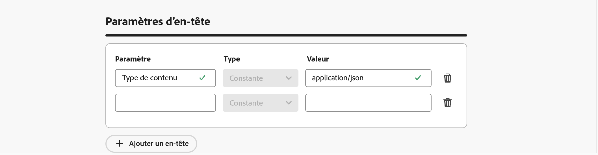

# Créer des webhooks de commentaires pour les campagnes déclenchées par API {#webhooks}

Les webhooks de commentaires vous permettent de recevoir des mises à jour de statut en temps réel pour les messages envoyés via des campagnes transactionnelles déclenchées par API. En configurant un webhook, vous recevez automatiquement les résultats des diffusions directement dans vos systèmes, ce qui facilite la surveillance, la journalisation et le traitement automatisé.

Vous pouvez gérer les configurations de webhook à partir du menu **[!UICONTROL Administration]** > **[!UICONTROL Canaux]** > **[!UICONTROL Paramètres du webhook des commentaires]**.


>[!NOTE]
>Une seule configuration de webhook par combinaison **organisation + sandbox** est autorisée.

## Créer un webhook de commentaires

Pour créer un webhook, procédez comme suit :

1. Accédez à **[!UICONTROL Administration]** / **[!UICONTROL Canaux]** / **[!UICONTROL Paramètres du webhook de commentaires]**.

1. Cliquez sur **Créer un webhook de commentaires**.

1. Dans la section **[!UICONTROL Configuration de base]**, fournissez les informations suivantes :

   

   * **Nom du webhook** : saisissez un nom explicite pour identifier le webhook.
   * **Canaux** : sélectionnez le ou les canaux pour lesquels ce webhook doit recevoir des commentaires (e-mail et/ou SMS).
   * **URL du webhook** : indiquez le point d’entrée HTTPS où les événements de commentaires doivent être diffusés.

1. Dans la section **[!UICONTROL Authentification]**, sélectionnez la méthode d’authentification :

   

   * **Pas d’authentification** : aucun en-tête d’authentification n’est ajouté.
   * **Authentification JWT** : fournissez les informations requises si votre point d’entrée nécessite une authentification JWT.

1. Dans la section **[!UICONTROL Paramètres d’en-tête]**, vous pouvez configurer des en-têtes personnalisés supplémentaires à envoyer avec chaque demande de webhook.

   

1. Cliquez sur **[!UICONTROL Envoyer]** pour enregistrer la configuration.

>[!NOTE]
>
>Vous pouvez modifier un webhook à tout moment. Pour ce faire, ouvrez-le dans l’inventaire, puis cliquez sur le bouton **[!UICONTROL Modifier]**.

## Structure de la payload du webhook

Après l’exécution d’un message, **[!DNL Journey Optimizer]** envoie la payload suivante au point d’entrée configuré.

```
{
  "requestId": "8NoByJneShCdCGRnrGS1t1m3CdA73dhR",
  "imsOrg": "myImsOrg",
  "sandbox": {
    "id": "068abf40-575e-11ea-8512-9b1bfdb82603",
    "name": "prod"
  },
  "channel": "email",
  "eventType": "message.feedback",
  "messageExecution": {
    "messageExecutionID": "HUMA-26362805",
    "messageType": "transactional",
    "campaignID": "16f24a15-7e21-477c-848a-d5695ca7f137",
    "campaignVersionID": "2ca10c10-56dd-4505-87cd-fa5da84e7a5d"
  },
  "messageDeliveryFeedback": {
    "feedbackStatus": {
      "value": "bounce"
    },
    "offers": null,
    "messageExclusion": null,
    "messageFailure": {
      "category": "sync",
      "type": "Ignored",
      "code": "25",
      "reason": "Admin Failure"
    },
    "retryCount": 0
  },
  "identityMap": {
    "email": [
      {
        "id": "john.doe@luma.com",
        "primary": true
      }
    ]
  }
}
```

Le webhook peut capturer les événements suivants :

* Envoyés
* Diffusés
* Rebond (voir l’exemple ci-dessus)
* Erreurs

Chaque requête entrante inclut également un ID de demande unique renvoyé au webhook.

## Étapes suivantes {#next}

Une fois le webhook de commentaires créé, vous pouvez l’activer lors de la configuration d’une audience de **campagne transactionnelle déclenchée par API**. Pour en savoir plus, consultez la section [Activer des webhooks](../campaigns/api-triggered-campaign-audience.md#webhook).
