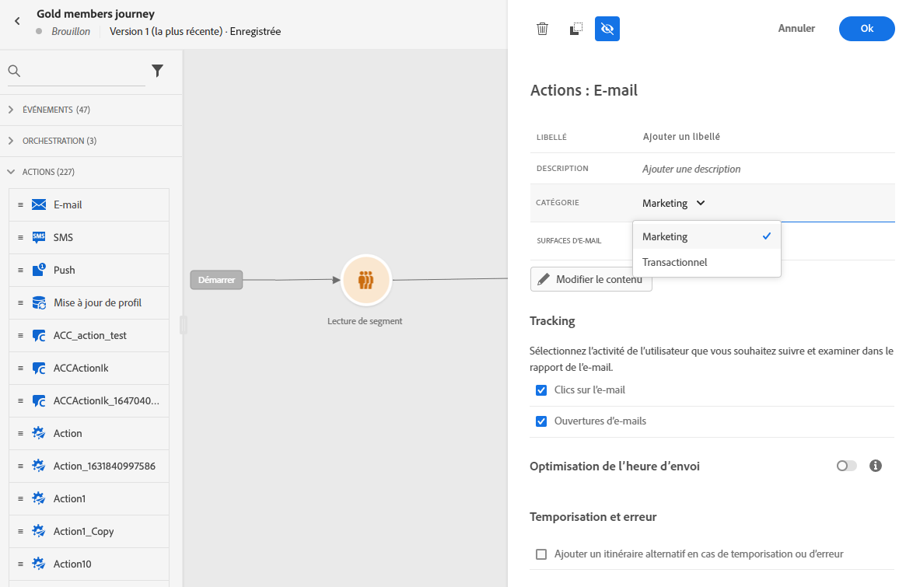

# Règles de fréquence des messages {#frequency-rules}

[!DNL Journey Optimizer] vous permet de contrôler la fréquence à laquelle les utilisateurs recevront un message ou entreront dans un parcours en définissant des règles cross-canal qui excluront automatiquement les profils sur-sollicités des messages et actions.

Par exemple, vous ne souhaitez pas que votre marque envoie plus de 3 messages marketing par mois à ses clients.

Pour cela, vous pouvez utiliser une règle de fréquence qui limite le nombre de messages envoyés sur un ou plusieurs canaux au cours d&#39;une période calendaire mensuelle.

>[!NOTE]
>
>Les règles de fréquence des messages sont différentes de la gestion des désabonnements, qui permet aux utilisateurs de se désabonner de la réception des communications d’une marque. [En savoir plus](../privacy/opt-out.md#opt-out-management)

➡️ [Découvrez cette fonctionnalité en vidéo](#video)

## Règles d’accès {#access-rules}

Les règles sont disponibles à partir de la **[!UICONTROL Administration]** > **[!UICONTROL Rules]** . Toutes les règles sont répertoriées, triées par date de modification.

Utilisez l’icône de filtre pour filtrer par catégorie, statut et/ou canal. Vous pouvez également effectuer une recherche sur le libellé du message.

### Autorisations{#permissions-frequency-rules}

Pour accéder, créer, modifier ou supprimer des règles de fréquence des messages, vous devez disposer de la variable **[!UICONTROL Manage frequency rules]** autorisation.

Utilisateurs avec la variable **[!UICONTROL View frequency rules]** Les autorisations peuvent afficher des règles, mais pas les modifier ni les supprimer.

En savoir plus sur les autorisations dans [cette section](../administration/high-low-permissions.md).

## Création d’une règle {#create-new-rule}

Pour créer une règle, procédez comme suit.

1. Accédez au **[!UICONTROL Message frequency rules]** liste, puis cliquez sur **[!UICONTROL Create rule]**.

   

1. Définissez le nom de la règle.

   

1. Sélectionnez la catégorie de règles du message.

   >[!NOTE]
   >
   >Actuellement, seule la variable **[!UICONTROL Marketing]** est disponible.

1. Définissez la limitation de votre règle, c’est-à-dire le nombre maximal de messages qui peuvent être envoyés à un profil utilisateur individuel chaque mois.

   

   >[!NOTE]
   >
   >Le plafond de fréquence est basé sur une période calendaire mensuelle. Elle est réinitialisée au début de chaque mois.

1. Sélectionnez le canal à utiliser pour cette règle : **[!UICONTROL Email]** ou **[!UICONTROL Push notification]**.

   

   >[!NOTE]
   >
   >Vous devez sélectionner au moins un canal pour pouvoir créer la règle.

1. Sélectionnez plusieurs canaux si vous souhaitez appliquer une limitation sur tous les canaux sélectionnés en tant que nombre total.

   Par exemple, définissez la limitation sur 15 et sélectionnez les canaux email et push. Si un profil a déjà reçu 10 emails marketing et 5 notifications push marketing, ce profil sera exclu de la prochaine diffusion de tout email ou notification push marketing.

1. Cliquez sur **[!UICONTROL Save as draft]** pour confirmer la création de la règle. Votre message est ajouté à la liste des règles, avec la variable **[!UICONTROL Draft]** statut.

   

## Activer une règle {#activate-rule}

Une fois créée, une règle de fréquence des messages affiche la variable **[!UICONTROL Draft]** et n’a encore aucun impact sur le message. Pour l’activer, cliquez sur les points de suspension en regard de la règle et sélectionnez **[!UICONTROL Activate]**.

L’activation d’une règle aura un impact sur tous les messages auxquels elle s’applique lors de leur prochaine exécution. Découvrez comment [appliquer une règle de fréquence à un message ;](#apply-frequency-rule).

>[!NOTE]
>
>L’activation complète d’une règle peut prendre jusqu’à 10 minutes. Vous n’avez pas besoin de modifier les messages ni de republier les parcours pour qu’une règle prenne effet.

Pour désactiver une règle de fréquence des messages, cliquez sur les points de suspension en regard de la règle et sélectionnez **[!UICONTROL Deactivate]**.

L’état de la règle devient **[!UICONTROL Inactive]** et la règle ne s&#39;appliquera pas aux futures exécutions de messages. Les messages en cours d’exécution ne seront pas affectés.

>[!NOTE]
>
>La désactivation d’une règle n’affecte ou ne réinitialise aucun comptage sur les profils individuels.

## Appliquer une règle de fréquence à un message {#apply-frequency-rule}

Pour appliquer une règle de fréquence à un message, procédez comme suit.

1. Créez un message en sélectionnant l&#39;un des canaux que vous avez définis pour votre règle.

1. Sélectionnez la catégorie que vous avez définie pour le [règle que vous avez créée](#create-new-rule).

   

   >[!NOTE]
   >
   >Actuellement, seule la variable **[!UICONTROL Marketing]** est disponible pour les règles de fréquence des messages.

   <!--
   1. You can click the **[!UICONTROL Frequency rule]** link to view the frequency rules that will apply for the selected category and channel(s). A new tab will open to display the matching message frequency rules.-->

1. Toutes les règles de fréquence correspondant à la catégorie et au(x) canal(s) sélectionné(s) seront automatiquement appliquées à ce message.

   >[!NOTE]
   >
   >Messages <!--that do not have any selected category or messages -->où la catégorie sélectionnée est **[!UICONTROL Transactional]** ne sera pas évalué par rapport aux règles de fréquence.

   <!--Clicking the link out button next to the category selector will jump you over to the rules inventory screen to see which rules will be applied to the message.-->

1. Vous pouvez visualiser le nombre de profils exclus de la diffusion dans la variable [Rapport global](../reports/global-report.md), et dans le [Rapport en direct](../reports/live-report.md), où les règles de fréquence seront répertoriées comme une raison possible pour les utilisateurs exclus de la diffusion.

>[!NOTE]
>
>Plusieurs règles peuvent s&#39;appliquer au même canal, mais une fois le plafond inférieur atteint, le profil sera exclu des prochaines diffusions.

## Exemple : combiner plusieurs règles {#frequency-rule-example}

Vous pouvez combiner plusieurs règles de fréquence des messages, comme décrit dans l&#39;exemple ci-dessous.

1. [Création d’une règle](#create-new-rule) appelé *Limitation globale du marketing*:

   * Sélectionnez les canaux Email et Push .
   * Définissez la limitation sur 12.

   

1. Pour limiter davantage le nombre de notifications push marketing envoyées à un utilisateur, créez une deuxième règle appelée *Limite de marketing push*:

   * Sélectionnez Canal push.
   * Définissez la limitation sur 4.

   

1. Enregistrez et [activate](#activate-rule) la règle.

1. Créez un email et sélectionnez le **[!UICONTROL Marketing]** catégorie de ce message. [En savoir plus](../email/create-email.md)

1. Créez une notification push et sélectionnez l’événement **[!UICONTROL Marketing]** catégorie de ce message. [En savoir plus](../push/create-push.md)

Dans ce scénario, un profil individuel :
* peut recevoir jusqu’à 12 messages marketing par mois ;
* mais seront exclus des notifications push marketing après avoir reçu 4 notifications push.

>[!NOTE]
>
>Lors du test des règles de fréquence, il est recommandé d’utiliser une [profil de test](../segment/creating-test-profiles.md), car une fois le plafond de fréquence d’un profil atteint, il n’est pas possible de réinitialiser le compteur avant le mois suivant. La désactivation d’une règle permet aux profils plafonnés de recevoir des messages, mais elle ne supprime ni supprime les incréments de compteur.

## Vidéo pratique {#video}

Découvrez comment créer, activer, tester et générer des rapports sur les règles de fréquence.

>[!VIDEO](https://video.tv.adobe.com/v/344451?quality=12)
