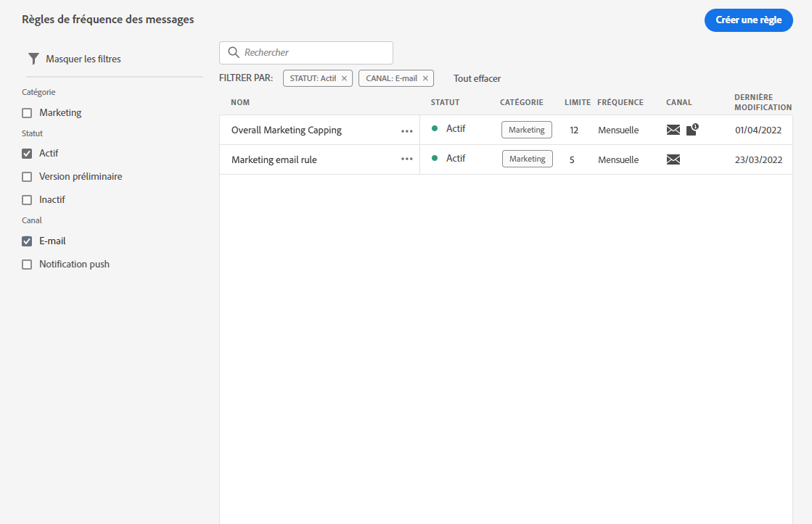
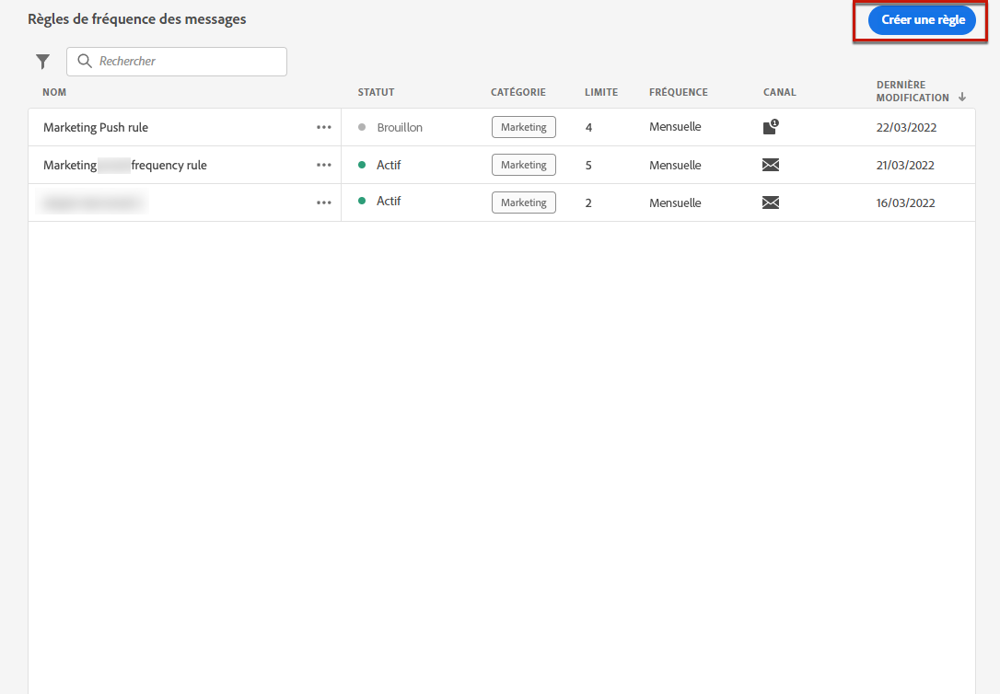
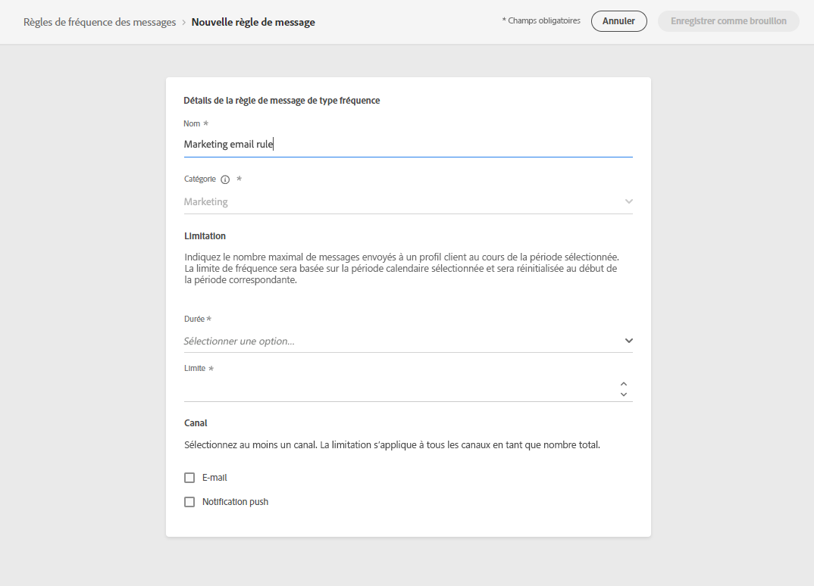
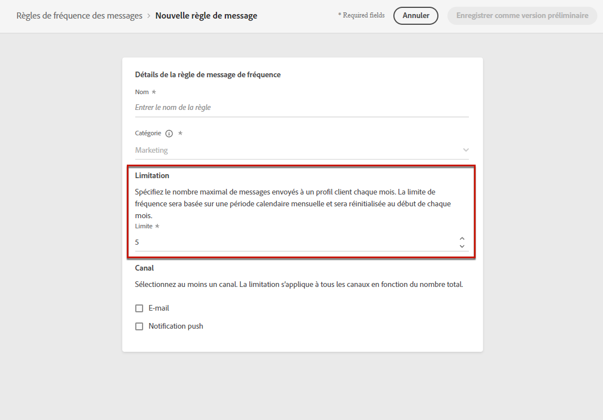
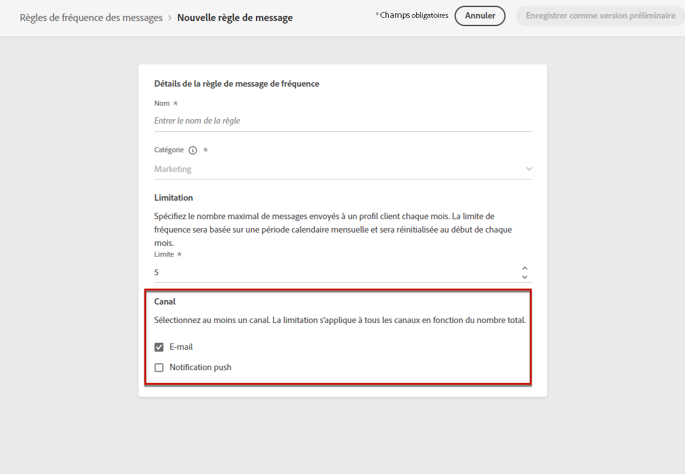
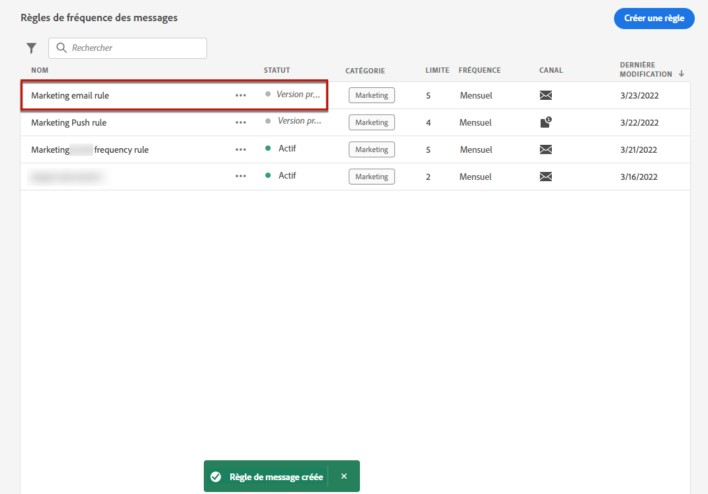
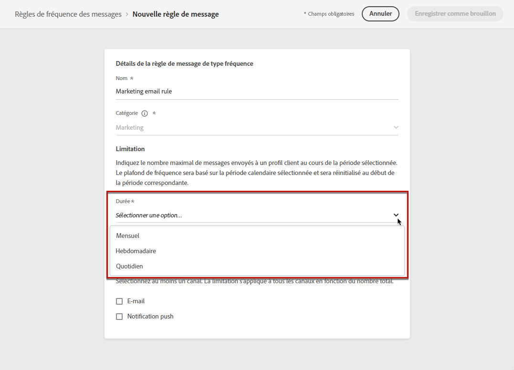
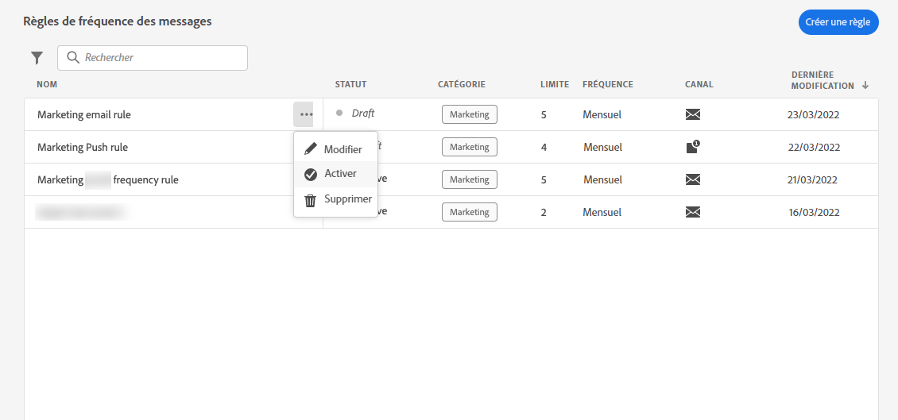
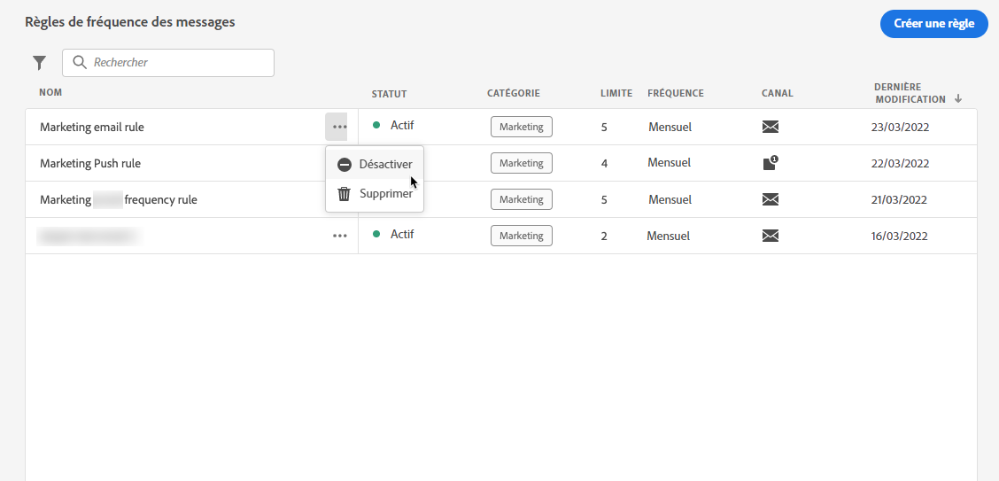

# Règles métier {#frequency-rules}

>[!CONTEXTUALHELP]
>id="ajo_business_rules_message_frequency_rules"
>title="Règles métier"
>abstract="Une règle de fréquence des messages est un type de règle métier qui limite le nombre de fois où les utilisateurs et les utilisatrices reçoivent des messages ou rejoignent des parcours via un ou plusieurs canaux. Ces règles cross-canal excluent automatiquement les profils sur-sollicités des messages et des actions."

[!DNL Journey Optimizer] vous permet de contrôler la fréquence à laquelle les utilisateurs et les utilisatrices reçoivent un message ou rejoignent un parcours via un ou plusieurs canaux. Règles de fréquence des messages qui excluent automatiquement les profils sur-sollicités des messages et des actions.

Par exemple, pour une marque, une règle peut être de ne pas envoyer plus de 4 messages marketing par mois à sa clientèle. Pour cela, vous pouvez utiliser une règle métier qui limite le nombre de messages envoyés sur un ou plusieurs canaux au cours d’une période calendaire mensuelle.

>[!NOTE]
>
>Les règles métier sont différentes de la gestion d’opt-out, qui permet aux utilisateurs et utilisatrices de se désinscrire des communications envoyées par une marque. [En savoir plus](../privacy/opt-out.md#opt-out-management)

➡️ [Découvrez cette fonctionnalité en vidéo](#video)

## Accéder aux règles métier {#access-rules}

Les règles métier sont disponibles à partir du menu **[!UICONTROL Administration]** > **[!UICONTROL Règles métier]**. Toutes les règles sont répertoriées, triées par date de modification. Utilisez l’icône de filtre pour filtrer le contenu par catégorie, statut et/ou canal. Vous pouvez également effectuer une recherche sur le libellé du message.

### Autorisations{#permissions-frequency-rules}

Pour accéder aux règles métier, en créer, les modifier ou les supprimer, vous devez disposer de l’autorisation **[!UICONTROL Gérer les règles métier]**.

Les personnes qui possèdent l’autorisation **[!UICONTROL Afficher les règles de fréquence]** peuvent afficher les règles, mais pas les modifier ni les supprimer.

Pour en savoir plus sur les autorisations, consultez [cette section](../administration/high-low-permissions.md).

## Créer une règle métier {#create-new-rule}

>[!CONTEXTUALHELP]
>id="ajo_rules_category"
>title="Sélectionner la catégorie de règle relative aux messages"
>abstract="Une fois activées et appliquées à un message, toutes les règles métier correspondant à la catégorie sélectionnée seront automatiquement appliquées à ce message. Actuellement, seule la catégorie Marketing est disponible."

>[!CONTEXTUALHELP]
>id="ajo_rules_capping"
>title="Définir la limitation de votre règle métier"
>abstract="Spécifiez le nombre maximal de messages envoyés à un profil client au cours de la période choisie. La limite de fréquence sera basée sur la période calendaire sélectionnée et sera réinitialisée au début de la période correspondante."

>[!CONTEXTUALHELP]
>id="ajo_rules_channel"
>title="Définissez le ou les canaux auxquels la règle métier s’applique."
>abstract="Sélectionnez au moins un canal. La limitation est calculée sur l’ensemble des canaux."

Pour créer une règle métier, procédez comme suit.

1. Accédez à la liste **[!UICONTROL Règles métier]**, puis cliquez sur **[!UICONTROL Créer une règle]**.

   

1. Définissez le nom de la règle et sélectionnez la catégorie de la règle relative aux messages.

   >[!NOTE]
   >
   >Seule la catégorie **[!UICONTROL Marketing]** est disponible.

   

1. Dans la liste déroulante **[!UICONTROL Durée]**, sélectionnez une période pour la limitation à appliquer. [En savoir plus](#frequency-cap)

1. Définissez la limitation de votre règle, c’est-à-dire le nombre maximum de messages pouvant être envoyés à un profil individuel chaque mois ou chaque semaine <!--or day-->, en fonction de la sélection effectuée ci-dessus.

   <!---->

1. Sélectionnez le canal à utiliser pour cette règle : **[!UICONTROL E-mail]**, **[!UICONTROL Notification push]**, **[!UICONTROL SMS]** ou **[!UICONTROL Courrier]**.

   

   >[!NOTE]
   >
   >Vous devez sélectionner au moins un canal pour pouvoir créer la règle.

1. Sélectionnez plusieurs canaux si vous souhaitez appliquer une limitation sur tous les canaux sélectionnés en tant que nombre total.

   Par exemple, définissez la limitation sur 15, et sélectionnez les canaux E-mail et Notification push. Si un profil a déjà reçu 10 e-mails marketing et 5 notifications push marketing pour la période sélectionnée, ce profil sera exclu de la prochaine diffusion de tout e-mail ou notification push marketing.

1. Cliquez sur **[!UICONTROL Enregistrer comme brouillon]** pour confirmer la création de la règle. Votre message est ajouté à la liste de règles, avec le statut **[!UICONTROL Brouillon]**.

   

### Limite de fréquence {#frequency-cap}

Dans la liste déroulante **[!UICONTROL Durée]**, indiquez si vous souhaitez que la limitation soit appliquée tous les mois ou toutes les semaines.

>[!NOTE]
>
>Une limite de fréquence quotidienne est également disponible à la demande. [En savoir plus](#daily-frequency-cap)

La limite de fréquence est basée sur la période calendaire sélectionnée. Elle est réinitialisée au début de la période correspondante.

L’expiration du compteur pour chaque période se présente comme suit :

* **[!UICONTROL Mensuele]** : la limite de fréquence est valable jusqu’au dernier jour du mois à 23:59:59 UTC. Par exemple, la date d’expiration mensuelle pour janvier est le 31 janvier à 23:59:59 UTC.

* **[!UICONTROL Hebdomadaire]** : la limite de fréquence est valable jusqu’au samedi à 23:59:59 UTC de cette semaine, car la semaine calendaire commence le dimanche. L’expiration est indépendante de la création de la règle. Par exemple, si la règle est créée le jeudi, cette règle est valide jusqu’au samedi à 23:59:59.

### Limite de fréquence quotidienne {#daily-frequency-cap}

Outre les fréquences mensuelle et hebdomadaire, un limite de fréquence quotidienne est également disponible à la demande. Pour en savoir plus sur celle-ci, contactez votre représentant ou représentante Adobe.

La limite de fréquence quotidienne est valable pour la journée jusqu’à 23:59:59 UTC et est réinitialisée à 0 au début de la journée suivante.

>[!NOTE]
>
>Pour garantir la précision des règles de capping de la fréquence quotidienne, nous vous recommandons d’utiliser la méthode [Segmentation en streaming](https://experienceleague.adobe.com/docs/experience-platform/segmentation/ui/streaming-segmentation.html?lang=fr){target="_blank"}. En savoir plus sur les méthodes d’évaluation de l’audience dans [cette section](../audience/about-audiences.md#evaluation-method-in-journey-optimizer).

## Activer une règle métier {#activate-rule}

Une fois créée, la règle métier affiche le statut **[!UICONTROL Brouillon]** et n’a pas encore d’incidence sur les messages. Pour l’activer, cliquez sur les points de suspension en regard de la règle et sélectionnez **[!UICONTROL Activer]**.

L’activation d’une règle aura un impact sur tous les messages auxquels elle s’applique lors de leur prochaine exécution. Découvrez comment [appliquer une règle métier à un message](#apply-frequency-rule).

>[!NOTE]
>
>L’activation complète d’une règle peut prendre jusqu’à 10 minutes. Vous n’avez pas besoin de modifier des messages ou de republier des parcours pour qu’une règle prenne effet.

Pour désactiver une règle métier, cliquez sur les points de suspension en regard de la règle et sélectionnez **[!UICONTROL Désactiver]**.

Le statut de la règle passe sur **[!UICONTROL Inactif]** et la règle ne s’appliquera pas aux futures exécutions de messages. Les messages en cours d’exécution ne seront pas affectés.

>[!NOTE]
>
>En cas de désactivation d’une règle, le décompte sur les différents profils n’est ni affecté ni réinitialisé.

## Appliquer une règle métier à un message {#apply-frequency-rule}

Pour appliquer une règle métier à un message, procédez comme suit.

1. Lors de la création d’un [parcours](../building-journeys/journey-gs.md), ajoutez un message en sélectionnant l’un des canaux que vous avez définis pour votre règle.

1. Sélectionnez la catégorie que vous avez définie pour la [règle que vous avez créée](#create-new-rule).

   

   >[!NOTE]
   >
   >Actuellement, seule la catégorie **[!UICONTROL Marketing]** est disponible pour les règles métier.

1. Cliquez sur le lien **[!UICONTROL Règle de fréquence]** pour ouvrir l’écran des règles de fréquence dans un nouvel onglet. [En savoir plus](#access-rules).

   Toutes les règles correspondant à la catégorie et aux canaux sélectionnés seront automatiquement appliquées à ce message.

   >[!NOTE]
   >
   >Les messages pour lesquels la catégorie sélectionnée est **[!UICONTROL Transactionnel]** ne seront pas évalués par rapport aux règles de fréquence.

1. Vous pouvez visualiser le nombre de profils exclus de la diffusion dans le [rapport Customer Journey Analytics](../reports/report-gs-cja.md) et dans le [rapport dynamique](../reports/live-report.md), où les règles métier seront répertoriées comme une raison possible pour les personnes exclues de la diffusion.

>[!NOTE]
>
>Plusieurs règles peuvent s’appliquer au même canal, mais une fois la limite inférieure atteinte, le profil sera exclu des prochaines diffusions.

## Exemple : combiner plusieurs règles {#frequency-rule-example}

Vous pouvez combiner plusieurs règles métier, comme décrit dans l’exemple ci-dessous.

1. [Créez une règle métier](#create-new-rule) appelée *Limitation marketing globale* :

   * Sélectionnez tous les canaux.
   * Définissez une limite de 12 avec une durée mensuelle.

   

1. Pour limiter davantage le nombre de notifications push marketing envoyées à un utilisateur ou une utilisatrice, créez une deuxième règle appelée *Push Marketing Cap* :

   * Sélectionnez le canal Notification push.
   * Définissez une limite de 4 avec une durée mensuelle.

   

1. Enregistrez et [activez](#activate-rule) la règle.

1. [Créez un message](../building-journeys/journeys-message.md) pour chaque canal par lequel vous souhaitez communiquer et sélectionnez la catégorie **[!UICONTROL Marketing]** pour chaque message. [Découvrir comment appliquer une règle métier](#apply-frequency-rule)

   

<!--
Learn how to create a message for the different channels in the following sections:
* [Create an email](../email/create-email.md)
* [Create a push notification](../push/create-push.md)
* [Create an SMS](../sms/create-sms.md)
* [Create a direct mail](../direct-mail/create-direct-mail.md)

Create an email and select the **[!UICONTROL Marketing]** category for that message. [Learn more](../email/create-email.md)

Create a push notification and select the **[!UICONTROL Marketing]** category for that message. [Learn more](../push/create-push.md)

Create an SMS and select the **[!UICONTROL Marketing]** category for that message. [Learn more](../sms/create-sms.md)

Create a direct mail and select the **[!UICONTROL Marketing]** category for that message. [Learn more](../direct-mail/create-direct-mail.md)
-->

Dans ce scénario, un profil individuel :
* peut recevoir jusqu’à 12 messages marketing par mois ;
* mais sera exclu des notifications push marketing après avoir reçu 4 notifications push.

>[!NOTE]
>
>Lors du test des règles métier, il est recommandé d’utiliser un nouveau [profil de test](../audience/creating-test-profiles.md), car une fois la limitation de fréquence d’un profil atteinte, il n’est pas possible de réinitialiser le compteur avant le mois suivant. La désactivation d’une règle permet aux profils limités de recevoir des messages, mais elle ne supprime pas les incréments de compteur.

## Vidéo pratique {#video}

Découvrez comment créer, activer, tester et générer des rapports sur les règles métier.

>[!VIDEO](https://video.tv.adobe.com/v/344451?quality=12)
