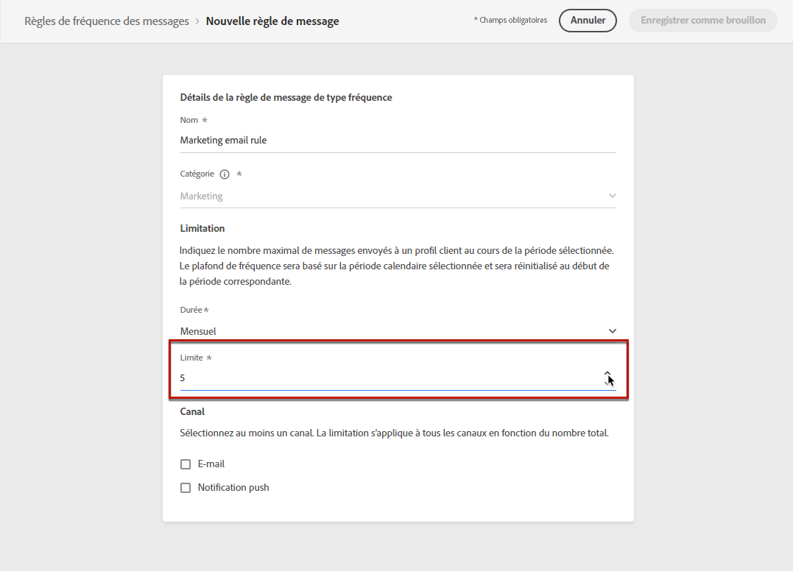
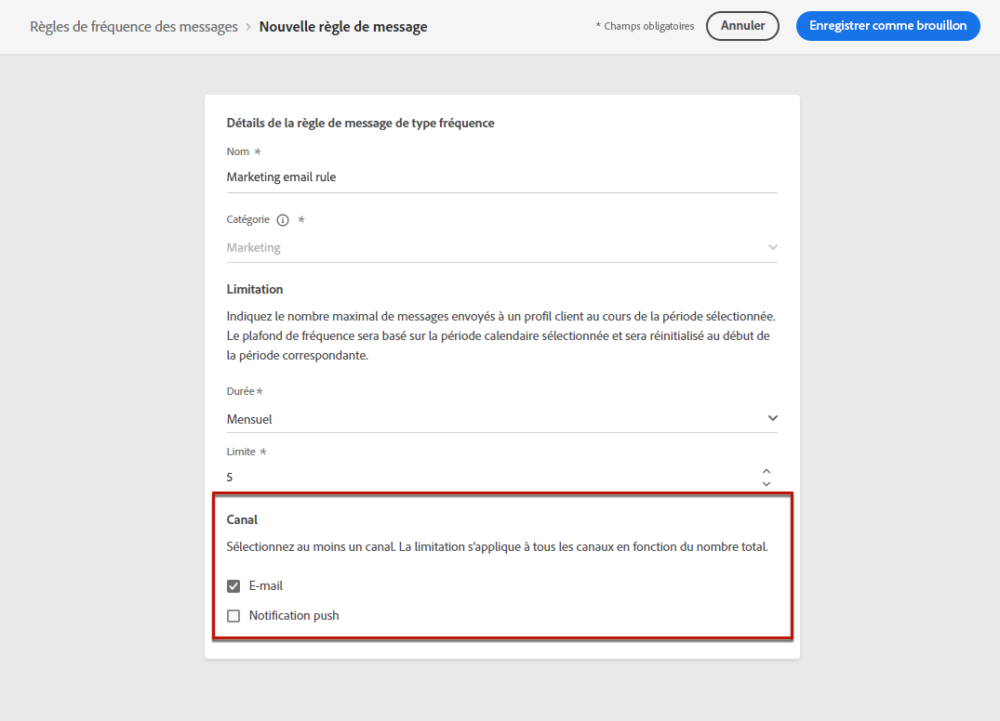
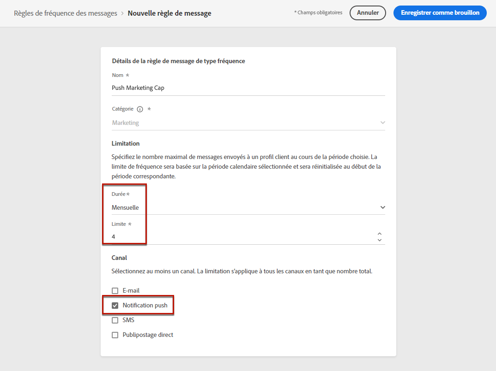

# Règles de fréquence des messages {#frequency-rules}

[!DNL Journey Optimizer] vous permet de contrôler la fréquence à laquelle les utilisateurs recevront un message ou entreront dans un parcours en définissant des règles cross-canal qui excluront automatiquement les profils sur-sollicités des messages et actions.

Par exemple, vous ne voulez pas que votre marque envoie plus de 3 messages marketing par mois à ses clients.

Pour cela, vous pouvez utiliser une règle de fréquence qui limite le nombre de messages envoyés sur un ou plusieurs canaux au cours d&#39;une période calendaire mensuelle.

>[!NOTE]
>
>Les règles de fréquence des messages sont différentes de la gestion des désabonnements, qui permet aux utilisateurs de se désabonner de la réception des communications de la part d&#39;une marque. [En savoir plus](../messages/consent.md#opt-out-management)

## Règles d&#39;accès {#access-rules}

Les règles sont disponibles à partir du menu **[!UICONTROL Administration]** > **[!UICONTROL Règles]**. Toutes les règles sont répertoriées, triées par date de modification.

>[!NOTE]
>
>Pour accéder, créer, modifier ou supprimer des règles de fréquence des messages, vous devez disposer de la variable [Gestion des règles de fréquence](../administration/high-low-permissions.md#manage-frequency-rules) autorisation.

Utilisez l&#39;icône de filtre pour filtrer par catégorie, statut et/ou canal. Vous pouvez également effectuer une recherche sur le libellé du message.

## Création d&#39;une règle {#create-new-rule}

Pour créer une nouvelle règle, procédez comme suit.

1. Accédez à la liste **[!UICONTROL Règles de fréquence des messages]**, puis cliquez sur **[!UICONTROL Créer une règle]**.

   

1. Définissez le nom de la règle.

   

1. Sélectionnez la catégorie de règle du message.

   >[!NOTE]
   >
   >Actuellement, seule la variable **[!UICONTROL Marketing]** est disponible.

1. Définissez la limitation de votre règle, c&#39;est-à-dire le nombre maximum de messages qui peuvent être envoyés à un profil utilisateur individuel chaque mois.

   

   >[!NOTE]
   >
   >La limite de fréquence est basée sur une période calendaire mensuelle. Elle est réinitialisée au début de chaque mois.

1. Sélectionnez le canal à utiliser pour cette règle : **[!UICONTROL E-mail]** ou **[!UICONTROL Notification push]**.

   

   >[!NOTE]
   >
   >Vous devez sélectionner au moins un canal pour pouvoir créer la règle.

1. Sélectionnez plusieurs canaux si vous souhaitez appliquer une limitation sur tous les canaux sélectionnés en tant que nombre total.

   Par exemple, définissez la limitation sur 15 et sélectionnez les canaux e-mail et push. Si un profil a déjà reçu 10 e-mails marketing et 5 notifications push marketing, ce profil sera exclu de la prochaine diffusion de tout e-mail ou notification push marketing.

1. Cliquez sur **[!UICONTROL Enregistrer comme brouillon]** pour confirmer la création de la règle. Votre message est ajouté dans la liste de règles, dans l&#39;état **[!UICONTROL Brouillon]**.

   

## Activer une règle {#activate-rule}

Une fois créée, une règle de fréquence des messages affiche la variable **[!UICONTROL Version préliminaire]** et n’a aucune incidence sur le message. Pour l’activer, cliquez sur les points de suspension en regard de la règle et sélectionnez **[!UICONTROL Activer]**.

L&#39;activation d&#39;une règle aura un impact sur tous les messages auxquels elle s&#39;applique lors de leur exécution suivante. Découvrez comment [appliquer une règle de fréquence à un message](#apply-frequency-rule).

>[!NOTE]
>
>Vous n&#39;avez pas besoin de modifier ou de republier des messages ou des parcours pour qu&#39;une règle prenne effet.

Pour désactiver une règle de fréquence des messages, cliquez sur les points de suspension en regard de la règle et sélectionnez **[!UICONTROL Désactiver]**.

L&#39;état de la règle devient **[!UICONTROL Inactif]** et la règle ne s&#39;appliquera pas aux futures exécutions de messages. Les messages en cours d&#39;exécution ne seront pas affectés.

>[!NOTE]
>
>La désactivation d&#39;une règle n&#39;affecte ou ne réinitialise aucun comptage sur les profils individuels.

## Appliquer une règle de fréquence à un message {#apply-frequency-rule}

Pour appliquer une règle de fréquence à un message, procédez comme suit.

1. Créer un message. [En savoir plus](../messages/get-started-content.md#create-new-message)

1. Sélectionnez la catégorie que vous avez définie pour le [règle que vous avez créée](#create-new-rule).

   

   >[!NOTE]
   >
   >Actuellement, seule la variable **[!UICONTROL Marketing]** est disponible pour les règles de fréquence des messages.

1. Sélectionnez le ou les canaux de votre choix pour votre message.

   

1. Vous pouvez cliquer sur le bouton **[!UICONTROL Règle de fréquence]** lien pour afficher les règles de fréquence qui s&#39;appliqueront à la catégorie et au(x) canal(s) sélectionné(s).

   

   Un nouvel onglet s’ouvre pour afficher les règles de fréquence des messages correspondantes.

1. [Conception](../design/design-emails.md) et [publier](../messages/publish-manage-message.md) votre message.

Toutes les règles de fréquence correspondant à la catégorie et au(x) canal(s) sélectionné(s) seront automatiquement appliquées à ce message.

<!--Clicking the link out button next to the category selector will jump you over to the rules inventory screen to see which rules will be applied to the message.-->

Vous pouvez visualiser le nombre de profils exclus de la diffusion dans la variable [Vues dynamiques et globales](../reports/message-monitoring.md), et dans le [rapport dynamique sur les e-mails](../reports/email-live-report.md), où les règles de fréquence seront répertoriées comme une raison possible pour les utilisateurs exclus de la diffusion.

>[!NOTE]
>
>Plusieurs règles peuvent s&#39;appliquer au même canal, mais une fois le plafond inférieur atteint, le profil sera exclu des prochaines diffusions.

## Exemple : combiner plusieurs règles {#frequency-rule-example}

Vous pouvez combiner plusieurs règles de fréquence des messages, comme décrit dans l&#39;exemple ci-dessous.

1. [Création d’une règle](#create-new-rule) appelé *Limitation globale du marketing*:

   * Sélectionnez tous les canaux (e-mail, push).
   * Définissez la limitation sur 12.

   

1. Pour limiter davantage le nombre de notifications push marketing envoyées à un utilisateur, créez une deuxième règle appelée *Limite de marketing push*:

   * Sélectionnez le canal push.
   * Définissez la limitation sur 4.

   

1. Enregistrez et [activate](#activate-rule) la règle.

1. Créer un message. [En savoir plus](../messages/get-started-content.md#create-new-message)

1. Sélectionnez la **[!UICONTROL Marketing]** catégorie.

   

1. Sélectionnez la **[!UICONTROL Email]** et **[!UICONTROL Notification push]** canaux.

   

1. Vous pouvez cliquer sur le bouton **[!UICONTROL Règle de fréquence]** lien pour afficher les règles de fréquence qui s&#39;appliqueront à la catégorie et au(x) canal(s) sélectionné(s).

1. [Conception](../design/design-emails.md) et [publier](../messages/publish-manage-message.md) votre message.

Dans ce scénario, un profil individuel :
* peut recevoir jusqu’à 12 messages marketing par mois ;
* mais seront exclus des notifications push marketing après avoir reçu 4 notifications push.
