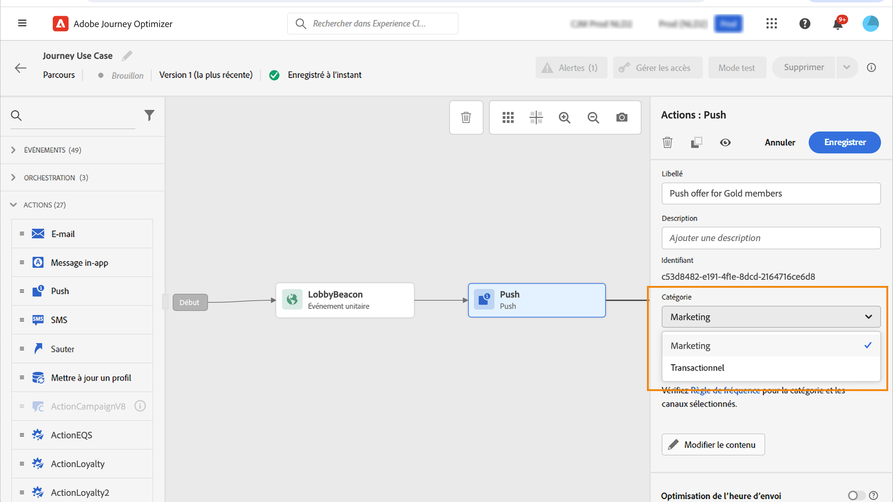

# Règles de fréquence des messages {#frequency-rules}

[!DNL Journey Optimizer] vous permet de contrôler la fréquence à laquelle les utilisateurs recevront un message ou entreront dans un parcours en définissant des règles cross-canal qui excluront automatiquement les profils sur-sollicités des messages et actions.

Par exemple, pour une marque, une règle peut être de ne pas envoyer plus de 4 messages marketing par mois à sa clientèle. Pour cela, vous pouvez utiliser une règle de fréquence qui limite le nombre de messages envoyés sur un ou plusieurs canaux au cours d&#39;une période calendaire mensuelle.

>[!NOTE]
>
>Les règles de fréquence des messages sont différentes de la gestion des désabonnements, qui permet aux utilisateurs de se désabonner de la réception des communications de la part d&#39;une marque. [En savoir plus](../privacy/opt-out.md#opt-out-management)

➡️ [Découvrez cette fonctionnalité en vidéo](#video)

## Règles d&#39;accès {#access-rules}

Les règles sont disponibles à partir du menu **[!UICONTROL Administration]** > **[!UICONTROL Règles]**. Toutes les règles sont répertoriées, triées par date de modification.

Utilisez l&#39;icône de filtre pour filtrer par catégorie, statut et/ou canal. Vous pouvez également effectuer une recherche sur le libellé du message.

### Autorisations{#permissions-frequency-rules}

Pour accéder aux règles de fréquence des messages, en créer, les modifier ou les supprimer, vous devez disposer de l’autorisation **[!UICONTROL Gestion des règles de fréquence]**.

Les utilisateurs avec l’autorisation **[!UICONTROL Afficher les règles de fréquence]** peuvent afficher les règles, mais pas les modifier ni les supprimer.

Pour en savoir plus sur les autorisations, consultez [cette section](../administration/high-low-permissions.md).

## Création d&#39;une règle {#create-new-rule}

>[!CONTEXTUALHELP]
>id="ajo_rules_category"
>title="Sélectionner la catégorie de règle du message"
>abstract="Lorsqu’elle sont activées et appliquées à un message, toutes les règles de fréquence correspondant à la catégorie sélectionnée seront automatiquement appliquées à ce message. Actuellement, seule la catégorie Marketing est disponible."

>[!CONTEXTUALHELP]
>id="ajo_rules_capping"
>title="Définir la limitation de votre règle"
>abstract="Spécifiez le nombre maximal de messages envoyés à un profil client au cours de la période choisie. La limite de fréquence sera basée sur la période calendaire sélectionnée et sera réinitialisée au début de la période correspondante."

>[!CONTEXTUALHELP]
>id="ajo_rules_channel"
>title="Définissez le ou les canaux auxquels la règle s’applique."
>abstract="Sélectionnez au moins un canal. Le plafond est calculé sur l’ensemble des canaux."

Pour créer une nouvelle règle, procédez comme suit.

1. Accédez à la liste **[!UICONTROL Règles de fréquence des messages]**, puis cliquez sur **[!UICONTROL Créer une règle]**.

   

1. Définissez le nom de la règle et sélectionnez la catégorie de la règle relative aux messages.

   >[!NOTE]
   >
   >Actuellement, seule la catégorie **[!UICONTROL Marketing]** est disponible.

   

1. Dans la **[!UICONTROL Durée]** dans la liste déroulante, sélectionnez une période pour laquelle la limitation doit être appliquée. [En savoir plus](#frequency-cap)

1. Définissez la limitation de votre règle, c’est-à-dire le nombre maximum de messages qui peuvent être envoyés à un profil individuel chaque mois, chaque semaine <!--or day-->, en fonction de votre sélection ci-dessous.

   <!---->

1. Sélectionnez le canal à utiliser pour cette règle : **[!UICONTROL E-mail]**, **[!UICONTROL Notification push]**, **[!UICONTROL SMS]** ou **[!UICONTROL Courrier]**.

   

   >[!NOTE]
   >
   >Vous devez sélectionner au moins un canal pour pouvoir créer la règle.

1. Sélectionnez plusieurs canaux si vous souhaitez appliquer une limitation sur tous les canaux sélectionnés en tant que nombre total.

   Par exemple, définissez la limitation sur 15 et sélectionnez les canaux e-mail et push. Si un profil a déjà reçu 10 e-mails marketing et 5 notifications push marketing pour la période sélectionnée, ce profil sera exclu de la prochaine diffusion de tout e-mail ou notification push marketing.

1. Cliquez sur **[!UICONTROL Enregistrer comme brouillon]** pour confirmer la création de la règle. Votre message est ajouté à la liste de règles, dans l&#39;état **[!UICONTROL Brouillon]**.

   

### Limite de fréquence {#frequency-cap}

Dans la **[!UICONTROL Durée]** , sélectionnez cette option si vous souhaitez que la limitation soit appliquée tous les mois ou toutes les semaines.

>[!NOTE]
>
>Une limite de fréquence quotidienne est également disponible sur demande. [En savoir plus](#daily-frequency-cap)

La limite de fréquence est basée sur la période calendaire sélectionnée. Elle est réinitialisée au début de la période correspondante.

L’expiration du compteur pour chaque période se présente comme suit :

* **[!UICONTROL Mensuelle]** : la limite de fréquence est valable jusqu’au dernier jour du mois à 23:59:59 UTC. Par exemple, la date d’expiration mensuelle pour janvier est le 31 janvier à 23:59:59 UTC.

* **[!UICONTROL Hebdomadaire]** : la limite de fréquence est valable jusqu’au samedi à 23:59:59 UTC de cette semaine, car la semaine calendaire commence le dimanche. L’expiration est indépendante de la création de la règle. Par exemple, si la règle est créée le jeudi, cette règle est valide jusqu’au samedi à 23:59:59.

### Capacité de fréquence quotidienne {#daily-frequency-cap}

Outre les fréquences mensuelles et hebdomadaires, un plafond quotidien est également disponible à la demande. Pour plus d’informations à ce sujet, contactez votre représentant Adobe.

La limite de fréquence quotidienne est valable jusqu’au 23.:59:59 UTC et réinitialise à 0 au début de la journée suivante.

>[!NOTE]
>
>Lorsque vous traitez de [segmentation par lots](https://experienceleague.adobe.com/docs/experience-platform/segmentation/home.html?lang=fr#batch){target="_blank"}, the daily counters may not accurately reflect the current values as the daily counter snapshot is taken at midnight UTC the night before. Consequently, relying on daily counters in this scenario becomes impractical, as the snapshot does not reflect the most up-to-date counter values on the profile. To ensure accuracy for daily frequency capping rules, the use of [streaming segmentation](https://experienceleague.adobe.com/docs/experience-platform/segmentation/ui/streaming-segmentation.html?lang=fr){target="_blank"} est recommandé. En savoir plus sur les méthodes d’évaluation d’audience dans [cette section](../audience/about-audiences.md#evaluation-method-in-journey-optimizer).

## Activer une règle {#activate-rule}

Une fois créée, une règle de fréquence des messages affiche le statut **[!UICONTROL Brouillon]** et n’a encore aucune incidence sur le message. Pour l’activer, cliquez sur les points de suspension en regard de la règle et sélectionnez **[!UICONTROL Activer]**.

L&#39;activation d&#39;une règle aura un impact sur tous les messages auxquels elle s&#39;applique lors de leur exécution suivante. Découvrez comment [appliquer une règle de fréquence à un message](#apply-frequency-rule).

>[!NOTE]
>
>L’activation complète d’une règle peut prendre jusqu’à 10 minutes. Vous n’avez pas besoin de modifier des messages ou de republier des parcours pour qu’une règle prenne effet.

Pour désactiver une règle de fréquence des messages, cliquez sur les points de suspension en regard de la règle et sélectionnez **[!UICONTROL Désactiver]**.

L&#39;état de la règle devient **[!UICONTROL Inactif]** et la règle ne s&#39;appliquera pas aux futures exécutions de messages. Les messages en cours d&#39;exécution ne seront pas affectés.

>[!NOTE]
>
>La désactivation d&#39;une règle n&#39;affecte ou ne réinitialise aucun comptage sur les profils individuels.

## Appliquer une règle de fréquence à un message {#apply-frequency-rule}

Pour appliquer une règle de fréquence à un message, procédez comme suit.

1. Lors de la création d’un [parcours](../building-journeys/journey-gs.md), ajoutez un message en sélectionnant l’un des canaux que vous avez définis pour votre règle.

1. Sélectionnez la catégorie que vous avez définie pour la [règle que vous avez créée](#create-new-rule).

   

   >[!NOTE]
   >
   >Actuellement, seule la variable **[!UICONTROL Marketing]** est disponible pour les règles de fréquence des messages.

1. Cliquez sur le lien **[!UICONTROL Règle de fréquence]** pour ouvrir l’écran des règles de fréquence dans un nouvel onglet. [En savoir plus](#access-rules).

   Toutes les règles de fréquence correspondant à la catégorie et aux canaux sélectionnés seront automatiquement appliquées à ce message.

   >[!NOTE]
   >
   >Les messages pour lesquels la catégorie sélectionnée est **[!UICONTROL Transactionnel]** ne seront pas évalués par rapport aux règles de fréquence.

1. Vous pouvez visualiser le nombre de profils exclus de la diffusion dans le [rapport global](../reports/global-report.md) et dans le [rapport dynamique](../reports/live-report.md), où les règles de fréquence seront répertoriées comme une raison possible pour les utilisateurs exclus de la diffusion.

>[!NOTE]
>
>Plusieurs règles peuvent s’appliquer au même canal, mais une fois la limite inférieure atteinte, le profil sera exclu des prochaines diffusions.

## Exemple : combiner plusieurs règles {#frequency-rule-example}

Vous pouvez combiner plusieurs règles de fréquence des messages, comme décrit dans l’exemple ci-dessous.

1. [Créez une règle](#create-new-rule) appelée *Limitation marketing globale :*

   * Sélectionnez tous les canaux.
   * Définissez la limitation mensuelle sur 12.

   

1. Pour limiter davantage le nombre de notifications push marketing envoyées à un utilisateur, créez une deuxième règle appelée *Limitation Push marketing* :

   * Sélectionnez le canal push.
   * Définissez la limitation mensuelle sur 4.

   

1. Enregistrez et [activez](#activate-rule) la règle.

1. [Créez un message](../building-journeys/journeys-message.md) pour chaque canal par lequel vous souhaitez communiquer et sélectionnez la catégorie **[!UICONTROL Marketing]** pour chaque message. [Découvrir comment appliquer une règle de fréquence](#apply-frequency-rule)

   

<!--
Learn how to create a message for the different channels in the following sections:
* [Create an email](../email/create-email.md)
* [Create a push notification](../push/create-push.md)
* [Create an SMS](../sms/create-sms.md)
* [Create a direct mail](../direct-mail/create-direct-mail.md)

Create an email and select the **[!UICONTROL Marketing]** category for that message. [Learn more](../email/create-email.md)

Create a push notification and select the **[!UICONTROL Marketing]** category for that message. [Learn more](../push/create-push.md)

Create an SMS and select the **[!UICONTROL Marketing]** category for that message. [Learn more](../sms/create-sms.md)

Create a direct mail and select the **[!UICONTROL Marketing]** category for that message. [Learn more](../direct-mail/create-direct-mail.md)
-->

Dans ce scénario, un profil individuel :
* peut recevoir jusqu’à 12 messages marketing par mois ;
* mais sera exclu des notifications push marketing après avoir reçu 4 notifications push.

>[!NOTE]
>
>Lors du test des règles de fréquence, il est recommandé d’utiliser un nouveau [profil de test](../audience/creating-test-profiles.md), car une fois la limitation de fréquence d’un profil atteinte, il n’est pas possible de réinitialiser le compteur avant le mois suivant. La désactivation d’une règle permet aux profils limités de recevoir des messages, mais elle ne supprime pas les incréments de compteur.

## Vidéo pratique {#video}

Découvrez comment créer, activer, tester et générer des rapports sur les règles de fréquence.

>[!VIDEO](https://video.tv.adobe.com/v/344451?quality=12)
