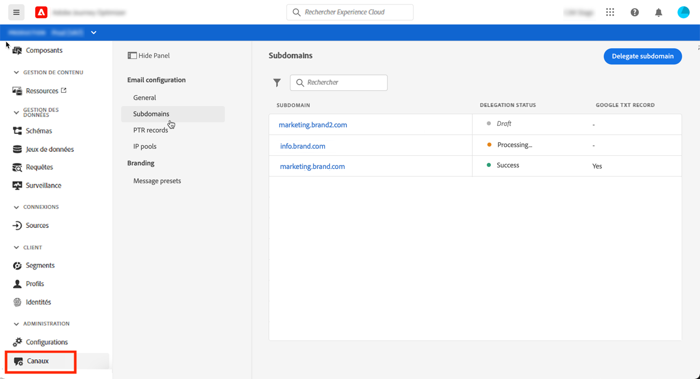
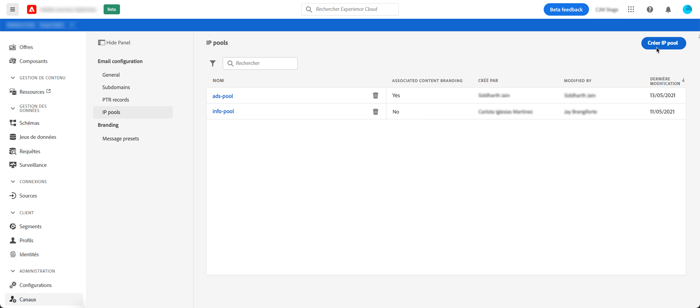
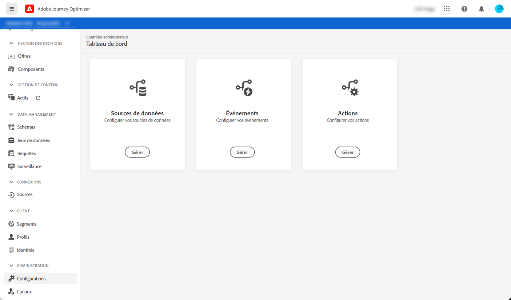

# Prise en main de la configuration [!DNL Journey Optimizer]

Lors de l’accès à [!DNL Journey Optimizer] pour la première fois, vous recevez un environnement de test de production et un certain nombre d’adresses IP vous sont attribués en fonction de votre contrat.

Pour pouvoir créer vos parcours et envoyer des messages, vous devez suivre les étapes de configuration suivantes :

1. **Configuration des messages et des canaux** : définir des paramètres prédéfinis, adapter et personnaliser les emails et les messages push ;

   * Définissez les paramètres des notifications push dans [!DNL Adobe Experience Platform] et [!DNL Adobe Experience Platform Launch]. [En savoir plus](../push-gs.md)

   * Créez des paramètres prédéfinis de message pour configurer tous les paramètres techniques requis pour les messages de notification push et par email. [En savoir plus](message-presets.md)

   * Déterminez l’adresse électronique à utiliser en priorité pour vos destinataires lorsque plusieurs adresses sont disponibles dans Adobe Experience Platform. [En savoir plus](primary-email-addresses.md)

   * Gérez le nombre de jours pendant lesquels des reprises sont effectuées avant d’envoyer des adresses électroniques à la liste de suppression. [En savoir plus](manage-suppression-list.md)

   <!--
    * Understand push notification flow. [Learn more](../push-gs.md)
    -->

1. **Déléguer des sous-domaines** : pour tout nouveau sous-domaine à utiliser dans Journey Optimizer, la première étape consiste à le déléguer. [En savoir plus](about-subdomain-delegation.md)

   

1. **Créer des pools** d’adresses IP : améliorez la délivrabilité et la réputation de vos emails en regroupant les adresses IP configurées avec votre instance. [En savoir plus](ip-pools.md)

   

1. **Configuration de parcours** : pour créer des parcours, vous devez configurer les  **[!UICONTROL sources de données]**, les  **** événements et les  **[!UICONTROL actions]**. [En savoir plus](about-data-sources-events-actions.md)

   

   * La configuration **Source de données** vous permet de définir une connexion à un système pour récupérer des informations supplémentaires qui seront utilisées dans vos parcours. En savoir plus sur les sources de données dans [cette section](../datasource/about-data-sources.md).

   * **Les événements vous permettent de déclencher vos parcours de manière unitaire pour envoyer des messages, en temps réel, à la personne suivant le parcours.** Dans la configuration des événements, vous configurez les événements attendus dans les parcours. Les données des événements entrants sont normalisées conformément au modèle de données Adobe Experience (XDM). Les événements authentifiés et non authentifiés proviennent des API d’ingestion en flux continu (notamment ceux issus du kit de développement Adobe Mobile SDK). En savoir plus sur les événements dans [cette section](../event/about-events.md).

   * [!DNL Journey Optimizer] est fourni avec les fonctionnalités de message intégrées : vous pouvez concevoir votre contenu et publier votre message. Si vous utilisez un système tiers pour envoyer vos messages, créez une **action personnalisée**. En savoir plus sur les actions dans [cette section](../action/action.md).