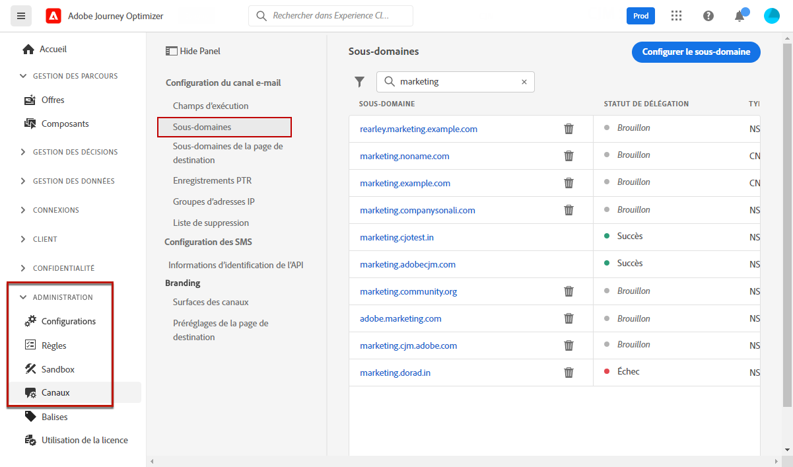
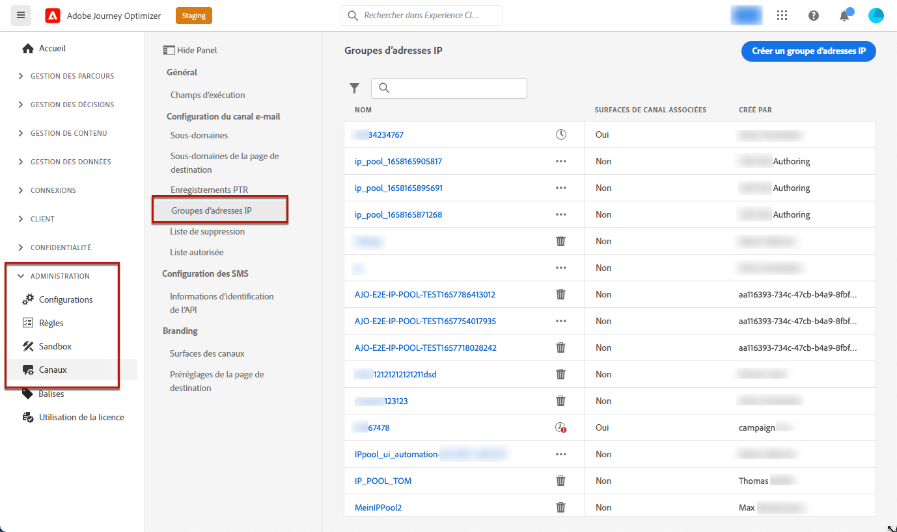

# Prise en main de la configuration de [!DNL Journey Optimizer] {#start-optimizer-configuration}

Lors de l&#39;accès à [!DNL Journey Optimizer] pour la première fois, vous recevez un environnement Sandbox de production et un certain nombre d&#39;adresses IP vous sont attribuées en fonction de votre contrat.

Pour pouvoir créer vos parcours et envoyer des messages, vous devez suivre les étapes de configuration suivantes :

1. **Configurer des messages et des canaux** : permet de définir les surfaces des canaux, d’adapter et de personnaliser les messages.

   * Créez des surfaces de canaux pour configurer tous les paramètres techniques requis pour diffuser les messages. [En savoir plus](channel-surfaces.md)

   * Déterminez l&#39;adresse e-mail à utiliser en priorité pour vos destinataires lorsque plusieurs adresses sont disponibles dans Adobe Experience Platform. [En savoir plus](primary-email-addresses.md)

   * Gérez le nombre de jours pendant lesquels de nouvelles tentatives sont effectuées avant d&#39;envoyer des adresses électroniques à la liste de suppression. [En savoir plus](manage-suppression-list.md)

   * Définissez les paramètres des notifications push dans [!DNL Adobe Experience Platform] et [!DNL Adobe Experience Platform Launch]. [En savoir plus](../configuration/push-gs.md)

   <!--* Understand the push notification flow. [Learn more](../configuration/push-gs.md)-->

   * Configurez votre instance pour envoyer des SMS (actuellement disponible uniquement pour un ensemble d’organisations - Disponibilité limitée). [En savoir plus](sms-configuration.md)

1. **Déléguer des sous-domaines** : pour un nouveau sous-domaine à utiliser dans Journey Optimizer, la première étape consiste à le déléguer. [En savoir plus](about-subdomain-delegation.md)

   

1. **Créer des pools d&#39;adresses IP** : améliorez la délivrabilité et la réputation de vos e-mails en regroupant les adresses IP configurées avec votre instance. [En savoir plus](ip-pools.md)

   

1. **Configurer des parcours** : pour créer des parcours, vous devez configurer les **[!UICONTROL sources de données]**, les **[!UICONTROL événements]** et les **[!UICONTROL actions]**. [En savoir plus](about-data-sources-events-actions.md)

   

   * La configuration des **sources de données** vous permet de définir une connexion à un système afin de récupérer des informations supplémentaires qui seront utilisées dans vos parcours. [En savoir plus](../datasource/about-data-sources.md)

   * **Les événements vous permettent de déclencher vos parcours de manière unitaire pour envoyer des messages, en temps réel, à l&#39;individu progressant dans le parcours.** Dans la configuration des événements, vous configurez les événements attendus dans les parcours. Les données des événements entrants sont normalisées conformément au modèle de données Adobe Experience (XDM). Les événements authentifiés et non authentifiés proviennent des API d&#39;ingestion en flux continu (notamment ceux issus du kit de développement Adobe Mobile SDK). [En savoir plus](../event/about-events.md)

   * [!DNL Journey Optimizer] est fourni avec des fonctionnalités de message intégrées qui vous permettent de concevoir et d’envoyer votre contenu. Si vous utilisez un système tiers pour envoyer vos messages, vous pouvez créer une **action personnalisée**. [En savoir plus](../action/action.md)