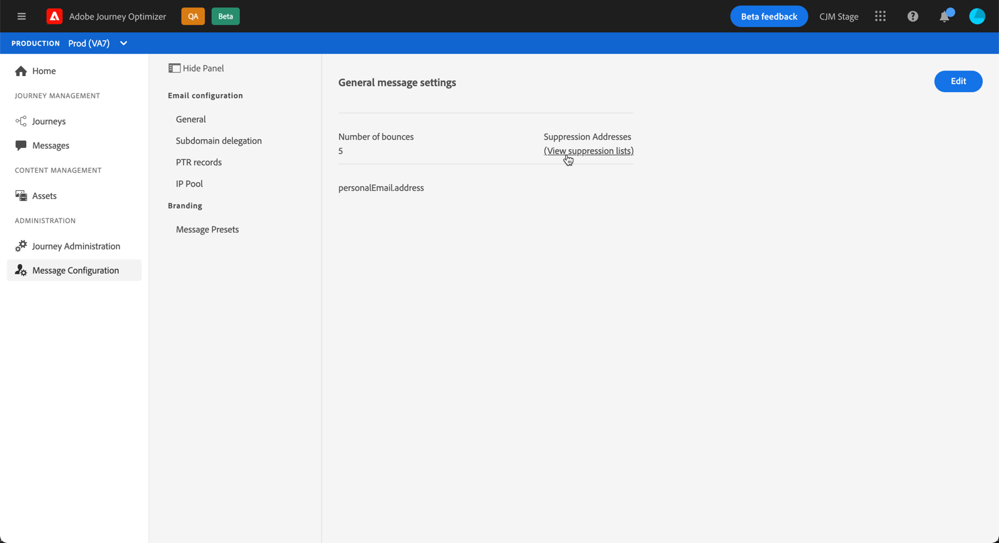

# Commencer avec les listes de suppression

Avec Journey Optimizer, vous pouvez contrôler toutes les adresses électroniques qui sont automatiquement exclues de l’envoi dans un parcours.

Pour accéder à la liste détaillée des adresses électroniques exclues, ouvrez le menu **[!UICONTROL Canaux]** / **[!UICONTROL Général]**, puis cliquez sur le lien **[!UICONTROL listes de suppression de Vue]**.

Des filtres sont disponibles pour vous aider à parcourir la liste (date de suppression, catégorie et raison). Vous pouvez également télécharger la liste au format CSV à des fins d’analyse et de rapports.

    !! lors de l’évaluation, seul le filtre de date de création est disponible 
