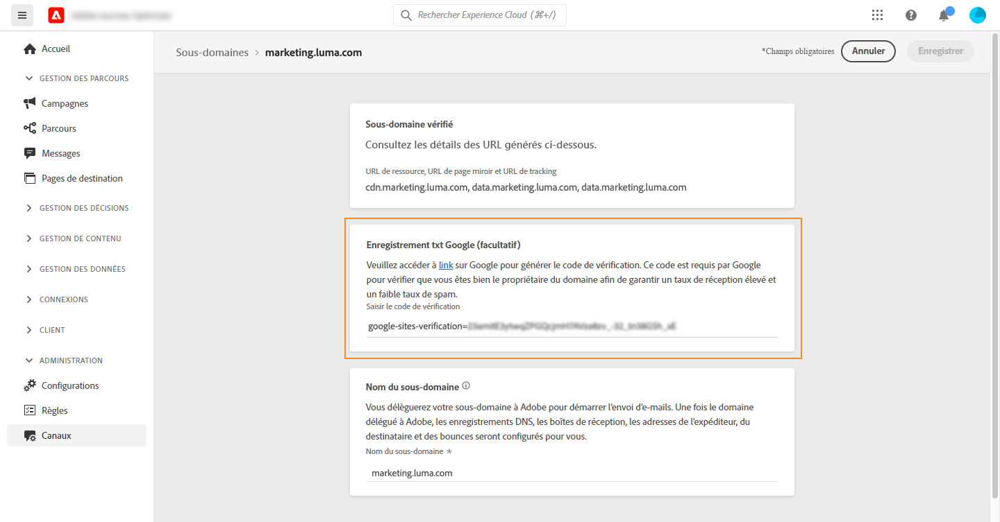

# Ajout d&#39;un enregistrement TXT Google à un sous-domaine {#google-txt-record}

Les enregistrements TXT font partie des enregistrements DNS. Ils servent à donner des informations textuelles à propos d&#39;un domaine, que des sources externes pourront lire par la suite.

Pour garantir une bonne délivrabilité et une diffusion réussie des e-mails vers les adresses Gmail, [!DNL Journey Optimizer] permet dʼajouter des enregistrements TXT de vérification de site Google spéciaux à vos sous-domaines afin de sʼassurer qu’ils soient vérifiés.

>[!CAUTION]
>
> Cette opération ne peut être effectuée que lorsqu&#39;un sous-domaine a le statut **[!UICONTROL Succès]**. Pour en savoir plus sur les statuts des sous-domaines, consultez [cette section](access-subdomains.md).

Pour ajouter un enregistrement TXT Google à votre sous-domaine, procédez comme suit :

1. Ouvrez le sous-domaine à partir du menu **[!UICONTROL Canaux]**/**[!UICONTROL Sous-domaines]**.

1. Dans la section **[!UICONTROL Enregistrement TXT de Google]**, saisissez le code de vérification généré depuis [Google Workspace](https://support.google.com/a/answer/183895){target=&quot;_blank&quot;}<!--G Suite Admin tools-->, puis cliquez sur **[!UICONTROL Enregistrer]**.

   

1. Une fois l’enregistrement TXT ajouté, vous devez le faire vérifier par Google. Pour ce faire, accédez à [Google Workspace](https://support.google.com/a/answer/183895){target=&quot;_blank&quot;}<!--G Suite Admin tools-->, puis entamez lʼétape de vérification.
