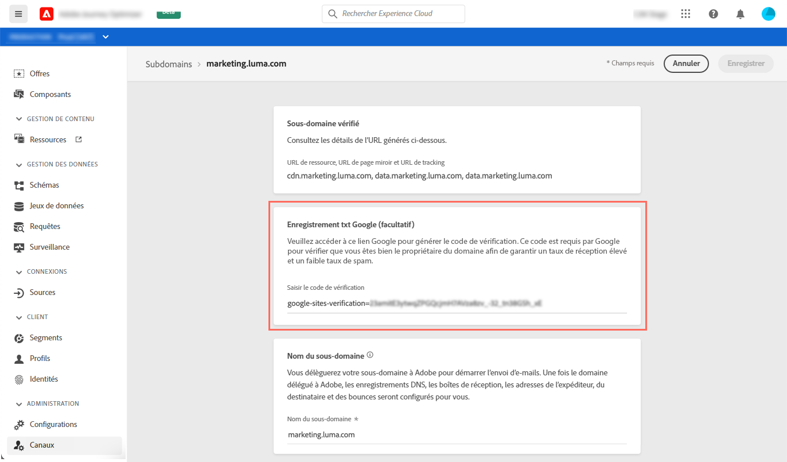

# Ajout d&#39;un enregistrement TXT Google à un sous-domaine

Les enregistrements TXT font partie des enregistrements DNS. Ils servent à donner des informations textuelles à propos d&#39;un domaine, que des sources externes pourront lire par la suite.

Pour garantir une bonne délivrabilité et une diffusion réussie des e-mails vers les adresses Gmail, Customer Journeys Management permet d&#39;ajouter des enregistrements TXT de vérification de site Google spéciaux à vos sous-domaines afin de s&#39;assurer qu&#39;ils soient vérifiés.

>[!NOTE]
>
> Cette opération ne peut être effectuée que lorsqu&#39;un sous-domaine a le statut **[!UICONTROL Succès]**. Pour en savoir plus sur les statuts des sous-domaines, consultez [cette section](access-subdomains.md).

Pour ajouter un enregistrement TXT Google à votre sous-domaine, procédez comme suit :

1. Ouvrez le sous-domaine à partir du menu **[!UICONTROL Canaux]**/**[!UICONTROL Sous-domaines]**.

1. Dans la section Enregistrement TXT Google, saisissez le code de vérification généré dans [Outils d&#39;administration G Suite](https://support.google.com/a/answer/183895), puis cliquez sur **[!UICONTROL Enregistrer]**.

   

1. Une fois l&#39;enregistrement TXT ajouté, vous devez le faire vérifier par Google. Pour ce faire, accédez aux outils d&#39;administration de G Suite, puis lancez l&#39;étape de vérification.
