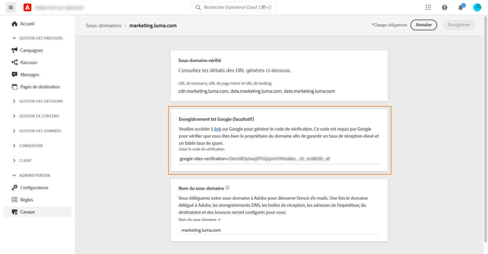

# Ajout d’un enregistrement TXT Google à un sous-domaine {#google-txt-record}

>[!BEGINSHADEBOX]

**Sur cette page :** découvrez comment ajouter et mettre à jour un enregistrement TXT de vérification de site Google sur votre sous-domaine pour réussir la diffusion des e-mails aux adresses Gmail.

>[!ENDSHADEBOX]

>[!CONTEXTUALHELP]
>id="ajo_admin_subdomain_google"
>title="Enregistrements TXT Google"
>abstract="Pour garantir la réussite de l’envoi d’e-mails aux adresses Gmail, vous pouvez ajouter des enregistrements TXT de vérification de site Google spéciaux à votre sous-domaine pour vous assurer qu’il est vérifié."

Les enregistrements TXT font partie des enregistrements DNS. Ils servent à donner des informations textuelles à propos d’un domaine, que des sources externes pourront lire par la suite.

Pour garantir une délivrabilité optimale et une diffusion réussie des e-mails vers les adresses Gmail, [!DNL Journey Optimizer] permet dʼajouter des enregistrements TXT de vérification de site Google spéciaux à vos sous-domaines afin dʼassurer qu’ils soient vérifiés.

>[!CAUTION]
>
> Cette opération ne peut être effectuée que lorsqu&#39;un sous-domaine a le statut **[!UICONTROL Succès]**. Pour en savoir plus sur les statuts des sous-domaines, consultez [cette section](delegate-subdomain.md#access-delegated-subdomains).

## Ajouter un enregistrement TXT Google {#add-google-txt-record}

Pour ajouter un enregistrement TXT Google à votre sous-domaine, procédez comme suit :

1. Ouvrez le sous-domaine à partir du menu **[!UICONTROL Canaux]** > **[!UICONTROL Paramètres des e-mails]** > **[!UICONTROL Sous-domaines]**.

1. Dans la section **[!UICONTROL Enregistrement TXT Google]**, saisissez le code de vérification généré depuis [Google Workspace](https://support.google.com/a/answer/183895){target="_blank"}<!--G Suite Admin tools-->, puis cliquez sur **[!UICONTROL Enregistrer]**.

   

1. Une fois l’enregistrement TXT ajouté, vous devez le faire vérifier par Google. Pour ce faire, accédez à [Google Workspace](https://support.google.com/a/answer/183895){target="_blank"}<!--G Suite Admin tools-->, puis lancez lʼétape de vérification.

## Mettre à jour un enregistrement TXT Google {#update-google-txt-record}

Pour mettre à jour un enregistrement TXT Google existant, procédez comme suit :

1. Ouvrez le sous-domaine à partir du menu **[!UICONTROL Sous-domaines]**.

1. Effacez la valeur existante dans le champ **[!UICONTROL Enregistrement TXT Google]** et cliquez sur **[!UICONTROL Enregistrer]**. Cette étape remplace la valeur d’enregistrement TXT Google précédente par une chaîne vide.

1. Rouvrez maintenant le même sous-domaine et saisissez le nouveau code de vérification.

1. Cliquez de nouveau sur **[!UICONTROL Enregistrer]**.

1. Vérifiez l’enregistrement mis à jour via [Google Workspace](https://support.google.com/a/answer/183895){target="_blank"}.
