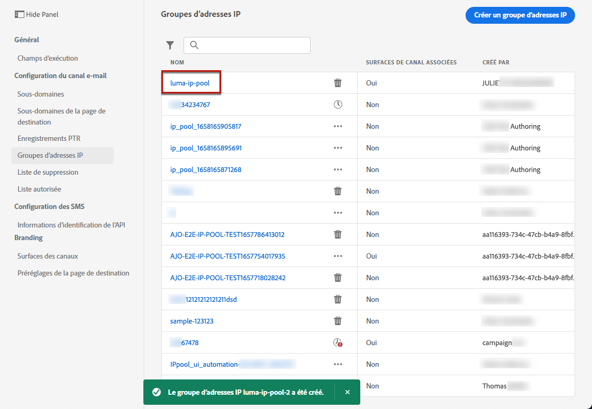
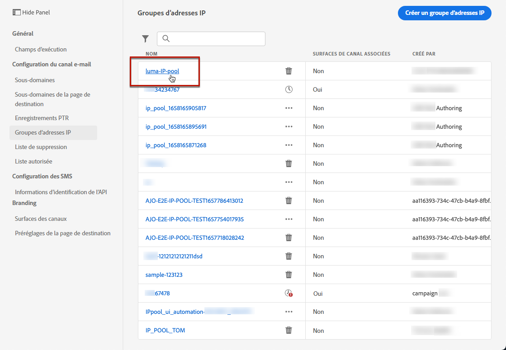

# Création de groupes d’adresses IP {#create-ip-pools}

>[!CONTEXTUALHELP]
>id="ajo_admin_ip_pool_header"
>title="Configuration d’un groupe d’adresses IP"
>abstract="Vous pouvez créer des groupes d’adresses IP pour regrouper les adresses IP de vos sous-domaines afin d’améliorer la délivrabilité des e-mails."

>[!CONTEXTUALHELP]
>id="ajo_admin_ip_pool"
>title="Configuration d’un groupe d’adresses IP"
>abstract="Vous pouvez créer des groupes d’adresses IP pour regrouper les adresses IP de vos sous-domaines afin d’améliorer la délivrabilité des e-mails."

## À propos des groupes d’adresses IP {#about-ip-pools}

Avec [!DNL Journey Optimizer], vous pouvez créer des groupes d’adresses IP pour regrouper les adresses IP de vos sous-domaines.

La création de pools d&#39;adresses IP est vivement recommandée pour la délivrabilité des e-mails. Ce faisant, vous pouvez empêcher la réputation d&#39;un sous-domaine d&#39;avoir un impact sur vos autres sous-domaines.

Par exemple, il est recommandé d&#39;avoir un pool d&#39;adresses IP pour vos messages marketing, et un autre pour vos messages transactionnels. De cette manière, si les performances de l&#39;un de vos messages marketing sont mauvaises et s&#39;il est déclaré comme indésirable par un client, cela n&#39;affecte pas les messages transactionnels envoyés à ce même client, qui recevra toujours des messages transactionnels (confirmations d’achat, messages de récupération de mot de passe, etc.).

## Création d&#39;un pool d&#39;adresses IP {#create-ip-pool}

Pour créer un pool d&#39;adresses IP, procédez comme suit :

1. Accédez au menu **[!UICONTROL Administration]** > **[!UICONTROL Canaux]**> **[!UICONTROL Groupes d’adresses IP]**, puis cliquez sur **[!UICONTROL Créer un groupe d’adresses IP]**.

   

1. Attribuez un nom et une description (facultatif) au groupe d’adresses IP.

   >[!NOTE]
   >
   >Le nom doit commencer par une lettre (A-Z) et contenir uniquement des caractères alphanumériques ou des caractères spéciaux ( _, ., - ).

1. Sélectionnez les adresses IP à inclure dans le pool dans la liste déroulante, puis cliquez sur **[!UICONTROL Envoyer]**.

   

   >[!NOTE]
   >
   >Toutes les adresses IP configurées avec votre instance sont disponibles dans la liste.

Le pool d&#39;adresses IP est maintenant créé et s&#39;affiche dans la liste. Vous pouvez le sélectionner pour accéder à ses propriétés et afficher la surface de canal associée (c’est-à-dire le préréglage de message). Pour plus d’informations sur l’association d’une surface de canal à un groupe d’adresses IP, consultez [cette section](channel-surfaces.md).

## Modification d&#39;un pool d&#39;adresses IP {#edit-ip-pool}

Pour modifier un pool d’adresses IP :

1. Dans la liste, cliquez sur le nom du pool d’adresses IP pour l’ouvrir.

   

1. Modifiez ses propriétés selon vos besoins. Vous pouvez modifier la description et ajouter ou supprimer des adresses IP.

   >[!NOTE]
   >
   >Le nom du pool d’adresses IP n’est pas modifiable. Si vous souhaitez le modifier, vous devez supprimer le pool d’adresses IP et en créer un autre avec le nom de votre choix.

   

   >[!CAUTION]
   >
   >Procédez avec attention lorsque vous envisagez de supprimer une adresse IP, car cela entraîne une charge supplémentaire pour les autres adresses IP, ce qui peut avoir de graves répercussions sur votre délivrabilité. En cas de doute, contactez un expert en délivrabilité.

1. Enregistrez vos modifications.

La mise à jour est effective immédiatement ou de manière asynchrone, selon que le groupe d’adresses IP est associé ou non à une [surface de canal](channel-surfaces.md) :

* Si le groupe d’adresses IP **n’est pas** associé à une quelconque surface de canal, la mise à jour est instantanée (statut **[!UICONTROL Succès]**).
* Si le groupe d’adresses IP **est** associé à une surface de canal, la mise à jour peut prendre jusqu’à 3 heures (statut **[!UICONTROL En cours de traitement]**).

>[!NOTE]
>
>Lors de la [création d’une surface de canal](channel-surfaces.md#create-channel-surface), si vous sélectionnez un groupe d’adresses IP en cours d’édition (statut **[!UICONTROL Traitement en cours]**) et qui n’a jamais été associé au sous-domaine sélectionné pour cette surface, vous ne pouvez pas poursuivre la création de la surface. [En savoir plus](channel-surfaces.md#subdomains-and-ip-pools)

Pour vérifier l’état de mise à jour du pool d’adresses IP, cliquez sur le bouton **[!UICONTROL Autres actions]** et sélectionnez **[!UICONTROL Mises à jour récentes]**.

>[!NOTE]
>
>Une fois qu’un pool d’adresses IP a été mis à jour, vous devrez peut-être attendre :
>* quelques minutes avant qu&#39;il soit consommé par les messages unitaires ;
>* jusqu’au lot suivant pour que le pool d’adresses IP soit effectif dans les messages par lots ;

Vous pouvez également utiliser le bouton **[!UICONTROL Supprimer]** pour supprimer un pool d’adresses IP. Notez que vous ne pouvez pas supprimer un groupe d’adresses IP associé à une surface de canal.

