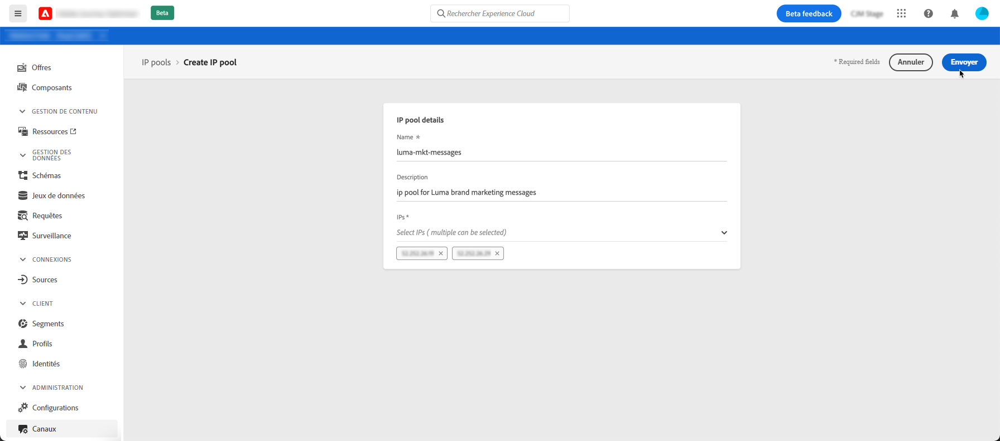
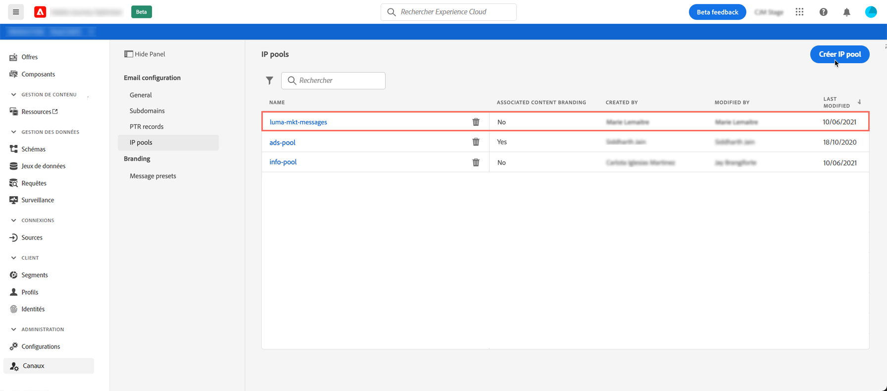

# Création de pools d’adresses IP

## À propos des pools d’adresses IP

Avec Journey Optimizer, vous pouvez créer des pools d’adresses IP pour regrouper les adresses IP de vos sous-domaines.

La création de pools d’adresses IP est vivement recommandée pour la délivrabilité des emails. Ce faisant, vous pouvez empêcher la réputation d’un sous-domaine d’avoir un impact sur vos autres sous-domaines.

Par exemple, il est recommandé d’avoir un pool d’adresses IP pour vos messages marketing, et un autre pour vos messages transactionnels. De cette manière, si l’un de vos messages marketing fonctionne mal et est déclaré comme indésirable par un client, cela n’affecte pas les messages transactionnels envoyés à ce même client, qui recevra toujours des messages transactionnels (confirmations d’achat, messages de récupération de mot de passe, etc.).

## Création d’un pool d’adresses IP

Pour créer un pool d’adresses IP, procédez comme suit :

1. Accédez au menu **[!UICONTROL Canaux]** / **[!UICONTROL Pools d’adresses IP]**, puis cliquez sur **[!UICONTROL Créer un pool d’adresses IP]**.

   

1. Attribuez un nom et une description (facultatif) au pool d’adresses IP.

   >[!NOTE]
   >
   >Le nom du sous-domaine doit commencer par une lettre (A-Z) et contenir uniquement des caractères alphanumériques ou des caractères spéciaux ( _, ., - ).

1. Sélectionnez les adresses IP à inclure dans le pool dans la liste déroulante, puis cliquez sur **[!UICONTROL Envoyer]**.

   

   >[!NOTE]
   >
   >Toutes les adresses IP configurées avec votre instance sont disponibles dans la liste.

Le pool d’adresses IP est maintenant créé et s’affiche dans la liste. Vous pouvez la sélectionner pour accéder à ses propriétés et afficher le paramètre de message prédéfini associé. Pour plus d&#39;informations sur l&#39;association d&#39;un paramètre prédéfini de message à un pool d&#39;adresses IP, consultez [cette section](message-presets.md)).

Pour modifier un pool d’adresses IP, ouvrez-le, puis modifiez ses propriétés selon vos besoins.

>[!NOTE]
>
>Si un paramètre prédéfini de message a été associé au pool d’adresses IP, vous devez d’abord le supprimer avant de modifier le pool d’adresses IP. Une fois vos modifications effectuées, vous pouvez associer à nouveau le paramètre de message prédéfini.
