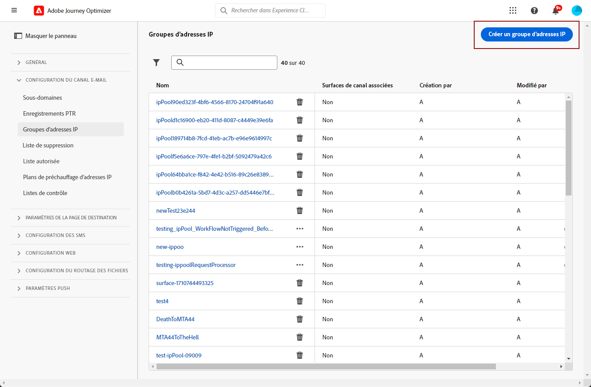

# Création de groupes d’adresses IP {#create-ip-pools}

>[!CONTEXTUALHELP]
>id="ajo_admin_ip_pool_header"
>title="Configurer un groupe d’adresses IP"
>abstract="Les groupes d’adresses IP rassemblent les adresses IP de vos sous-domaines pour une délivrabilité des e-mails améliorée."

>[!CONTEXTUALHELP]
>id="ajo_admin_ip_pool"
>title="Configurer un groupe d’adresses IP"
>abstract="Journey Optimizer vous permet de créer des groupes d’adresses IP afin de regrouper les adresses IP de vos sous-domaines. Cela peut améliorer considérablement la délivrabilité de vos e-mails, car ce faisant, vous pouvez empêcher la réputation d’un sous-domaine d’avoir un impact sur vos autres sous-domaines."

## À propos des groupes d’adresses IP {#about-ip-pools}

Avec [!DNL Journey Optimizer], vous pouvez créer des groupes d’adresses IP pour regrouper les adresses IP de vos sous-domaines.

La création de pools d&#39;adresses IP est vivement recommandée pour la délivrabilité des e-mails. Ce faisant, vous pouvez empêcher la réputation d&#39;un sous-domaine d&#39;avoir un impact sur vos autres sous-domaines.

Par exemple, il est recommandé d&#39;avoir un pool d&#39;adresses IP pour vos messages marketing, et un autre pour vos messages transactionnels. De cette manière, si les performances de l&#39;un de vos messages marketing sont mauvaises et s&#39;il est déclaré comme indésirable par un client, cela n&#39;affecte pas les messages transactionnels envoyés à ce même client, qui recevra toujours des messages transactionnels (confirmations d’achat, messages de récupération de mot de passe, etc.).

>[!CAUTION]
>
>La configuration du groupe d’adresses IP est commune à tous les environnements. Par conséquent, toute création ou modification de groupe d’adresses IP aura également un impact sur les sandbox de production.

## Création d&#39;un pool d&#39;adresses IP {#create-ip-pool}

Pour créer un pool d&#39;adresses IP, procédez comme suit :

1. Accédez au menu **[!UICONTROL Administration]** > **[!UICONTROL Canaux]** > **[!UICONTROL Paramètres d’e-mail]** > **[!UICONTROL pools d’adresses IP]**, puis cliquez sur **[!UICONTROL Créer un pool d’adresses IP]**.

   

1. Attribuez un nom et une description (facultatif) au groupe d’adresses IP.

   >[!NOTE]
   >
   >Le nom doit commencer par une lettre (A-Z) et contenir uniquement des caractères alphanumériques ou des caractères spéciaux ( _, ., - ).

1. Sélectionnez les adresses IP à inclure dans le pool dans la liste déroulante, puis cliquez sur **[!UICONTROL Envoyer]**.

   

   >[!NOTE]
   >
   >Toutes les adresses IP configurées avec votre instance sont disponibles dans la liste.

Lors de la sélection des adresses IP, vous pouvez voir dans la liste les enregistrements PTR associés aux adresses IP. Vous pouvez ainsi vérifier les informations de branding de chaque adresse IP lors de la création d’un groupe d’adresses IP et sélectionner les adresses IP avec les mêmes informations de branding, par exemple. [En savoir plus sur les enregistrements PTR.](ptr-records.md)

>[!NOTE]
>
>Si aucun enregistrement PTR n’est configuré pour une adresse IP, vous ne pouvez pas la sélectionner. Contactez votre représentant(e) Adobe pour configurer l’enregistrement PTR de cette adresse IP.

Une fois un groupe d’adresses IP créé, les informations PTR sont visibles lorsque vous pointez sur les adresses IP affichées sous la liste déroulante du groupe d’adresses IP.

Le pool d&#39;adresses IP est maintenant créé et s&#39;affiche dans la liste. Vous pouvez la sélectionner pour accéder à ses propriétés et afficher la configuration de canal associée (c’est-à-dire le paramètre prédéfini de message). Pour plus d&#39;informations sur l&#39;association d&#39;une configuration de canal à un pool d&#39;adresses IP, consultez [cette section](channel-surfaces.md).

## Modification d&#39;un pool d&#39;adresses IP {#edit-ip-pool}

Pour modifier un groupe dʼadresses IP, suivez les étapes ci-dessous.

1. Dans la liste, cliquez sur le nom du pool d’adresses IP pour l’ouvrir.

1. Modifiez ses propriétés selon vos besoins. Vous pouvez modifier la description et ajouter ou supprimer des adresses IP.

   >[!NOTE]
   >
   >Le nom du pool d’adresses IP n’est pas modifiable. Si vous souhaitez le modifier, vous devez supprimer le pool d’adresses IP et en créer un autre avec le nom de votre choix.

   

   >[!CAUTION]
   >
   >Procédez avec attention lorsque vous envisagez de supprimer une adresse IP, car cela entraîne une charge supplémentaire pour les autres adresses IP, ce qui peut avoir de graves répercussions sur votre délivrabilité. En cas de doute, contactez un expert en délivrabilité.

1. Enregistrez vos modifications.

La mise à jour est effective immédiatement ou de manière asynchrone, selon que le pool IP est associé ou non à une [configuration de canal](channel-surfaces.md) :

* Si le pool IP est **et non** associé à une configuration de canal, la mise à jour est instantanée (**[!UICONTROL statut de succès]**).
* Si le pool d&#39;adresses IP **est** associé à une configuration de canal, la mise à jour peut prendre jusqu&#39;à 3 heures (état **[!UICONTROL Traitement]** ).

>[!NOTE]
>
>Lors de la [création d’une configuration de canal](channel-surfaces.md#create-channel-surface), si vous sélectionnez un pool d’adresses IP en cours d’édition (**[!UICONTROL état de traitement]**) et que vous n’avez jamais été associé au sous-domaine sélectionné pour cette configuration, vous ne pouvez pas poursuivre la création de configuration. [En savoir plus](channel-surfaces.md#subdomains-and-ip-pools)

Pour vérifier l’état de mise à jour du pool d’adresses IP, cliquez sur le bouton **[!UICONTROL Autres actions]** et sélectionnez **[!UICONTROL Mises à jour récentes]**.

>[!NOTE]
>
>Une fois qu’un pool d’adresses IP a été mis à jour, vous devrez peut-être attendre :
>* quelques minutes avant qu&#39;il soit consommé par les messages unitaires ;
>* jusqu’au lot suivant pour que le pool d’adresses IP soit effectif dans les messages par lots ;

Vous pouvez également utiliser le bouton **[!UICONTROL Supprimer]** pour supprimer un pool d’adresses IP. Notez que vous ne pouvez pas supprimer un pool d’adresses IP associé à une configuration de canal.

