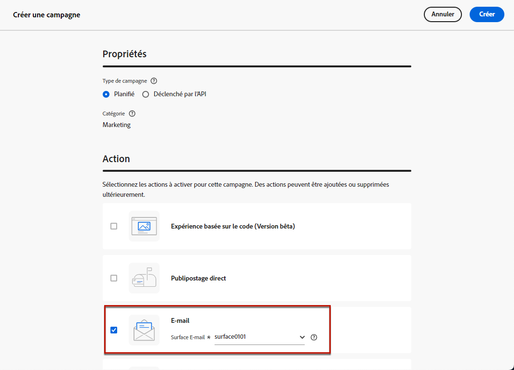
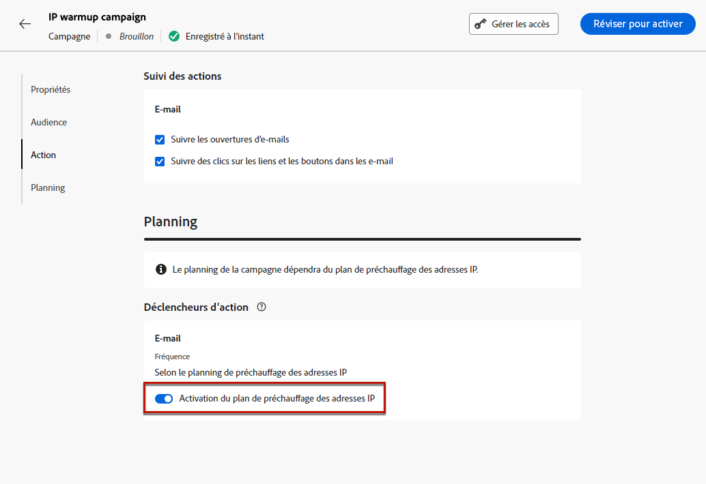
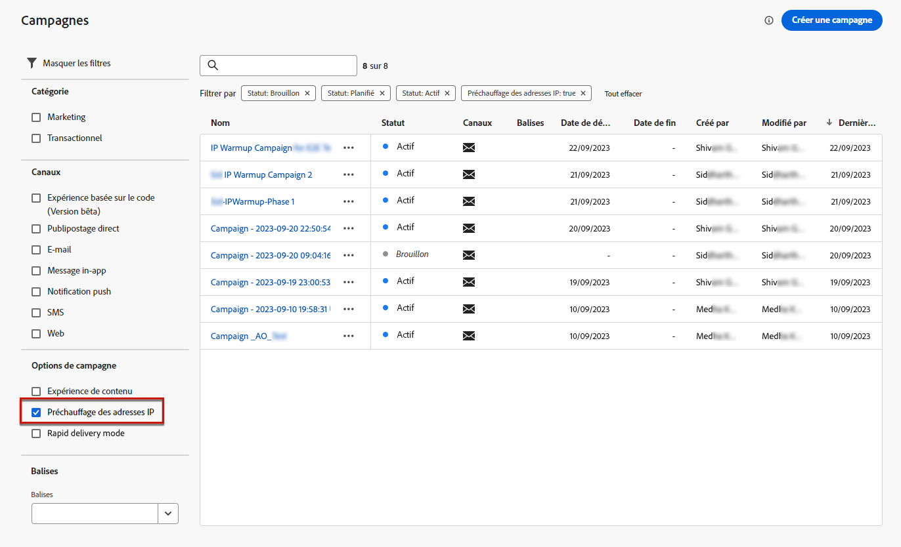

# Créer des campagnes de préchauffage d’adresses IP {#create-ip-warmup-campaign}

>[!CONTEXTUALHELP]
>id="ajo_campaign_ip_warmup"
>title="Activer l’option de plan de préchauffage d’adresses IP"
>abstract="Lorsque vous sélectionnez cette option, la campagne peut être utilisée dans un plan de préchauffage d’adresses IP. Le planning de la campagne sera ensuite piloté par le plan de préchauffage d’adresses IP auquel il est associé."

>[!BEGINSHADEBOX]

Ce guide couvre les sujets suivants :

* [Commencer avec les plans de préchauffage d’adresses IP](ip-warmup-gs.md)
* **[Créer des campagnes de préchauffage d’adresses IP](ip-warmup-campaign.md)**
* [Créer un plan de préchauffage d’adresses IP](ip-warmup-plan.md)
* [Exécuter le plan de préchauffage d’adresses IP](ip-warmup-execution.md)

>[!ENDSHADEBOX]

Avant de créer le plan de préchauffage d’adresses IP dans [!DNL Journey Optimizer], vous devez d’abord créer une ou plusieurs campagnes spécialement conçues pour être utilisées dans un plan de préchauffage d’adresses IP<!--through a dedicated option-->.

Pour créer une campagne de préchauffage d’adresses IP, suivez les étapes ci-dessous.

1. Créez une [surface](channel-surfaces.md) de canal [e-mail](../email/email-settings.md) pour le domaine et les adresses IP que vous avez identifiées pour votre plan de préchauffage.

   >[!NOTE]
   >
   >Découvrez comment sélectionner le domaine et les adresses IP à utiliser dans une surface d’e-mail dans [cette section](../email/email-settings.md#subdomains-and-ip-pools).
   >
   >Contactez votre conseiller ou conseillère en délivrabilité pour identifier le domaine et les adresses IP à utiliser pour votre plan de préchauffage d’adresses IP.<!--TBC-->

1. Créez une [campagne](../campaigns/create-campaign.md) marketing programmée et sélectionnez l’action [E-mail](../email/create-email.md#create-email-journey-campaign).

   <!--Select the Marketing category. The IP warmup plan activation option is only available for  marketing-type campaigns.-->

1. Sélectionnez la surface que vous avez créée pour le préchauffage d’adresses IP.

   

   <!--You must use the same surface as the one that will be used for the asociated IP warmup plan. [Learn how to create an IP warmup plan](#create-ip-warmup-plan)-->

1. Cliquez sur **[!UICONTROL Créer]**.

1. Dans la section **[!UICONTROL Planning]**, sélectionnez **[!UICONTROL Activation du plan de préchauffage d’adresses IP]**.

   

   Le [planning](../campaigns/create-campaign.md#schedule) de la campagne sera piloté par le plan de préchauffage d’adresses IP auquel il sera associé, ce qui signifie que le planning n’est plus défini dans la campagne elle-même.

1. Suivez les étapes de création d’une campagne par e-mail, telles que définir les propriétés, l’[audience](../audience/about-audiences.md)<!--best practices for IP warmup in terms of audience?--> et le [contenu](../email/get-started-email-design.md#key-steps) de la campagne.

   >[!NOTE]
   >
   >Pour plus d’informations sur la configuration d’une campagne, consultez cette [page](../campaigns/get-started-with-campaigns.md).

1. [Activez](../campaigns/review-activate-campaign.md) la campagne. Son statut passe à **[!UICONTROL Actif]**.

   >[!NOTE]
   >
   >Pour une campagne active avec un plan de préchauffage d’adresses IP activé, le bouton **[!UICONTROL Supprimer]** est disponible jusqu’à ce qu’il soit associé à un plan de préchauffage d’adresses IP. Une fois utilisée dans un plan, la campagne ne peut plus être supprimée.

1. La campagne s’affiche dans la liste **[!UICONTROL Campagnes]**. Pour récupérer facilement toutes les campagnes de préchauffage d’adresses IP créées sur le sandbox actuel, vous pouvez filtrer sur l’option de campagne **[!UICONTROL Préchauffage d’adresses IP]**.

   

Une fois active, la campagne est prête à être utilisée dans un plan de préchauffage d’adresses IP. [En savoir plus](ip-warmup-plan.md)

Une campagne de préchauffage d’adresses IP ne peut être utilisée que dans un seul plan de préchauffage d’adresses IP. Cependant, la même campagne peut être utilisée dans une ou plusieurs phases du même plan de préchauffage d’adresses IP. [En savoir plus](ip-warmup-plan.md#define-phases)

>[!NOTE]
>
>Lorsqu’une campagne active est utilisée dans un plan de préchauffage d’adresses IP, une fois que le plan est [marqué comme terminé](ip-warmup-execution.md#mark-as-completed), le statut de cette campagne passe à **[!UICONTROL Arrêté]**.

