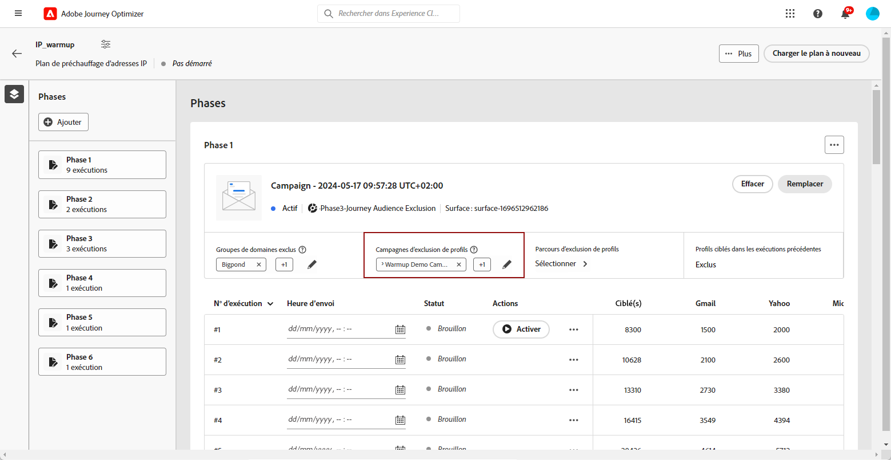
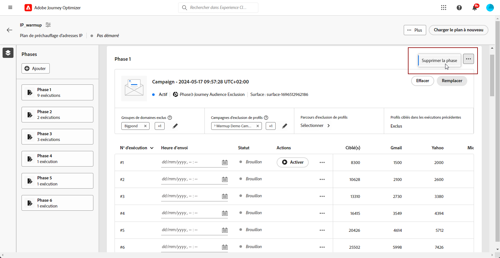
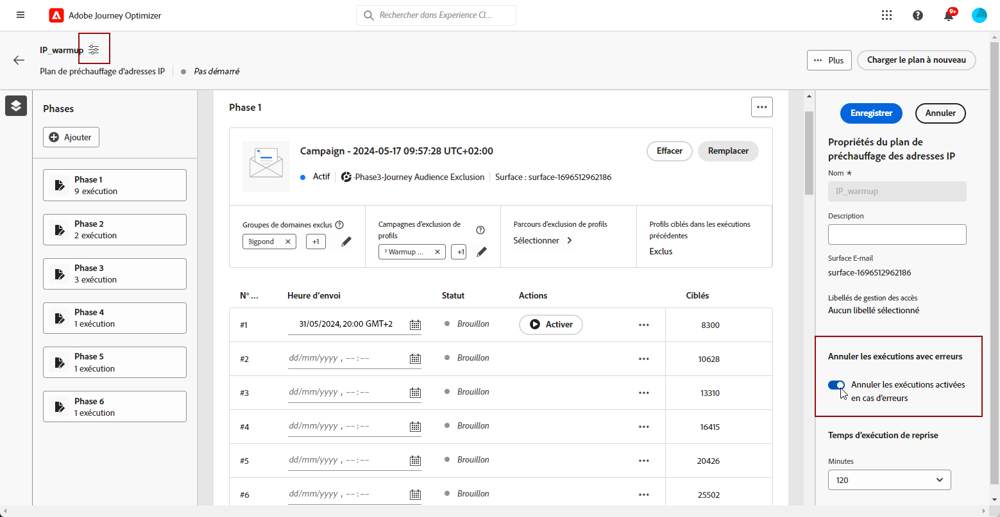
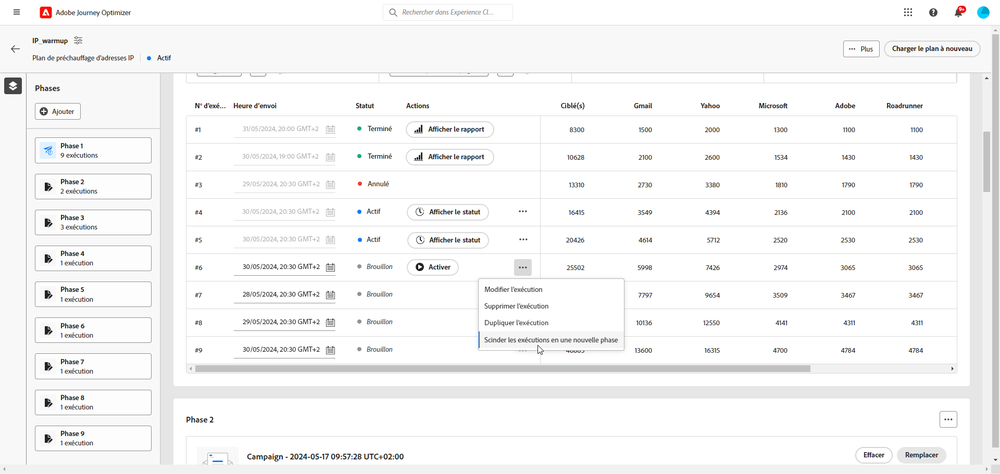

# Exécuter le plan de préchauffage d’adresses IP {#ip-warmup-running}

>[!BEGINSHADEBOX]

Ce guide couvre les sujets suivants :

* [Commencer avec le préchauffage d’adresses IP](ip-warmup-gs.md)
* [Créer des campagnes de préchauffage d’adresses IP](ip-warmup-campaign.md)
* [Créer un plan de préchauffage d’adresses IP](ip-warmup-plan.md)
* **[Exécuter le plan de préchauffage des adresses IP](ip-warmup-execution.md)**

>[!ENDSHADEBOX]

Une fois que vous avez [créé un plan de préchauffage des adresses IP](ip-warmup-plan.md) et chargé le fichier préparé avec votre consultant ou votre consultante en délivrabilité, vous pouvez définir les phases et les exécutions dans votre plan.

Chaque phase est composée de plusieurs exécutions auxquelles vous affectez une seule campagne.

## Définir les phases {#define-phases}

>[!CONTEXTUALHELP]
>id="ajo_admin_ip_warmup_campaigns_excluded"
>title="Exclure les audiences de campagne"
>abstract="Sélectionnez les audiences d’autres campagnes que vous souhaitez exclure de la phase en cours. Cela permet d’éviter que les profils contactés antérieurement à partir d’autres phases ou d’autres plans de préchauffage des adresses IP ne soient à nouveau ciblés."

>[!CONTEXTUALHELP]
>id="ajo_admin_ip_warmup_domains_excluded"
>title="Exclure des groupes de domaines"
>abstract="Sélectionnez les domaines que vous souhaitez exclure de la phase actuelle. L’exclusion de domaine requiert une phase non exécutée, vous devrez donc peut-être diviser une phase d’exécution pour ajouter des exclusions."
>additional-url="https://experienceleague.adobe.com/docs/journey-optimizer/using/configuration/implement-ip-warmup-plan/ip-warmup-execution.html#split-phase?lang=fr" text="Diviser une phase"

>[!CONTEXTUALHELP]
>id="ajo_admin_ip_warmup_phases"
>title="Définir les phases de votre plan"
>abstract="Chaque phase est composée de plusieurs exécutions auxquelles vous affectez une seule campagne."

<!--You need to associate the campaign and audience at phase level and turns on some settings as needed for all runs associated with a single creative/campaign

At phase level, system ensures that previously targeted + new profiles are picked up AND at iteration level, system ensures that each run is having unique profiles and the count matches what is stated in plan-->

<!---->

1. Pour chaque phase, sélectionnez la campagne que vous souhaitez associer à cette phase du plan de préchauffage des adresses IP.

   

   >[!IMPORTANT]
   >
   >    * Seules les campagnes ayant l’option **[!UICONTROL Activation du plan de préchauffage des adresses IP]** activée <!--and live?--> sont disponibles pour sélection. [En savoir plus](#create-ip-warmup-campaign)
   >
   >* Vous devez sélectionner une campagne qui utilise la même surface que celle sélectionnée pour le plan de préchauffage des adresses IP en cours.
   >
   >* Vous ne pouvez pas sélectionner une campagne qui est déjà utilisée dans un autre plan de chauffage par IP.

1. Dans la section **[!UICONTROL Exclusion de profil]**, vous pouvez constater que les profils des exécutions précédentes de cette phase sont toujours exclus. Par exemple, si dans Exécuter #1 un profil est couvert dans les 4 800 premières personnes ciblées, le système s’assure automatiquement que le même profil ne reçoive pas l’e-mail dans Exécuter #2.

1. Dans la section **[!UICONTROL Audiences de campagne exclues]**, sélectionnez les audiences d’autres campagnes <!--executed/live?--> que vous souhaitez exclure de la phase actuelle.

   

   Par exemple, lors de l’exécution de la phase 1, vous deviez [la fractionner](#split-phase) pour une raison quelconque. Par conséquent, vous pouvez exclure la campagne utilisée dans la phase 1 afin que les profils contactés précédemment de la phase 1 ne soient pas inclus dans la phase 2. Vous pouvez également exclure les campagnes d’autres plans de préchauffage des adresses IP.

1. Dans la section **[!UICONTROL Groupes de domaines exclus]**, sélectionnez les domaines à exclure de cette phase.

   >[!NOTE]
   >
   >L’exclusion de domaines requiert une phase non exécutée, vous devrez donc peut-être [fractionner une phase d’exécution](#split-phase) pour ajouter des exclusions.

   

   Par exemple, après avoir exécuté le préchauffage des adresses IP pendant quelques jours, vous réalisez que la réputation de votre FAI auprès d’un domaine (par exemple, Adobe) n’est pas bonne et que vous souhaitez résoudre ce problème sans arrêter votre plan de préchauffage des adresses IP. Dans ce cas, vous pouvez exclure le groupe de domaines Adobe.

   >[!NOTE]
   >
   >Si le domaine n’est pas un groupe de domaines prêt à l’emploi, vous devez collaborer avec votre consultant ou consultante en délivrabilité pour ajouter ce domaine au [fichier de plan de préchauffage des adresses IP](ip-warmup-plan.md#prepare-file) et [le charger à nouveau](#re-upload-plan) pour pouvoir exclure ce domaine.

1. Si nécessaire, vous pouvez ajouter une phase. Elle sera ajoutée après la dernière phase actuelle.

   

1. Utilisez le bouton **[!UICONTROL Supprimer la phase]** pour supprimer toute phase indésirable.

   

   >[!CAUTION]
   >
   >Vous ne pouvez pas annuler l’action de **[!UICONTROL suppression]**.
   >
   >Si vous supprimez toutes les phases du plan de préchauffage des adresses IP, il est recommandé de charger à nouveau un plan. [En savoir plus](#re-upload-plan)

## Définir les exécutions {#define-runs}

>[!CONTEXTUALHELP]
>id="ajo_admin_ip_warmup_run"
>title="Définir chaque exécution"
>abstract="Définissez et activez chaque exécution pour toutes les phases."

>[!CONTEXTUALHELP]
>id="ajo_admin_ip_warmup_last_engagement"
>title="Filtre sur l’engagement"
>abstract="Cette colonne est un filtre qui cible uniquement les utilisateurs et les utilisatrices engagés auprès de votre marque au cours des 20 derniers jours, par exemple. Vous pouvez également modifier ce paramètre à l’aide de l’option **Modifier l’exécution**."

>[!CONTEXTUALHELP]
>id="ajo_admin_ip_warmup_retry"
>title="Définir une fenêtre temporelle"
>abstract="Vous pouvez définir une fenêtre temporelle pendant laquelle la campagne de préchauffage des adresses IP peut être exécutée en cas de retard dans le traitement de segmentation."

>[!CONTEXTUALHELP]
>id="ajo_admin_ip_warmup_pause"
>title="Annuler les exécutions avec des erreurs d’audience"
>abstract="Sélectionnez cette option pour annuler une exécution si les profils qualifiés sont inférieurs aux profils ciblés une fois que l’audience a été évaluée pour cette exécution."

>[!CONTEXTUALHELP]
>id="ajo_admin_ip_warmup_qualified"
>title="Afficher les profils qualifiés"
>abstract="Cette colonne affiche le nombre de profils qualifiés. Une fois que l’audience a été évaluée pour une exécution, s’il existe plus de profils ciblés que de profils qualifiés, l’exécution se poursuit, sauf si l’option **Pause pour erreurs** est activée. Dans ce cas, l’exécution est annulée."

1. Sélectionnez un planning pour chaque exécution.

   

1. Vous pouvez éventuellement définir une fenêtre temporelle pendant laquelle la campagne de réchauffement des adresses IP peut être exécutée en cas de retard dans la variable [segmentation](https://experienceleague.adobe.com/docs/experience-platform/segmentation/home.html#how-segmentation-works){target="_blank"} tâche. Pour ce faire, cliquez sur l’icône Propriétés en haut à gauche, en regard du nom du plan, et utilisez la liste déroulante **[!UICONTROL Temps d’exécution de reprise]** pour sélectionner une durée, jusqu’à 240 minutes (4 heures).

   

   Si, par exemple, vous définissez une heure d’envoi un jour donné à 9h00 et que vous sélectionnez 120 minutes comme heure d’exécution de la nouvelle tentative, une fenêtre d’opportunité de 2 heures (de 9h00 à 11h00) est disponible pour l’exécution de la tâche de segmentation.

   >[!NOTE]
   >
   >Si aucune fenêtre temporelle n’est spécifiée, l’exécution est tentée à l’heure d’envoi et échoue si le traitement de segmentation n’est pas terminé.

1. Si nécessaire, sélectionnez **[!UICONTROL Modifier l’exécution]** à partir de l’icône Plus d’actions. Vous pouvez y mettre à jour le nombre d’adresses dans chaque colonne. Vous pouvez également mettre à jour le champ **[!UICONTROL Dernier engagement]** pour cibler uniquement les utilisateurs et utilisatrices engagés auprès de votre marque au cours des 20 derniers jours, par exemple.

   

1. Sélectionnez l’option **[!UICONTROL Pause pour erreurs]** pour annuler une exécution si les profils qualifiés sont inférieurs aux profils ciblés une fois que l’audience a été évaluée pour cette exécution.

   

1. **[!UICONTROL Activez]** l’exécution. [En savoir plus](#activate-run)

1. Le statut de cette exécution passe à **[!UICONTROL Actif]**. Les différents statuts d’exécution sont répertoriés dans [cette section](#monitor-plan).

1. Si l’exécution de la campagne n’a pas démarré, vous pouvez arrêter une exécution active.<!--why?-->

   

   >[!NOTE]
   >
   >Une fois que l’exécution de la campagne a démarré, le bouton **[!UICONTROL Arrêter]** n’est plus disponible.

1. Pour ajouter une exécution, sélectionnez **[!UICONTROL Ajoutez une exécution ci-dessous.]** à partir de l’icône Autres actions .

   

## Activer une exécution {#activate-run}

Pour activer une exécution, sélectionnez le bouton **[!UICONTROL Activer]**.

Assurez-vous que vous avez planifié suffisamment de temps pour autoriser le [segmentation](https://experienceleague.adobe.com/docs/experience-platform/segmentation/home.html#how-segmentation-works){target="_blank"} à exécuter.

>[!CAUTION]
>
>Chaque exécution doit être activée au moins 12 heures avant l’heure d’envoi réelle. Sinon, la segmentation risque de ne pas être terminée.

Lorsque vous activez une exécution, plusieurs segments sont automatiquement créés.

* Si vous activez la première exécution d’une phase :

   * A [segment](https://experienceleague.adobe.com/docs/experience-platform/segmentation/ui/segment-builder.html?lang=fr){target="_blank"} est créé pour les audiences de campagne exclues (le cas échéant).
   * Un autre segment est créé pour les groupes de domaines exclus (le cas échéant).

* Lors de l’activation d’une exécution :

   * Un autre segment est créé pour le dernier filtre d’engagement.
   * Un [composition de l&#39;audience](https://experienceleague.adobe.com/docs/experience-platform/segmentation/ui/audience-composition.html?lang=fr){target="_blank"} est créé correspondant à l’audience à laquelle la campagne sera envoyée.

<!--How do you know when segmentation is complete? Is there a way to prevent user from scheduling less than 12 hours before the segmentation job?-->

<!--Sart to execute on every day basis by simply clicking the play button > for each run? do you have to come back every day to activate each run? or can you schedule them one after the other?)-->

<!--Upon activation, when the segment evaluation happens, more segments will be created by the IP warmup service and will be leveraged in an audience composition and a new audience will be created for each run splitted into the different selected domains.-->

## Gérer votre plan {#manage-plan}

À tout moment, si votre plan de préchauffage des adresses IP ne fonctionne pas comme prévu, vous pouvez prendre les mesures ci-dessous.

### Diviser une phase {#split-phase}

Si vous souhaitez ajouter une nouvelle phase à partir d’une exécution spécifique, sélectionnez la **[!UICONTROL Option Partager sur une nouvelle phase]** à partir de l’icône Autres actions .

Une nouvelle phase est créée pour les exécutions restantes de la phase en cours.

Par exemple, si vous sélectionnez cette option pour l’exécution nº 4, les exécutions nº 4 à 8 seront déplacées vers une nouvelle phase juste après la phase actuelle.

Suivez les étapes [ci-dessus](#define-phases) pour définir la nouvelle phase.

* Vous pouvez utiliser l’option **[!UICONTROL Remplacer une campagne]** pour cette nouvelle phase.

* Vous pouvez également exclure la campagne précédente ou un domaine qui n’est pas performant. Découvrez comment dans [cette section](#define-phases).

<!--
You don't have to decide the campaign upfront. You can do a split later. It's a work in progress plan: you activate one run at a time with a campaign and you always have the flexibility to modify it while working on it.

But need to explain in which case you want to modify campaigns, provide examples
-->

### Marquer un plan comme terminé {#mark-as-completed}

Si votre plan ne fonctionne pas assez bien ou si vous souhaitez l’abandonner pour en créer un autre, vous pouvez le marquer comme terminé.

Pour ce faire, cliquez sur le bouton **[!UICONTROL Plus]** en haut à droite du plan de préchauffage des adresses IP et sélectionnez **[!UICONTROL Marquer comme terminé]**.

Cette option n’est disponible que si le statut de toutes les exécutions du plan est **[!UICONTROL Terminé]** ou **[!UICONTROL Brouillon]**. Si une exécution est **[!UICONTROL active]**, l’option apparaît grisée.

Les différents statuts d’exécution sont répertoriés dans [cette section](#monitor-plan).

### Recharger un plan de préchauffage des adresses IP {#re-upload-plan}

Si votre plan de préchauffage des adresses IP ne fonctionne pas comme prévu (par exemple, si vous constatez que certains FAI marquent vos messages comme étant du spam), vous pouvez demander à votre spécialiste en délivrabilité de configurer un autre fichier de plan de préchaufage des adresses IP et de le recharger à l’aide du bouton correspondant.

Toutes les exécutions précédemment exécutées seront en lecture seule. Le nouveau plan est affiché sous le premier plan.

Suivez les étapes [ci-dessus](#define-phases) pour définir le nouveau plan.

>[!NOTE]
>
>Les détails du plan de préchauffage des adresses IP changeront en fonction du fichier qui vient d’être chargé. Les exécutions précédentes (quel que soit leur [statut](#monitor-plan)) ne sont pas affectées.

Prenons un exemple :

* Avec le plan initial de préchauffage des adresses IP, la phase 2 comportait 9 exécutions.

* 4 exécutions ont été exécutées (peu importe si l’exécution a échoué, terminée ou annulée).<!--as long as a run has been attempted, it is an executed run-->).

* Si vous rechargez un plan, la phase 2 avec les 4 premières exécutions effectuées passe en mode lecture seule.

* Les 5 exécutions restantes (dont le statut est Brouillon) sont déplacées vers une nouvelle phase (Phase 3) qui s’affiche conformément au plan nouvellement chargé.

## Surveiller le plan {#monitor-plan}

Pour mesurer l’impact de votre plan, vous pouvez vérifier les performances de vos campagnes de préchauffage des adresses IP à l’aide des rapports de campagne [!DNL Journey Optimizer]. Pour ce faire, vous pouvez cliquer sur le bouton **[!UICONTROL Afficher des rapports]** pour chaque exécution effectuée. En savoir plus sur le [rapport dynamique](../reports/campaign-live-report.md#email-live) et le [rapport global](../reports/campaign-global-report.md##email-global) de la campagne par e-mail.

Le plan de préchauffage des adresses IP lui-même sert également de rapport consolidé à un seul endroit. Vous pouvez vérifier des éléments tels que le nombre d’exécutions **[!UICONTROL actives]** ou **[!UICONTROL terminées]** pour chaque phase et vérifier l’avancement de votre plan de préchauffage des adresses IP.

Une exécution peut avoir les statuts suivants :

* **[!UICONTROL Brouillon]** : chaque fois qu’une exécution est créée, soit lors de la [création d’un plan](ip-warmup-plan.md) ou de l’[ajout d’une exécution](#define-runs) à partir de l’interface utilisateur, son statut est **[!UICONTROL Brouillon]**.
* **[!UICONTROL Actif]** : chaque fois que vous activez une exécution, son statut est **[!UICONTROL Actif]**.
* **[!UICONTROL Terminé]** : l’exécution de la campagne pour cette exécution est terminée. <!--i.e. campaign execution has started, no error happened and emails have reached users? to check with Sid-->
* **[!UICONTROL Annulé]**: a **[!UICONTROL En direct]** L’exécution a été annulée à l’aide de la fonction **[!UICONTROL Arrêter]** ou si vous avez activé la fonction **[!UICONTROL Pause pour les erreurs]** et une erreur s’est produite. [En savoir plus](#define-runs)
* **[!UICONTROL Échec]** : une erreur rencontrée par le système ou la campagne utilisée pour la phase en cours a été arrêtée. Si une exécution échoue, vous pouvez en planifier une autre pour le jour suivant.
