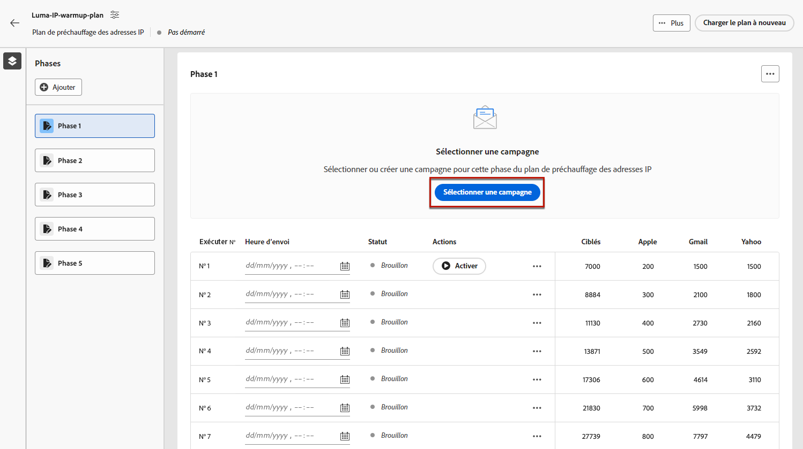
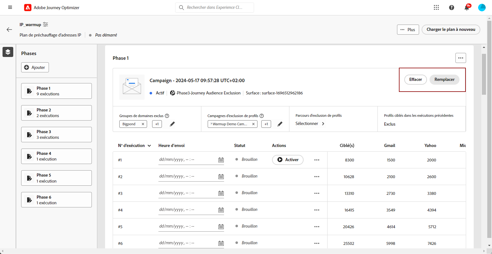
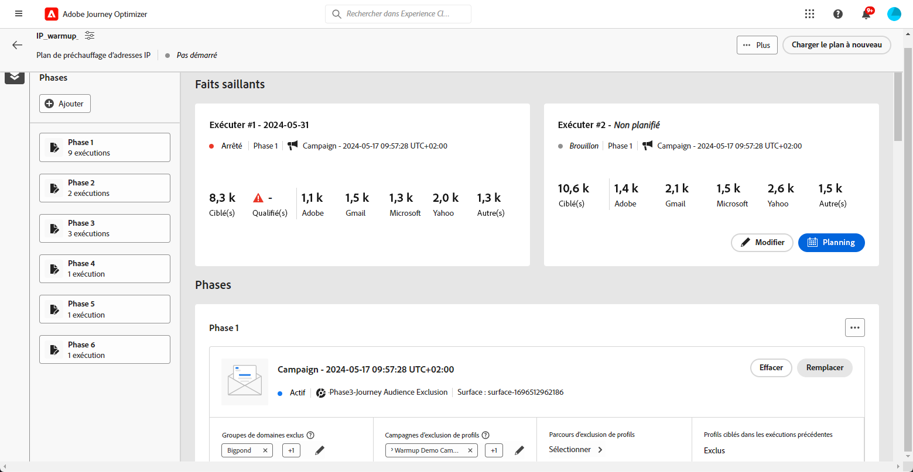
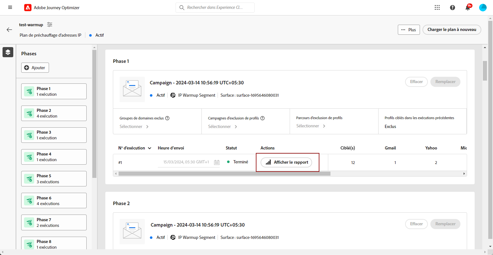

# Exécuter le plan de préchauffage d’adresses IP {#ip-warmup-running}

>[!BEGINSHADEBOX]

Ce guide couvre les sujets suivants :

* [Commencer avec les plans de préchauffage d’adresses IP](ip-warmup-gs.md)
* [Créer des campagnes de préchauffage d’adresses IP](ip-warmup-campaign.md)
* [Créer un plan de préchauffage d’adresses IP](ip-warmup-plan.md)
* **[Exécuter le plan de préchauffage des adresses IP](ip-warmup-execution.md)**

>[!ENDSHADEBOX]

Une fois que vous avez [créé un plan de préchauffage des adresses IP](ip-warmup-plan.md) et chargé le fichier préparé avec votre consultant ou votre consultante en délivrabilité, vous pouvez définir les phases et les exécutions dans votre plan.

Chaque phase est composée de plusieurs exécutions auxquelles vous affectez une seule campagne.

## Définir les phases {#define-phases}

>[!CONTEXTUALHELP]
>id="ajo_admin_ip_warmup_campaigns_excluded"
>title="Exclure les audiences de campagne"
>abstract="Sélectionnez des campagnes pour exclure leurs audiences de la phase en cours. Cela permet d’éviter que les profils contactés antérieurement à partir d’autres phases ou d’autres plans de préchauffage des adresses IP ne soient à nouveau ciblés."

>[!CONTEXTUALHELP]
>id="ajo_admin_ip_warmup_domains_excluded"
>title="Exclure des groupes de domaines"
>abstract="Sélectionnez les domaines que vous souhaitez exclure de la phase actuelle. L’exclusion de domaine requiert une phase non exécutée, vous devrez donc peut-être diviser une phase d’exécution pour ajouter des exclusions."
>additional-url="https://experienceleague.adobe.com/docs/journey-optimizer/using/configuration/implement-ip-warmup-plan/ip-warmup-execution.html?lang=fr#split-phase" text="Diviser une phase"

>[!CONTEXTUALHELP]
>id="ajo_admin_ip_warmup_phases"
>title="Définir les phases de votre plan"
>abstract="Chaque phase est composée de plusieurs exécutions auxquelles vous affectez une seule campagne."

<!--You need to associate the campaign and audience at phase level and turns on some settings as needed for all runs associated with a single creative/campaign

At phase level, system ensures that previously targeted + new profiles are picked up AND at iteration level, system ensures that each run is having unique profiles and the count matches what is stated in plan-->

<!---->

1. Pour chaque phase, sélectionnez la campagne que vous souhaitez associer à cette phase du plan de préchauffage des adresses IP.

   >[!NOTE]
   >
   >Vous ne pouvez pas sélectionner une campagne qui est déjà utilisée dans un autre plan de préchauffage des adresses IP. Cependant, la même campagne peut être utilisée dans une ou plusieurs phases du même plan de préchauffage d’adresses IP.

   

   >[!IMPORTANT]
   >
   >* Seules les campagnes ayant l’option **[!UICONTROL Activation du plan de préchauffage des adresses IP]** activée sont disponibles pour sélection. [En savoir plus](#create-ip-warmup-campaign)
   >
   >* Vous devez sélectionner une campagne qui utilise la même surface que celle sélectionnée pour le plan de préchauffage des adresses IP en cours.

1. Une fois qu’une campagne est sélectionnée pour la phase en cours, les sections permettant d’exclure les profils, les audiences de campagnes et les groupes de domaines de l’opération s’affichent.

   >[!NOTE]
   >
   >Quand une exécution est activée, les exclusions ne peuvent plus être modifiées, sauf si vous [scindez l’exécution](#split-phase) en une nouvelle phase.

   1. Dans la section **[!UICONTROL Groupes de domaines exclus]**, sélectionnez les domaines à exclure de cette phase.

      >[!NOTE]
      >
      >L’exclusion de domaines requiert une phase non exécutée, vous devrez donc peut-être [fractionner une phase d’exécution](#split-phase) pour ajouter des exclusions.

      

      Par exemple, après avoir exécuté le préchauffage des adresses IP pendant quelques jours, vous réalisez que la réputation de votre FAI auprès d’un domaine (par exemple, Adobe) n’est pas bonne et que vous souhaitez résoudre ce problème sans arrêter votre plan de préchauffage des adresses IP. Dans ce cas, vous pouvez exclure le groupe de domaines Adobe.

      >[!NOTE]
      >
      >Vous pouvez uniquement exclure un groupe de domaines personnalisé qui a été ajouté au [modèle de plan de préchauffage des adresses IP](ip-warmup-plan.md#prepare-file). Si ce n’est pas le cas, mettez à jour le modèle avec le groupe de domaines personnalisé à exclure et [chargez à nouveau le plan](#re-upload-plan).

   1. Dans la **[!UICONTROL Campagne d&#39;exclusion de profils]** , sélectionnez les campagnes que vous souhaitez exclure de la phase en cours.

      

      Par exemple, lors de l’exécution de la phase 1, vous deviez [la fractionner](#split-phase) pour une raison quelconque. Par conséquent, vous pouvez exclure la campagne utilisée dans la phase 1 afin que les profils contactés précédemment de la phase 1 ne soient pas inclus dans la phase 2. Vous pouvez également exclure les campagnes d’autres plans de préchauffage des adresses IP.

   1. Dans la **[!UICONTROL Parcours d’exclusion des profils]** , sélectionnez les parcours avec les audiences à exclure de la phase en cours.

+++ Pour utiliser l’option Parcours pour l’exclusion des profils, vous devez établir une relation entre les schémas Evénement de retour de message AJO et Enregistrement d’entité AJO.

      1. Création d’une **Espace de noms** qui servira de type d’identité pour les étapes ci-dessous.

      1. Accédez à Adobe Experience Platform à partir du **Schémas** , sélectionnez **Schéma d’enregistrement d’entité AJO** et définissez la variable **_id** comme identité principale, puis sélectionnez l’espace de noms créé précédemment comme **Espace de noms d’identité**.

      1. Dans la **Schémas** , sélectionnez **Schéma d’événement de retour de message AJO**, puis accédez à la **_messageID** champ . Sélectionner **Ajout d’une relation** et choisissez **Schéma d’enregistrement d’entité AJO** comme la propriété **Schéma de référence** et votre espace de noms créé précédemment en tant que **Espace d’identification de référence**.
+++

   1. Dans le **[!UICONTROL Profils ciblés lors des exécutions précédentes]** , vous pouvez constater que les profils des exécutions précédentes de cette phase sont toujours exclus. Par exemple, si dans Exécuter #1 un profil est couvert dans les 4 800 premières personnes ciblées, le système s’assure automatiquement que le même profil ne reçoive pas l’e-mail dans Exécuter #2.

      >[!NOTE]
      >
      >Cette section n’est pas modifiable.

1. Si nécessaire, vous pouvez remplacer la campagne à l’aide de la variable **[!UICONTROL Remplacer]** bouton . Vous pouvez également effacer la campagne sélectionnée à l’aide de l’option **[!UICONTROL Effacer]** bouton . Vous pouvez ensuite choisir une nouvelle opération immédiatement ou ultérieurement.

   

   >[!NOTE]
   >
   >Cette action n’est possible qu’avant l’activation de la première exécution de la phase. Une fois qu’une exécution est activée, la campagne ne peut pas être remplacée, sauf si vous [scindez l’exécution](#split-phase) en une nouvelle phase.

1. Si nécessaire, vous pouvez ajouter une phase. Elle sera ajoutée après la dernière phase actuelle.

   

1. Utilisez le bouton **[!UICONTROL Supprimer la phase]** pour supprimer toute phase indésirable. Cette action n’est disponible que si aucune exécution n’est exécutée dans une phase. <!--Once a run is executed, deletion is not allowed.-->

   >[!CAUTION]
   >
   >Vous ne pouvez pas annuler la **[!UICONTROL Phase de suppression]** action.

   

   >[!NOTE]
   >
   >Si vous supprimez toutes les phases du plan de préchauffage des adresses IP, il est recommandé de charger à nouveau un plan. [En savoir plus](#re-upload-plan)

## Définir les exécutions {#define-runs}

>[!CONTEXTUALHELP]
>id="ajo_admin_ip_warmup_run"
>title="Définir chaque exécution"
>abstract="Définissez et activez chaque exécution pour toutes les phases."

>[!CONTEXTUALHELP]
>id="ajo_admin_ip_warmup_last_engagement"
>title="Filtre sur l’engagement"
>abstract="Cette colonne est un filtre qui cible uniquement les utilisateurs et les utilisatrices engagés auprès de votre marque au cours des 20 derniers jours, par exemple. Vous pouvez également modifier ce paramètre à l’aide de l’option **Modifier l’exécution**."

>[!CONTEXTUALHELP]
>id="ajo_admin_ip_warmup_retry"
>title="Définir une fenêtre temporelle"
>abstract="Vous pouvez définir une fenêtre temporelle pendant laquelle la campagne de préchauffage des adresses IP peut être exécutée en cas de retard dans le traitement de segmentation."

>[!CONTEXTUALHELP]
>id="ajo_admin_ip_warmup_pause"
>title="Annuler les exécutions avec des erreurs d’audience"
>abstract="Sélectionnez cette option pour annuler une exécution si les profils qualifiés sont inférieurs aux profils ciblés une fois que l’audience a été évaluée pour cette exécution."

>[!CONTEXTUALHELP]
>id="ajo_admin_ip_warmup_qualified"
>title="Afficher les profils qualifiés"
>abstract="Cette colonne affiche le nombre de profils qualifiés. Une fois que l’audience a été évaluée pour une exécution, s’il existe plus de profils ciblés que de profils qualifiés, l’exécution est toujours exécutée, sauf si la variable **Annuler les exécutions activées en cas d’erreur** est activée. Dans ce cas, l’exécution est annulée."

1. Sélectionnez un planning pour chaque exécution afin de vous assurer qu’il est exécuté à l’heure indiquée.

   

1. Vous pouvez éventuellement définir une fenêtre temporelle pendant laquelle la campagne de préchauffage des adresses IP peut être exécutée en cas de retard dans l’[évaluation de l’audience](https://experienceleague.adobe.com/docs/experience-platform/segmentation/home.html?lang=fr#how-segmentation-works){target="_blank"}. Pour ce faire, cliquez sur l’icône Propriétés en haut à gauche, en regard du nom du plan, et utilisez la liste déroulante **[!UICONTROL Temps d’exécution de reprise]** pour sélectionner une durée, jusqu’à 240 minutes (4 heures).

   >[!NOTE]
   >
   >Les reprises ont lieu toutes les 30 minutes jusqu’à la fin de la période définie.

   

   Par exemple, si vous définissez une heure d’envoi un jour donné à 9 h et que vous sélectionnez 120 minutes comme temps d’exécution de reprise, une fenêtre d’opportunité de 2 heures (9 h à 11 h) s’affiche pour l’exécution en cas de retards inattendus dans l’évaluation de l’audience.

   >[!NOTE]
   >
   >Si aucune fenêtre temporelle n’est spécifiée, l’exécution est tentée à l’heure d’envoi et échoue si l’évaluation de l’audience n’est pas terminée.

1. Si nécessaire, sélectionnez **[!UICONTROL Modifier l’exécution]** à partir de l’icône Plus d’actions. Vous pouvez y mettre à jour le nombre d’adresses dans chaque colonne. Vous pouvez également mettre à jour la variable **[!UICONTROL Dernière interaction]** pour cibler uniquement les utilisateurs engagés avec votre marque au cours des 20 derniers jours, par exemple.

   >[!NOTE]
   >
   >Il est recommandé de modifier ces chiffres en consultation avec votre spécialiste en délivrabilité.

   

   >[!NOTE]
   >
   >Si vous ne souhaitez appliquer aucune période d’engagement à une exécution, saisissez 0 dans la variable **[!UICONTROL Dernière interaction]** champ .

1. Sélectionnez la variable **[!UICONTROL Annuler les exécutions activées en cas d’erreur]** pour annuler une exécution si les profils qualifiés sont inférieurs aux profils ciblés une fois l’audience évaluée pour cette exécution. Dans ce cas, l’exécution prend le statut **[!UICONTROL Échec]**.

   

1. **[!UICONTROL Activez]** l’exécution. [En savoir plus](#activate-run)

1. Le statut de cette exécution passe à **[!UICONTROL Actif]**, ce qui signifie que le système a accepté la demande de planification de l’exécution.

   >[!NOTE]
   >
   >Les différents statuts d’exécution sont répertoriés dans [cette section](#monitor-plan).

1. Si l&#39;exécution de la campagne n&#39;a pas démarré, vous pouvez annuler une exécution en direct. Cette action annule en fait le planning d&#39;exécution : elle n&#39;arrête pas l&#39;envoi.

   

1. Pour dupliquer une opération de brouillon, d’activation ou d’exécution terminée, sélectionnez **[!UICONTROL Duplication de l’exécution]**. En cas de duplication, le menu Modifier l’exécution s’affiche, ce qui permet aux utilisateurs d’ajuster la variable **[!UICONTROL Profils cibles totaux]** et la variable **[!UICONTROL Heure d’envoi]** selon les besoins.

   

## Activer les exécutions {#activate-run}

Pour activer une exécution, sélectionnez le bouton **[!UICONTROL Activer]**. Vous pouvez ensuite activer les prochaines exécutions quotidiennement.

Lors de l’exécution simultanée de plusieurs plans de réchauffement des adresses IP, ciblant tous les mêmes groupes et domaines IP, il est essentiel d’anticiper les conséquences potentielles. Par exemple, si un FAI applique une limite quotidienne de 100 emails, l’exécution de plusieurs plans ciblant les mêmes domaines peut dépasser ce seuil.

Assurez-vous d’avoir planifié suffisamment de temps pour permettre l’exécution de l’[évaluation de l’audience](https://experienceleague.adobe.com/docs/experience-platform/segmentation/home.html?lang=fr#how-segmentation-works){target="_blank"}.

>[!CAUTION]
>
>Chaque exécution doit être activée au moins 12 heures avant l’heure d’envoi réelle. Sinon, l’évaluation de l’audience peut ne pas être terminée.

Lorsque vous activez une exécution, plusieurs audiences sont automatiquement créées.

* Si vous activez la première exécution d’une phase :

   * Une [audience](https://experienceleague.adobe.com/docs/experience-platform/segmentation/ui/segment-builder.html?lang=fr){target="_blank"} est créée pour les audiences de campagne exclues (le cas échéant), avec la convention de nommage suivante : `<warmupName>_Phase<phaseNo>-Audience Exclusion`.

   * Une autre audience est créée pour les groupes de domaines exclus (le cas échéant), avec la convention de nommage suivante : `<warmupName>_Phase<phaseNo>-Domain Exclusion`.

  >[!NOTE]
  >
  >Les audiences sont nettoyées une fois que le plan de préchauffage est marqué comme terminé.
  >
  >Le système ne crée pas de nouvelle audience en cas d’absence de modification des audiences de campagne ou des groupes de domaines exclus pour les phases ultérieures.

* Lors de l’activation d’une exécution :

   * Une autre audience est créée pour le dernier filtre d’engagement, avec la convention de nommage suivante : `<warmupName>_Phase<phaseNo>_Run<runNo>-Engagement Filter`.

     >[!NOTE]
     >
     >L’audience est nettoyée une fois le plan de préchauffage marqué comme terminé.
     >
     >Le système ne crée pas de nouvelle audience en cas d’absence de modification du dernier filtre d’engagement pour les phases ultérieures.

   * Une [composition d’audience](https://experienceleague.adobe.com/docs/experience-platform/segmentation/ui/audience-composition.html?lang=fr){target="_blank"} est créée, qui correspond à l’audience à laquelle la campagne sera envoyée, avec la convention de nommage suivante : `<warmupName>-Phase<phaseNo>-Run<runNo>`.

     >[!NOTE]
     >
     >Une nouvelle composition d’audience est créée pour chaque exécution. Avec une limite de 10, les utilisateurs qui exécutent simultanément plusieurs campagnes, parcours et plans de réchauffement des adresses IP à l’aide de la composition d’audience publiée doivent prévoir de respecter cette limite pour les opérations parallèles.
     >
     >La composition de l’audience (et donc l’audience de sortie) est nettoyée lorsque la prochaine itération est activée.

<!--How do you know when segmentation is complete? Is there a way to prevent user from scheduling less than 12 hours before the segmentation job?-->

<!--Sart to execute on every day basis by simply clicking the play button > for each run? do you have to come back every day to activate each run? or can you schedule them one after the other?)-->

<!--Upon activation, when the segment evaluation happens, more segments will be created by the IP warmup service and will be leveraged in an audience composition and a new audience will be created for each run splitted into the different selected domains.-->

## Surveiller le plan {#monitor-plan}

Pour exécuter correctement votre plan de préchauffage des adresses IP, vous devez surveiller les rapports, activer les exécutions et vérifier quotidiennement leur statut.

### Utiliser la section Informations {#highlights}

Une fois la première exécution activée pour une phase, la section **[!UICONTROL Informations]** s’affiche.

Elle fournit une vue d’ensemble rapide de l’exécution actuelle et de l’exécution à venir. Dans cette section, vous pouvez également modifier et activer la prochaine exécution.

### Vérifier les statuts d’exécution {#run-statuses}

Le plan de préchauffage des adresses IP lui-même sert de rapport consolidé à un seul endroit. Vous pouvez vérifier des éléments tels que le nombre d’exécutions dont le stuat est **[!UICONTROL Actif]** ou **[!UICONTROL Terminé]** pour chaque phase et vérifier l’avancement de votre plan de préchauffage des adresses IP.

>[!NOTE]
>
>Il est recommandé de surveiller quotidiennement votre plan de préchauffage des adresses IP.

Une exécution peut avoir les statuts suivants :

* **[!UICONTROL Brouillon]** : chaque fois qu’une exécution est créée, soit lors de la [création d’un plan](ip-warmup-plan.md) ou de l’[ajout d’une exécution](#define-runs) à partir de l’interface utilisateur, son statut est **[!UICONTROL Brouillon]**.
* **[!UICONTROL Actif]** : chaque fois que vous activez une exécution, son statut est **[!UICONTROL Actif]**. Cela signifie que le système a accepté la demande de planification de l’exécution, et non que l’envoi a commencé. À ce stade, vous pouvez observer l’état de l’exécution en cliquant sur la **[!UICONTROL Afficher le statut]** dans le tableau. Vous pouvez ainsi suivre le nombre de profils ciblés réellement qualifiés.
* **[!UICONTROL Terminé]**: l’exécution de la campagne pour cette exécution est terminée. Vous pouvez accéder à un rapport d’exécution détaillé en cliquant sur le **[!UICONTROL Afficher le rapport]** dans le tableau. Cette option vous permet de suivre l’état de diffusion par email de l’exécution, y compris les ventilations spécifiques aux groupes de domaines pour une surveillance améliorée. [En savoir plus](#reports)
* **[!UICONTROL Annulé]**: a **[!UICONTROL En direct]** L’exécution a été annulée à l’aide de la fonction **[!UICONTROL Arrêter]** ou si vous avez activé la fonction **[!UICONTROL Annuler les exécutions activées en cas d’erreur]** et une erreur s’est produite. [En savoir plus](#define-runs)
* **[!UICONTROL Échec]** : une erreur rencontrée par le système ou la campagne utilisée pour la phase en cours a été arrêtée. Si une exécution échoue, vous pouvez en planifier une autre pour le jour suivant.

### Utiliser les rapports {#reports}

Plus généralement, pour mesurer l’impact de votre plan, vous pouvez vérifier les performances de vos campagnes de préchauffage des adresses IP à l’aide des rapports de campagne [!DNL Journey Optimizer]. Pour ce faire, vous pouvez cliquer sur le bouton **[!UICONTROL Afficher des rapports]** pour chaque exécution effectuée. En savoir plus sur le [rapport dynamique](../reports/campaign-live-report.md#email-live) et le [rapport global](../reports/campaign-global-report.md#email-global) de la campagne par e-mail.

Vous pouvez également accéder aux rapports à partir du [menu Campagnes](../campaigns/modify-stop-campaign.md#access), car votre plan peut utiliser différentes campagnes.

## Gérer votre plan {#manage-plan}

À tout moment, si votre plan de préchauffage des adresses IP ne fonctionne pas comme prévu, vous pouvez prendre les mesures ci-dessous.

### Diviser une phase {#split-phase}

Si vous souhaitez ajouter une nouvelle phase à partir d’une exécution spécifique, sélectionnez la **[!UICONTROL La division entre les exécutions et une nouvelle phase]** à partir de l’icône Autres actions .

Une nouvelle phase est créée pour les exécutions restantes de la phase en cours.

Par exemple, si vous sélectionnez cette option pour l’exécution nº 4, les exécutions nº 4 à 8 seront déplacées vers une nouvelle phase juste après la phase actuelle.

Suivez les étapes [ci-dessus](#define-phases) pour définir la nouvelle phase.

* Vous pouvez utiliser la variable **[!UICONTROL Remplacer]** ou **[!UICONTROL Effacer]** options pour cette nouvelle phase.

* Vous pouvez également exclure la campagne précédente ou un domaine qui n’est pas performant. Découvrez comment dans [cette section](#define-phases).

<!--
You don't have to decide the campaign upfront. You can do a split later. It's a work in progress plan: you activate one run at a time with a campaign and you always have the flexibility to modify it while working on it.

But need to explain in which case you want to modify campaigns, provide examples
-->

### Recharger un plan de préchauffage des adresses IP {#re-upload-plan}

Si votre plan de préchauffage des adresses IP ne fonctionne pas comme prévu (par exemple, si vous constatez que certains FAI marquent vos messages comme étant du spam), vous pouvez demander à votre spécialiste en délivrabilité de configurer un autre fichier de plan de préchaufage des adresses IP et de le recharger à l’aide du bouton correspondant.

Toutes les exécutions précédemment exécutées seront en lecture seule. Le nouveau plan est affiché sous le premier plan.

Suivez les étapes [ci-dessus](#define-phases) pour définir le nouveau plan.

>[!NOTE]
>
>Les détails du plan de préchauffage des adresses IP changeront en fonction du fichier qui vient d’être chargé. Les exécutions précédentes (quel que soit leur [statut](#monitor-plan)) ne sont pas affectées.

Prenons un exemple :

* Avec le plan initial de préchauffage des adresses IP, la phase 2 comportait 9 exécutions.

* 4 exécutions ont été exécutées (peu importe si elles ont échoué, ont été terminées ou annulées<!--as long as a run has been attempted, it is an executed run-->).

* Si vous rechargez un plan, la phase 2 avec les 4 premières exécutions effectuées passe en mode lecture seule.

* Les 5 exécutions restantes (dont le statut est Brouillon) sont déplacées vers une nouvelle phase (Phase 3) qui s’affiche conformément au plan nouvellement chargé.

### Marquer un plan comme terminé {#mark-as-completed}

Si votre plan ne fonctionne pas assez bien ou si vous souhaitez l’abandonner pour en créer un autre, vous pouvez le marquer comme terminé.

Pour ce faire, cliquez sur le bouton **[!UICONTROL Plus]** en haut à droite du plan de préchauffage des adresses IP et sélectionnez **[!UICONTROL Marquer comme terminé]**.

Cette option n’est disponible que si le statut de toutes les exécutions du plan est **[!UICONTROL Terminé]** ou **[!UICONTROL Brouillon]**. Si une exécution est **[!UICONTROL active]**, l’option apparaît grisée.

Les différents statuts d’exécution sont répertoriés dans [cette section](#monitor-plan).

