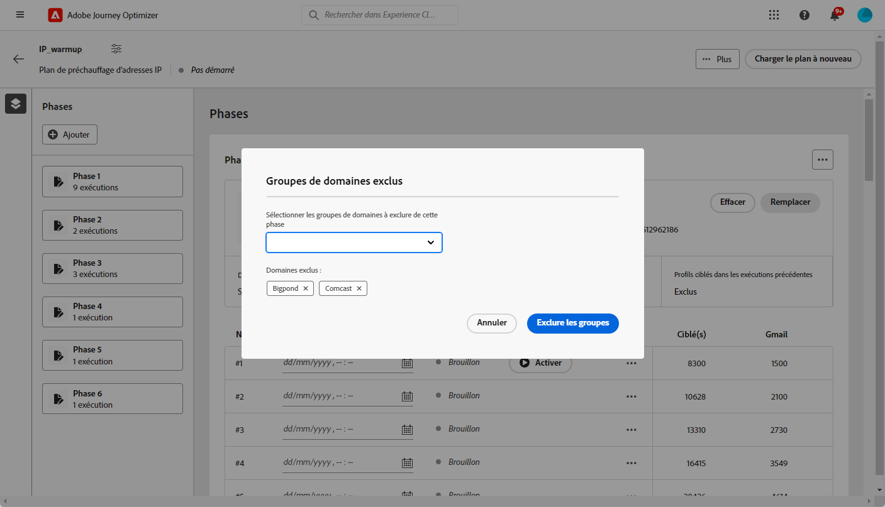
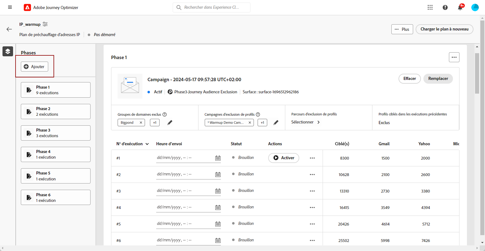
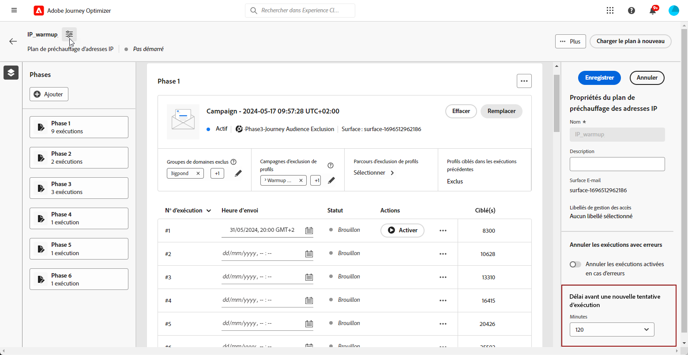
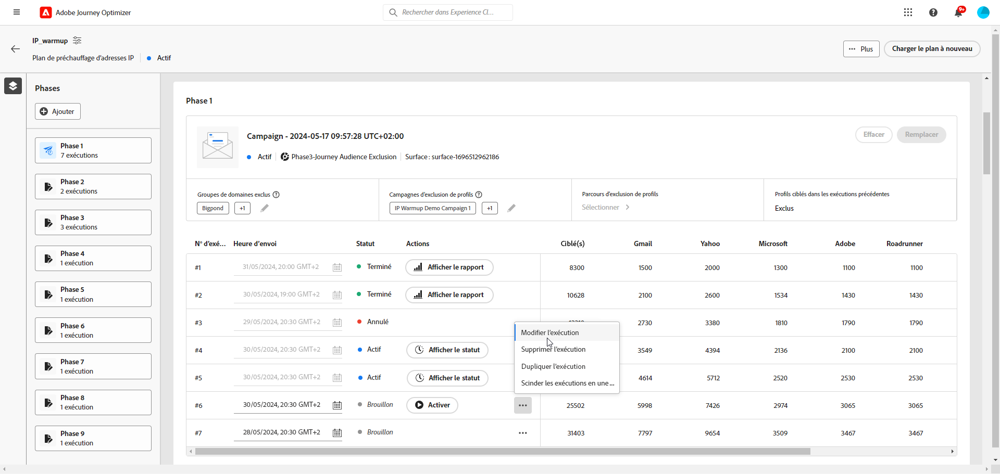
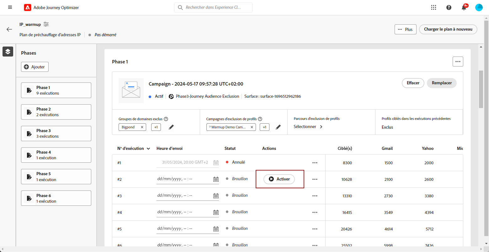
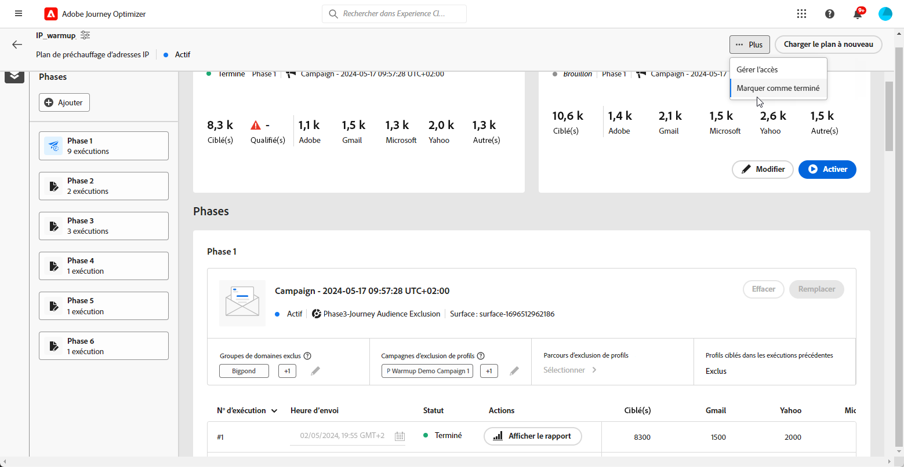

# Exécution de la formule de chauffage par IP {#ip-warmup-running}

>[!BEGINSHADEBOX]

Ce guide vous apportera la documentation suivante :

* [Prise en main du réchauffement des adresses IP](ip-warmup-gs.md)
* [Créer des campagnes de réchauffement des adresses IP](ip-warmup-campaign.md)
* [Créer une formule de chauffage des adresses IP](ip-warmup-plan.md)
* **[Exécution de la formule de chauffage par IP](ip-warmup-execution.md)**

>[!ENDSHADEBOX]

Une fois que vous avez [création d’un plan de chauffage des adresses IP ;](ip-warmup-plan.md) et a chargé le fichier préparé avec votre consultant en délivrabilité, vous pouvez définir les phases et les exécutions dans votre plan.

Chaque phase est composée de plusieurs exécutions auxquelles vous affectez une seule campagne.

## Définition des phases {#define-phases}

>[!CONTEXTUALHELP]
>id="ajo_admin_ip_warmup_campaigns_excluded"
>title="Exclusion des audiences de campagne"
>abstract="Sélectionnez les audiences d’autres campagnes que vous souhaitez exclure de la phase en cours. Cela permet d’éviter que les profils contactés antérieurement à partir d’autres phases ou d’autres plans de chaleur IP ne soient à nouveau ciblés."

<!--
>[!CONTEXTUALHELP]
>id="ajo_admin_ip_warmup_domains_excluded"
>title="Exclude domain groups"
>abstract="Select the domains that you want to exclude from the current phase. Domain exclusion requires a non-executed phase, so you may have to split a running phase to add exclusions."
>additional-url="https://experienceleague.adobe.com/docs/journey-optimizer/using/configuration/implement-ip-warmup-plan/ip-warmup-running.html#split-phase" text="Split a phase"
-->

<!--You need to associate the campaign and audience at phase level and turns on some settings as needed for all runs associated with a single creative/campaign

At phase level, system ensures that previously targeted + new profiles are picked up AND at iteration level, system ensures that each run is having unique profiles and the count matches what is stated in plan-->

<!---->

1. Pour chaque phase, sélectionnez la campagne que vous souhaitez associer à cette phase du plan de réchauffement des adresses IP.

   

   Prenez note des points suivants :

   * Seules les campagnes avec la variable **[!UICONTROL Activation du plan de chauffage par IP]** option activée <!--and live?--> sont disponibles pour sélection. [En savoir plus](#create-ip-warmup-campaign)

   * Vous devez sélectionner une opération qui utilise la même surface que celle sélectionnée pour le plan de chaleur IP en cours.

   * Vous ne pouvez pas sélectionner une campagne qui est déjà utilisée dans une autre campagne de chaleur IP.

1. Dans le **[!UICONTROL Exclusion de profil]** , vous pouvez constater que les profils des exécutions précédentes de cette phase sont toujours exclus. Par exemple, si dans Exécuter #1 un profil est couvert dans les 4800 premières personnes ciblées, le système s’assure automatiquement que le même profil ne reçoit pas l’email dans Exécuter #2.

1. Dans la **[!UICONTROL Audiences de campagne exclues]** , sélectionnez les audiences d’autres <!--executed/live?-->campagnes que vous souhaitez exclure de la phase actuelle.

   

   Par exemple, lors de l’exécution de la phase 1, vous deviez [fractionner](#split-phase) pour une raison quelconque. Par conséquent, vous pouvez exclure la campagne utilisée dans la phase 1 afin que les profils contactés précédemment de la phase 1 ne soient pas inclus dans la phase 2. Vous pouvez également exclure les campagnes des autres plans de chauffage par IP.

1. Dans la **[!UICONTROL Groupes de domaines exclus]** , sélectionnez les domaines à exclure de cette phase.

   >[!NOTE]
   >
   >L’exclusion de domaine requiert une phase non exécutée, vous devrez peut-être donc [scinder une phase d’exécution](#split-phase) pour ajouter des exclusions.

   

   Par exemple, après avoir exécuté le réchauffement des adresses IP pendant quelques jours, vous réalisez que la réputation de votre FAI avec un domaine (par exemple, un Adobe) n’est pas bonne et que vous souhaitez la résoudre sans arrêter votre plan de réchauffement des adresses IP. Dans ce cas, vous pouvez exclure le groupe de domaines Adobe.

   >[!NOTE]
   >
   >Si le domaine n’est pas un groupe de domaines d’usine, vous devez collaborer avec votre conseiller en délivrabilité pour ajouter ce domaine à la variable [Fichier de plan de chauffage par IP](ip-warmup-plan.md#prepare-file) et [le charger à nouveau](#re-upload-plan) pour pouvoir exclure ce domaine.

1. Vous pouvez ajouter une phase, si nécessaire. Il sera ajouté après la dernière phase actuelle.

   

1. Utilisez la variable **[!UICONTROL Phase de suppression]** pour supprimer toute phase indésirable.

   

   >[!CAUTION]
   >
   >Vous ne pouvez pas annuler la **[!UICONTROL Supprimer]** action.
   >
   >Si vous supprimez toutes les phases du plan de chauffage par IP, il est recommandé de charger à nouveau un plan. [En savoir plus](#re-upload-plan)

## Définition des exécutions {#define-runs}

1. Sélectionnez un planning pour chaque exécution.

   

1. Vous pouvez éventuellement définir une fenêtre temporelle pendant laquelle la campagne d’optimisation des adresses IP peut être exécutée en cas de retard dans la tâche de segmentation. Pour ce faire, cliquez sur l’icône Propriétés en haut à gauche, en regard du nom du plan, et utilisez la variable **[!UICONTROL Réessayer l’exécution]** liste déroulante pour sélectionner une durée - jusqu’à 240 minutes (4 heures).

   

   Par exemple, si vous définissez une heure d’envoi un jour donné à 21 h, et que vous sélectionnez 120 minutes comme heure d’exécution de la reprise, une fenêtre d’opportunité de 2 heures s’affiche pour que la tâche de segmentation soit exécutée.

   >[!NOTE]
   >
   >Si aucune fenêtre temporelle n’est spécifiée, l’exécution est tentée à l’heure d’envoi et échoue si la tâche de segmentation n’est pas terminée.

1. Si nécessaire, sélectionnez **[!UICONTROL Modifier l’exécution]** à partir de l’icône Autres actions . Vous pouvez y mettre à jour le nombre d&#39;adresses dans chaque colonne. Vous pouvez également mettre à jour la variable **[!UICONTROL Dernier engagement]** pour cibler uniquement les utilisateurs engagés avec votre marque au cours des 20 derniers jours, par exemple.

   

1. Sélectionnez la variable **[!UICONTROL Pause pour les erreurs]** si vous souhaitez suspendre les exécutions en cas d’erreur.<!--can't see the Paused status for runs? Is it failed?-->

   

   Par exemple, une fois la tâche de segmentation exécutée, si le nombre de profils ciblés est inférieur à ce qui était prévu, l’exécution est annulée.

1. **[!UICONTROL Activer]** la course. Assurez-vous d’avoir planifié suffisamment de temps pour permettre l’exécution de la tâche de segmentation.

   

   >[!CAUTION]
   >
   >Chaque exécution doit être activée au moins 12 heures avant l’heure d’envoi réelle. Sinon, la segmentation risque de ne pas être terminée. <!--How do you know when segmentation is complete? Is there a way to prevent user from scheduling less than 12 hours before the segmentation job?-->

   <!--Sart to execute on every day basis by simply clicking the play button > for each run? do you have to come back every day to activate each run? or can you schedule them one after the other?)-->

   <!--Upon activation, when the segment evaluation happens, more segments will be created by the IP warmup service and will be leveraged in an audience composition and a new audience will be created for each run splitted into the different selected domains.-->

1. L’état de cette exécution passe à **[!UICONTROL En direct]**. Les différents états d’exécution sont répertoriés dans la section [cette section](#monitor-plan). Si l&#39;exécution de la campagne n&#39;a pas démarré, vous pouvez arrêter une exécution en direct.<!--why?-->

   

   >[!NOTE]
   >
   >Une fois l&#39;exécution de l&#39;opération démarrée, la variable **[!UICONTROL Arrêter]** n’est plus disponible.

1. Pour ajouter une exécution, sélectionnez **[!UICONTROL Ajoutez une exécution ci-dessous.]** à partir de l’icône de trois points.

   

## Gérer votre formule {#manage-plan}

À tout moment, si votre plan de réchauffement des adresses IP ne fonctionne pas comme prévu, vous pouvez prendre les mesures ci-dessous.

### Fractionner une phase {#split-phase}

Si vous souhaitez ajouter une nouvelle phase à partir d’une exécution spécifique, sélectionnez la **[!UICONTROL Option Partager sur une nouvelle phase]** à partir de l’icône de trois points.

Une nouvelle phase est créée pour les exécutions restantes de la phase en cours.

Par exemple, si vous sélectionnez cette option pour Exécuter #4, Exécuter #4 sur #8 sera déplacé vers une nouvelle phase.

Suivez les étapes [above](#define-phases) pour définir la nouvelle phase.

* Vous pouvez utiliser la variable **[!UICONTROL Remplacer une campagne]** pour cette nouvelle phase.

* Vous pouvez également exclure la campagne précédente ou un domaine qui ne fonctionne pas correctement. Découvrez comment dans [cette section](#define-phases).

<!--
You don't have to decide the campaign upfront. You can do a split later. It's a work in progress plan: you activate one run at a time with a campaign and you always have the flexibility to modify it while working on it.

But need to explain in which case you want to modify campaigns, provide examples
-->

### Marquer un plan comme terminé {#mark-as-completed}

Si votre plan ne fonctionne pas assez bien ou si vous souhaitez le déposer pour en créer un autre, vous pouvez le marquer comme terminé.

Pour ce faire, cliquez sur le bouton **[!UICONTROL Plus]** en haut à droite du plan de chauffage par IP et sélectionnez **[!UICONTROL Marquer comme terminé]**.

Cette option n’est disponible que si toutes les exécutions du plan sont incluses dans **[!UICONTROL Terminé]** ou **[!UICONTROL Version préliminaire]** statut. Si une exécution est **[!UICONTROL En direct]**, l’option est grisée.

Les différents états d’exécution sont répertoriés dans la section [cette section](#monitor-plan).

### Chargement à nouveau d’une formule de chauffage par IP {#re-upload-plan}

Si votre plan de réchauffement des adresses IP ne fonctionne pas comme prévu (par exemple, si vous constatez que certains FAI marquent vos messages comme du spam), vous pouvez demander à votre expert en délivrabilité de configurer un autre fichier de réchauffement des adresses IP et de le charger à nouveau à l’aide du bouton correspondant.

Toutes les exécutions exécutées précédemment seront marquées comme étant terminées. Le nouveau plan est affiché sous le premier plan.

Suivez les étapes [above](#define-phases) définir les phases du nouveau plan.

>[!NOTE]
>
>Les détails du plan de chaleur de l’adresse IP changeront en fonction du fichier qui vient d’être chargé. Les exécutions en direct et terminées ne sont pas affectées.

## Surveiller le plan {#monitor-plan}

Pour mesurer l’impact de votre plan, vous pouvez vérifier les performances de vos campagnes de chauffage par IP à l’aide de la variable [!DNL Journey Optimizer] rapports de campagne. Pour ce faire, vous pouvez cliquer sur le bouton **[!UICONTROL Affichage des rapports]** bouton . En savoir plus sur l&#39;email de campagne [rapport en direct](../reports/campaign-live-report.md#email-live) et [rapport global](../reports/campaign-global-report.md##email-global).

Le plan de chauffage des adresses IP lui-même sert également de rapport consolidé à un seul endroit. Vous pouvez vérifier des éléments tels que le nombre de **[!UICONTROL En direct]** ou **[!UICONTROL Terminé]** s’exécute pour chaque phase et vérifiez l’état d’avancement de votre plan de chauffage par IP.

Une exécution peut avoir les états suivants :

* **[!UICONTROL Version préliminaire]** : à chaque fois qu’une exécution est créée, au choix, lorsque [création d’un plan](ip-warmup-plan.md) ou [ajout d’une exécution](#define-runs) à partir de l’interface utilisateur, la variable **[!UICONTROL Version préliminaire]** statut.
* **[!UICONTROL En direct]**: chaque fois que vous activez une exécution, la fonction prend la valeur **[!UICONTROL En direct]** statut.
* **[!UICONTROL Terminé]**<!--TBC-->: l’exécution de la campagne pour cette exécution est terminée. <!--i.e. campaign execution has started, no error happened and emails have reached users? to check with Sid-->
* **[!UICONTROL Annulé]**: a **[!UICONTROL En direct]** L’exécution a été annulée à l’aide de la fonction **[!UICONTROL Arrêter]** bouton . Ce bouton n&#39;est disponible que si l&#39;exécution de la campagne n&#39;a pas démarré. [En savoir plus](#define-runs)
* **[!UICONTROL En échec]**: une erreur s&#39;est produite par le système ou la campagne utilisée pour la phase en cours a été arrêtée<!--what should the user do in that case?-->.
