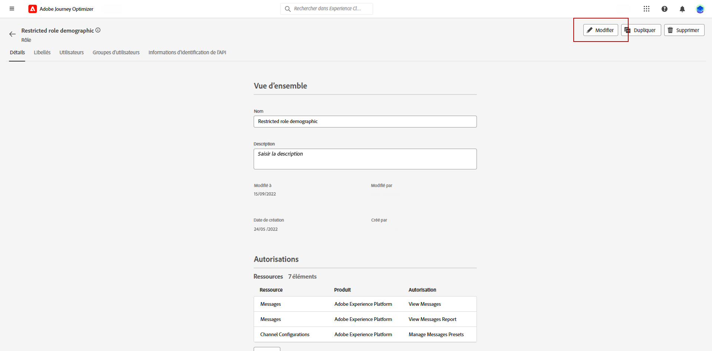
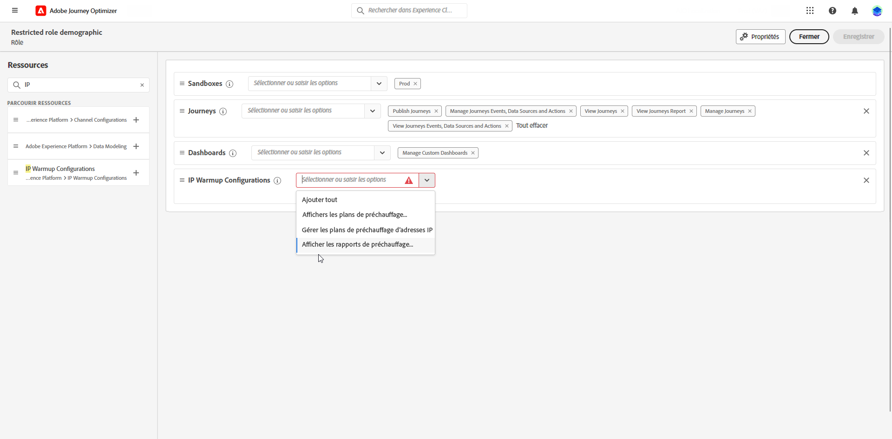
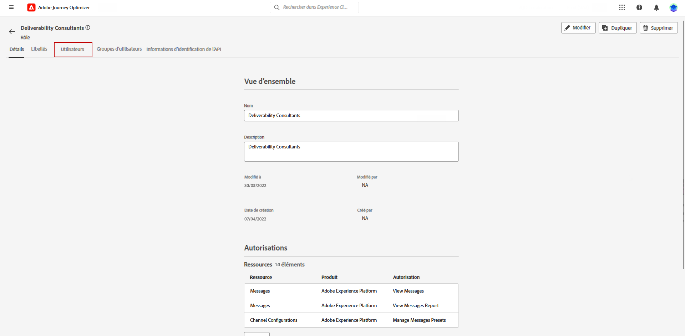
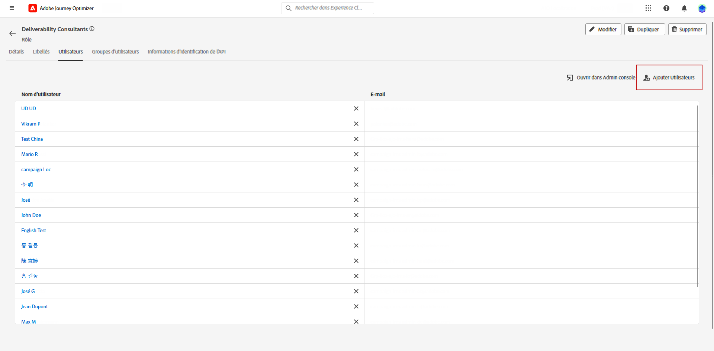
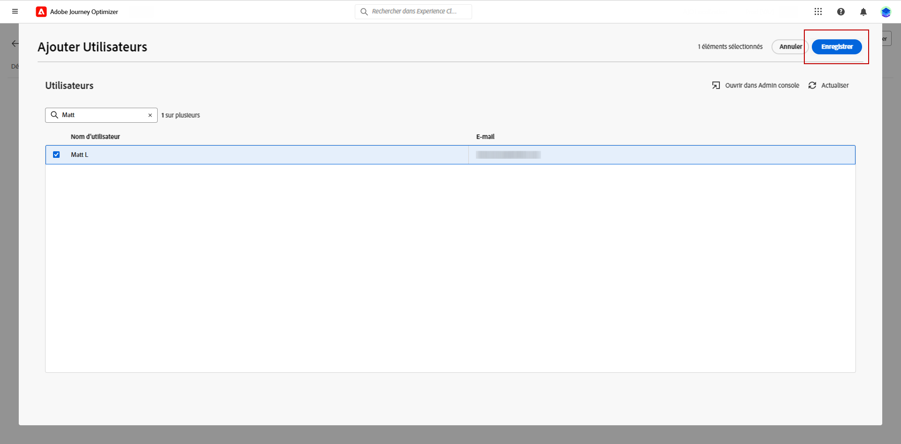
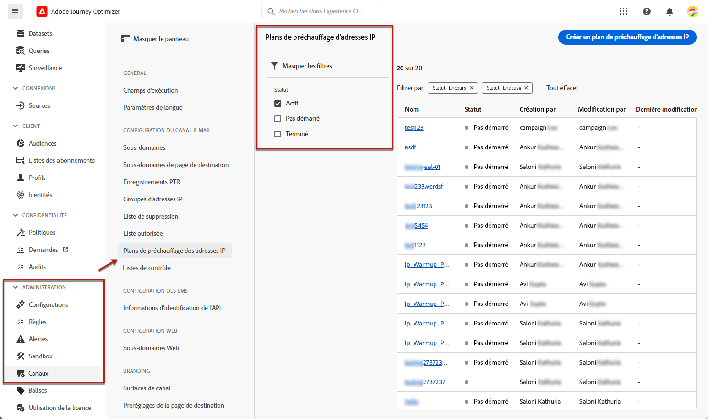
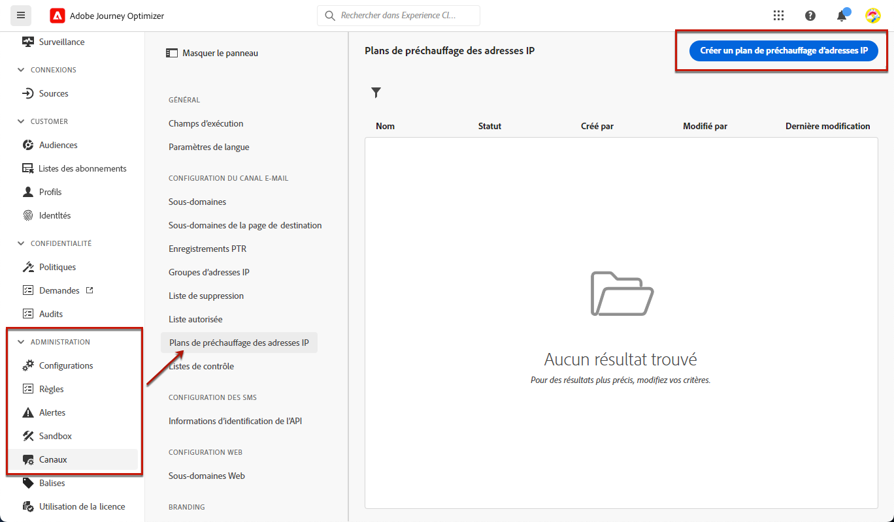
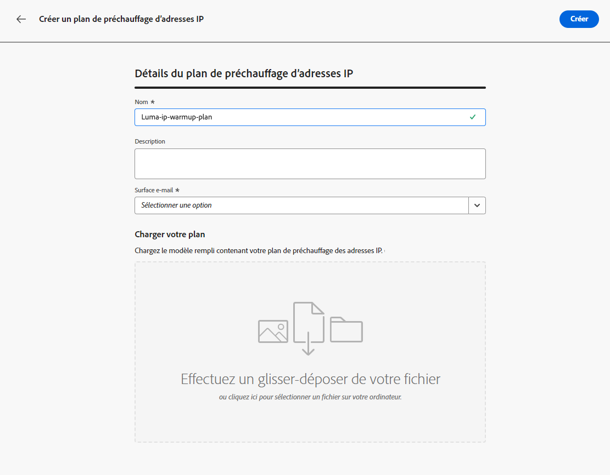
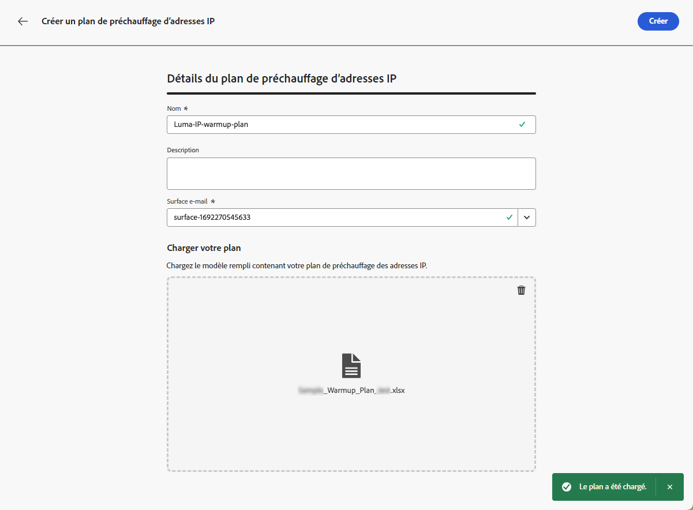
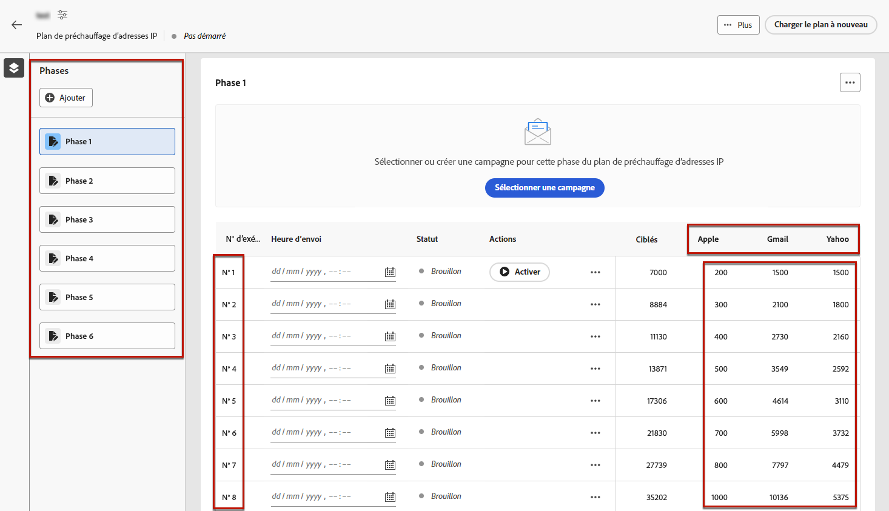

# Créer un plan de préchauffage d’adresses IP {#ip-warmup}

>[!BEGINSHADEBOX]

Ce guide couvre les sujets suivants :

* [Commencer avec les plans de préchauffage d’adresses IP](ip-warmup-gs.md)
* [Créer des campagnes de préchauffage d’adresses IP](ip-warmup-campaign.md)
* **[Créer un plan de préchauffage d’adresses IP](ip-warmup-plan.md)**
* [Exécuter le plan de préchauffage d’adresses IP](ip-warmup-execution.md)

>[!ENDSHADEBOX]

Une fois que vous avez créé une ou plusieurs [campagnes de préchauffage d’adresses IP](ip-warmup-campaign.md) avec une surface dédiée et l’option correspondante activée, vous pouvez commencer à créer votre plan de préchauffage d’adresses IP.

Pour créer, modifier supprimer des plans de préchauffage d’adresses IP et y accéder, vous devez disposer des autorisations associées au rôle **[!UICONTROL Consultant en délivrabilité]** ou aux plans de préchauffage des adresses IP.

+++Découvrez comment attribuer le rôle Consultant en délivrabilité, ou encore les autorisations associées aux plans de préchauffage des adresses IP.

Le contrôle d’accès au niveau de l’objet vous permet de protéger les données et d’accorder un accès spécifique pour afficher et gérer vos plans. Si aucun libellé n’est attribué à votre plan de préchauffage des adresses IP, les utilisateurs et utilisatrices pourront l’afficher et le modifier.

L’octroi de l’autorisation **[!UICONTROL Afficher les plans de préchauffage des adresses IP]** limite l’accès à l’affichage et à la publication uniquement, alors que l’attribution de l’autorisation **[!UICONTROL Gérer des plans de préchauffage des adresses IP]** permet aux utilisateurs et utilisatrices d’afficher et de modifier le plan.

Pour attribuer l’autorisation correspondant à un **[!UICONTROL rôle]** spécifique :

1. Dans le produit [!DNL Permissions], accédez au menu **[!UICONTROL Rôles]** et sélectionnez le rôle à mettre à jour avec les nouvelles autorisations **[!UICONTROL Configuration de préchauffage des adresses IP]**.

1. À partir du tableau de bord **[!UICONTROL Rôle]**, cliquez sur **[!UICONTROL Modifier]**.

   

1. Faites glisser et déposez la ressource **[!UICONTROL Configurations de préchauffage des adresses IP]** pour attribuer une autorisation.

1. Dans la liste déroulante des ressources **[!UICONTROL Configurations du préchauffage d’adresses IP]**, sélectionnez les autorisations dont votre utilisateur ou utilisatrice a besoin : **[!UICONTROL Afficher les plans de préchauffage d’adresses IP]**, **[!UICONTROL Gérer les plans de préchauffage d’adresses IP]**, et/ou **[!UICONTROL Afficher les rapports de préchauffage d’adresses IP]**. Si nécessaire, vous pouvez toutes les sélectionner.

   

1. Cliquez sur **[!UICONTROL Enregistrer]**.

Pour affecter le rôle correspondant à **[!UICONTROL un utilisateur ou une utilisatrice]** :

1. Dans le produit [!DNL Permissions], accédez au menu **[!UICONTROL Rôles]** et sélectionnez le rôle intégré **[!UICONTROL Consultant en délivrabilité]**.

1. Dans le tableau de bord **[!UICONTROL Rôle]**, accédez à l’onglet **[!UICONTROL Utilisateurs et utilisatrices]**.

   

1. Cliquez sur **[!UICONTROL Ajouter un utilisateur ou une utilisatrice]** pour affecter le rôle intégré **[!UICONTROL Consultant en délivrabilité]**.

   

1. Sélectionnez votre **[!UICONTROL utilisateur ou utilisatrice]** et cliquez sur **[!UICONTROL Enregistrer]**.

   

+++

## Préparer un fichier de plan de préchauffage d’adresses IP {#prepare-file}

Le préchauffage d’adresses IP est une activité qui consiste à augmenter progressivement le volume d’e-mails qui sortent de vos adresses IP et domaine vers les principaux fournisseurs d’accès à Internet (FAI), afin d’établir votre réputation d’expéditeur légitime.

Cette activité est réalisée en temps opportun avec l’aide d’une personne spécialisée en délivrabilité qui contribue à la préparation d’un plan bien conçu basé sur les domaines du secteur, les cas d’utilisation, les régions, les FAI et d’autres facteurs.

<!--When working with the [!DNL Journey Optimizer] IP warmup feature, this plan takes the form of an Excel file that must contain a number of predefined columns.-->

Avant de pouvoir créer un plan de préchauffage des adresses IP dans l’interface [!DNL Journey Optimizer], vous devez renseigner un modèle Excel avec toutes les données qui alimenteront votre plan.

* Depuis l’interface utilisateur, vous pouvez télécharger le [modèle de plan de préchauffage des adresses IP](assets/IPWarmupPlan-Template.xlsx) Excel (vierge), afin de le remplir.

* Vous pouvez également télécharger un [exemple de plan de préchauffage des adresses IP](assets/IPWarmupPlan-Sample.xlsx) déjà rempli avec certaines données, à utiliser à titre d’exemple.

<!--
* From the user interface you can download the blank Excel IP warmup plan template to fill in.

* You can also download a sample IP warmup plan already filled in with some data you can use as an example.
-->

>[!CAUTION]
>
>Collaborez avec votre consultant ou consultante en délivrabilité pour vous assurer que votre fichier de plan de préchauffage d’adresses IP est correctement configuré.
>
>Veillez à utiliser le format fourni dans le modèle.

Vous trouverez ci-dessous un exemple de fichier contenant un plan de préchauffage d’adresses IP.

### Onglet Plan de préchauffage d’adresses IP {#ip-warmup-plan-tab}

* Dans cet exemple, un plan a été préparé sur 17 jours (appelé « **exécutions** ») pour atteindre un volume cible de plus d’un million de profils.

* Ce plan est exécuté en six **phases**, chacune d’elles contenant au moins une exécution.

* Vous pouvez avoir autant de colonnes que vous le souhaitez pour les domaines sur lesquels vous souhaitez envoyer des messages. Dans cet exemple, le plan est divisé en six colonnes :

   * Quatre d’entre elles correspondent aux **groupes de domaines prêts à l’emploi** à utiliser dans votre plan (Gmail, Microsoft, Yahoo et Orange).
   * L’une correspond à un groupe de domaines personnalisé (que vous devez ajouter à l’aide de l’onglet [Groupe de domaines personnalisé](#custom-domain-group-tab)).
   * La sixième colonne, **Autres**, contient toutes les adresses restantes d’autres domaines qui ne sont pas explicitement couverts dans le plan. Cette colonne est facultative : si elle est omise, les e-mails seront envoyés uniquement aux domaines spécifiés.

L’idée est d’augmenter progressivement le nombre d’adresses ciblées au cours de chaque exécution, tout en réduisant le nombre d’exécutions pour chaque phase.

Les groupes de domaines principaux prêts à l’emploi que vous pouvez ajouter à votre plan sont répertoriés ci-dessous :

<!--
* Gmail
* Adobe
* WP
* Comcast
* Yahoo
* Bigpond
* Orange
* Softbank
* Docomo
* United Internet
* Microsoft
* KDDI
* Italia Online
* La Poste
* Apple
-->

+++ Gmail
gmail.com;google.com;googlemail.com;googlemail.co.uk
+++

+++WP
wp.pl;o2.pl
+++

+++Comcast
comcast.net
+++

+++Yahoo
aol.fi;games.com;cs.com;yahoo.com.in;y7mail.com;yahoo.co.uk;yahoo.hu;yahoo.co.hu;yahoo.cn;yahoogroups.com.sg;yahoogroups.com.au;aol.es;yahoo.com.au;yahoo.com.vn;yahoo.ca;aol.hk;aol.co.nz;yahoo.com.br;aolpoland.pl;aolnorge.no;yahoo.ne.jp;yahoo.fi;ymail.com;netscape.com;yahoo.com.pe;yahoo.hr;aol.cz;yahoo.ee;aol.be;aolcom.tr;yahoo.si;yahoo.co.id;aol.it;citlink.net;wmconnect.com;yahoo.es;yahoo.dk;yahoogroups.ca;yahoo.com.jp;yahoo.com.hk;aol.kr;yahoo.ie;aol.jp;aol.com.br;yahoo.lt;yahoo.co.kr;aol.nl;yahoo.com.ar;yahoo.bg;ygm.com;yahoo.co.nz;aol.se;aol.com;yahoo.de;goowy.com;rocketmail.com;frontiernet.net;aim.com;yahoo.nl;yahoogroups.co.in;aol.dk;netscape.net;aol.cl;luckymail.com;yahoo.no;yahoo.co.jp;yahoo.com.kr;yahoo.cz;yahoo.co.za;yahoo.sk;verizon.net;yahoogroups.de;yahoo.gr;aol.com.ve;aol.com.ar;yahoo.ro;aol.com.co;wild4music.com;yahoo.at;yahoogroups.com.cn;yahoo.com.co;wow.com;aol.fr;yahoo.in;aol.in;yahoo.com;yahoo.rs;aol.de;yahooxtra.co.nz;yahoo.com.mx;yahoo.com.ph;sky.com;aol.com.mx;aol.com.au;yahoo.se;myaol.jp;aolchina.com;yahoo.pt;yahoo.com.net;yahoo.com.tw;yahoogrupper.dk;yahoo.fr;talk21.com;compuserve.com;aol.pl;yahoo.com.sg;yahoogroups.com.tw;aol.ch;yahoo.it;frontier.com;yahoo.co.in;aolpolcka.pl;yahoo.co.il;verizon.net.in;yahoogruppi.it;yahoo.com.tr;yahoo.cl;yahoogroups.com.hk;yahoogroups.co.uk;yahoo.com.biz;yahoo.com.hr;yahoo.be;aol.co.uk;ybb.ne.jp;aol.tw;yahoogroups.co.kr;yahoo.com.my;rogers.com;gte.net;yahoogroups.com;yahoo.co.th;yahoo.com.cn;love.com;bellatlantic.net;aol.ru;yahoo.com.ve;yahoo.com.ua;yahoo.lv;aolpolska.pl;aol.at;yahoo.pl
+++

+++Bigpond
bigpond.com;bigpond.com.au;bigpond.net;telstra.com;bigpond.net.au
+++

+++Orange
voila.com;francetelecom.com;orange.com;orange.fr;wanadoo.fr;voila.fr
+++

+++Softbank
c.vodafone.ne.jp;jp-h.ne.jp;k.vodafone.ne.jp;jp-d.ne.jp;jp-c.ne.jp;t.vodafone.ne.jp;h.vodafone.ne.jp;r.vodafone.ne.jp;q.vodafone.ne.jp;jp-t.ne.jp;jp-q.ne.jp;s.vodafone.ne.jp;jp-s.ne.jp;jp-r.ne.jp;jp-k.ne.jp;n.vodafone.ne.jp;d.vodafone.ne.jp;softbank.ne.jp;jp-n.ne.jp
+++

+++Docomo
docomo.ne.jp
+++

+++United Internet
gmx.de;1and1.com;gmx.fr;mail.com;1und1.de;gmx.com;gmx.net;gmx.at;web.de;gmx.ch
+++

+++Microsoft
hotmail.com.tr;live.de;live.ru;live.nl;windowslive.com;live.jp;mts.net;xbox.com;hotmail.fr;hotmail.cl;hotmail.jp;live.cl;live.at;live.com.au;hotmail.co.th;live.hk;hotmail.com.au;hotmail.com;live.com.my;hotmail.co.kr;live.ie;outlook.com.br;hotmail.co.il;hotmail.dk;live.co.kr;live.co.uk;live.com.mx;outlook.ie;live.cn;hotmail.co.uk;live.com.sg;hotmail.es;live.fr;live.no;live.dk;hotmail.it;msn.com;live.se;hotmail.co.jp;live.be;live.co.za;live.in;hotmail.se;live.com.pt;hotmail.ch;outlook.com;live.com;hotmail.gr;live.it;live.com.ar;hotmail.ca;hotmail.com.br;hotmail.com.ar;live.ca;hotmail.de
+++

+++KDDI
au.com;ezweb.ne.jp;uqmobile.jp
+++

+++Italia Online
inwind.it;blu.it;virgilio.it;giallo.it;iol.it;libero.it
+++

+++La Poste
laposte.net
+++

+++Apple
mac.com;icloud.com;apple.com;me.com
+++

### Onglet Groupe de domaines personnalisés {#custom-domain-group-tab}

Vous pouvez également ajouter d’autres colonnes à votre plan en incluant des groupes de domaines personnalisés.

Utilisez l’onglet **[!UICONTROL Groupe de domaines personnalisés]** pour définir un nouveau groupe de domaines. Pour chaque domaine, vous pouvez ajouter tous les sous-domaines qu’il couvre.<!--TBC-->

Assurez-vous que chaque domaine soit propre à son groupe de domaines et n’empiète pas sur d’autres groupes de domaines. Les groupes de domaines globaux étant automatiquement définis, les utilisateurs et utilisatrices doivent tenir compte de ces éléments lors de la création de groupes de domaines personnalisés.

Par exemple, si vous ajoutez le domaine personnalisé Luma, vous devriez inclure les sous-domaines suivants : luma.com, luma.co.uk, luma.it, luma.fr, luma.de, etc.

### Exemple {#example}

Supposons que vous souhaitiez avoir deux groupes de domaines personnalisés :

* Un pour les domaines Hotmail uniquement.
* Un pour tous les autres domaines du groupe de domaines Microsoft (excluant ainsi tous les domaines Hotmail).

Notez que tous les autres domaines seront rassemblés dans la colonne **[!UICONTROL Autres]**.

1. Dans l’onglet **[!UICONTROL Groupe de domaines personnalisé]**, créez le groupe de domaines **Hotmail**.

1. Ajoutez tous les domaines Hotmail sur la même ligne.

   Vous pouvez [copier et coller](#copy-paste) tous les domaines Hotmail répertoriés dans la section de l’[onglet Plan de préchauffage d’adresses IP](#ip-warmup-plan-tab).

1. Ajoutez une autre ligne.

1. Créez le groupe de domaines **Microsoft_X**.

1. Ajoutez tous les domaines Microsoft qui ne sont pas Hotmail sur la même ligne. De même, vous pouvez les copier et les coller à partir de la liste ci-dessus. [En savoir plus](#copy-paste)

1. Revenez à l’onglet **[!UICONTROL Plan de préchauffage d’adresses IP]**.

1. Créez trois colonnes : une pour **Hotmail**, une pour **Microsoft_X** et une pour **Autres**.

1. Renseignez les colonnes selon vos besoins.

>[!NOTE]
>
>Une fois le plan de préchauffage d’adresses IP chargé dans [!DNL Journey Optimizer], il n’est pas nécessaire d’exclure les groupes de domaines Microsoft.

<!--Only the domain groups listed in the **[!UICONTROL IP Warmup Plan]** tab will be taken into account.-->

### Copier et coller les domaines par défaut {#copy-paste}

Si vous souhaitez créer un groupe de domaines personnalisé contenant par exemple tous les domaines Hotmail, vous pouvez copier et coller les domaines à partir de la liste par défaut fournie [ci-dessus](#ip-warmup-plan-tab).

Utilisez ensuite l’outil de conversion Excel pour convertir le texte en colonnes :

1. Sélectionnez **[!UICONTROL Données]** > **[!UICONTROL Texte en colonnes…]**, choisissez **[!UICONTROL Délimité]** et sélectionnez **[!UICONTROL Suivant]**.

1. Sélectionnez **[!UICONTROL Point-virgule]**, cliquez sur **[!UICONTROL Suivant]** et **[!UICONTROL Terminer]**.

Chaque domaine s’affiche désormais dans une colonne différente sur la même ligne.

## Accéder à des plans de préchauffage d’adresses IP et les gérer {#manage-ip-warmup-plans}

1. Accédez au menu **[!UICONTROL Administration]** > **[!UICONTROL Canaux]** > **[!UICONTROL Plans de préchauffage d’adresses IP]**. Tous les plans de préchauffage d’adresses IP créés jusqu’à présent s’affichent.

   

1. Vous pouvez filtrer par statut. Les différents statuts sont les suivants :

   * **Pas démarré** : aucune exécution n’a été activée pour le moment. [En savoir plus](ip-warmup-execution.md#define-runs)
   * **Actif** : le plan passe à ce statut dès que la première exécution de la première phase a été activée avec succès. [En savoir plus](ip-warmup-execution.md#define-runs)
   * **Terminé** : le plan a été marqué comme terminé. <!--This option is only available if all the runs in the plan are in **[!UICONTROL Completed]** or **[!UICONTROL Draft]** status (no run can be **[!UICONTROL Live]**).--> [En savoir plus](ip-warmup-execution.md#mark-as-completed)
     <!--* **Paused**: to check (user action)-->

1. Pour supprimer un plan de préchauffage d’adresses IP, sélectionnez l’icône **[!UICONTROL Supprimer]** en regard du nom d’un plan et confirmez la suppression.

   >[!NOTE]
   >
   >Seuls les plans ayant le statut **Non démarré** peuvent être supprimés.

   

   >[!CAUTION]
   >
   >Le plan de préchauffage d’adresses IP sélectionné sera définitivement supprimé.

## Créer un plan de préchauffage d’adresses IP {#create-ip-warmup-plan}

>[!CONTEXTUALHELP]
>id="ajo_admin_ip_warmup_upload"
>title="Définition de votre plan de préchauffage d’adresses IP"
>abstract="Remplissez le modèle Excel avec toutes les données qui alimenteront votre plan, telles que les phases de préchauffage des adresses IP et le nombre cible de profils, puis chargez-les ici."
>additional-url="https://experienceleague.adobe.com/docs/journey-optimizer/using/configuration/implement-ip-warmup-plan/ip-warmup-plan.html?lang=fr#prepare-file" text="Préparer un fichier de plan de préchauffage d’adresses IP"

>[!CONTEXTUALHELP]
>id="ajo_admin_ip_warmup_surface"
>title="Sélectionner une surface marketing"
>abstract="Vous devez sélectionner la même surface que celle sélectionnée dans la campagne que vous souhaitez associer à votre plan de préchauffage d’adresses IP."
>additional-url="https://experienceleague.adobe.com/docs/journey-optimizer/using/configuration/channel-surfaces.html?lang=fr" text="Configurer des surfaces de canal"
>additional-url="https://experienceleague.adobe.com/docs/journey-optimizer/using/configuration/channel-surfaces.html?lang=fr" text="Créer des campagnes de préchauffage d’adresses IP"

Pour créer une campagne de préchauffage d’adresses IP, suivez les étapes ci-dessous.

1. Accédez au menu **[!UICONTROL Administration]** > **[!UICONTROL Canaux]** > **[!UICONTROL Plans de préchauffage d’adresses IP]**, puis cliquez sur **[!UICONTROL Créer un plan de préchauffage d’adresses IP]**.

   

1. Renseignez les détails du plan de préchauffage d’adresses IP : attribuez-lui un nom et une description.

   

1. Sélectionnez la [surface](channel-surfaces.md) que vous voulez vous préchauffer. Seules les surfaces marketing peuvent être sélectionnées. [En savoir plus sur le type d’e-mail](../email/email-settings.md#email-type)

   >[!NOTE]
   >
   >Les campagnes que vous souhaitez associer à votre plan de préchauffage d’adresses IP doivent utiliser la même surface. [Découvrez comment créer une campagne de préchauffage d’adresses IP](ip-warmup-campaign.md).

1. Chargez le fichier Excel contenant votre plan de préchauffage d’adresses IP. [En savoir plus](#prepare-file)

   <!--
    You can also download the Excel template from the [!DNL Journey Optimizer] user interface and upload it after filling it with the IP warmup details.-->

   

   >[!NOTE]
   >
   >En cas d’échec du chargement, assurez-vous d’utiliser le formatage et le format de fichier corrects (.xls ou .xlsx). Utilisez le [modèle](assets/IPWarmupPlan-Template.xlsx) fourni par Adobe.

1. Cliquez sur **[!UICONTROL Créer]**. Toutes les phases, les exécutions, les colonnes et leur contenu définis dans le fichier que vous avez chargé sont automatiquement affichés dans l’interface de [!DNL Journey Optimizer].

   

   >[!NOTE]
   >
   >La colonne **[!UICONTROL Ciblé]** indique la somme de tous les profils ciblés pour chaque exécution, c’est-à-dire tous les profils de chaque groupe de domaines que vous avez défini, y compris la colonne **Autres**, le cas échéant.

Vous pouvez maintenant exécuter votre plan de préchauffage d’adresses IP. [En savoir plus](ip-warmup-execution.md)
