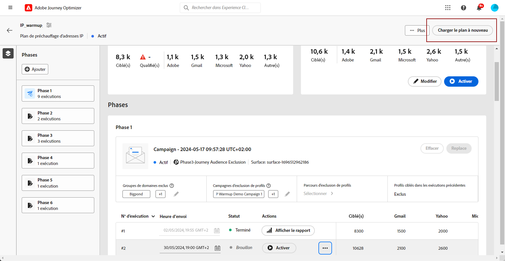

# Créer une formule de chauffage des adresses IP {#ip-warmup}

>[!BEGINSHADEBOX]

Ce guide vous apportera la documentation suivante :

* [Prise en main du réchauffement des adresses IP](ip-warmup-gs.md)
* [Créer des campagnes de réchauffement des adresses IP](ip-warmup-campaign.md)
* **[Créer une formule de chauffage des adresses IP](ip-warmup-plan.md)**
* [Exécution de la formule de chauffage des adresses IP](ip-warmup-running.md)

>[!ENDSHADEBOX]

Une fois que [création d’une ou de plusieurs campagnes](ip-warmup-campaign.md) avec une surface dédiée et l’option de réchauffement des adresses IP activée, vous pouvez commencer à créer votre plan de réchauffement des adresses IP.

## Accès et gestion des plans de chauffage des adresses IP {#manage-ip-warmup-plans}

1. Accédez au **[!UICONTROL Administration]** > **[!UICONTROL Canaux]** > **[!UICONTROL Plans de chauffage des adresses IP]** . Tous les plans de chauffage des adresses IP créés jusqu’à présent s’affichent.

   

1. Vous pouvez filtrer par Etat de la . Les différents statuts sont les suivants :

   * **Pas démarré**: aucune exécution n’a eu lieu
   * **En cours**: dès qu’une exécution a commencé <!--or is done?-->
   * **En pause**
   * **Terminé**: toutes les exécutions du plan sont effectuées

1. Pour supprimer un plan de chauffage par IP, sélectionnez le **[!UICONTROL Supprimer]** en regard d’un élément de liste et confirmez la suppression.

   

   >[!CAUTION]
   >
   >Le plan de chauffage d’une adresse IP sélectionné sera définitivement supprimé.

## Créer une formule de chauffage des adresses IP {#create-ip-warmup-plan}

>[!CONTEXTUALHELP]
>id="ajo_admin_ip_warmup_upload"
>title="Définition de votre formule de chauffage des adresses IP"
>abstract="Téléchargez le modèle CSV et remplissez-le de données pour les phases de réchauffement des adresses IP et le nombre cible de profils."

>[!CONTEXTUALHELP]
>id="ajo_admin_ip_warmup_surface"
>title="Sélectionner une surface marketing"
>abstract="Vous devez sélectionner la même surface que celle sélectionnée dans l&#39;opération que vous souhaitez associer à votre plan de chaleur IP."
>additional-url="https://experienceleague.adobe.com/docs/journey-optimizer/using/configuration/channel-surfaces.html?lang=fr" text="Configurer des surfaces de canal"
>additional-url="https://experienceleague.adobe.com/docs/journey-optimizer/using/configuration/channel-surfaces.html?lang=fr" text="Créer des campagnes de réchauffement des adresses IP"

>[!CAUTION]
>
>Pour créer, modifier et supprimer des plans de réchauffement des adresses IP, vous devez disposer de la variable **[!UICONTROL Consultant en matière de délivrabilité]** autorisation.
<!--Learn more on managing [!DNL Journey Optimizer] users' access rights in [this section](../administration/permissions-overview.md).-->

Lorsqu’une ou plusieurs campagnes en direct avec la variable **[!UICONTROL Activation du plan de chauffage par IP]** Les options activées sont activées. Vous pouvez les associer à un plan de réchauffement des adresses IP.

>[!CAUTION]
>
>Consultez votre conseiller en délivrabilité pour vous assurer que le modèle de plan de réchauffement des adresses IP est correctement configuré. <!--TBC-->

1. Accédez au **[!UICONTROL Administration]** > **[!UICONTROL Canaux]** > **[!UICONTROL Plans de chauffage des adresses IP]** , puis cliquez sur **[!UICONTROL Créer un plan de chauffage par IP]**.

   

1. Renseignez les détails du plan de chaleur IP : donnez-lui un nom et une description.

   

1. Sélectionnez une [surface](channel-surfaces.md). Seules les surfaces marketing peuvent être sélectionnées. [En savoir plus sur le type d&#39;email](../email/email-settings.md#email-type)

   >[!CAUTION]
   >
   >Vous devez sélectionner la même surface que celle sélectionnée dans l&#39;opération que vous souhaitez associer à votre plan de chaleur IP. [Découvrez comment créer une campagne de réchauffement des adresses IP](#create-ip-warmup-campaign)

1. Téléchargez le fichier Excel contenant votre plan de chauffage par IP.<!--which formats are allowed?-->. Vous pouvez utiliser le modèle fourni par l&#39;équipe de délivrabilité.<!--TBC?--> [En savoir plus](#upload-plan)
   <!--
    You can also download the Excel template from the [!DNL Journey Optimizer] user interface and upload it after filling it with the IP warmup details.-->

   

1. Cliquez sur **[!UICONTROL Créer]**. Le nombre de phases définies dans le fichier que vous avez téléchargé s’affiche automatiquement pour toutes les exécutions pour chaque phase. [En savoir plus](#upload-plan)

   

### Chargement à nouveau d’une formule de chauffage par IP {#re-upload-plan}

Vous pouvez recharger un autre plan de chauffage par IP à l’aide du bouton correspondant.

>[!NOTE]
>
>Les détails du plan de chaleur de l’adresse IP changeront en fonction du fichier qui vient d’être chargé. Les exécutions terminées et les exécutions activées ne sont pas affectées.

### Téléchargez le fichier contenant le plan. {#upload-plan}

Vous trouverez ci-dessous un exemple de fichier contenant un plan de chauffage par IP.

Chaque phase correspond à une période composée de plusieurs exécutions, à laquelle vous affecterez une seule opération.

Pour chaque exécution, vous disposez d’un certain nombre de destinataires et vous définissez une date d’exécution.

Vous pouvez avoir autant de colonnes que vous le souhaitez pour les domaines sur lesquels vous souhaitez envoyer des messages. Dans cet exemple, vous disposez de trois colonnes : Gmail, Adobe et Autres, ce qui signifie que

L’idée est d’avoir plus d’exécutions dans les premières phases et d’augmenter progressivement le nombre d’adresses ciblées tout en réduisant le nombre d’exécutions.
