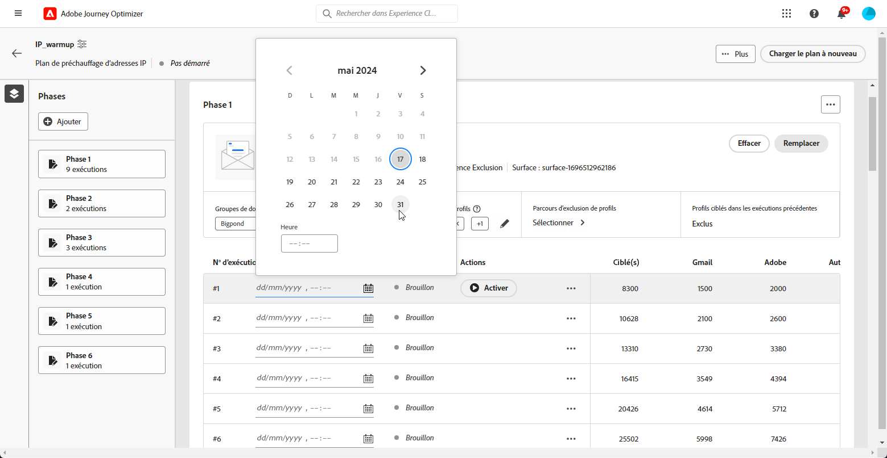
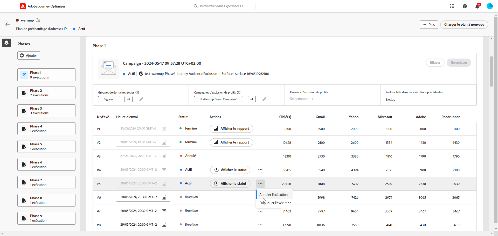

# Exécution de la formule de chauffage des adresses IP {#ip-warmup-running}

>[!BEGINSHADEBOX]

Ce guide vous apportera la documentation suivante :

* [Prise en main du réchauffement des adresses IP](ip-warmup-gs.md)
* [Créer des campagnes de réchauffement des adresses IP](ip-warmup-campaign.md)
* [Créer une formule de chauffage des adresses IP](ip-warmup-plan.md)
* **[Exécution de la formule de chauffage des adresses IP](ip-warmup-running.md)**

>[!ENDSHADEBOX]

## Définition des phases {#define-phases}

>[!CONTEXTUALHELP]
>id="ajo_admin_ip_warmup_campaigns_excluded"
>title="Sélectionner les audiences de campagnes à exclure"
>abstract="Sélectionnez les audiences d’autres campagnes que vous souhaitez exclure de la phase en cours."

>[!CONTEXTUALHELP]
>id="ajo_admin_ip_warmup_domains_excluded"
>title="Sélectionner les groupes de domaines à exclure"
>abstract="Sélectionnez les domaines que vous souhaitez exclure de la phase actuelle."

Vous devez associer la campagne et l’audience au niveau de la phase et activer certains paramètres si nécessaire pour toutes les exécutions associées à une seule création/campagne.

Au niveau de la phase, le système s’assure que les profils précédemment ciblés + nouveaux sont sélectionnés ET au niveau de l’itération, le système s’assure que chaque exécution comporte des profils uniques et que le nombre correspond à ce qui est indiqué dans le plan.

1. Pour chaque phase, sélectionnez la campagne que vous souhaitez associer à cette phase du plan de réchauffement des adresses IP.

   

   Prenez note des points suivants :

   * Seules les campagnes avec la variable **[!UICONTROL Activation du plan de chauffage par IP]** option activée <!--and live?--> sont disponibles pour sélection. [En savoir plus](#create-ip-warmup-campaign)

   * Vous devez sélectionner une opération qui utilise la même surface que celle sélectionnée pour le plan de chaleur IP en cours.

   * Vous ne pouvez pas sélectionner une campagne qui est déjà utilisée dans une autre campagne de chaleur IP.

1. Pour chaque phase, les conditions suivantes s’appliquent :

   * **[!UICONTROL Exclusion de profil]** - Les profils des exécutions précédentes de cette phase sont toujours exclus. Par exemple, si #1 Leo est couvert par les 6300 premières personnes ciblées, le système s&#39;assure automatiquement que Leo n&#39;obtient pas le courrier en cours d&#39;exécution #2.

   * **[!UICONTROL Audiences de campagne exclues]** - Sélectionner les audiences d’autres <!--executed/live?-->campagnes que vous souhaitez exclure de la phase actuelle.

     Par exemple, vous exécutez peut-être une phase et avez dû la fractionner pour n’importe quelle raison. Dans ce cas, lors de la phase 2, vous souhaitez inclure dans cette section la campagne utilisée lors de la phase 1 afin qu&#39;au cours de la phase 2, les personnes contactées antérieurement lors de la phase 1 ne soient pas incluses. Cela peut être fait non seulement avec les campagnes utilisées dans le même plan de chauffage par IP, mais aussi à partir d’un autre plan de chauffage par IP.

   * **[!UICONTROL Groupes de domaines exclus]** - Sélectionnez les domaines que vous souhaitez exclure de cette phase, par exemple Gmail. <!--??-->

     Après quelques jours d’optimisation des adresses IP, vous réalisez que la réputation des FAI avec un domaine indique que le hotmail n’est pas bon et que vous souhaitez le résoudre avec les FAI mais ne souhaitez pas arrêter le plan de réchauffement IP. Dans ce cas, vous pouvez placer le hotmail du groupe de domaines dans la catégorie exclue.

     >[!NOTE]
     >
     >L’exclusion de domaine nécessite une phase non exécutée, de sorte que vous devrez peut-être diviser une phase d’exécution pour ajouter des exclusions. De même, si le groupe de domaines n’est pas un groupe de domaines prêt à l’emploi, vous devrez peut-être créer un groupe de domaines dans Excel, le charger, puis en exclure le même.

   

1. Si nécessaire, vous pouvez ajouter une phase qui sera ajoutée après la dernière phase en cours. Utilisez la variable **[!UICONTROL Phase de suppression]** pour supprimer toute phase indésirable.

   

   >[!CAUTION]
   >
   >Vous ne pouvez pas annuler la **[!UICONTROL Supprimer]** action.
   >
   >Si vous supprimez toutes les phases du plan de chauffage par IP, nous vous recommandons de télécharger à nouveau un plan.

## Définition des exécutions {#define-runs}

1. Sélectionnez un planning pour chaque exécution. <!--which is actually a window of opportunity. meaning? how many hours? shall we specify that to clarify?-->

   

1. Sélectionnez une heure de fin, c’est-à-dire la fenêtre dans laquelle nous pouvons exécuter une campagne de chaleur en cas de retards dans la tâche de l’audience. S’il n’est pas spécifié, nous tenterons de démarrer et échouerons. Si l’heure de fin est fournie, nous exécuterons l’exécution entre cette fenêtre.

1. Activez chaque exécution. Veillez à planifier une heure suffisamment tôt pour permettre l’exécution de la tâche de segmentation. <!--explain how you can evaluate a proper time-->

   >[!CAUTION]
   >
   >Chaque exécution doit être activée au moins 12 heures avant l’heure d’envoi réelle. Sinon, la segmentation risque de ne pas être terminée. <!--How do you know when segmentation is complete? Is there a way to prevent user from scheduling less than 12 hours before the segmentation job?-->

<!--Sart to execute on every day basis by simply clicking the play button > for each run? do you have to come back every day to activate each run? or can you schedule them one after the other?)-->

1. Si l&#39;exécution de la campagne n&#39;a pas démarré, vous pouvez arrêter une exécution.<!--why?-->

   Une fois l&#39;exécution de l&#39;opération démarrée, la variable **[!UICONTROL Arrêter]** n’est plus disponible. <!--TBC in UI-->

   

1. Pour ajouter une exécution, sélectionnez **[!UICONTROL Ajoutez une exécution ci-dessous.]** à partir de l’icône de trois points.

   

1. À tout moment, si vous souhaitez utiliser une autre campagne à partir d’une exécution spécifique, sélectionnez la variable **[!UICONTROL Option Partager sur une nouvelle phase]** à partir de l’icône de trois points. Une nouvelle phase est créée pour les exécutions restantes de la phase en cours. Suivez les étapes [above](#define-phases) pour définir la nouvelle phase.

   Par exemple, si vous sélectionnez cette option pour l’exécution #4, les opérations #4 vers #8 seront déplacées vers une nouvelle phase.

<!--
You don't have to decide the campaign upfront. You can do a split later. It's a work in progress plan: you activate one run at a time with a campaign and you always have the flexibility to modify it while working on it.

But need to explain in which case you want to modify campaigns, provide examples
-->

## Surveiller le plan

Une exécution peut avoir les états suivants :<!--TBC with Medha-->:

* **[!UICONTROL Terminé]**:
* **[!UICONTROL Échec]**:
* **[!UICONTROL Annulé]**: vous avez arrêté l&#39;exécution avant le démarrage de l&#39;exécution de la campagne.

Avantages :

* Les rapports continueront à s’afficher au niveau de la campagne avec des fonctionnalités similaires à celles d’aujourd’hui. Mais le plan de réchauffement des adresses IP sert également de rapport consolidé à un seul endroit du nombre d’exécutions effectuées, etc.

* Emplacement unique pour gérer et afficher l’avancement du réchauffement des adresses IP.

* Rapport consolidé au niveau de la création/de la campagne, car tous s’exécutent pour une phase