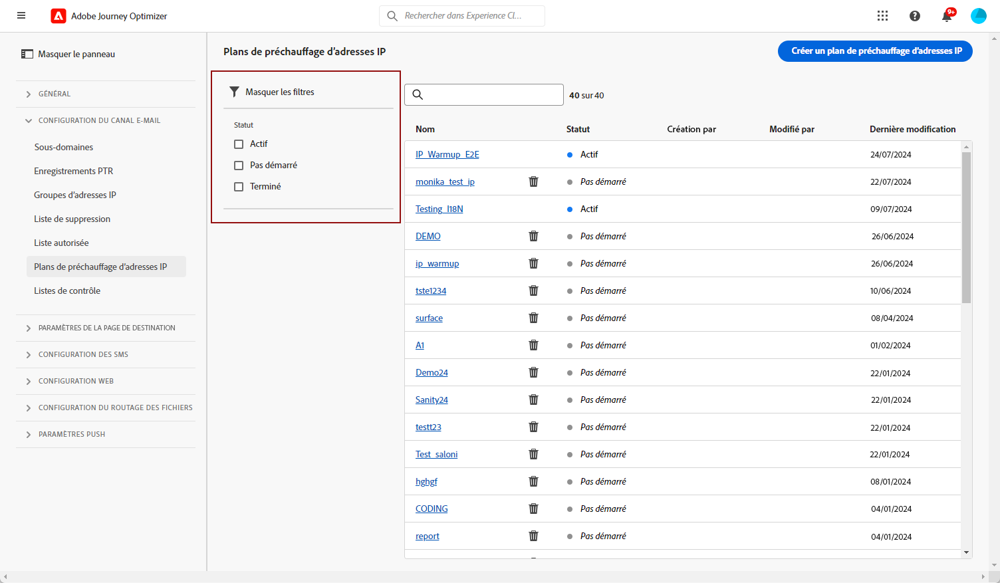
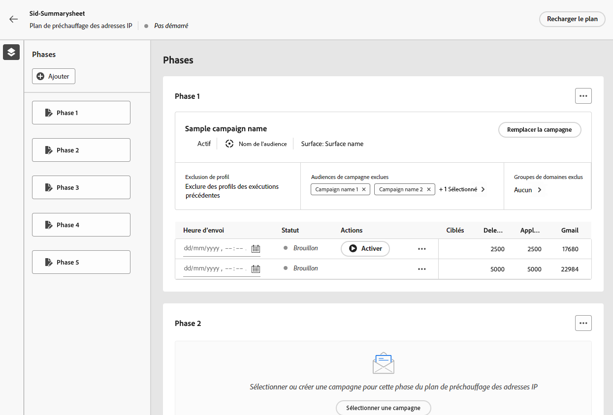

# Mettre en oeuvre un plan de chauffage par IP {#ip-warmup}

<!--
>[!CONTEXTUALHELP]
>id="ajo_admin_ip_warmup_plan"
>title="Define your IP warmup plan"
>abstract="You can perform IP warmup workflows directly from the Journey Optimizer interface in a standardized and efficient way that follows the best practices for optimal deliverability."
-->

>[!AVAILABILITY]
>
>La fonctionnalité de réchauffement des adresses IP est actuellement disponible en version bêta pour sélectionner uniquement les utilisateurs. Pour rejoindre le programme Beta, contactez l’assistance clientèle d’Adobe.

Avec [!DNL Journey Optimizer], vous pouvez facilement exécuter des workflows de chauffage des adresses IP directement à partir de l’interface utilisateur d’une manière normalisée et efficace, en respectant les bonnes pratiques pour une délivrabilité optimale.

>[!CAUTION]
>
>Cette fonctionnalité s&#39;applique uniquement au canal e-mail.

Lorsque vous envoyez des emails à l&#39;aide d&#39;une nouvelle plateforme, rien n&#39;est plus suspect pour un FAI (fournisseur d&#39;accès internet) que les adresses IP qui ne sont pas reconnues. Si des emails sont subitement envoyés en masse, le FAI les range souvent dans le courrier indésirable.

Pour éviter que les emails soient marqués comme spam, vous pouvez augmenter progressivement le volume envoyé à l’aide de la fonctionnalité de plan de réchauffement des adresses IP. Une nouvelle option du menu Administration vous permet de le faire plus facilement au lieu de créer des parcours complexes. Cela devrait garantir un développement fluide de la phase de démarrage et vous permettre de réduire le taux global d&#39;adresses invalides.

>[!NOTE]
>
>En savoir plus sur l’amélioration de la réputation de vos emails grâce au réchauffement des adresses IP dans la section [Guide des bonnes pratiques de délivrabilité](https://experienceleague.adobe.com/docs/deliverability-learn/deliverability-best-practice-guide/additional-resources/generic-resources/increase-reputation-with-ip-warming.html?lang=fr).

<!--
Here are the main steps:

1. You get a deliverability plan from the deliverability consulting team.

1. Create a campaign - marketer [Learn more](#create-ip-warmup-campaign)

1. Your associated practitioner (customer's practitioner/ACS consultant/partner consultant) creates a IP warmup object in project and uploads a plan.

    The CSV manifests itself like below with numbers showing up with/without domain bifurcation. Below screen shows one phase (creative) with associated runs (The plan obviously has more such phases)

1. Practitioner associates the campaign and audience at phase level and turns on some settings as needed for all runs associated with a single creative/campaign

1. Then start to execute on every day basis by simply clicking the play button

1. Reports will continue to show up at campaign level with similar capabilities as today. NO enhancements in BETA. But the IP warmup plan also serves as a consolidated report at one single place of how many executions were done and so on

Benefits are as follows:

* No more creation of daily journeys and associated testing

* Standardization on Campaign which will be easy for practitioners too

* No more pain of creating queries, audiences and testing those as system will create the audiences. At phase level, system ensures that previously targeted + new profiles are picked up AND at iteration level, system ensures that each run is having unique profiles and the count matches what is stated in plan

* Ease of excluding domains and changing the plan with help of simple toggles to exclude OR by editing numbers inline or create new phases or reupload plan if drastic change. No more pain of editing audience definitions, journey conditions

* Single place to manage and view how IP warm is progressing.

* Consolidated report at creative/campaign level as all runs for a phase 

* There is an expectation that with this, it will ease around 30% of effort and will be much better experience for consultant/partner/practitioner - right from planning to execution to reporting
-->

Les étapes clés de la mise en oeuvre d’un plan de chauffage par IP sont les suivantes :

* [Créer des campagnes de réchauffement des adresses IP](#create-ip-warmup-campaign)
* [Définition d’un plan de chauffage des adresses IP](#define-ip-warmup-plan)

## Créer des campagnes de réchauffement des adresses IP {#create-ip-warmup-campaign}

>[!CONTEXTUALHELP]
>id="ajo_campaign_ip_warmup"
>title="Activez l’option Formule de chauffage par IP ."
>abstract="Sélectionnez l’option d’activation du plan de chaleur IP. Une fois la campagne activée, elle peut être associée à un plan de chauffage par IP."

Vous devez créer une ou plusieurs campagnes avec une option spécifique activée afin qu’elles puissent être utilisées dans un plan de réchauffement des adresses IP. Suivez les étapes ci-dessous.

1. Créez un [surface](channel-surfaces.md) pour le domaine et les adresses IP que vous avez identifiées pour votre plan de chaleur.

1. Créez un [campaign](../campaigns/create-campaign.md) et sélectionnez la variable [Email](../email/create-email.md#create-email-journey-campaign) action.

1. Sélectionnez la surface que vous avez créée pour le réchauffement des adresses IP.

   <!--You must use the same surface as the one that will be used for the asociated IP warmup plan. [Learn how to create an IP warmup plan](#create-ip-warmup-plan)-->

1. Cliquez sur **[!UICONTROL Créer]**.

1. Dans la **[!UICONTROL Planification]** , sélectionnez **[!UICONTROL Activation du plan de chauffage par IP]**.

   

   La campagne [planning](../campaigns/create-campaign.md#schedule) sera piloté par le plan de chaleur IP auquel il sera associé, ce qui signifie que le planning n’est plus défini dans la campagne elle-même.

1. [Activer](../campaigns/review-activate-campaign.md) la campagne. Une fois en ligne, elle est prête à être utilisée dans un plan de chauffage par IP.

>[!NOTE]
>
>Pour une campagne en direct avec le plan de chauffage par IP activé, la variable **[!UICONTROL Supprimer]** est disponible jusqu’à ce qu’il soit associé à un plan de chauffage par IP.

Pour plus d’informations sur la configuration d’une campagne, consultez cette [page](../campaigns/get-started-with-campaigns.md).

## Définition d’un plan de chauffage des adresses IP {#define-ip-warmup-plan}

### Gestion des plans de chauffage des adresses IP {#manage-ip-warmup-plans}

1. Accédez au **[!UICONTROL Administration]** > **[!UICONTROL Canaux]** > **[!UICONTROL Plans de chauffage des adresses IP]** . Tous les plans de chauffage des adresses IP créés jusqu’à présent s’affichent.

   

1. Vous pouvez filtrer par Etat de la . Les différents statuts sont les suivants :

   * **Pas démarré**: aucune exécution n’a eu lieu
   * **En cours**: dès qu’une exécution a commencé <!--or is done?-->
   * **En pause**
   * **Terminé**: toutes les exécutions du plan sont effectuées

1. Pour supprimer un plan de chauffage par IP, sélectionnez le **[!UICONTROL Supprimer]** en regard d’un élément de liste et confirmez la suppression.

   

   >[!CAUTION]
   >
   >Le plan de chauffage d’une adresse IP sélectionné sera définitivement supprimé.

### Créer une formule de chauffage des adresses IP {#create-ip-warmup-plan}

>[!CONTEXTUALHELP]
>id="ajo_admin_ip_warmup_upload"
>title="Définition de votre formule de chauffage des adresses IP"
>abstract="Téléchargez le modèle CSV et remplissez-le de données pour les phases de réchauffement des adresses IP et le nombre cible de profils."

>[!CONTEXTUALHELP]
>id="ajo_admin_ip_warmup_surface"
>title="Sélectionner une surface marketing"
>abstract="Vous devez sélectionner la même surface que celle sélectionnée dans l&#39;opération que vous souhaitez associer à votre plan de chaleur IP."
>additional-url="https://experienceleague.adobe.com/docs/journey-optimizer/using/configuration/channel-surfaces.html?lang=fr" text="Configurer des surfaces de canal"
>additional-url="https://experienceleague.adobe.com/docs/journey-optimizer/using/configuration/channel-surfaces.html?lang=fr" text="Créer des campagnes de réchauffement des adresses IP"

>[!CAUTION]
>
>Pour créer, modifier et supprimer des plans de réchauffement des adresses IP, vous devez disposer de la variable **[!UICONTROL Consultant en matière de délivrabilité]** autorisation.
<!--Learn more on managing [!DNL Journey Optimizer] users' access rights in [this section](../administration/permissions-overview.md).-->

Lorsqu’une ou plusieurs campagnes en direct avec la variable **[!UICONTROL Activation du plan de chauffage par IP]** Les options activées sont activées. Vous pouvez les associer à un plan de réchauffement des adresses IP.

>[!CAUTION]
>
>Consultez votre conseiller en délivrabilité pour vous assurer que le modèle de plan de réchauffement des adresses IP est correctement configuré. <!--TBC-->

1. Accédez au **[!UICONTROL Administration]** > **[!UICONTROL Canaux]** > **[!UICONTROL Plans de chauffage des adresses IP]** , puis cliquez sur **[!UICONTROL Créer un plan de chauffage par IP]**.

   

1. Renseignez les détails du plan de chaleur IP : donnez-lui un nom et une description.

   

1. Sélectionnez une [surface](channel-surfaces.md). Seules les surfaces marketing peuvent être sélectionnées. [En savoir plus sur le type d&#39;email](../email/email-settings.md#email-type)

   >[!CAUTION]
   >
   >Vous devez sélectionner la même surface que celle sélectionnée dans l&#39;opération que vous souhaitez associer à votre plan de chaleur IP. [Découvrez comment créer une campagne de réchauffement des adresses IP](#create-ip-warmup-campaign)

1. Téléchargez le fichier Excel contenant votre plan de chauffage par IP.<!--which formats are allowed?-->. Vous pouvez utiliser le modèle fourni par l&#39;équipe de délivrabilité.<!--TBC?--> [En savoir plus](#upload-plan)
   <!--
    You can also download the Excel template from the [!DNL Journey Optimizer] user interface and upload it after filling it with the IP warmup details.-->

   

1. Cliquez sur **[!UICONTROL Créer]**. Le nombre de phases définies dans le fichier que vous avez téléchargé s’affiche automatiquement pour toutes les exécutions pour chaque phase. [En savoir plus](#upload-plan)

   

### Chargement à nouveau d’une formule de chauffage par IP {#re-upload-plan}

Vous pouvez recharger un autre plan de chauffage par IP à l’aide du bouton correspondant.

>[!NOTE]
>
>Les détails du plan de chaleur de l’adresse IP changeront en fonction du fichier qui vient d’être chargé. Les exécutions terminées et les exécutions activées ne sont pas affectées.

### Téléchargez le fichier contenant le plan. {#upload-plan}

Vous trouverez ci-dessous un exemple de fichier contenant un plan de chauffage par IP.

Chaque phase correspond à une période composée de plusieurs exécutions, à laquelle vous affecterez une seule opération.

Pour chaque exécution, vous disposez d’un certain nombre de destinataires et vous définissez une date d’exécution.

Vous pouvez avoir autant de colonnes que vous le souhaitez pour les domaines sur lesquels vous souhaitez envoyer des messages. Dans cet exemple, vous disposez de trois colonnes : Gmail, Adobe et Autres, ce qui signifie que

L’idée est d’avoir plus d’exécutions dans les premières phases et d’augmenter progressivement le nombre d’adresses ciblées tout en réduisant le nombre d’exécutions.

### Définition des phases {#define-phases}

>[!CONTEXTUALHELP]
>id="ajo_admin_ip_warmup_campaigns_excluded"
>title="Sélectionner les audiences de campagnes à exclure"
>abstract="Sélectionnez les audiences d’autres campagnes que vous souhaitez exclure de la phase en cours."

>[!CONTEXTUALHELP]
>id="ajo_admin_ip_warmup_domains_excluded"
>title="Sélectionner les groupes de domaines à exclure"
>abstract="Sélectionnez les domaines que vous souhaitez exclure de la phase actuelle."

1. Pour chaque phase, sélectionnez la campagne que vous souhaitez associer à cette phase du plan de réchauffement des adresses IP.

   

   Prenez note des points suivants :

   * Seules les campagnes avec la variable **[!UICONTROL Activation du plan de chauffage par IP]** option activée <!--and live?--> sont disponibles pour sélection. [En savoir plus](#create-ip-warmup-campaign)

   * Vous devez sélectionner une opération qui utilise la même surface que celle sélectionnée pour le plan de chaleur IP en cours.

   * Vous ne pouvez pas sélectionner une campagne qui est déjà utilisée dans une autre campagne de chaleur IP.

1. Pour chaque phase, les conditions suivantes s’appliquent :

   * **[!UICONTROL Exclusion de profil]** - Les profils des exécutions précédentes de cette phase sont toujours exclus. Par exemple, si #1 Leo est couvert par les 6300 premières personnes ciblées, le système s&#39;assure automatiquement que Leo n&#39;obtient pas le courrier en cours d&#39;exécution #2.

   * **[!UICONTROL Audiences de campagne exclues]** - Sélectionner les audiences d’autres <!--executed/live?-->campagnes que vous souhaitez exclure de la phase actuelle.

     Par exemple, vous exécutez peut-être une phase et avez dû la fractionner pour n’importe quelle raison. Dans ce cas, lors de la phase 2, vous souhaitez inclure dans cette section la campagne utilisée lors de la phase 1 afin qu&#39;au cours de la phase 2, les personnes contactées antérieurement lors de la phase 1 ne soient pas incluses. Cela peut être fait non seulement avec les campagnes utilisées dans le même plan de chauffage par IP, mais aussi à partir d’un autre plan de chauffage par IP.

   * **[!UICONTROL Groupes de domaines exclus]** - Sélectionnez les domaines que vous souhaitez exclure de cette phase, par exemple Gmail. <!--??-->

     Après quelques jours d’optimisation des adresses IP, vous réalisez que la réputation des FAI avec un domaine indique que le hotmail n’est pas bon et que vous souhaitez le résoudre avec les FAI mais ne souhaitez pas arrêter le plan de réchauffement IP. Dans ce cas, vous pouvez placer le hotmail du groupe de domaines dans la catégorie exclue.

     >[!NOTE]
     >
     >L’exclusion de domaine nécessite une phase non exécutée, de sorte que vous devrez peut-être diviser une phase d’exécution pour ajouter des exclusions. De même, si le groupe de domaines n’est pas un groupe de domaines prêt à l’emploi, vous devrez peut-être créer un groupe de domaines dans Excel, le charger, puis en exclure le même.

   

1. Si nécessaire, vous pouvez ajouter une phase qui sera ajoutée après la dernière phase en cours. Utilisez la variable **[!UICONTROL Phase de suppression]** pour supprimer toute phase indésirable.

   

   >[!CAUTION]
   >
   >Vous ne pouvez pas annuler la **[!UICONTROL Supprimer]** action.
   >
   >Si vous supprimez toutes les phases du plan de chauffage par IP, nous vous recommandons de télécharger à nouveau un plan.

### Définition des exécutions {#define-runs}

1. Sélectionnez un planning pour chaque exécution. <!--which is actually a window of opportunity. meaning? how many hours? shall we specify that to clarify?-->

   

1. Sélectionnez une heure de fin, c’est-à-dire la fenêtre dans laquelle nous pouvons exécuter une campagne de chaleur en cas de retards dans la tâche de l’audience. S’il n’est pas spécifié, nous tenterons de démarrer et échouerons. Si l’heure de fin est fournie, nous exécuterons l’exécution entre cette fenêtre.

1. Activez chaque exécution. Veillez à planifier une heure suffisamment tôt pour permettre l’exécution de la tâche de segmentation. <!--explain how you can evaluate a proper time-->

   >[!CAUTION]
   >
   >Chaque exécution doit être activée au moins 12 heures avant l’heure d’envoi réelle. Sinon, la segmentation risque de ne pas être terminée. <!--How do you know when segmentation is complete? Is there a way to prevent user from scheduling less than 12 hours before the segmentation job?-->

1. Si l&#39;exécution de la campagne n&#39;a pas démarré, vous pouvez arrêter une exécution.

   Une fois l&#39;exécution de l&#39;opération démarrée, la variable **[!UICONTROL Arrêter]** n’est plus disponible. <!--TBC in UI-->

   

1. Pour ajouter une exécution, sélectionnez **[!UICONTROL Ajoutez une exécution ci-dessous.]** à partir de l’icône de trois points.

   

1. À tout moment, si vous souhaitez utiliser une autre campagne à partir d’une exécution spécifique, sélectionnez la variable **[!UICONTROL Option Partager sur une nouvelle phase]** à partir de l’icône de trois points. Une nouvelle phase est créée pour les exécutions restantes de la phase en cours. Suivez les étapes [above](#define-phases) pour définir la nouvelle phase.

   Par exemple, si vous sélectionnez cette option pour l’exécution #4, les opérations #4 vers #8 seront déplacées vers une nouvelle phase.

<!--
You don't have to decide the campaign upfront. You can do a split later. It's a work in progress plan: you activate one run at a time with a campaign and you always have the flexibility to modify it while working on it.

But need to explain in which case you want to modify campaigns, provide examples
-->

Une exécution peut avoir les états suivants :<!--TBC with Medha-->:

* **[!UICONTROL Terminé]**:
* **[!UICONTROL Échec]**:
* **[!UICONTROL Annulé]**: vous avez arrêté l&#39;exécution avant le démarrage de l&#39;exécution de la campagne.

