# Configuration des landing pages {#lp-configuration}

## Configuration des sous-domaines de landing page {#lp-subdomains}

>[!CONTEXTUALHELP]
>id="ajo_admin_configure_subdomain"
>title="Configuration des sous-domaines de landing page"
>abstract="Pour pouvoir sélectionner un sous-domaine, vérifiez que vous avez déjà configuré au moins un sous-domaine de landing page."

Pour être en mesure de [créer des paramètres prédéfinis de landing page](#lp-create-preset), vous devez configurer les sous-domaines que vous utiliserez pour vos landing pages.

Vous pouvez utiliser un sous-domaine déjà délégué à Adobe ou configurer un autre sous-domaine. En savoir plus sur la délégation de sous-domaines à Adobe dans [cette section](delegate-subdomain.md).

### Utilisation d’un sous-domaine existant {#lp-use-existing-subdomain}

Pour utiliser un sous-domaine déjà délégué à Adobe, procédez comme suit.

1. Accédez au **[!UICONTROL Administration]** > **[!UICONTROL Canaux]** , puis sélectionnez **[!UICONTROL Configuration des emails]** > **[!UICONTROL Sous-domaines de landing page]**.

   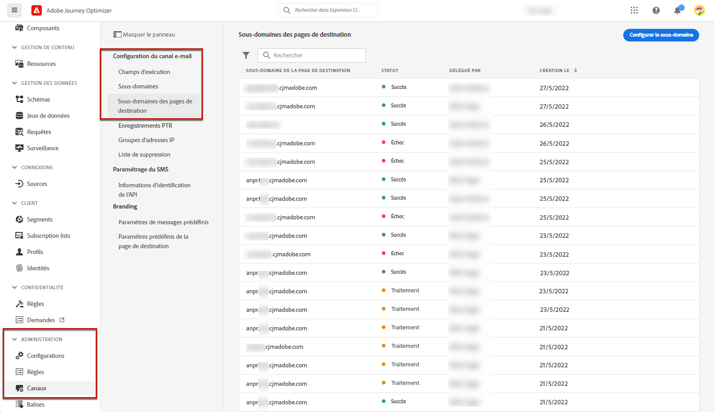

1. Cliquez sur **[!UICONTROL Configuration d’un sous-domaine]**.

   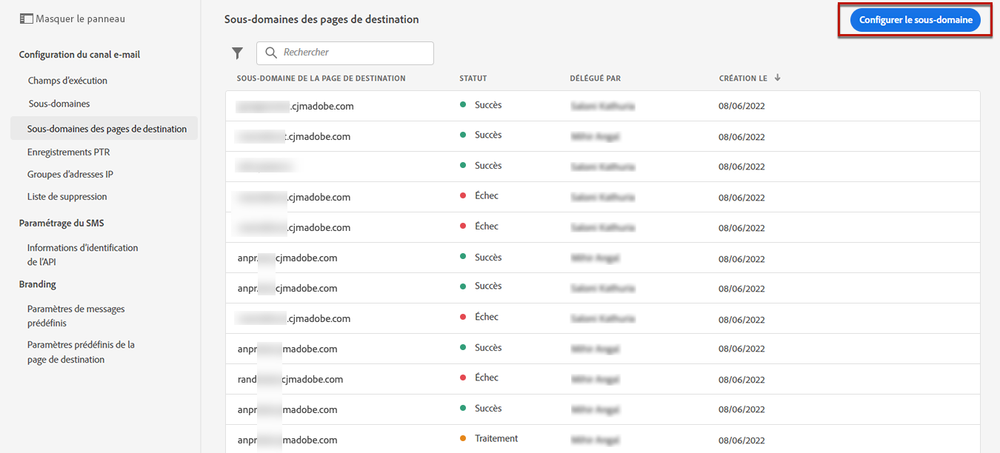

1. Sélectionner **[!UICONTROL Utiliser le domaine délégué]** de la **[!UICONTROL Type de configuration]** .

   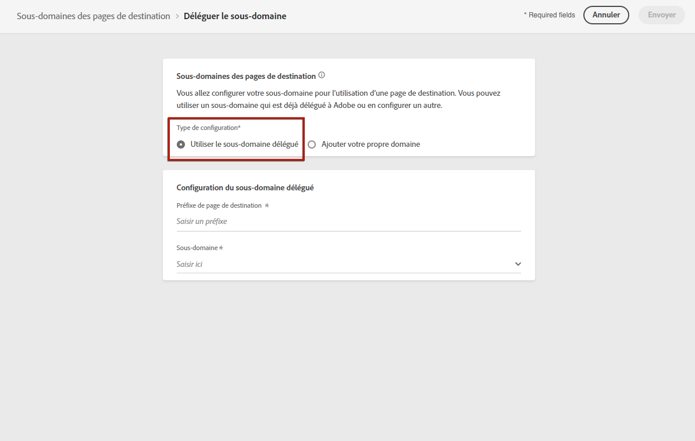

1. Saisissez le préfixe qui s&#39;affichera dans l&#39;URL de votre landing page.

   >[!NOTE]
   >
   >Seuls les caractères alphanumériques et les tirets sont autorisés.

1. Sélectionnez un sous-domaine délégué dans la liste.

   >[!NOTE]
   >
   >Vous ne pouvez pas sélectionner un sous-domaine déjà utilisé comme sous-domaine de page d’entrée.

   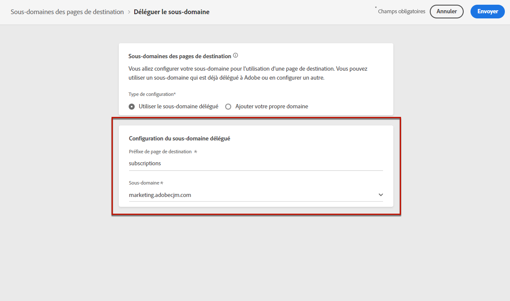

   >[!CAUTION]
   >
   >Si vous sélectionnez un domaine qui a été délégué à l’Adobe à l’aide de la variable [méthode CNAME](delegate-subdomain.md#cname-subdomain-delegation), vous devez créer l’enregistrement DNS sur votre plateforme d’hébergement. Pour générer l’enregistrement DNS, le processus est le même que lorsque vous configurez un nouveau sous-domaine de landing page. Découvrez comment dans [cette section](#lp-configure-new-subdomain).

1. Cliquez sur **[!UICONTROL Envoyer]**.

1. Une fois envoyé, le sous-domaine s’affiche dans la liste avec le **[!UICONTROL Traitement]** statut. Pour en savoir plus sur les statuts des sous-domaines, consultez [cette section](access-subdomains.md).<!--Same statuses?-->

   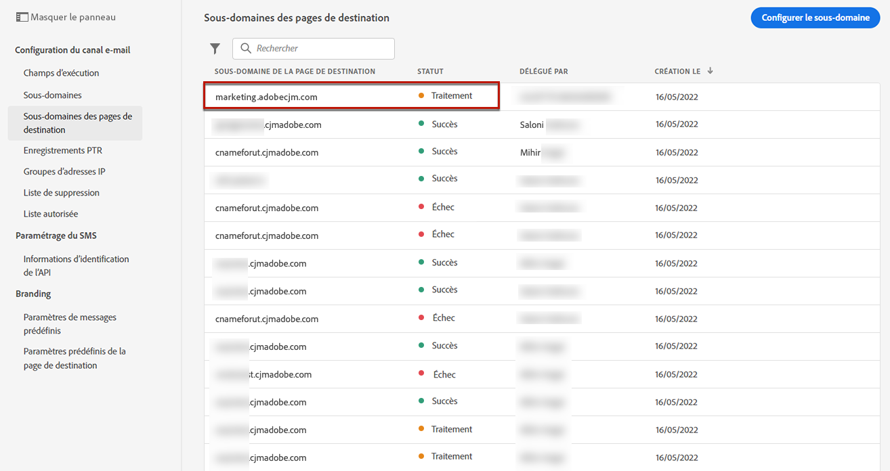

   >[!NOTE]
   >
   >Avant de pouvoir utiliser ce sous-domaine pour envoyer des messages, vous devez attendre que l’Adobe effectue les vérifications requises, ce qui peut prendre jusqu’à 4 heures.<!--Learn more in [this section](delegate-subdomain.md#subdomain-validation).-->

1. Une fois les vérifications effectuées, le sous-domaine obtient le statut **[!UICONTROL Succès]**. Il est prêt à être utilisé pour créer des paramètres prédéfinis de page d’entrée.

### Configuration d’un nouveau sous-domaine {#lp-configure-new-subdomain}

Pour configurer un nouveau sous-domaine, procédez comme suit.

1. Accédez au **[!UICONTROL Administration]** > **[!UICONTROL Canaux]** , puis sélectionnez **[!UICONTROL Configuration des emails]** > **[!UICONTROL Sous-domaines de landing page]**.

1. Cliquez sur **[!UICONTROL Configuration d’un sous-domaine]**.

1. Sélectionner **[!UICONTROL Ajouter votre propre domaine]** de la **[!UICONTROL Type de configuration]** .

   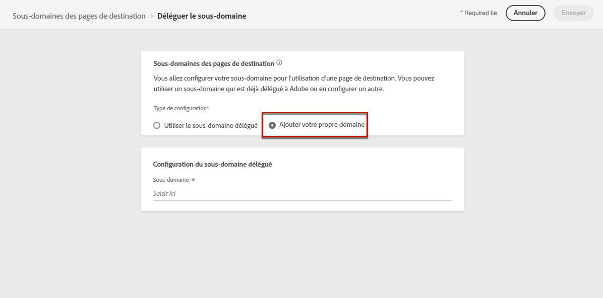

1. Spécifiez le sous-domaine à déléguer.

   >[!CAUTION]
   >
   >Vous ne pouvez pas utiliser un sous-domaine de landing page existant.

   La délégation d’un sous-domaine non valide à Adobe n’est pas autorisée. Veillez à saisir un sous-domaine valide détenu par votre entreprise, tel que marketing.votre_entreprise.com.

   Les sous-domaines de plusieurs niveaux tels que &quot;email.marketing.votreentreprise.com&quot; ne sont actuellement pas pris en charge.

1. L’enregistrement à placer dans vos serveurs DNS s’affiche. Copiez cet enregistrement ou téléchargez un fichier CSV, puis accédez à votre solution d’hébergement de domaine pour générer l’enregistrement DNS correspondant.

1. Assurez-vous que l’enregistrement DNS a été généré dans votre solution d’hébergement de domaine. Si tout est correctement configuré, cochez la case &quot;Je confirme...&quot;, puis cliquez sur **[!UICONTROL Envoyer]**.

   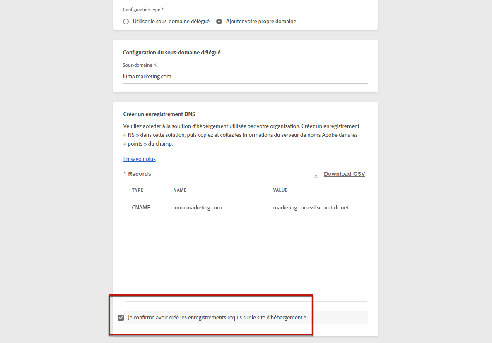

   >[!NOTE]
   >
   >Lorsque vous configurez un nouveau sous-domaine de landing page, il pointe toujours vers un enregistrement CNAME.

1. Une fois la délégation de sous-domaine envoyée, le sous-domaine s&#39;affiche dans la liste avec le statut **[!UICONTROL Traitement]**. Pour en savoir plus sur les statuts des sous-domaines, consultez [cette section](access-subdomains.md).<!--Same statuses?-->

   >[!NOTE]
   >
   >Avant de pouvoir utiliser ce sous-domaine pour envoyer des messages, vous devez attendre que l’Adobe effectue les vérifications requises, ce qui peut prendre jusqu’à 4 heures.<!--Learn more in [this section](#subdomain-validation).-->

1. Une fois les vérifications effectuées, le sous-domaine obtient le statut **[!UICONTROL Succès]**. Il est prêt à être utilisé pour créer des paramètres prédéfinis de page d’entrée.

   Notez que le sous-domaine sera marqué comme **[!UICONTROL En échec]** si vous ne créez pas l’enregistrement de validation sur votre solution d’hébergement.

## Définition des paramètres prédéfinis de page d’entrée {#lp-define-preset}

When [création d&#39;une landing page](../landing-pages/create-lp.md#create-a-lp), vous devez sélectionner un paramètre prédéfini de page d’entrée pour pouvoir créer la page d’entrée et l’exploiter au moyen de la fonction **[!DNL Journey Optimizer]**.

### Accès aux paramètres prédéfinis de page d’entrée {#lp-presets}

Pour accéder aux paramètres prédéfinis de landing page, procédez comme suit.

1. Accédez au **[!UICONTROL Administration]** > **[!UICONTROL Canaux]** .

1. Sélectionner **[!UICONTROL Marques]** > **[!UICONTROL Paramètres prédéfinis de page d’entrée]**.

   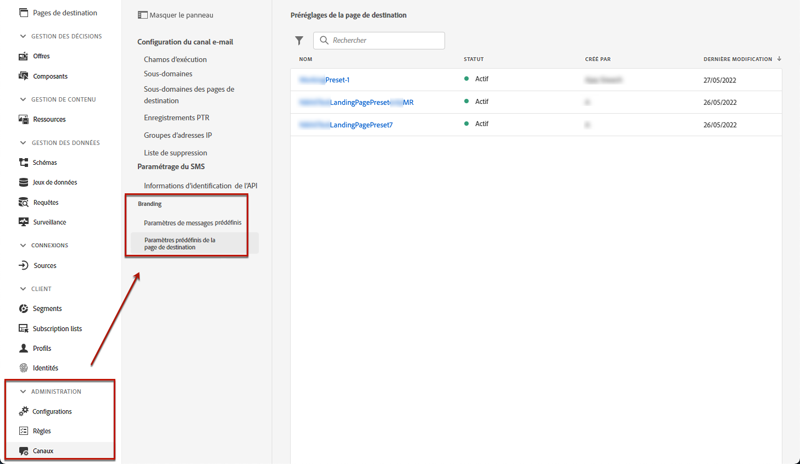

1. Cliquez sur un libellé de paramètre prédéfini pour accéder aux détails du paramètre prédéfini de page d’entrée.

   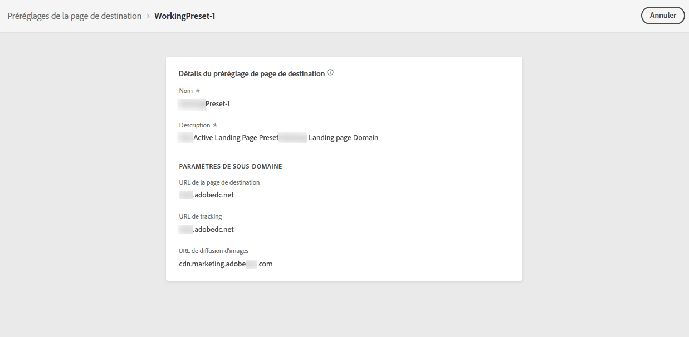

### Créer un paramètre prédéfini de landing page {#lp-create-preset}

Pour créer un paramètre prédéfini de page d’entrée, procédez comme suit.

>[!NOTE]
>
>Pour pouvoir créer un paramètre prédéfini, vérifiez que vous avez déjà configuré au moins un sous-domaine de landing page. [Découvrez comment](#lp-subdomains)

1. Accédez au **[!UICONTROL Administration]** > **[!UICONTROL Canaux]** , puis sélectionnez **[!UICONTROL Marques]** > **[!UICONTROL Paramètres prédéfinis de page d’entrée]**.

1. Sélectionner **[!UICONTROL Créer un paramètre prédéfini de page d’entrée]**.

   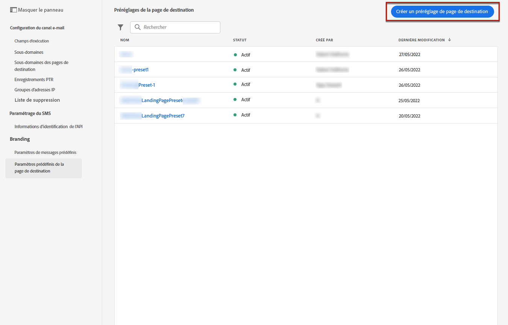

1. Saisissez un nom et une description pour le paramètre prédéfini.

   >[!NOTE]
   >
   > Les noms doivent commencer par une lettre (A-Z). Ils ne peuvent contenir que des caractères alphanumériques. Vous pouvez également utiliser le trait de soulignement `_`, le point`.` et le trait d&#39;union `-`.

1. Sélectionnez un sous-domaine de landing page dans la liste déroulante.

   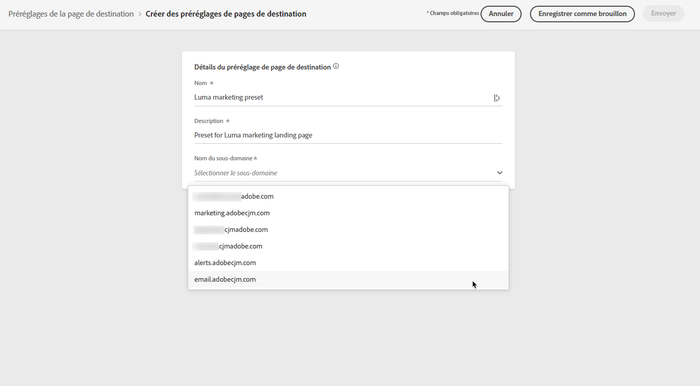

   >[!NOTE]
   >
   >Pour pouvoir sélectionner un sous-domaine, vérifiez que vous avez déjà configuré au moins un sous-domaine de landing page. [Découvrez comment](#lp-subdomains)

   Les paramètres correspondant au sous-domaine sélectionné s’affichent.

1. Si vous souhaitez sélectionner le sous-domaine de la landing page comme URL de tracking, cochez la case **[!UICONTROL Identique au sous-domaine de la page d’entrée]** . [En savoir plus sur le tracking](../messages/message-tracking.md)

   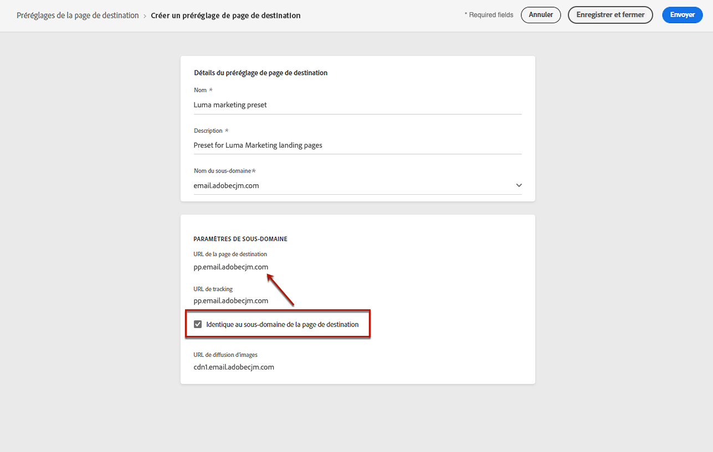

   Par exemple, si l’URL de la landing page est &quot;pages.mail.luma.com&quot; et que l’URL de tracking est &quot;data.mail.luma.com&quot;, vous pouvez choisir &quot;pages.mail.luma.com&quot; comme sous-domaine de tracking.

1. Cliquez sur **[!UICONTROL Envoyer]** pour confirmer la création du paramètre prédéfini de page d’entrée. Vous pouvez également enregistrer le préréglage de en tant que brouillon et reprendre sa configuration ultérieurement.

   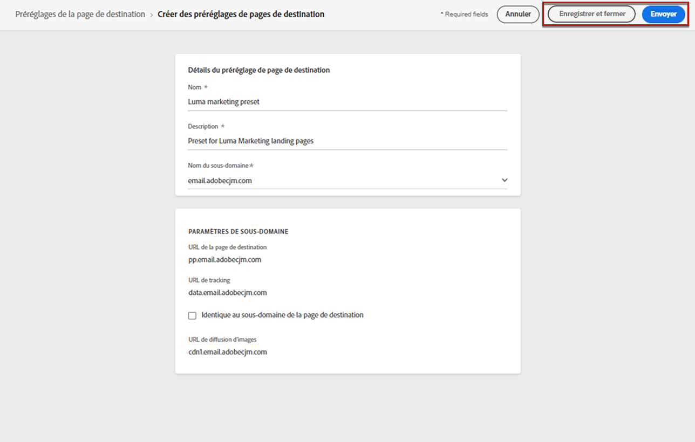

1. Une fois le paramètre prédéfini de page d’entrée créé, il s’affiche dans la liste avec la variable **[!UICONTROL Principal]** statut. Il est prêt à être utilisé pour vos landing pages.

   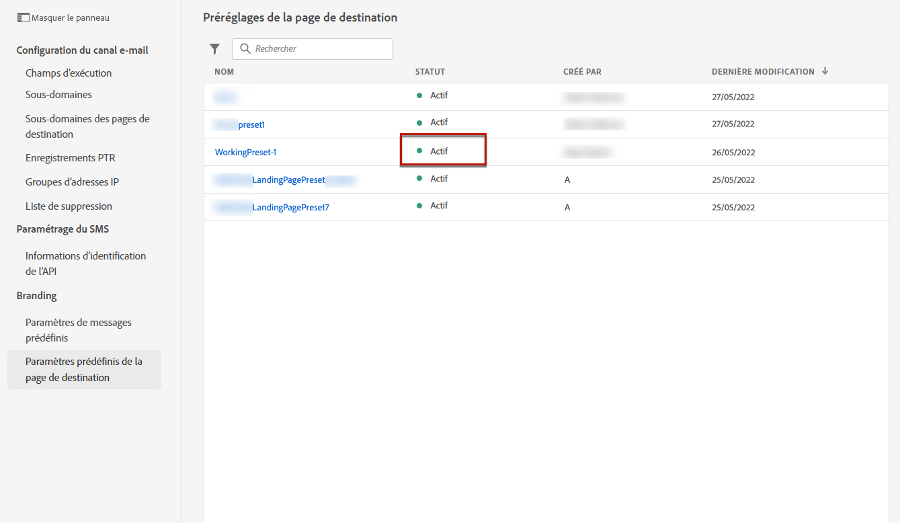

Vous êtes maintenant prêt à [créer des landing pages ;](../landing-pages/create-lp.md) in [!DNL Journey Optimizer].

>[!NOTE]
>
>Découvrez comment créer des paramètres prédéfinis de message pour les notifications push et les emails dans [cette section](message-presets.md).

**Rubriques connexes**:

* [Prise en main des pages de destination](../landing-pages/get-started-lp.md)
* [Création d’une page de destination](../landing-pages/create-lp.md#create-a-lp)
