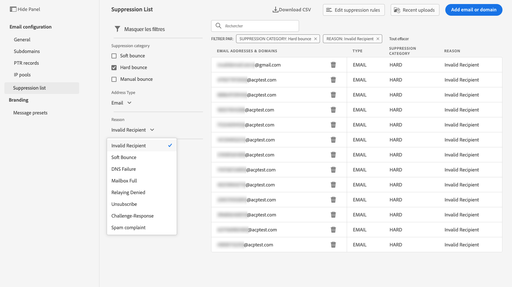
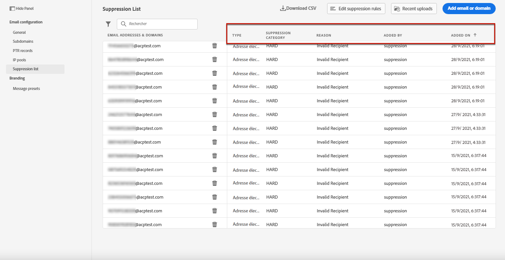
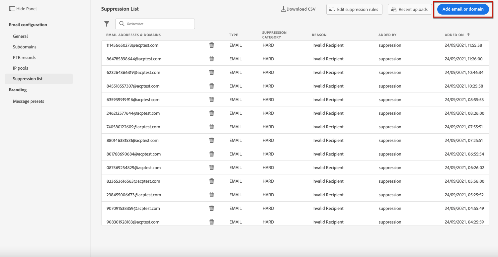
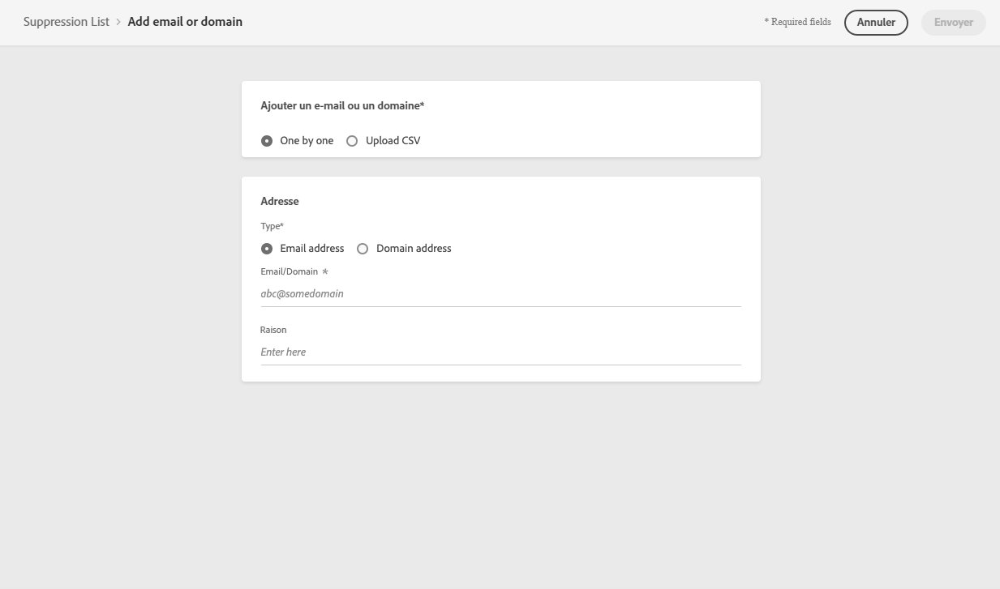
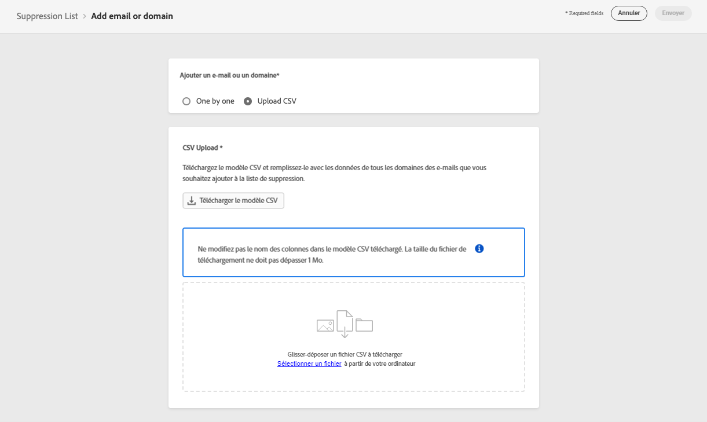
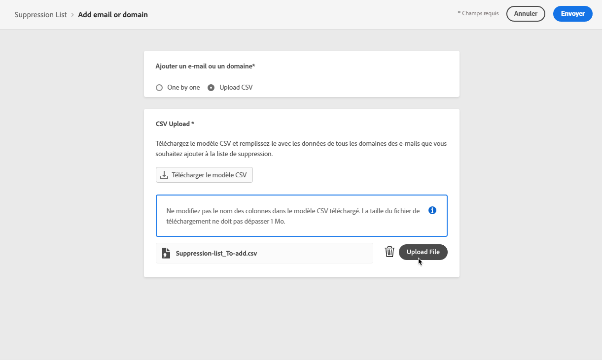
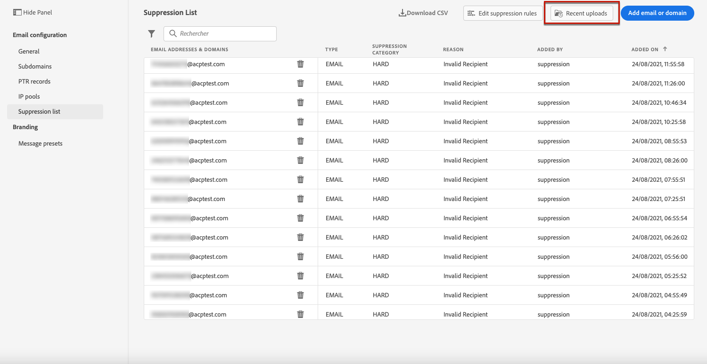
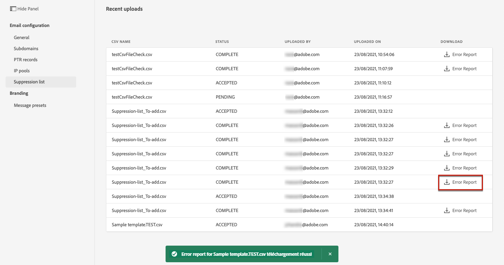

# Gestion de la liste de suppression {#manage-suppression-list}

Avec [!DNL Journey Optimizer], vous pouvez surveiller toutes les adresses e-mail qui sont automatiquement exclues de l&#39;envoi dans un parcours, telles que :

* Adresses non valides (hard bounces).
* Adresses qui soft bounces de manière cohérente et qui peuvent nuire à la réputation de vos emails si vous continuez à les inclure dans vos diffusions.
* Les destinataires qui déposent une plainte pour spam contre l&#39;un de vos e-mails.

Ces adresses e-mail sont automatiquement collectées dans la **liste de suppression** de Journey Optimizer. En savoir plus dans [cette section](../suppression-list.md).

## Accéder à la liste de suppression {#access-suppression-list}

Pour accéder à la liste détaillée des adresses e-mail exclues, ouvrez le menu **[!UICONTROL Canaux]** > **[!UICONTROL Configuration des e-mails]** > **[!UICONTROL Général]**, puis cliquez sur le lien **[!UICONTROL Afficher les listes de suppression]**.


<!--To access the detailed list of excluded email addresses, go to **[!UICONTROL Administration]** > **[!UICONTROL Channels]** > **[!UICONTROL Email configuration]**, and select **[!UICONTROL Suppression list]**.
You can also display the suppression list content using the **[!UICONTROL View suppression list]** link through the **[!UICONTROL Channels]** > **[!UICONTROL Email configuration]** > **[!UICONTROL General]** menu, but this view does not allow you to edit the list.

-->

Des filtres sont disponibles pour vous aider à parcourir la liste.


<!--

You can filter on the **[!UICONTROL Suppression category]**, **[!UICONTROL Address type]**, or **[!UICONTROL Reason]**. Select the option(s) of your choice for each criterion.



Once selected, you can clear each filter or all filters displayed on top of the list.-->

## Catégories de suppression et motifs {#suppression-categories-and-reasons}

Lorsqu&#39;un message ne parvient pas à être envoyé à une adresse email, [!DNL Journey Optimizer] détermine la raison de l&#39;échec de la diffusion et l&#39;associe à une **[!UICONTROL catégorie de suppression]**.

Les catégories de suppression sont les suivantes :

* **Hard** : l&#39;adresse e-mail est immédiatement envoyée à la liste de suppression.

   >[!NOTE]
   >
   >Lorsque l&#39;erreur est le résultat d&#39;une plainte de spam, elle est également classée dans la catégorie **Hard**. L&#39;adresse email du destinataire ayant émis la plainte est immédiatement envoyée à la liste de suppression.

* **Soft** : les erreurs de type Soft envoient une adresse à la liste de suppression une fois que le compteur d&#39;erreurs a atteint le seuil limite. [En savoir plus sur les reprises](retries.md)

   <!--
    **Ignored**:
    * When the error occurred for a valid email address but is known to be temporary, such as a failed connection attempt or a temporary technical issue, the email address is added to the suppression list once the error counter reaches the limit threshold. [Learn more on retries](retries.md).
    * When the error is the result of a spam complaint, the email address of the recipient who issued the complaint is immediately sent to the suppression list.
    -->

* **Manuel** : Vous pouvez également ajouter manuellement une adresse électronique ou un domaine à la liste de suppression. [En savoir plus](#add-addresses-and-domains)

>[!NOTE]
>
>Pour en savoir plus sur les soft bounces et les hard bounces, consultez la section [Types de diffusion en échec](../suppression-list.md#delivery-failures).

Pour chaque adresse électronique répertoriée, vous pouvez également vérifier le **[!UICONTROL Type]** (adresse électronique ou domaine), le **[!UICONTROL motif]** de l’exclusion, de la personne qui l’a ajoutée et la date/l’heure de son ajout à la liste de suppression.

<!---->

Les motifs possibles d&#39;une diffusion en échec sont les suivants :

| Motif | Description | Catégorie de suppression |
| --- | --- | --- |
| **[!UICONTROL Destinataire non valide]** | Le destinataire n&#39;est pas valide ou n&#39;existe pas. | Hard |
| **[!UICONTROL Soft Bounce]** | Le message a fait l&#39;objet d&#39;un soft bounce pour un motif autre que les erreurs soft répertoriées dans ce tableau, par exemple lors d&#39;un envoi supérieur au taux autorisé recommandé par un FAI. | Soft |
| **[!UICONTROL Échec du DNS]** | Le message a fait l&#39;objet d&#39;un bounce en raison d&#39;un échec du DNS. | Soft |
| **[!UICONTROL Boîte pleine]** | Le message a fait l&#39;objet d&#39;un bounce, car la boîte du destinataire était pleine et ne pouvait pas accepter d&#39;autres messages. | Soft |
| **[!UICONTROL Relais refusé]** | Le message a été bloqué par le destinataire, car le relais n&#39;est pas autorisé. | Soft |
| **[!UICONTROL Réponse au défi]** | Le message est une enquête de réponse au défi. | Soft |

>[!NOTE]
>
>Les utilisateurs désabonnés ne reçoivent pas d&#39;e-mails de [!DNL Journey Optimizer]. Par conséquent, leurs adresses e-mail ne peuvent pas être envoyées à la liste de suppression. Leur choix est géré au niveau d&#39;Experience Platform. En savoir plus sur la [désinscription](../consent.md).

<!--
Removed from the table provided by SparkPost/Momentum:
| **[!UICONTROL Undetermined]** | The bounce reason received from the recipient domain Message Transfer Agent (MTA) could not be identified. | Ignored |
| **[!UICONTROL Too Large]** | The message bounced because it was too large for the recipient. [Retries](retries.md) will be performed: you can edit the message size and re-inject it for delivery. | Ignored |
| **[!UICONTROL Timeout]** | The message timed out, meaning it soft bounced and reached the message retry limit (3.5 days). | Ignored |
| **[!UICONTROL Admin Failure]** | The message was failed according to the policies configured by the sending system administrator. ///For example, if emails are blackholed at the global, domain or binding level using the "blackhole" directive, this bounce code is used. | Ignored |
| **[!UICONTROL Generic Bounce: No RCPT]** | No recipient could be determined for the message. | Ignored |
| **[!UICONTROL Generic Bounce]** | The message failed for unspecified reasons. | Ignored |
| **[!UICONTROL Mail Block]** | The message was blocked by the receiver (i.e. recipient MTA). | Ignored |
| **[!UICONTROL Spam Block]** | The message was blocked by the receiver as coming from a known spam source. It could be a sending IP block for example. | Ignored |
| **[!UICONTROL Spam Content]** | The message content was blocked by the receiver (recipient MTA) as spam. | Ignored |
| **[!UICONTROL Prohibited Attachment]** | The message was blocked by the receiver because it contained an attachment. | Ignored |
| **[!UICONTROL Auto-Reply]** | The message is an auto-reply/vacation mail. | Ignored |
| **[!UICONTROL Transient Failure]** | Message transmission has been temporarily delayed. | Ignored |
| **[!UICONTROL Subscribe]** | The message is a subscribe request. | Ignored |
| **[!UICONTROL Unsubscribe]** | The message is an unsubscribe request. | Hard |
-->

<!--Note to add eventually: If a user is subscribed and [!DNL Journey Optimizer] fails to send emails to their subscribed email address, they will get added to the suppression list. (not sure it's possible to subscribe through AJO or need to find reference to Experience Platform doc?)-->

<!--## Manually add addresses and domains {#add-addresses-and-domains}

When a message fails to be delivered to an email address, this address is automatically added to the suppression list based on the defined suppression rule or bounce count.

However, you can also manually populate the [!DNL Journey Optimizer] suppression list to exclude specific email addresses and/or domains from your sending.

You may add email addresses or domains [one at a time](#add-one-address-or-domain), or [in bulk mode](#upload-csv-file) through a CSV file upload.

To do this, select the **[!UICONTROL Add email or domain]** button, then follow one of the methods below.



### Add one address or domain {#add-one-address-or-domain}

1. Select the **[!UICONTROL One by one]** option.

    

1. Choose the address type: **[!UICONTROL Email address]** or **[!UICONTROL Domain address]**.

1. Enter the email address or domain you want to exclude from your sending.

    >[!NOTE]
    >
    >Make sure you enter a valid email address (such as abc@company) or domain (such as abc.company.com).

1. Specify a reason if needed.

1. Click **[!UICONTROL Submit]**.

### Upload a CSV file {#upload-csv-file}

1. Select the **[!UICONTROL Upload CSV]** option.

    

1. Download the CSV template to use, which includes the columns and format below:

    ```
    TYPE,VALUE,COMMENT
    EMAIL,abc@somedomain.com,Comment
    DOMAIN,somedomain.com,Comment
    ```
    You can also download this template from the **[!UICONTROL Suppression list]** main view.

    >[!CAUTION]
    >
    >Do not change the names of the columns in the CSV template.
    >
    >The file size should not exceed 50 MB.

1. Fill in the CSV template with the email addresses and/or domains you want to add to the suppression list.

1. Once completed, drag and drop your CSV file, then click **[!UICONTROL Upload file]**.

    

1. Click **[!UICONTROL Submit]**.

### Check recent uploads status {#recent-uploads}

You can check the list of the latest CSV files you uploaded.

To do this, from the **[!UICONTROL Suppression list]** view, click the **[!UICONTROL Recent uploads]** button.



The latest uploads you submitted and their corresponding statuses are displayed.

If an error report is associated with a file, you can download it to check the errors encountered.



Below is an example of the type of entries you can find in the error report:

```
type,value,comments,failureReason
Email,examplemail.com,MANUAL,Invalid format for value: examplemail.com
Email,examplemail,MANUAL,Invalid format for value: examplemail
Email,example@mail,MANUAL,Invalid format for value: example@mail
Domain,example,MANUAL,Invalid format for value: example
Domain,example.!com,MANUAL,Invalid format for value: example.!com
Domain,!examplecom,MANUAL,Invalid format for value: !examplecom
```

-->


