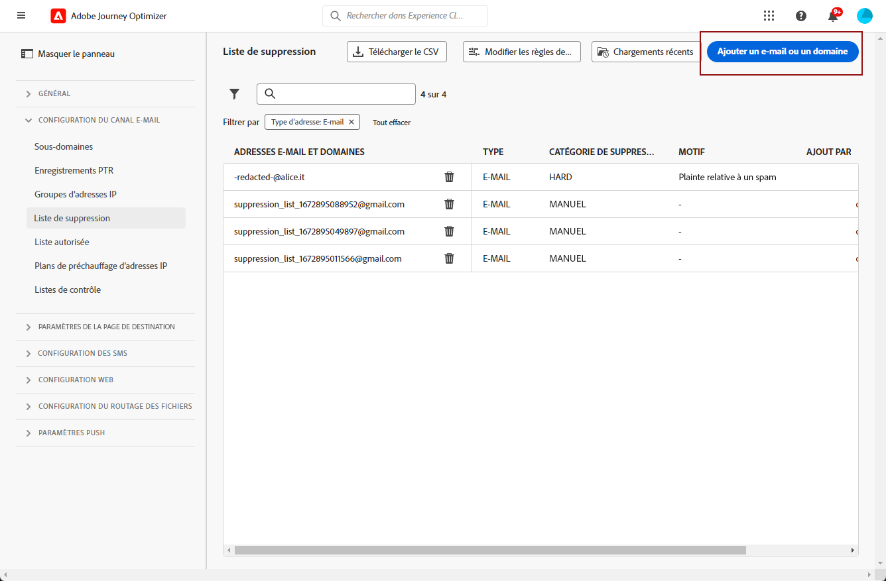
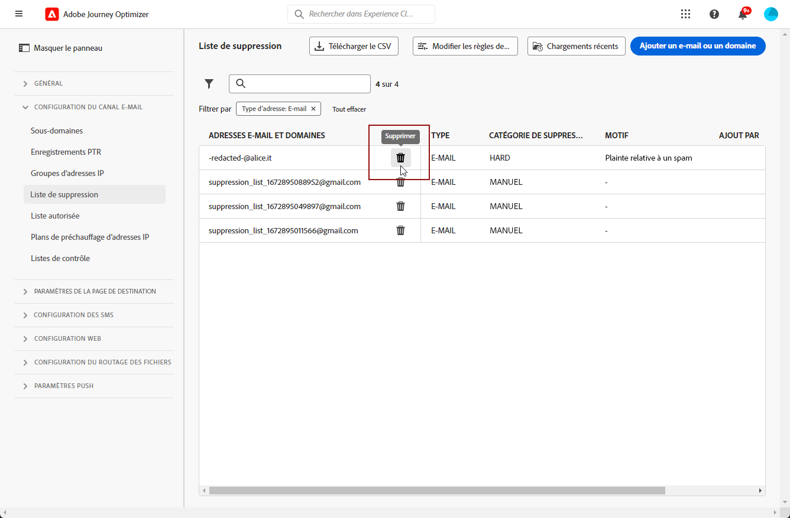

# Gérer la liste de suppression {#manage-suppression-list}

Avec [!DNL Journey Optimizer], vous pouvez surveiller toutes les adresses e-mail qui sont automatiquement exclues de l’envoi dans un parcours ou une campagne, telles que les rebonds définitifs, les rebonds temporaires et les réclamations relatives au spam.

Ces adresses e-mail sont automatiquement collectées dans la **liste de suppression** de Journey Optimizer. Une liste de suppression se compose d’adresses et de domaines à exclure de vos audiences. Elle rassemble les adresses e-mail et les domaines supprimés de tous les mailings dans un seul environnement client, c’est-à-dire spécifiques à un ID d’organisation associé à un ID de sandbox.

Pour en savoir plus sur le concept et l’utilisation de la liste de suppression, consultez [cette section](../reports/suppression-list.md).

>[!NOTE]
>
>Adobe tient à jour une liste des adresses erronées connues qui se sont avérées préjudiciables à l’engagement et à la réputation du publipostage, et s’assure que les e-mails ne leur sont pas remis. Cette liste est gérée dans une liste de suppression globale qui est commune à tous les clients Adobe. Les adresses et les noms de domaine contenus dans la liste de suppression globale sont masqués. Seul le nombre de destinataires exclus est indiqué dans les rapports de diffusion.

En outre, vous pouvez tirer parti de l’**API REST de suppression** de Journey Optimizer pour contrôler vos messages sortants à l’aide des listes de suppression et des listes autorisées. [Découvrez comment utiliser l’API REST de suppression.](https://developer.adobe.com/journey-optimizer-apis/references/suppression/){target="_blank"}

## Accéder à la liste de suppression {#access-suppression-list}

Pour accéder à la liste détaillée des adresses e-mail et domaines exclus, accédez à **[!UICONTROL Administration]** > **[!UICONTROL Canaux]** > **[!UICONTROL Paramètres d’e-mails]**, puis sélectionnez **[!UICONTROL Liste de suppression]**.


>[!CAUTION]
>
>Les autorisations d’affichage, d’export et de gestion de la liste de suppression sont limitées aux [Administrateurs de Journey](../administration/ootb-product-profiles.md#journey-administrator). Pour en savoir plus sur la gestion des droits d’accès des utilisateurs [!DNL Journey Optimizer], consultez [cette section](../administration/permissions-overview.md).


Des filtres sont disponibles pour vous aider à parcourir la liste.


Vous pouvez filtrer par **[!UICONTROL Catégorie de suppression]**, **[!UICONTROL Type d’adresse]** ou **[!UICONTROL Raison]**. Sélectionnez une ou plusieurs options pour chaque critère. Une fois la sélection effectuée, vous pouvez effacer chaque filtre ou tous les filtres affichés en haut de la liste.


## Comprendre les raisons de l’échec {#suppression-categories-and-reasons}

Lorsqu&#39;un message ne parvient pas à être envoyé à une adresse e-mail, [!DNL Journey Optimizer] détermine les motifs de l&#39;échec de la diffusion et l&#39;associe à une **[!UICONTROL catégorie de suppression]**.

Les catégories de suppression sont les suivantes :

* **Définitif** : un rebond définitif indique une adresse e-mail non valide (c’est-à-dire une adresse e-mail qui n’existe pas). Un message de rebond du serveur de messagerie de réception indique explicitement que l’adresse n’est pas valide. L’adresse e-mail est immédiatement envoyée à la liste de suppression.

  Lorsque l&#39;erreur est le résultat d&#39;une plainte de spam, elle est également classée dans la catégorie **Hard**. L’adresse e-mail du destinataire ayant émis la plainte est immédiatement envoyée à la liste de suppression.

* **Soft** : un soft bounce est un e-mail de rebond temporaire qui s’est produit pour une adresse e-mail valide. L’adresse e-mail est ajoutée à la liste de suppression après plusieurs reprises. Les erreurs de type Soft envoient une adresse à la liste de suppression une fois que le compteur d’erreurs a atteint le seuil limite. [En savoir plus sur les reprises](retries.md)

* **Manuel** : des erreurs manuelles ont été ajoutées manuellement à la liste de suppression. [En savoir plus](#add-addresses-and-domains).

Pour chaque adresse e-mail répertoriée, vous pouvez également vérifier le **[!UICONTROL type]** (e-mail ou domaine), le **[!UICONTROL motif]** de son exclusion et la date/l’heure de son ajout à la liste de suppression.

Les motifs possibles d’un échec de diffusion sont les suivants :

| Motif | Description | Catégorie |
| --- | --- | --- |
| **[!UICONTROL Destinataire non valide]** | Le destinataire n&#39;est pas valide ou n&#39;existe pas. | Hard |
| **[!UICONTROL Rebond temporaire]** | Le message a fait l’objet d’un rebond temporaire pour un motif autre que les erreurs temporaires répertoriées dans ce tableau, par exemple lors d’un envoi supérieur au taux autorisé recommandé par un FAI. | Soft |
| **[!UICONTROL Échec du DNS]** | Le message a fait l’objet d’un rebond en raison d’un échec du DNS. | Soft |
| **[!UICONTROL Boîte pleine]** | Le message a fait l’objet d’un rebond, car la boîte du destinataire était pleine et ne pouvait pas accepter d’autres messages. | Soft |
| **[!UICONTROL Relais refusé]** | Le message a été bloqué par le destinataire, car le relais n&#39;est pas autorisé. | Soft |
| **[!UICONTROL Réponse au défi]** | Le message est une enquête de réponse au défi. | Soft |
| **[!UICONTROL Plainte relative à un spam]** | Le message a été bloqué car marqué comme étant indésirable par le destinataire. | Hard |

>[!NOTE]
>
>Les utilisateurs désabonnés ne reçoivent pas d&#39;e-mails de [!DNL Journey Optimizer]. Par conséquent, leurs adresses e-mail ne peuvent pas être envoyées à la liste de suppression. Leur choix est géré au niveau d&#39;Experience Platform. [En savoir plus sur la désinscription](../privacy/opt-out.md)


### Règles de suppression  {#suppression-rules}

Dans la **[!UICONTROL Liste de suppression]**, vous pouvez également modifier le paramètre de reprise associé aux règles de suppression à l’aide du bouton **[!UICONTROL Modifier les règles de suppression]**. Utilisez cette option pour mettre à jour le seuil de reprise du sandbox actuel. [En savoir plus sur les reprises](retries.md).


## Ajouter des adresses ou des domaines à la liste de suppression{#add-addresses-and-domains}

>[!CONTEXTUALHELP]
>id="ajo_admin_suppression_list_header"
>title="Ajouter des e-mails ou des domaines à la liste de suppression"
>abstract="Vous pouvez également remplir manuellement la liste de suppression de Journey Optimizer pour exclure des adresses e-mail et/ou domaines spécifiques de votre envoi."

>[!CONTEXTUALHELP]
>id="ajo_admin_suppression_list"
>title="Ajouter des e-mails ou des domaines à la liste de suppression"
>abstract="Pour renseigner la liste de suppression, vous pouvez ajouter manuellement des adresses e-mail ou des domaines, individuellement ou en bloc par le biais d’un téléchargement de fichier CSV. Ces adresses e-mail et/ou domaines spécifiques seront exclus de votre envoi."

Lorsqu’un message ne parvient pas à être envoyé à une adresse e-mail, cette adresse est automatiquement ajoutée à la liste de suppression en fonction de la règle de suppression définie ou du nombre de rebonds.

Cependant, vous pouvez également remplir manuellement la liste de suppression [!DNL Journey Optimizer] pour exclure des adresses e-mail et/ou domaines spécifiques de votre envoi.

>[!NOTE]
>
>Il faudra jusqu’à 60 minutes pour que [!DNL Journey Optimizer] prenne en compte les adresses supprimées dans les e-mails sortants.

Vous pouvez ajouter des adresses e-mail ou des domaines [un par un](#add-one-address-or-domain) ou [en masse](#upload-csv-file) par le biais du téléchargement d’un fichier CSV.

### Ajout d’une adresse ou d’un domaine {#add-one-address-or-domain}

>[!CONTEXTUALHELP]
>id="ajo_admin_suppression_list_address"
>title="Ajouter un élément à la liste de suppression"
>abstract="Vous pouvez remplir la liste de suppression en ajoutant une adresse e-mail ou un domaine à la fois."

Pour ajouter une adresse e-mail ou un domaine à la liste de suppression, procédez comme suit :

1. Sélectionnez le bouton **[!UICONTROL Ajouter un e-mail ou un domaine]**.

   

1. Sélectionnez l’option **[!UICONTROL Un par un]**.

   

1. Sélectionnez le type d’adresse : **[!UICONTROL e-mail]** ou **[!UICONTROL domaine]**.

1. Saisissez l&#39;adresse e-mail ou le domaine que vous souhaitez exclure de votre envoi.

   >[!NOTE]
   >
   >Veillez à saisir une adresse e-mail (par exemple abc@company) ou un domaine valide (par exemple abc.company.com).

1. (facultatif) Saisissez un motif. Tous les caractères ASCII imprimables compris entre 32 et 126 sont autorisés dans ce champ.

1. Utilisez le bouton **[!UICONTROL Envoyer]** pour confirmer.

### Chargement d’un fichier CSV {#upload-csv-file}

>[!CONTEXTUALHELP]
>id="ajo_admin_suppression_list_csv"
>title="Charger un fichier CSV pour ajouter des éléments à la liste de suppression"
>abstract="Vous pouvez remplir la liste de suppression en chargeant un fichier CSV contenant les adresses e-mail/domaines à exclure."

Pour ajouter un groupe d’e-mails ou de domaines à la liste de suppression, procédez comme suit :

1. Sélectionnez le bouton **[!UICONTROL Ajouter un e-mail ou un domaine]**.
1. Sélectionnez l’option **[!UICONTROL Télécharger CSV]**.

   

1. Téléchargez le modèle CSV à utiliser, qui comprend les colonnes et le format ci-dessous :

   ```
   TYPE,VALUE,COMMENT
   EMAIL,abc@somedomain.com,Comment
   DOMAIN,somedomain.com,Comment
   ```

1. Remplissez le modèle CSV avec les adresses e-mail et/ou les domaines à ajouter à la liste de suppression. Tous les caractères ASCII imprimables compris entre 32 et 126 sont autorisés dans la colonne **Commentaire**.

   >[!CAUTION]
   >
   >Ne modifiez pas les noms des colonnes dans le modèle CSV.
   >
   >La taille du fichier ne doit pas dépasser 1 Mo.
   >

1. Une fois l’opération terminée, effectuez un glisser-déposer de votre fichier CSV, puis utilisez le bouton **[!UICONTROL Envoyer]** pour confirmer.

   

Une fois le chargement terminé, vous pouvez vérifier son statut à l’aide du bouton [Chargements récents](#recent-uploads), comme décrit ci-dessous.

### Vérifier le statut des téléchargements {#recent-uploads}

Utilisez le bouton **[!UICONTROL Chargements récents]** pour vérifier le statut des derniers fichiers CSV chargés.


Les statuts possibles sont les suivants :

* **[!UICONTROL En attente]** : le téléchargement du fichier est en cours de traitement.
* **[!UICONTROL Erreur]** : le processus de téléchargement du fichier a échoué en raison d’un problème technique ou d’un format de fichier incorrect.
* **[!UICONTROL Terminé]** : le processus de téléchargement du fichier est terminé.

Lors du téléchargement, si certaines adresses ne sont pas au format correct, elles ne sont pas ajoutées à la liste de suppression [!DNL Journey Optimizer].

Dans ce cas, une fois le téléchargement terminé, un rapport associé est émis. Vous pouvez le télécharger pour vérifier les erreurs rencontrées<!-- and understand why they were not added to the suppression list-->.


Vous trouverez ci-dessous un exemple du type d’entrées que vous pouvez trouver dans le rapport d’erreur :

```
type,value,comments,failureReason
Email,examplemail.com,MANUAL,Invalid format for value: examplemail.com
Email,examplemail,MANUAL,Invalid format for value: examplemail
Email,example@mail,MANUAL,Invalid format for value: example@mail
Domain,example,MANUAL,Invalid format for value: example
Domain,example.!com,MANUAL,Invalid format for value: example.!com
Domain,!examplecom,MANUAL,Invalid format for value: !examplecom
```

## Supprimer une adresse de la liste de suppression {#remove-from-suppression-list}

Vous pouvez mettre à jour manuellement la liste de suppression. La suppression d’une adresse e-mail de la quarantaine est une opération sensible qui peut affecter la réputation de votre adresse IP et vos taux de délivrabilité. Veillez à procéder avec précaution.

La suppression d’une adresse e-mail ou d’un domaine de la liste de suppression signifie qu’Adobe Journey Optimizer va recommencer à délivrer à cette adresse ou à ce domaine.  En savoir plus sur la délivrabilité dans [cette section](../reports/deliverability.md).

Pour supprimer une adresse de la liste de suppression, utilisez le bouton **[!UICONTROL Supprimer]**.




>[!NOTE]
>
>Procédez avec attention lorsque vous envisagez de supprimer une adresse e-mail ou un domaine. En cas de doute, contactez un expert en délivrabilité.

Par exemple, dans le cas d’une panne du fournisseur d’accès Internet (FAI), les e-mails sont marqués à tort comme rebonds définitifs, car ils ne peuvent pas être envoyés avec succès à leur destinataire. Ces adresses e-mail doivent être supprimées de la liste de suppression.

Pour récupérer ces adresses, exécutez une requête spécifique avec des paramètres personnalisés en fonction du contexte de la panne. [En savoir plus dans cet exemple](../data/datasets-query-examples.md#isp-outage-query).

Une fois les adresses e-mail concernées identifiées, filtrez la liste de suppression pour les afficher. Par exemple, si une panne du FAI s’est produite du 11 novembre 2022 au 13 novembre 2022 sur le domaine **test.com**, filtrez les adresses ajoutées à la liste de suppression dans cette période, tel qu’indiqué ci-dessous :

Vous pouvez ensuite supprimer les adresses e-mail de la liste de suppression à l’aide du bouton **[!UICONTROL Supprimer]**.

## Télécharger la liste de suppression {#download-suppression-list}

<!--
>[!CONTEXTUALHELP]
>id="ajo_admin_suppression_list_download"
>title="Export the list as a CSV file"
>abstract="To download the suppression list, Qou can either export the current list by generating a new file, or download the file that was previously generated."
-->

Pour exporter la liste de suppression au format CSV, suivez les étapes ci-dessous :

1. Sélectionnez le bouton **[!UICONTROL Téléchargement le CSV]**.

   

1. Patientez jusqu’à ce que le fichier soit généré.

   >[!NOTE]
   >
   >Le temps de téléchargement dépend de la taille du fichier, c’est-à-dire du nombre d’adresses qui se trouvent sur la liste de suppression.
   >
   >Une seule demande de téléchargement peut être traitée à la fois pour un sandbox donnée.

1. Une fois le fichier généré, vous recevez une notification. Cliquez sur l’icône représentant une cloche en haut à droite de l’écran pour l’afficher.

1. Cliquez sur la notification elle-même pour télécharger le fichier.

   

   >[!NOTE]
   >
   >Le lien est valide pendant 24 heures.

<!--When downloading the CSV file, you can choose to either:

* Download the file that was previously generated by another user or yourself.

* Generate a new file in order to export the current suppression list.-->