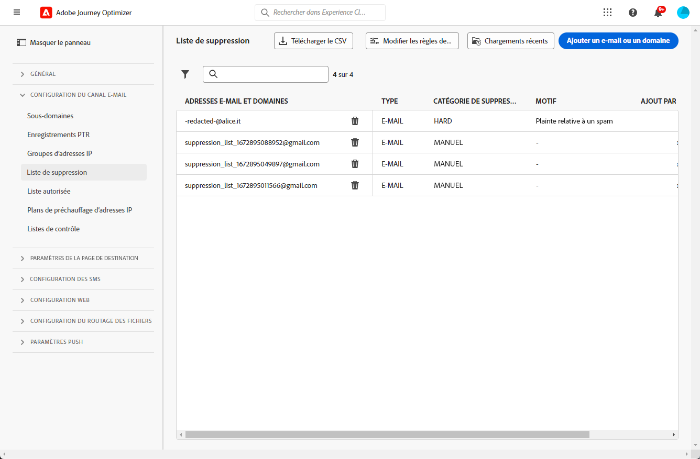
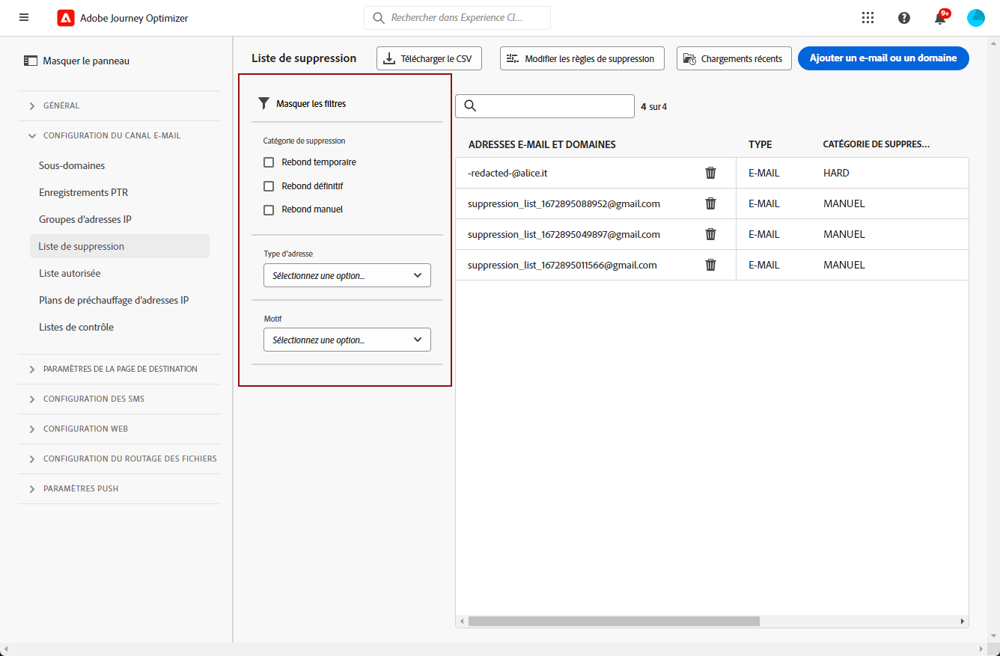
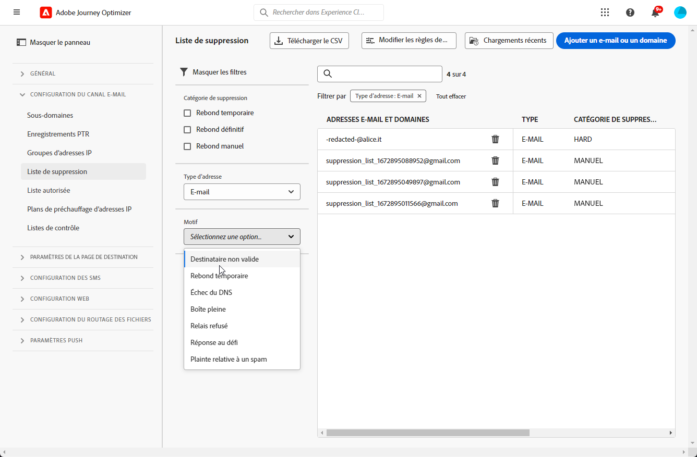
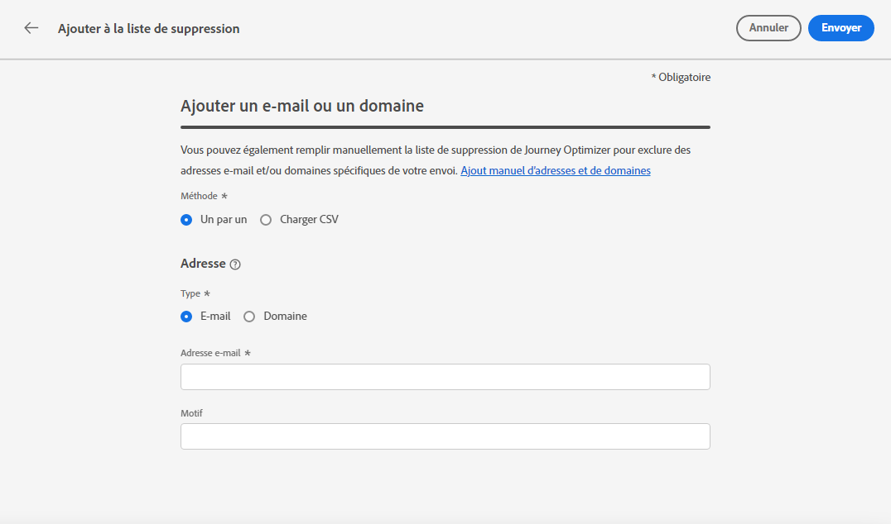
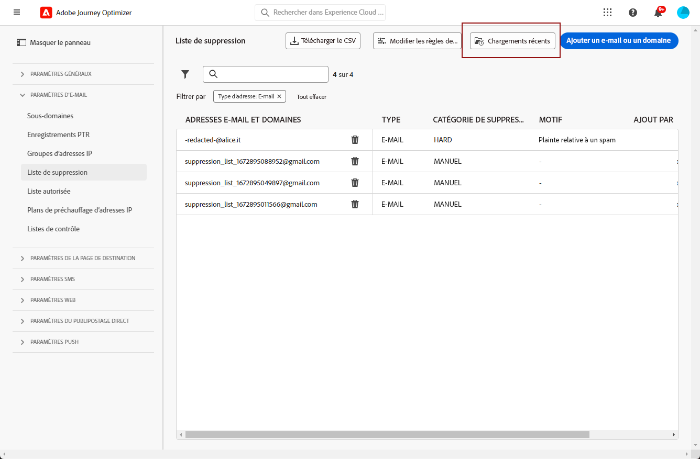

# Gestion de la liste de suppression {#manage-suppression-list}

Avec [!DNL Journey Optimizer], vous pouvez surveiller toutes les adresses électroniques qui sont automatiquement exclues de l’envoi dans un parcours ou une campagne, par exemple :

* Adresses non valides (hard bounces).
* Adresses qui soft bounces de manière cohérente et qui peuvent nuire à la réputation de vos emails si vous continuez à les inclure dans vos diffusions.
* Les destinataires qui émettent une plainte de spam d&#39;une sorte contre l&#39;un de vos emails.

>[!NOTE]
>
>La liste de suppression est gérée au niveau de l’environnement de test.

Ces adresses électroniques sont automatiquement collectées dans Journey Optimizer. **liste de suppression**. En savoir plus sur le concept et l’utilisation de la liste de suppression dans [cette section](../reports/suppression-list.md).

Vous pouvez également [**manuellement** ajouter une adresse ou un domaine](#add-addresses-and-domains) à la liste de suppression.

>[!NOTE]
>
>Cela prendra entre 0 et 60 minutes pour [!DNL Journey Optimizer] pour prendre en compte les adresses supprimées dans les emails sortants.

## Accès à la liste de suppression {#access-suppression-list}

Pour accéder à la liste détaillée des adresses email exclues, accédez à **[!UICONTROL Administration]** > **[!UICONTROL Channels]** > **[!UICONTROL Email configuration]**, puis sélectionnez **[!UICONTROL Suppression list]**.

>[!CAUTION]
>
>Les autorisations d’affichage, d’exportation et de gestion de la liste de suppression sont limitées à [Administrateurs de parcours](../administration/ootb-product-profiles.md#journey-administrator). En savoir plus sur la gestion [!DNL Journey Optimizer] droits d’accès des utilisateurs dans [cette section](../administration/permissions-overview.md).



Des filtres sont disponibles pour vous aider à parcourir la liste.



Vous pouvez filtrer selon les **[!UICONTROL Suppression category]**, **[!UICONTROL Address type]** ou **[!UICONTROL Reason]**. Sélectionnez la ou les options de votre choix pour chaque critère. Une fois sélectionné, vous pouvez effacer chaque filtre ou tous les filtres affichés en haut de la liste.



Si vous ajoutez manuellement une adresse électronique ou un domaine par erreur, la variable **[!UICONTROL Delete]** permet de supprimer cette entrée.

>[!CAUTION]
>
>N’utilisez jamais la variable **[!UICONTROL Delete]** pour supprimer les adresses ou domaines de messagerie supprimés.


La suppression d’une adresse électronique ou d’un domaine de la liste de suppression signifie que vous commencerez à envoyer à nouveau l’adresse à cette adresse ou à ce domaine. Par conséquent, cela peut avoir de graves répercussions sur votre délivrabilité et votre réputation IP, ce qui peut entraîner le blocage de votre adresse IP ou de votre domaine d’envoi. En savoir plus sur l’importance de conserver une liste de suppression dans [cette section](../reports/suppression-list.md).

>[!NOTE]
>
>Procédez avec une attention particulière lorsque vous envisagez de supprimer une adresse électronique ou un domaine. En cas de doute, contactez un expert en délivrabilité.

Dans la **[!UICONTROL Suppression list]** vous pouvez également modifier les règles de suppression. [En savoir plus](retries.md)

## Téléchargement de la liste de suppression {#download-suppression-list}

<!--
>[!CONTEXTUALHELP]
>id="ajo_admin_suppression_list_download"
>title="Export the list as a CSV file"
>abstract="To download the suppression list, you can either export the current list by generating a new file, or download the file that was previously generated."
-->

Pour exporter la liste de suppression au format CSV, procédez comme suit.

1. Sélectionnez la **[!UICONTROL Download CSV]** bouton .

   

1. Patientez jusqu’à ce que le fichier soit généré.

   

   >[!NOTE]
   >
   >Le temps de téléchargement dépend de la taille du fichier, c’est-à-dire du nombre d’adresses qui se trouvent sur la liste de suppression.
   >
   >Une demande de téléchargement peut être traitée à la fois pour un environnement de test donné.

1. Une fois le fichier généré, vous recevez une notification. Cliquez sur l’icône représentant une cloche en haut à droite de l’écran pour l’afficher.

1. Cliquez sur la notification elle-même pour télécharger le fichier.

   

   >[!NOTE]
   >
   >Le lien est valide pendant 24 heures.

<!--When downloading the CSV file, you can choose to either:

* Download the file that was previously generated by another user or yourself.

* Generate a new file in order to export the current suppression list.-->

## Catégories et motifs de suppression {#suppression-categories-and-reasons}

Lorsqu&#39;un message ne parvient pas à être envoyé à une adresse email, [!DNL Journey Optimizer] détermine pourquoi la diffusion a échoué et l’associe à une **[!UICONTROL Suppression category]**.

Les catégories de suppression sont les suivantes :

* **Hard**: L’adresse électronique est immédiatement envoyée à la liste de suppression.

   >[!NOTE]
   >
   >Lorsque l’erreur est le résultat d’une plainte de spam, elle est également classée dans la variable **Hard** catégorie. L&#39;adresse email du destinataire ayant émis la plainte est immédiatement envoyée à la liste de suppression.

* **Soft**: Les erreurs de type Soft envoient une adresse à la liste de suppression une fois que le compteur d’erreurs a atteint le seuil limite. [En savoir plus sur les reprises](retries.md)

* **Manuel**: Vous pouvez également ajouter manuellement une adresse électronique ou un domaine à la liste de suppression. [En savoir plus](#add-addresses-and-domains)

>[!NOTE]
>
>En savoir plus sur les soft bounces et hard bounces dans la section [Types de diffusion en échec](../reports/suppression-list.md#delivery-failures) .

Pour chaque adresse électronique répertoriée, vous pouvez également vérifier la variable **[!UICONTROL Type]** (email ou domaine), **[!UICONTROL Reason]** pour l’exclure, qui l’a ajouté et la date/l’heure à laquelle il a été ajouté à la liste de suppression.


Les raisons possibles d&#39;un échec de diffusion sont les suivantes :

| Motif | Description | Catégorie de suppression |
| --- | --- | --- |
| **[!UICONTROL Invalid Recipient]** | Le destinataire n&#39;est pas valide ou n&#39;existe pas. | Hard |
| **[!UICONTROL Soft Bounce]** | Le message soft a rebondi pour une raison autre que les erreurs soft répertoriées dans ce tableau, par exemple lors de l’envoi du taux autorisé recommandé par un FAI. | Soft |
| **[!UICONTROL DNS Failure]** | Le message a rebondi en raison d’un échec du DNS. | Soft |
| **[!UICONTROL Mailbox Full]** | Le message a rebondi car la boîte du destinataire était pleine et ne pouvait pas accepter d’autres messages. | Soft |
| **[!UICONTROL Relaying Denied]** | Le message a été bloqué par le récepteur car le relais n’est pas autorisé. | Soft |
| **[!UICONTROL Challenge-Response]** | Le message est une enquête de réponse aux défis. | Soft |
| **[!UICONTROL Spam Complaint]** | Le message a été bloqué car marqué comme indésirable par le destinataire. | Hard |

>[!NOTE]
>
>Les utilisateurs désabonnés ne reçoivent pas d’e-mails de [!DNL Journey Optimizer], par conséquent, leurs adresses électroniques ne peuvent pas être envoyées à la liste de suppression. Leur choix est géré au niveau d’Experience Platform. [En savoir plus sur l’exclusion](../privacy/opt-out.md)

## Ajouter manuellement des adresses et des domaines {#add-addresses-and-domains}

>[!CONTEXTUALHELP]
>id="ajo_admin_suppression_list_header"
>title="Ajout d’emails ou de domaines à la liste de suppression"
>abstract="Vous pouvez remplir manuellement la liste de suppression de Journey Optimizer afin d’exclure des adresses électroniques et/ou domaines spécifiques de votre envoi."

>[!CONTEXTUALHELP]
>id="ajo_admin_suppression_list"
>title="Ajout d’emails ou de domaines à la liste de suppression"
>abstract="Pour remplir la liste de suppression, vous pouvez ajouter manuellement des adresses ou des domaines de courriel : une à la fois, ou en mode bloc par le biais d’un téléchargement de fichier CSV. Ces adresses électroniques et/ou domaines spécifiques seront exclus de votre envoi."

Lorsqu’un message ne parvient pas à être envoyé à une adresse email, cette adresse est automatiquement ajoutée à la liste de suppression en fonction de la règle de suppression définie ou du nombre de bounces.

Cependant, vous pouvez également renseigner manuellement la variable [!DNL Journey Optimizer] liste de suppression pour exclure des adresses électroniques et/ou domaines spécifiques de votre envoi.

Vous pouvez ajouter des adresses ou des domaines de messagerie [un à la fois](#add-one-address-or-domain)ou [en mode bloc](#upload-csv-file) par le biais d’un téléchargement de fichier CSV.

Pour ce faire, sélectionnez la variable **[!UICONTROL Add email or domain]** , puis suivez l’une des méthodes ci-dessous.


### Ajouter une adresse ou un domaine {#add-one-address-or-domain}

>[!CONTEXTUALHELP]
>id="ajo_admin_suppression_list_address"
>title="Ajouter un élément à la liste de suppression"
>abstract="Vous pouvez remplir la liste de suppression en ajoutant une par une des adresses email et/ou des domaines."

1. Sélectionnez la **[!UICONTROL One by one]** .

   

1. Choisissez le type d&#39;adresse : **[!UICONTROL Email address]** ou **[!UICONTROL Domain address]**.

1. Saisissez l&#39;adresse email ou le domaine que vous souhaitez exclure de votre envoi.

   >[!NOTE]
   >
   >Veillez à saisir une adresse électronique (abc@company.com, par exemple) ou un domaine (abc.company.com, par exemple) valide.

1. Indiquez un motif si nécessaire.

   >[!NOTE]
   >
   >Tous les caractères ASCII compris entre 32 et 126 sont autorisés dans la variable **[!UICONTROL Reason]** champ . La liste complète se trouve sur [cette page](https://en.wikipedia.org/wiki/Wikipedia:ASCII#ASCII_printable_characters){target=&quot;_blank&quot;} par exemple.

1. Cliquez sur **[!UICONTROL Submit]**.

### Chargement d’un fichier CSV {#upload-csv-file}

>[!CONTEXTUALHELP]
>id="ajo_admin_suppression_list_csv"
>title="Chargement d’un fichier CSV pour ajouter des éléments à la liste de suppression"
>abstract="Vous pouvez remplir la liste de suppression en chargeant un fichier CSV contenant les adresses/domaines de courriel à exclure."

1. Sélectionnez la **[!UICONTROL Upload CSV]** .

   

1. Téléchargez le modèle CSV à utiliser, qui comprend les colonnes et le format ci-dessous :

   ```
   TYPE,VALUE,COMMENT
   EMAIL,abc@somedomain.com,Comment
   DOMAIN,somedomain.com,Comment
   ```

   >[!CAUTION]
   >
   >Ne modifiez pas les noms des colonnes dans le modèle CSV.
   >
   >La taille du fichier ne doit pas dépasser 1 Mo.

1. Remplissez le modèle CSV avec les adresses électroniques et/ou les domaines à ajouter à la liste de suppression.

   >[!NOTE]
   >
   >Tous les caractères ASCII compris entre 32 et 126 sont autorisés dans la variable **Commentaire** colonne . La liste complète se trouve sur [cette page](https://en.wikipedia.org/wiki/Wikipedia:ASCII#ASCII_printable_characters){target=&quot;_blank&quot;} par exemple.

1. Une fois l’opération terminée, faites glisser et déposez votre fichier CSV, puis cliquez sur **[!UICONTROL Submit]**.

   

>[!NOTE]
>
>Une fois le chargement terminé, vérifiez qu’il a réussi en vérifiant son état dans l’interface. [Découvrez comment](#recent-uploads)

### Vérification du statut des chargements récents {#recent-uploads}

Vous pouvez vérifier la liste des derniers fichiers CSV que vous avez téléchargés.

Pour ce faire, à partir du **[!UICONTROL Suppression list]** , cliquez sur le bouton **[!UICONTROL Recent uploads]** bouton .



Les derniers téléchargements que vous avez envoyés et leurs états correspondants s’affichent.

Si un rapport d&#39;erreur est associé à un fichier, vous pouvez le télécharger pour vérifier les erreurs rencontrées.


Vous trouverez ci-dessous un exemple du type d’entrées que vous pouvez trouver dans le rapport d’erreur :

```
type,value,comments,failureReason
Email,examplemail.com,MANUAL,Invalid format for value: examplemail.com
Email,examplemail,MANUAL,Invalid format for value: examplemail
Email,example@mail,MANUAL,Invalid format for value: example@mail
Domain,example,MANUAL,Invalid format for value: example
Domain,example.!com,MANUAL,Invalid format for value: example.!com
Domain,!examplecom,MANUAL,Invalid format for value: !examplecom
```
