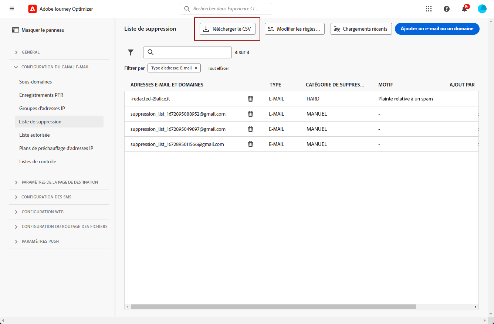

# Gestion de la liste de suppression {#manage-suppression-list}

Avec [!DNL Journey Optimizer], vous pouvez surveiller toutes les adresses e-mail qui sont automatiquement exclues de l&#39;envoi dans un parcours, telles que :

* Adresses non valides (hard bounces).
* Les adresses qui font l’objet de soft bounces systématiques et qui sont susceptibles de nuire à votre réputation en matière d’e-mails si vous continuez à les inclure dans vos diffusions.
* Les destinataires qui déposent une plainte pour spam contre l&#39;un de vos e-mails.

Ces adresses e-mail sont automatiquement collectées dans la **liste de suppression** de Journey Optimizer. Pour en savoir plus sur le concept et l’utilisation de la liste de suppression, consultez [cette section](../reports/suppression-list.md).

## Accès à la liste de suppression {#access-suppression-list}

Pour accéder à la liste détaillée des adresses e-mail exclues, accédez à **[!UICONTROL Administration]** > **[!UICONTROL Canaux]** > **[!UICONTROL Configuration des e-mails]**, puis sélectionnez **[!UICONTROL Liste de suppression]**.

>[!CAUTION]
>
>Les autorisations d’affichage, d’export et de gestion de la liste de suppression sont limitées aux [Administrateurs de Journey](../administration/ootb-product-profiles.md#journey-administrator). Pour en savoir plus sur la gestion des droits d’accès des utilisateurs [!DNL Journey Optimizer], consultez [cette section](../administration/permissions-overview.md).


Des filtres sont disponibles pour vous aider à parcourir la liste.


Vous pouvez filtrer par **[!UICONTROL Catégorie de suppression]**, **[!UICONTROL Type d’adresse]** ou **[!UICONTROL Raison]**. Sélectionnez la ou les options de votre choix pour chaque critère. Une fois sélectionné, vous pouvez effacer chaque filtre ou tous les filtres affichés en haut de la liste.


Si vous ajoutez manuellement une adresse e-mail ou un domaine par erreur, le bouton **[!UICONTROL Supprimer]** permet de supprimer cette entrée.

>[!CAUTION]
>
>N’utilisez jamais le bouton **[!UICONTROL Supprimer]** pour supprimer les adresses e-mails ou domaines supprimés.


La suppression d’une adresse e-mail ou d’un domaine de la liste de suppression signifie que vous recommencerez à délivrer à cette adresse ou à ce domaine. Par conséquent, cela peut avoir de graves répercussions sur votre délivrabilité et votre réputation IP, ce qui peut entraîner le blocage de votre adresse IP ou de votre domaine d’envoi. En savoir plus sur l’importance de la maintenance d’une liste de suppression dans [cette section](../reports/suppression-list.md).

>[!NOTE]
>
>Procédez avec attention lorsque vous envisagez de supprimer une adresse e-mail ou un domaine. En cas de doute, contactez un expert en délivrabilité.

Dans la vue **[!UICONTROL Liste de suppression]**, vous pouvez également modifier les règles de suppression. [En savoir plus](retries.md)

Pour exporter la liste de suppression au format CSV, cliquez sur le bouton **[!UICONTROL Télécharger CSV]**.



## Catégories de suppression et motifs {#suppression-categories-and-reasons}

Lorsqu&#39;un message ne parvient pas à être envoyé à une adresse e-mail, [!DNL Journey Optimizer] détermine les motifs de l&#39;échec de la diffusion et l&#39;associe à une **[!UICONTROL catégorie de suppression]**.

Les catégories de suppression sont les suivantes :

* **Hard** : l&#39;adresse e-mail est immédiatement envoyée à la liste de suppression.

   >[!NOTE]
   >
   >Lorsque l&#39;erreur est le résultat d&#39;une plainte de spam, elle est également classée dans la catégorie **Hard**. L’adresse e-mail du destinataire ayant émis la plainte est immédiatement envoyée à la liste de suppression.

* **Soft** : les erreurs de type Soft envoient une adresse à la liste de suppression une fois que le compteur d&#39;erreurs a atteint le seuil limite. [En savoir plus sur les reprises](retries.md)

* **Manuel** : vous pouvez également ajouter manuellement une adresse e-mail ou un domaine à la liste de suppression. [En savoir plus](#add-addresses-and-domains)

>[!NOTE]
>
>Pour en savoir plus sur les soft bounces et les hard bounces, consultez la section [Types de diffusion en échec](../reports/suppression-list.md#delivery-failures).

Pour chaque adresse e-mail répertoriée, vous pouvez également vérifier le **[!UICONTROL type]** (e-mail ou domaine), le **[!UICONTROL motif]** de son exclusion et la date/l’heure de son ajout à la liste de suppression.


Les motifs possibles d&#39;une diffusion en échec sont les suivants :

| Motif | Description | Catégorie de suppression |
| --- | --- | --- |
| **[!UICONTROL Destinataire non valide]** | Le destinataire n&#39;est pas valide ou n&#39;existe pas. | Hard |
| **[!UICONTROL Soft Bounce]** | Le message a fait l&#39;objet d&#39;un soft bounce pour un motif autre que les erreurs soft répertoriées dans ce tableau, par exemple lors d&#39;un envoi supérieur au taux autorisé recommandé par un FAI. | Soft |
| **[!UICONTROL Échec du DNS]** | Le message a fait l&#39;objet d&#39;un bounce en raison d&#39;un échec du DNS. | Soft |
| **[!UICONTROL Boîte pleine]** | Le message a fait l&#39;objet d&#39;un bounce, car la boîte du destinataire était pleine et ne pouvait pas accepter d&#39;autres messages. | Soft |
| **[!UICONTROL Relais refusé]** | Le message a été bloqué par le destinataire, car le relais n&#39;est pas autorisé. | Soft |
| **[!UICONTROL Réponse au défi]** | Le message est une enquête de réponse au défi. | Soft |
| **[!UICONTROL Plainte relative à un spam]** | Le message a été bloqué car marqué comme étant indésirable par le destinataire. | Hard |

>[!NOTE]
>
>Les utilisateurs désabonnés ne reçoivent pas d&#39;e-mails de [!DNL Journey Optimizer]. Par conséquent, leurs adresses e-mail ne peuvent pas être envoyées à la liste de suppression. Leur choix est géré au niveau d&#39;Experience Platform. [En savoir plus sur la désinscription](../messages/consent.md)

## Ajout manuel d’adresses et de domaines {#add-addresses-and-domains}

Lorsqu’un message ne parvient pas à être envoyé à une adresse e-mail, cette adresse est automatiquement ajoutée à la liste de suppression en fonction de la règle de suppression définie ou du nombre de bounces.

Cependant, vous pouvez également remplir manuellement la liste de suppression [!DNL Journey Optimizer] pour exclure des adresses e-mail et/ou domaines spécifiques de votre envoi.

Vous pouvez ajouter des adresses e-mail ou des domaines [un par un](#add-one-address-or-domain) ou [en masse](#upload-csv-file) par le biais du téléchargement d’un fichier CSV.

Pour cela, cliquez sur le bouton **[!UICONTROL Ajouter un e-mail ou un domaine]**, puis suivez l’une des méthodes ci-dessous.


### Ajout d’une adresse ou d’un domaine {#add-one-address-or-domain}

1. Sélectionnez l’option **[!UICONTROL Un par un]**.

   

1. Choisissez le type d&#39;adresse : **[!UICONTROL Adresse e-mail]** ou **[!UICONTROL Adresse de domaine]**.

1. Saisissez l&#39;adresse e-mail ou le domaine que vous souhaitez exclure de votre envoi.

   >[!NOTE]
   >
   >Veillez à saisir une adresse e-mail (par exemple abc@company) ou un domaine valides (par exemple abc.company.com).

1. Indiquez un motif si nécessaire.

1. Cliquez sur **[!UICONTROL Envoyer]**.

### Téléchargement d’un fichier CSV {#upload-csv-file}

1. Sélectionnez l’option **[!UICONTROL Télécharger CSV]**.

   

1. Téléchargez le modèle CSV à utiliser, qui comprend les colonnes et le format ci-dessous :

   ```
   TYPE,VALUE,COMMENT
   EMAIL,abc@somedomain.com,Comment
   DOMAIN,somedomain.com,Comment
   ```
   Vous pouvez également télécharger ce modèle à partir de la vue principale **[!UICONTROL Liste de suppression]**.

   >[!CAUTION]
   >
   >Ne modifiez pas les noms des colonnes dans le modèle CSV.
   >
   >La taille du fichier ne doit pas dépasser 1 Mo.

1. Remplissez le modèle CSV avec les adresses e-mail et/ou les domaines à ajouter à la liste de suppression.

1. Une fois l’opération terminée, effectuez un glisser-déposer de votre fichier CSV, puis cliquez sur **[!UICONTROL Télécharger le fichier]**.

   

1. Cliquez sur **[!UICONTROL Envoyer]**.

### Vérification du statut des téléchargements récents {#recent-uploads}

Vous pouvez vérifier la liste des fichiers CSV les plus récents que vous avez téléchargés.

Pour ce faire, dans la vue **[!UICONTROL Liste de suppression]**, cliquez sur le bouton **[!UICONTROL Téléchargements récents]**.


Les derniers téléchargements que vous avez envoyés et leurs statuts correspondants s’affichent.

Si un rapport d&#39;erreur est associé à un fichier, vous pouvez le télécharger pour vérifier les erreurs rencontrées.


Vous trouverez ci-dessous un exemple du type d’entrées que vous pouvez trouver dans le rapport d’erreur :

```
type,value,comments,failureReason
Email,examplemail.com,MANUAL,Invalid format for value: examplemail.com
Email,examplemail,MANUAL,Invalid format for value: examplemail
Email,example@mail,MANUAL,Invalid format for value: example@mail
Domain,example,MANUAL,Invalid format for value: example
Domain,example.!com,MANUAL,Invalid format for value: example.!com
Domain,!examplecom,MANUAL,Invalid format for value: !examplecom
```
