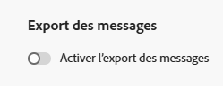

# Exporter le contenu du message {#message-export}

>[!CONTEXTUALHELP]
>id="ajo_admin_msg_export"
>title="Conserver et exporter votre contenu envoyé"
>abstract="La sélection de cette option vous permet d’écrire le contenu de l’e-mail ou du SMS envoyé à l’aide de cette configuration dans un jeu de données [!DNL Experience Platform]. Les enregistrements sont conservés pendant 7 jours calendaires à partir de l’ingestion, pendant lesquels vous pouvez les exporter vers votre propre espace de stockage."

>[!AVAILABILITY]
>
>Cette fonctionnalité est disponible uniquement pour les canaux e-mail et SMS, pour les organisations qui ont acheté l’offre de module complémentaire Exportation de messages . Pour en savoir plus, contactez votre représentant Adobe.

L’**exportation de messages** vous permet de transférer le contenu des e-mails et des SMS envoyés depuis [!DNL Journey Optimizer] vers votre propre stockage via des destinations [!DNL Adobe Experience Platform], ce qui vous permet de diffuser des données provenant de [!DNL Experience Platform] vers des points d’entrée externes. [En savoir plus](https://experienceleague.adobe.com/fr/docs/experience-platform/destinations/home){target="_blank"}

Grâce à cette fonctionnalité, le contenu des e-mails et des SMS envoyés par l’intermédiaire de [!DNL Journey Optimizer] marqués pour l’exportation est écrit dans le jeu de données d’exportation de messages AJO [!DNL Experience Platform]****. [En savoir plus sur les jeux de données](../data/get-started-datasets.md)

Les enregistrements sont ensuite conservés dans le jeu de données pendant sept jours calendaires à compter de l’ingestion, pendant lesquels vous pouvez les exporter vers le système externe de votre choix.

## Mécanismes de sécurisation

* Cette fonctionnalité prend uniquement en charge les canaux **E-mail** et **SMS**.
* Les enregistrements du jeu de données d’exportation de messages d’AJO sont conservés **pendant sept jours calendaires à compter de l’ingestion**.
* Le renvoi n’est pas pris en charge pour les messages envoyés avant l’activation de l’export des messages, comme décrit ci-dessous.

## Activer l’export des messages {#enable-message-export}

Le processus d’intégration de la fonctionnalité d’export de messages comporte deux étapes :

1. [Configurer le flux de données d’export](#set-up-export-dataflow) dans [!DNL Experience Platform] ;
1. [Activer l’export des messages](#config-message-export) au niveau de la configuration du canal dans [!DNL Journey Optimizer].

>[!WARNING]
>
>Seuls les nouveaux enregistrements s’affichent après l’activation des exports et l’envoi des messages. Les renvois de contenu avant la configuration du processus d’export et l’activation de l’option Export des messages ne sont pas pris en charge.

### Configurer le flux de données d’export {#set-up-export-dataflow}

Avant de pouvoir exporter vos données, vous devez configurer le processus d’export en définissant la destination [!DNL Experience Platform] et le jeu de données qui sera utilisé. Suivez les étapes ci-après.

>[!NOTE]
>
>Cette configuration doit être effectuée pour chaque sandbox.

1. Choisissez un [type de destination](https://experienceleague.adobe.com/fr/docs/experience-platform/destinations/destination-types){target="_blank"} Experience Platform. Une liste des plateformes de destination disponibles prêtes à recevoir des données est disponible sur [cette page](https://experienceleague.adobe.com/fr/docs/experience-platform/destinations/catalog/overview){target="_blank"}.

1. Dans [!DNL Experience Platform], configurez votre destination en définissant les informations d’identification, le compartiment/conteneur, le préfixe du chemin d’accès et les options de sécurité. [Voici comment procéder](https://experienceleague.adobe.com/fr/docs/experience-platform/destinations/ui/activate/export-datasets){target="_blank"}

1. Créez un flux d’export de jeu de données à l’aide des données suivantes :

   * Jeu de données source : sélectionnez **jeu de données d’export de messages AJO**.
   * Format de fichier : sélectionnez JSON ou Parquet (choisissez-le en fonction des outils déployés).
   * Planification : assurez-vous qu’elle s’exécute dans la fenêtre de conservation de 7 jours.

### Activer l’export des messages dans la configuration de canal {#config-message-export}

Pour appliquer l’export des messages à vos campagnes et à vos parcours, vous devez activer l’option dédiée au niveau de la configuration des canaux. Suivez les étapes ci-après.

1. Dans [!DNL Journey Optimizer], modifiez ou créez la [configuration de canal](channel-surfaces.md#create-channel-surface) E-mail ou SMS souhaitée.

1. Sélectionnez l’option **[!UICONTROL Activer l’export des messages]**.

   

1. Enregistrez vos modifications et validez votre configuration de canal.

Une fois que vous avez envoyé des messages par le biais de campagnes ou de parcours à l’aide de cette configuration de canal, les e-mails et les SMS sont écrits dans le **Jeu de données d’exportation de messages AJO**. Vous pouvez ensuite [accéder aux enregistrements](#access-exported-data) dans le jeu de données et les exporter vers la destination de stockage sélectionnée en fonction du flux de données d’exportation que vous avez défini.

>[!NOTE]
>
>La désactivation de l’option **[!UICONTROL Activer l’export des messages]** empêche l’ingestion dans le jeu de données de nouveaux enregistrements pour cette configuration de canal. Les enregistrements existants sont conservés jusqu’à l’expiration de la période de rétention.

## Accès aux données de message exportées {#access-exported-data}

Une fois les messages envoyés à l’aide d’une configuration de canal avec l’exportation de messages activée, vous pouvez accéder aux données exportées et les consulter dans le **Jeu de données d’exportation de messages AJO**.

Pour afficher les données de message exportées :

1. Dans [!DNL Journey Optimizer], accédez à **[!UICONTROL Gestion des données]** > **[!UICONTROL Jeux de données]** dans le volet de navigation de gauche. [En savoir plus sur les jeux de données](../data/get-started-datasets.md)

1. Assurez-vous d’afficher les jeux de données générés par le système.

1. Sélectionnez le **Jeu de données d’exportation de messages AJO** dans la liste.

   

1. Sur la page des détails du jeu de données, cliquez sur **[!UICONTROL Prévisualiser le jeu de données]** pour afficher les enregistrements les plus récents.

   

Le jeu de données contient des informations complètes pour chaque message envoyé via la configuration du canal avec l’exportation de messages activée, notamment : l’objet, le corps du message, l’adresse e-mail ou le numéro de téléphone du destinataire, l’adresse ou le numéro de téléphone de l’expéditeur, la date et l’heure d’envoi, les données de personnalisation, etc.

Tous les enregistrements du jeu de données sont conservés pendant **sept jours civils à compter de l’ingestion**. Pendant cette période de conservation, vous pouvez accéder aux données à des fins d’audits de conformité, d’enquêtes juridiques ou les exporter vers votre propre système de stockage via la destination Experience Platform configurée.

