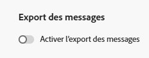
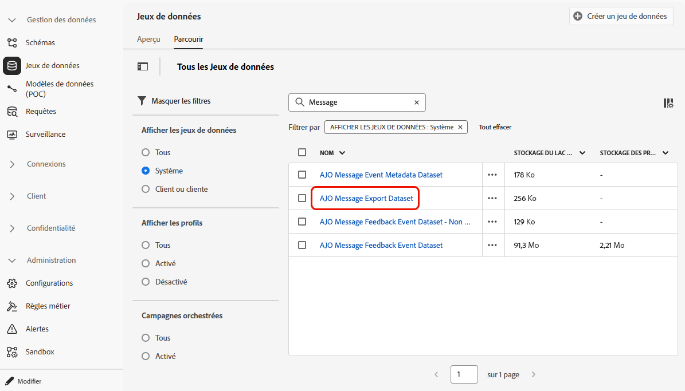
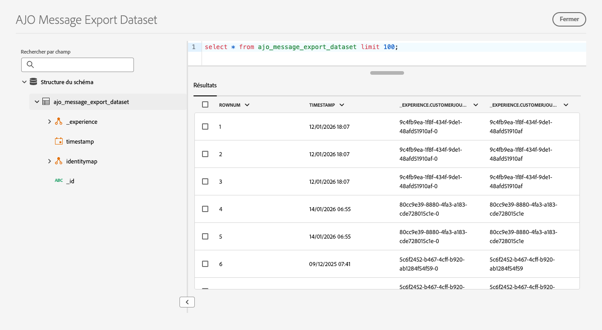

# Exporter le contenu du message {#message-export}

>[!BEGINSHADEBOX]

**Sur cette page :** découvrez comment activer l’exportation de messages dans les configurations de canal e-mail et SMS pour écrire le contenu des messages envoyés dans un jeu de données Adobe Experience Platform et le transférer vers votre propre espace de stockage.

>[!ENDSHADEBOX]

>[!CONTEXTUALHELP]
>id="ajo_admin_msg_export"
>title="Conserver et exporter votre contenu envoyé"
>abstract="La sélection de cette option vous permet d’écrire le contenu de l’e-mail ou du SMS envoyé à l’aide de cette configuration dans un jeu de données [!DNL Experience Platform]. Les enregistrements sont conservés pendant 7 jours calendaires, au cours desquels vous pouvez les exporter vers votre propre espace de stockage."

>[!AVAILABILITY]
>
>Cette fonctionnalité n’est disponible que pour les canaux e-mail et SMS, pour les organisations qui ont acheté l’offre complémentaire d’export des messages. Pour plus d’informations, contactez votre représentant ou représentante Adobe.

**Exportation de messages** vous permet de transférer le contenu des e-mails et des SMS envoyés depuis [!DNL Journey Optimizer] vers votre propre stockage via [[!DNL Adobe Experience Platform] destinations](https://experienceleague.adobe.com/fr/docs/experience-platform/destinations/home){target="_blank"}, ce qui vous permet de diffuser des données à partir de [!DNL Experience Platform] vers des points d’entrée externes.

Grâce à cette fonctionnalité, le contenu des e-mails et des SMS envoyés par l’intermédiaire de [!DNL Journey Optimizer] marqués pour l’exportation est écrit dans le jeu de données d’exportation de messages AJO [[!DNL Experience Platform]](message-export-schema.md).

Les enregistrements sont ensuite conservés dans le jeu de données pendant sept jours calendaires à compter de l’ingestion, pendant lesquels vous pouvez les exporter vers le système externe de votre choix.

➡️ Pour obtenir des questions fréquentes et des réponses, consultez la [FAQ sur l’exportation de messages](#message-export-faq).

## Mécanismes de sécurisation

* Cette fonctionnalité prend uniquement en charge les canaux **E-mail** et **SMS**.
* Les enregistrements du jeu de données d’exportation de messages d’AJO sont conservés **pendant sept jours civils** à compter de l’ingestion.
* Le renvoi n’est pas pris en charge pour les messages envoyés avant l’activation de l’export des messages, comme décrit ci-dessous.

## Activer l&#39;export des messages {#enable-message-export}

Le processus d’intégration de la fonctionnalité d’export de messages comporte deux étapes :

1. [Configurer le flux de données d’export](#set-up-export-dataflow) dans [!DNL Experience Platform] ;
1. [Activer l’export des messages](#config-message-export) au niveau de la configuration du canal dans [!DNL Journey Optimizer].

>[!WARNING]
>
>Seuls les nouveaux enregistrements s’affichent après l’activation des exports et l’envoi des messages. Les renvois de contenu avant la configuration du processus d’export et l’activation de l’option Export des messages ne sont pas pris en charge.

### Configurer le flux de données d’export {#set-up-export-dataflow}

Avant de pouvoir exporter vos données, configurez le processus d’exportation en définissant la destination du [!DNL Experience Platform] et le flux d’exportation du jeu de données.

Pour obtenir des instructions détaillées, les destinations cloud prises en charge, les autorisations requises et des informations supplémentaires, consultez [cette section](../data/export-datasets.md#export-datasets).

>[!NOTE]
>
>Cette configuration doit être effectuée pour chaque sandbox.

1. Choisissez un [type de destination](https://experienceleague.adobe.com/fr/docs/experience-platform/destinations/destination-types){target="_blank"} Experience Platform. Une liste des plateformes de destination disponibles prêtes à recevoir des données est disponible sur [cette page](https://experienceleague.adobe.com/fr/docs/experience-platform/destinations/catalog/overview){target="_blank"}.

1. Dans [!DNL Experience Platform], configurez votre destination en définissant les informations d’identification, le compartiment/conteneur, le préfixe du chemin d’accès et les options de sécurité. [Voici comment procéder](https://experienceleague.adobe.com/fr/docs/experience-platform/destinations/ui/activate/export-datasets){target="_blank"}

1. Créez un flux d’export de jeu de données à l’aide des données suivantes :

   * Jeu de données source : sélectionnez **jeu de données d’export de messages AJO**.
   * Format de fichier : sélectionnez JSON ou Parquet (choisissez-le en fonction des outils déployés).
   * Planification : assurez-vous qu’elle s’exécute dans la fenêtre de conservation de 7 jours.

### Activer l’export des messages dans la configuration des canaux {#config-message-export}

Pour appliquer l’export des messages à vos campagnes et à vos parcours, vous devez activer l’option dédiée au niveau de la configuration des canaux. Suivez les étapes ci-après.

1. Dans [!DNL Journey Optimizer], modifiez ou créez la [configuration de canal](channel-surfaces.md#create-channel-surface) E-mail ou SMS souhaitée.

1. Sélectionnez l’option **[!UICONTROL Activer l’export des messages]**.

   

1. Enregistrez vos modifications et validez votre configuration de canal.

Une fois que vous avez envoyé des messages par le biais de campagnes ou de parcours à l’aide de cette configuration de canal, les e-mails et les SMS sont écrits dans le **Jeu de données d’exportation de messages AJO**. Vous pouvez ensuite [accéder aux enregistrements](#access-exported-data) dans le jeu de données et les exporter vers la destination de stockage sélectionnée en fonction du flux de données d’exportation que vous avez défini.

>[!NOTE]
>
>La désactivation de l’option **[!UICONTROL Activer l’export des messages]** empêche l’ingestion dans le jeu de données de nouveaux enregistrements pour cette configuration de canal. Les enregistrements existants sont conservés jusqu’à l’expiration de la période de rétention.

## Accès aux données de message exportées {#access-exported-data}

Une fois les messages envoyés à l’aide d’une configuration de canal avec l’exportation de messages activée, vous pouvez accéder aux données exportées et les consulter dans le **Jeu de données d’exportation de messages**.

Pour afficher les données de message exportées :

1. Dans [!DNL Journey Optimizer], accédez à **[!UICONTROL Gestion des données]** > **[!UICONTROL Jeux de données]** dans le volet de navigation de gauche. [En savoir plus sur les jeux de données](../data/get-started-datasets.md)

1. Assurez-vous d’afficher les jeux de données générés par le système.

1. Sélectionnez le **Jeu de données d’exportation de messages** dans la liste.

   

1. Sur la page des détails du jeu de données, cliquez sur **[!UICONTROL Prévisualiser le jeu de données]** pour afficher les enregistrements les plus récents.

   

Le jeu de données contient des informations complètes pour chaque message envoyé via la configuration du canal avec l’exportation de messages activée, notamment : l’objet, le corps du message, l’adresse e-mail ou le numéro de téléphone du destinataire, l’adresse ou le numéro de téléphone de l’expéditeur, la date et l’heure d’envoi, les données de personnalisation, etc.

➡️ Pour une vue complète de la structure du jeu de données et de tous les champs disponibles, consultez le [schéma d’exportation de messages AJO](message-export-schema.md).

Tous les enregistrements du jeu de données sont conservés pendant **sept jours calendaires** à compter de l’ingestion. Pendant cette période de conservation, vous pouvez accéder aux données à des fins d’audits de conformité, d’enquêtes juridiques ou les exporter vers votre propre système de stockage via la destination Experience Platform configurée.

## Exemple de fichier JSON exporté {#sample-exported-json}

Les exemples ci-dessous montrent la forme globale des enregistrements écrits dans le Jeu de données d’exportation de messages AJO pour les SMS et les e-mails. Les valeurs telles que les identifiants, les références de schéma, les horodatages et le contenu sont fournies à titre d’illustration. Vos exportations reflètent votre sandbox, votre schéma et les messages envoyés.

Développez chaque section pour afficher l’exemple JSON complet.

+++ Exemple d&#39;export de SMS

```json
{
  "header": {
    "msgId": "f06d2a6d-65c3-472b-9ca7-cc4224af2df4",
    "xactionId": "9ccd6e76-9ee5-4a12-bff3-fea240228121",
    "msgType": "xdmEntityCreate",
    "imsOrgId": "906E3A095DC834230A495FD6@AdobeOrg",
    "sandboxId": "db3adc95-dcf6-49c3-badc-95dcf639c345",
    "sandboxName": "ajo-e2e",
    "createdAt": 1773591102107,
    "datasetId": "689653509dd3432b92f6323f",
    "schemaRef": {
      "id": "https://ns.adobe.com/aemonacpprodcampaign/schemas/64cb5d9d26c2aae6b08bdc9b7882deb90202439ec53836e7",
      "contentType": "application/vnd.adobe.xed-full+json;version=1"
    },
    "source": {
      "name": "message-execution-service"
    },
    "originalTimestamp": 1773591102107,
    "tags": [
      "ups:segmentation=false"
    ]
  },
  "body": {
    "xdmEntity": {
      "_experience": {
        "customerJourneyManagement": {
          "messageExecution": {
            "messageExecutionID": "CSM-09561055",
            "messageID": "15fe77c8-ab73-49e4-abbb-c25b859162ff-0",
            "messageType": "marketing",
            "campaignID": "5638ce57-5264-4a96-995f-5ae34eddafd7",
            "campaignVersionID": "f9019155-3d6a-44a1-9b6f-5f9cd49e7cf5",
            "campaignActionID": "dfa7f59f-477c-42ec-9db2-831d294b5779",
            "batchInstanceID": "5e23a286fb72411f1cdf1443a81ad2eb",
            "messagePublicationID": "15fe77c8-ab73-49e4-abbb-c25b859162ff",
            "audience": {
              "id": "4c339f63-b66e-4e72-8d56-db624b5277f2",
              "type": "targeted"
            }
          },
          "messageProfile": {
            "channel": {
              "_id": "https://ns.adobe.com/xdm/channels/sms",
              "_type": "https://ns.adobe.com/xdm/channel-types/sms"
            },
            "messageProfileID": "7ff5aefb-7583-38c4-8c32-b63cced94aa7",
            "variant": "5c1092da-5ba2-4bcc-b591-713ee7999f7d"
          },
          "messageRenderedContent": {
            "smsContent": {
              "message": "AJO Campaigns - Prod - E2E Test Text VA7"
            }
          },
          "messageDeliveryMetadata": {
            "smsMetadata": {
              "recipient": {
                "number": "+19256260201"
              },
              "sender": {
                "numbers": [
                  "12345678"
                ]
              }
            }
          }
        }
      },
      "identityMap": {
        "email": [
          {
            "id": "rlyajoqa+messageExport1@adobe.com",
            "primary": true
          }
        ]
      },
      "_id": "b0001846-cafa-379a-be96-1d8ee973e047",
      "timestamp": "2026-03-15T16:11:42.184Z"
    }
  }
}
```

+++

+++ Exemple d&#39;export d&#39;email

```json
{
  "header": {
    "msgId": "1e64d2c4-7887-4f80-8b28-5c20d3da8baf",
    "xactionId": "5yfSV2Gs7VJM5TKo1uEkbiDd4iuakgzQ",
    "msgType": "xdmEntityCreate",
    "imsOrgId": "745F37C35E4B776E0A49421B@AdobeOrg",
    "sandboxId": "068abf40-575e-11ea-8512-9b1bfdb82603",
    "sandboxName": "prod",
    "createdAt": 1754489661211,
    "datasetId": "68912b8881572a2b267380c1",
    "schemaRef": {
      "id": "https://ns.adobe.com/cjmstage/schemas/1684477c0160376b8bb6975a80b5e5bd384696329faa1c42",
      "contentType": "application/vnd.adobe.xed-full+json;version=1"
    },
    "source": {
      "name": "message-execution-service"
    },
    "originalTimestamp": 1754489659000,
    "tags": [
      "ups:segmentation=false"
    ]
  },
  "body": {
    "xdmEntity": {
      "_experience": {
        "customerJourneyManagement": {
          "messageExecution": {
            "messageExecutionID": "HUMA-62208933",
            "messageID": "d0d02f68-afea-42fc-b898-6819cee643e6-0",
            "messageType": "transactional",
            "campaignID": "ce2331c2-c259-47ff-a1dd-f6d1eae08801",
            "campaignVersionID": "4272bb9f-e154-44e9-89f1-6548c77d1455",
            "batchInstanceID": "03587190-72cf-11f0-938b-31e7c9f96d89",
            "messagePublicationID": "d0d02f68-afea-42fc-b898-6819cee643e6",
            "audience": {
              "type": "all"
            }
          },
          "messageProfile": {
            "channel": {
              "_id": "https://ns.adobe.com/xdm/channels/email",
              "_type": "https://ns.adobe.com/xdm/channel-types/email"
            },
            "messageProfileID": "5yfSV2Gs7VJM5TKo1uEkbiDd4iuakgzQ",
            "variant": "11cc5796-8017-4738-aa66-ca5db967dfcc"
          },
          "messageRenderedContent": {
            "emailContent": {
              "subject": "test",
              "html": "xxx"
            }
          },
          "messageDeliveryMetadata": {
            "emailMetadata": {
              "recipient": {
                "email": "himanshig@adobe.com"
              },
              "sender": {
                "email": "cjm-team@e2e-personalisation.test.cjmadobe.com",
                "name": "CJM team",
                "replyToEmail": "replyto@marketing.adobecjm.com",
                "replyToName": "replyto",
                "errorEmail": "replyto@e2e-personalisation.test.cjmadobe.com"
              }
            }
          }
        }
      },
      "identityMap": {
        "email": [
          {
            "id": "chijain@adobe.com",
            "primary": true
          }
        ]
      },
      "_id": "ea48ce1b-80c9-3c6a-b05f-d1c998989e02",
      "timestamp": "2025-08-06T14:14:22.814Z"
    }
  }
}
```

+++

## FAQ sur l’exportation de messages {#message-export-faq}

+++ Qu’est-ce que l’exportation de messages ?

L’exportation de messages permet aux clients d’exporter des messages entièrement rendus (e-mails et SMS) qui ont été envoyés aux utilisateurs finaux. Les données exportées peuvent être diffusées vers des destinations externes à l’aide des fonctionnalités d’exportation de [!DNL Adobe Experience Platform] standard (AEP) et utilisées à des fins d’archivage, de vérification de la conformité, d’analyse ou d’intégrations en aval.

+++

+++ Quels canaux sont pris en charge ?

L’exportation de messages prend en charge les éléments suivants :

* E-mail
* SMS

+++

+++ Quelles données Message Export génère-t-il ?

L’exportation de messages crée dans [!DNL Adobe Experience Platform] un jeu de données généré par le système qui contient un instantané du message au moment de l’envoi. Ce jeu de données peut ensuite être exporté vers des destinations prises en charge (par exemple, un espace de stockage dans le cloud ou des systèmes tiers).

L’exportation de messages est conçue comme un mécanisme permettant aux clients de déplacer les données de messages en dehors des systèmes Adobe. Les clients sont chargés de transformer, de stocker et de gérer les données dans leurs propres solutions d’archivage ou de conformité.

+++

+++ L’exportation de messages capture-t-elle des messages entièrement personnalisés ?

Oui. L’exportation de messages capture le message entièrement généré envoyé à chaque destinataire, y compris la personnalisation et le contenu dynamique tel qu’il est généré au moment de l’envoi.

+++

+++ L&#39;export de message peut-il être utilisé pour reproduire le message d&#39;origine ?

Oui. L’HTML exportée peut être utilisée pour reproduire le message envoyé d’origine dans un navigateur.

Toutefois, la reproduction dépend de la disponibilité des ressources hébergées en externe (telles que les images). L’exportation de messages n’incorpore pas directement les fichiers multimédias dans l’exportation.

+++

+++ Les images et les médias sont-ils inclus dans l’exportation ?

L’exportation de messages comprend du contenu HTML avec des références (URL) aux images et à d’autres médias. Les ressources multimédias ne sont pas incorporées dans l’exportation.

Si une image ou une URL de ressource devient non valide, restreinte ou dépubliée après l’heure d’envoi, Message Export ne peut pas récupérer cette ressource.

+++

+++ Comment les liens sont-ils gérés dans l&#39;exportation de messages ?

Les messages exportés contiennent des liens suivis chiffrés, conformément à la manière dont les liens sont traités au moment de l&#39;envoi. Ces liens chiffrés sont conservés dans l’exportation et peuvent être résolus comme prévu par la plateforme.

+++

+++ Comment les informations d’identification personnelles et les données de personnalisation sont-elles gérées ?

Les données sont stockées exactement comme elles apparaissent dans le message rendu :

* Les valeurs Personalization rendues dans le message (par exemple, prénom) apparaissent sous forme de texte.
* Les éléments chiffrés (tels que les liens trackés) restent chiffrés.
* L’exportation de messages ne rend pas automatiquement anonyme ni ne rédige le contenu des messages.

+++

+++ Quelle est la période de conservation des données d’exportation de messages ?

Les données d’exportation de messages suivent une période de conservation de 7 jours dans [!DNL Adobe Experience Platform].

Les clients doivent exporter les données au cours de cette période et les stocker dans leurs propres systèmes si une conservation plus longue est nécessaire.

+++

+++ Les clients peuvent-ils tester l’exportation de messages avant d’effectuer leur achat ?

Il n’existe pas d’option d’essai ou d’option « essayer avant d’acheter » pour l’exportation de messages.

Les clients peuvent valider leurs systèmes en aval à l’aide d’exemples de fichiers d’exportation, car l’exportation des messages repose sur les fonctionnalités standard des jeux de données et des destinations AEP.

+++

+++ Le schéma Exportation des messages est-il disponible avant l’achat ?

Non. Le jeu de données et le schéma d’exportation de messages ne sont disponibles dans le produit qu’après l’achat et l’activation du module complémentaire d’exportation de messages.

+++

+++ Message Export est-il une solution complète d’archivage ou de conformité ?

Non. L’exportation de messages est un activateur, et non un produit d’archivage ou de conformité complet.

Les clients sont censés :

* Exporter les données de message depuis Adobe
* Transformation ou enrichissement selon les besoins
* Stocker et gérer les données dans leurs propres systèmes d’archivage ou de conformité

+++

+++ Quels sont les cas d’utilisation courants ?

Les clients utilisent généralement l’exportation de messages pour :

* Examen de la réglementation ou de la conformité
* Archivage des messages
* Intégration à des systèmes tiers
* Workflows d’audit interne ou d’assistance
* Analytics au-delà des applications Adobe

+++

+++ Ce que ne fait pas l’exportation de messages

L’exportation de messages ne :

* Incorporer des images ou des ressources multimédias externes
* Assurer la conservation illimitée ou à long terme des données dans les systèmes Adobe
* Offrir un environnement d’évaluation
* Archiver automatiquement les messages en dehors d’Adobe

+++

