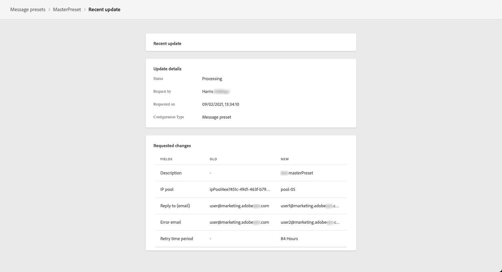
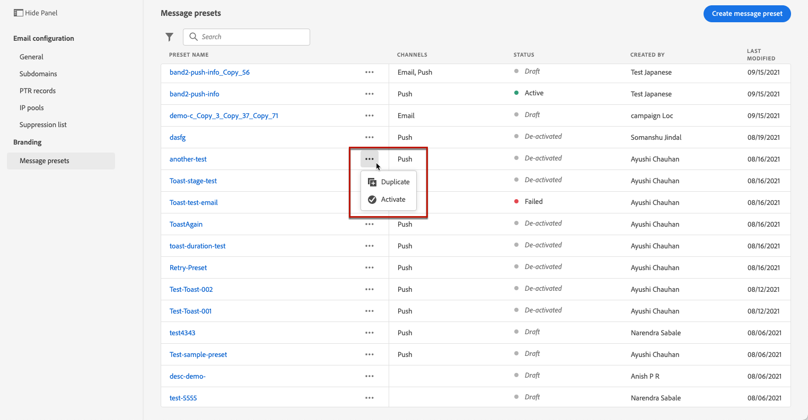

# Création de préréglages de message

Avec [!DNL Journey Optimizer], vous pouvez configurer des préréglages de message qui définissent tous les paramètres techniques requis pour les messages de notification par e-mail et push : type d&#39;e-mail, nom et adresse e-mail de l&#39;expéditeur, applications mobiles, etc.

>[!CAUTION]
>
> * La configuration des préréglages de message est limitée aux administrateurs de parcours. [En savoir plus](../administration/ootb-product-profiles.md#journey-administrator)
>
> * Vous devez effectuer la configuration des emails et [Configuration push](../push-configuration.md) étapes avant de créer des paramètres prédéfinis de message.

Une fois les préréglages de message configurés, vous pourrez les sélectionner dans la liste **[!UICONTROL Préréglages]** lors de la création de messages.

➡️ [Découvrez comment créer et utiliser des préréglages d’e-mail dans cette vidéo](#video-presets)

## Création d&#39;un préréglage de message {#create-message-preset}

Pour créer un préréglage de message, procédez comme suit :

1. Accédez au **[!UICONTROL Canaux]** > **[!UICONTROL Marques]** > **[!UICONTROL Paramètres prédéfinis de message]** , puis cliquez sur **[!UICONTROL Créer un paramètre prédéfini de message]**.

   

1. Saisissez un nom et une description (facultatif) pour le paramètre prédéfini, puis sélectionnez le ou les canaux à configurer.

   

   >[!NOTE]
   >
   > Les noms doivent commencer par une lettre (A-Z). Ils ne peuvent contenir que des caractères alphanumériques. Vous pouvez également utiliser le trait de soulignement `_`, le point`.` et le trait d&#39;union `-`.

1. Configurez les paramètres d’**e-mail**.

   

   * Sélectionnez le type de message qui sera envoyé avec le paramètre prédéfini : **Transactionnel** ou **Marketing**.

      >[!CAUTION]
      >
      > Les messages **transactionnels** peuvent être envoyés aux profils qui se sont désabonnés des communications marketing. Ces messages ne peuvent être envoyés que dans des contextes spécifiques, tels que la réinitialisation du mot de passe, le statut de la commande, la notification de diffusion, par exemple.

   * Sélectionnez le sous-domaine à utiliser pour envoyer les e-mails. [En savoir plus](about-subdomain-delegation.md)
   * Sélectionnez le pool d&#39;adresses IP à associer au paramètre prédéfini. [En savoir plus](ip-pools.md)
   * Renseignez les paramètres d’en-tête des e-mails envoyés à l’aide du préréglage.

      >[!CAUTION]
      >
      >Les adresses électroniques doivent utiliser la sélection actuelle [sous-domaine délégué](about-subdomain-delegation.md).

      <!--CAUTION: Except for the **Reply to (forward email)** field-->

      * **[!UICONTROL Nom de l&#39;expéditeur]**: Nom de l’expéditeur, tel que le nom de votre marque.

      * **[!UICONTROL E-mail de l&#39;expéditeur]** : adresse e-mail que vous souhaitez utiliser pour vos communications. Par exemple, si le sous-domaine délégué est *marketing.luma.com*, vous pouvez utiliser *contact@marketing.luma.com*.

      * **[!UICONTROL Répondre à (nom)]** : le nom qui sera utilisé lorsque le destinataire clique sur le bouton **Répondre** de son logiciel de messagerie.

      * **[!UICONTROL Répondre à (e-mail)]** : adresse e-mail qui sera utilisée lorsque le destinataire clique sur le bouton **Répondre** de son logiciel de messagerie. <!--The emails sent to this address will be forwarded to the **[!UICONTROL Reply to (forward email)]** address provided below. -->Vous devez utiliser une adresse définie sur le sous-domaine délégué (par exemple, *reply@marketing.luma.com*), sinon les e-mails seront ignorés.

      * **[!UICONTROL Message d&#39;erreur]** : toutes les erreurs générées par les FAI après quelques jours de diffusion de l&#39;e-mail (bounces asynchrones) sont reçues sur cette adresse.

      <!--**[!UICONTROL Reply to (forward email)]**: All emails received by [!DNL Journey Optimizer] for the delegated subdomain will be forwarded to this email address. You can specify any address, except an email address defined on the delegated subdomain. For example, if the delegated subdomain is *marketing.luma.com*, any address like *abc@marketing.luma.com* is prohibited.-->

      >[!NOTE]
      >
      >A partir de la version d’octobre 2021, il n’est plus possible de définir une adresse électronique de transfert à partir de la [!DNL Journey Optimizer] de l’interface utilisateur. Si vous souhaitez que tous les emails soient reçus par [!DNL Journey Optimizer] pour que le sous-domaine délégué soit transféré vers une adresse électronique spécifique, contactez le [Équipe d’assistance clientèle d’Adobe](https://helpx.adobe.com/fr/enterprise/admin-guide.html/enterprise/using/support-for-experience-cloud.ug.html){target=&quot;_blank&quot;}. <!--move to Deprecated features section when created?-->

      

      >[!NOTE]
      >
      >Les noms doivent commencer par une lettre (A-Z). Ils ne peuvent contenir que des caractères alphanumériques. Vous pouvez également utiliser le trait de soulignement `_`, le point`.` et le trait d&#39;union `-`.

   * Configurez les **paramètres de reprise d’e-mail**. Par défaut, la [période de reprise](retries.md#retry-duration) est définie sur 84 heures, mais vous pouvez ajuster ce paramètre pour mieux l’adapter à vos besoins.

      

      Vous devez saisir une valeur entière (en heures ou minutes) dans la plage suivante :
      * Pour le type d’e-mail marketing, la période de reprise minimale est de 6 heures.
      * Pour le type d’e-mail transactionnel, la période de reprise minimale est de 10 minutes.
      * Pour les deux types d’e-mail, la période de reprise maximale est de 84 heures (soit 5 040 minutes).

1. Configurez les paramètres de **notification push**.

   

   * Sélectionnez au moins une plateforme : **iOS** et/ou **Android**.

   * Sélectionnez les applications mobiles à utiliser pour chaque plateforme.

      Pour plus d&#39;informations sur la configuration de votre environnement pour envoyer des notifications push, consultez [cette section](../push-gs.md).

1. Une fois tous les paramètres configurés, cliquez sur **[!UICONTROL Envoyer]** pour confirmer. Vous pouvez également enregistrer le préréglage de message en tant que version préliminaire et reprendre sa configuration ultérieurement.

   

1. Une fois le préréglage de message créé, il s&#39;affiche dans la liste avec le statut **[!UICONTROL Traitement]**.

   Au cours de cette étape, plusieurs vérifications seront effectuées afin de vérifier qu&#39;il a été correctement configuré. Le temps de traitement est proche **48h à 72h**, et peuvent prendre jusqu’à **7 à 10 jours ouvrés**.

   Ces contrôles incluent les tests de délivrabilité effectués par l&#39;équipe chargée de la délivrabilité d&#39;Adobe :

   * Validation SPF
   * Validation DKIM
   * Validation des enregistrements MX
   * Vérification de la liste bloquée des adresses IP
   * Vérification de l&#39;hôte Helo
   * Vérification du pool d&#39;adresses IP
   * Enregistrement A/PTR, vérification du sous-domaine t/m/res

   >[!NOTE]
   >
   >Si les vérifications ne réussissent pas, découvrez les raisons possibles de l’échec dans [cette section](#monitor-message-presets).

1. Une fois les vérifications effectuées, le préréglage de message obtient le statut **[!UICONTROL Actif]**. Il est prêt à être utilisé pour diffuser des messages.

   <!-- later on, users will be notified in Pulse -->

   

## Surveillance des préréglages de message {#monitor-message-presets}

Tous vos paramètres de message prédéfinis s’affichent dans la variable **[!UICONTROL Canaux]** > **[!UICONTROL Paramètres prédéfinis de message]** . Des filtres sont disponibles pour vous aider à parcourir la liste (type de canal, utilisateur, statut).

Les préréglages de message peuvent avoir les statuts suivants :

* **[!UICONTROL Version préliminaire]** : le préréglage de message a été enregistré en tant que version préliminaire et n&#39;a pas encore été envoyé. Ouvrez-le pour reprendre la configuration.
* **[!UICONTROL Traitement]** : le préréglage de message a été envoyé et passe par plusieurs étapes de vérification.
* **[!UICONTROL Actif]** : le préréglage de message a été vérifié et peut être sélectionné pour créer des messages.
* **[!UICONTROL Échec]** : une ou plusieurs vérifications ont échoué lors de la vérification du préréglage de message.
* **[!UICONTROL Désactivé]**: Le paramètre prédéfini du message est désactivé. Il ne peut pas être utilisé pour créer de nouveaux messages.

En cas d’échec de la création d’un préréglage de message, les détails de chaque raison d’échec possible sont décrits ci-dessous.

Si l’une de ces erreurs se produit, contactez l’[équipe d’assistance clientèle d’Adobe](https://helpx.adobe.com/enterprise/admin-guide.html/enterprise/using/support-for-experience-cloud.ug.html){target=&quot;_blank&quot;} pour obtenir de l’aide.

* **Échec de la validation SPF** : SPF (Sender Policy Framework) est un protocole d’authentification d’e-mail qui permet de spécifier des adresses IP autorisées pouvant envoyer des e-mails à partir d’un sous-domaine donné. L’échec de validation SPF signifie que les adresses IP contenues dans l’enregistrement SPF ne correspondent pas aux adresses IP utilisées pour envoyer les e-mails aux fournisseurs de messagerie.

* **Échec de la validation DKIM** : DKIM (DomainKeys Identified Mail) permet au serveur destinataire de vérifier que le message reçu a été envoyé par l’expéditeur véritable du domaine associé et que le contenu du message d’origine n’a pas été modifié en cours de route. L’échec de validation DKIM signifie que les serveurs de messagerie de réception ne peuvent pas vérifier l’authenticité du contenu du message et son association avec le domaine d’envoi.:

* **Échec de la validation des enregistrements MX** : l’échec de la validation des enregistrements MX (Mail eXchange) signifie que les serveurs de messagerie chargés d’accepter les e-mails entrants pour le compte d’un sous-domaine donné ne sont pas correctement configurés.

* **Échec des configurations de délivrabilité** : l’échec des configurations de délivrabilité peut être dû à l’une des raisons suivantes :
   * Placement sur liste bloquée des adresses IP allouées
   * Nom `helo` non valide
   * E-mails envoyés à partir d’adresses IP autres que celles spécifiées dans le groupe d’adresses IP du préréglage correspondant
   * Impossibilité de diffuser des e-mails vers les boîtes de réception des principaux FAI tels que Gmail et Yahoo

## Modifier un paramètre prédéfini de message {#edit-message-preset}

Pour modifier un paramètre prédéfini de message, procédez comme suit.

>[!NOTE]
>
>Vous ne pouvez pas modifier la variable **[!UICONTROL Paramètres des notifications push]**. Si un paramètre prédéfini de message n&#39;est configuré que pour le canal Notification push , il n&#39;est pas modifiable.

1. Dans la liste, cliquez sur le nom d’un paramètre prédéfini de message pour l’ouvrir.

   

1. Modifiez ses propriétés selon vos besoins.

   >[!NOTE]
   >
   >Si un paramètre prédéfini de message comporte la variable **[!UICONTROL Principal]** le statut, **[!UICONTROL Nom]**, **[!UICONTROL Sélectionner le canal]** et **[!UICONTROL Subdomain]** Les champs sont grisés et ne peuvent pas être modifiés.

1. Cliquez sur **[!UICONTROL Envoyer]** pour confirmer vos modifications.

   

   >[!NOTE]
   >
   >Vous pouvez également enregistrer le paramètre prédéfini de message en tant que brouillon et reprendre la mise à jour ultérieurement.

Une fois les modifications envoyées, le paramètre de message prédéfini passe par un cycle de validation similaire à celui en place lorsque [création d’un paramètre prédéfini](#create-message-preset).

Pour les paramètres prédéfinis de message qui ont la variable **[!UICONTROL Principal]** , vous pouvez vérifier les détails de la mise à jour. Pour ce faire :

* Cliquez sur le bouton **[!UICONTROL Mise à jour récente]** qui s’affiche en regard du nom principal du paramètre prédéfini.

   

* Vous pouvez également accéder aux détails de la mise à jour depuis un principal paramètre prédéfini de message pendant la mise à jour.

   

Sur le **[!UICONTROL Mise à jour récente]** vous pouvez voir des informations telles que le statut de la mise à jour,<!--the approximate remaining time before completion (if validation is in progress)--> et la liste des modifications demandées.

### Mise à jour des états {#update-statuses}

Une mise à jour de paramètre prédéfini de message peut avoir les états suivants :

* **[!UICONTROL Traitement]**: La mise à jour du paramètre prédéfini de message a été envoyée et passe par plusieurs étapes de vérification.
* **[!UICONTROL Succès]**: Le paramètre prédéfini de message mis à jour a été vérifié et peut être sélectionné pour créer des messages.
* **[!UICONTROL En échec]**: Une ou plusieurs vérifications ont échoué lors de la vérification de la mise à jour des paramètres prédéfinis du message.

**En cours de traitement**

Plusieurs contrôles de délivrabilité seront effectués pour vérifier que le paramètre prédéfini a été correctement mis à jour. Le temps de traitement est proche **48h à 72h**, et peuvent prendre jusqu’à **7 à 10 jours ouvrés**. En savoir plus sur les contrôles effectués lors du cycle de validation dans [cette section](#create-message-preset).

>[!NOTE]
>
>Vous ne pouvez pas modifier un paramètre prédéfini de message pendant la mise à jour. Vous pouvez toujours cliquer sur son nom, mais tous les champs sont grisés. Les modifications ne seront pas répercutées tant que la mise à jour n’aura pas été effectuée correctement.

Si vous modifiez un paramètre prédéfini qui était déjà principal :

* Son statut reste **[!UICONTROL Principal]** pendant que le processus de validation est en cours.

* Le **[!UICONTROL Mise à jour récente]** s’affiche en regard du nom du paramètre prédéfini dans la liste des paramètres prédéfinis de message.

* Pendant le processus de validation, les messages configurés à l’aide de ce paramètre prédéfini utilisent toujours l’ancienne version du paramètre prédéfini.

**Succès**

Une fois le processus de validation réussi, la nouvelle version du paramètre prédéfini est automatiquement utilisée dans tous les messages utilisant ce paramètre prédéfini. Cependant, vous devrez peut-être attendre :
* quelques minutes avant qu&#39;il soit consommé par les messages unitaires ;
* jusqu’au lot suivant pour que le paramètre prédéfini soit efficace dans les messages par lots.

<!--Changes made to a message preset with the **[!UICONTROL Active]** status will automatically be applied to all messages currently using this preset.-->

**Échec**

Si le processus de validation échoue, l’ancienne version du paramètre prédéfini est toujours utilisée.

Les types d&#39;erreur de mise à jour possibles sont les suivants :
* **Erreur d’autorisation**: le jeton porteur n’est pas valide ou n’est pas autorisé.
* **Modification illégale**: une modification a été effectuée sur un ou plusieurs champs non autorisés.
* **Échec de la condition**: certains champs ne peuvent avoir que des valeurs spécifiques, ce qui n’a pas été fait.

<!--Learn more on the possible failure reasons in [this section](#monitor-message-presets).-->

En cas d’échec de la mise à jour, le paramètre prédéfini est à nouveau modifiable. Vous pouvez cliquer sur son nom et mettre à jour les paramètres à corriger.

## Désactivation d’un paramètre prédéfini de message {#deactivate-preset}

Pour créer un **[!UICONTROL Principal]** paramètre de message prédéfini non disponible pour créer des messages, vous pouvez le désactiver. Toutefois, les messages publiés utilisant ce paramètre prédéfini ne seront pas affectés et continueront à fonctionner.

>[!NOTE]
>
>Vous ne pouvez pas désactiver un paramètre prédéfini de message pendant le traitement d’une mise à jour. Vous devez attendre que la mise à jour soit réussie ou qu’elle ait échoué. En savoir plus sur [modification des paramètres prédéfinis de message](#edit-message-preset) et sur le [mettre à jour les états](#update-statuses).

1. Accédez à la liste des paramètres prédéfinis du message.

1. Pour le paramètre prédéfini principal de votre choix, cliquez sur le **[!UICONTROL Autres actions]** bouton .

1. Sélectionner **[!UICONTROL Désactiver]**.

   

>[!NOTE]
>
>Les préréglages de message désactivés ne peuvent pas être supprimés afin d&#39;éviter tout problème dans les parcours les utilisant pour envoyer des messages.

Vous ne pouvez pas modifier directement un paramètre prédéfini de message désactivé. Cependant, vous pouvez le dupliquer et modifier la copie pour créer une version que vous utiliserez pour créer de nouveaux messages. Vous pouvez également l’activer à nouveau et attendre que la mise à jour soit réussie pour la modifier.

<!--1. Access the message presets list.

1. Deactivate the message preset that you want to edit.

1. Duplicate the deactivated message preset. A copy with the **[!UICONTROL Draft]** status is automatically added to the list.

    

1. Open the duplicated message preset, modify it according to your needs, then submit your changes. The message preset will go through the same validation cycle as during the [creation step](#create-message-preset).

1. Once validated, it gets the **[!UICONTROL Active]** status and is ready to be used to create new messages.-->

## Vidéo pratique{#video-presets}

Découvrez comment créer des préréglages de message et les utiliser. Apprenez également comment déléguer un sous-domaine et créer un pool d’adresses IP.

>[!VIDEO](https://video.tv.adobe.com/v/334343?quality=12)
