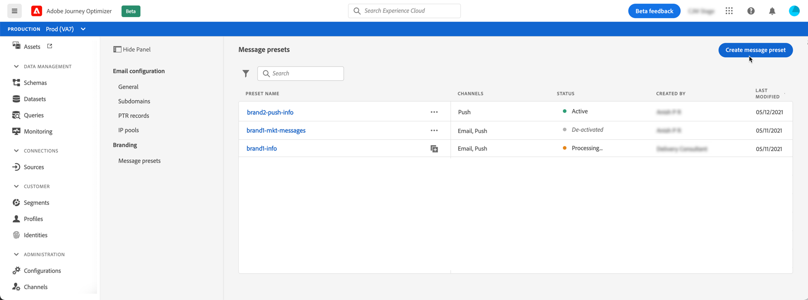
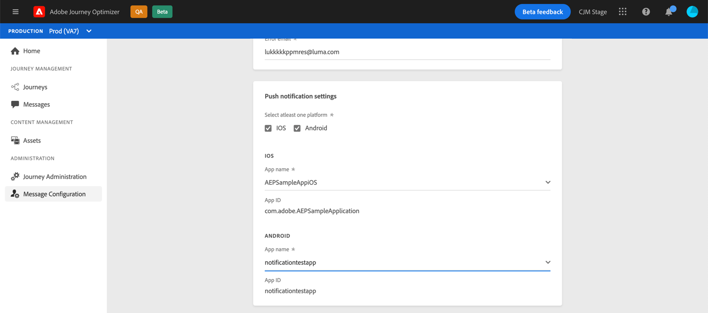
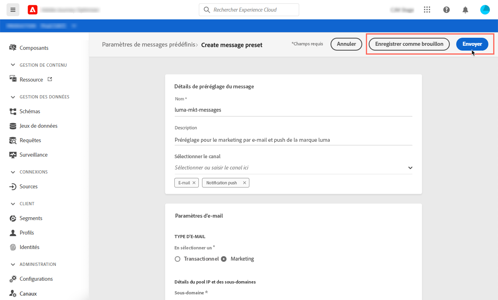
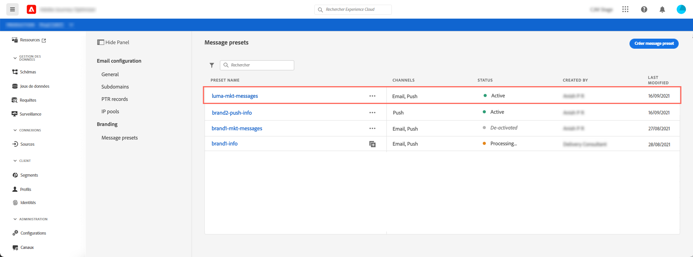
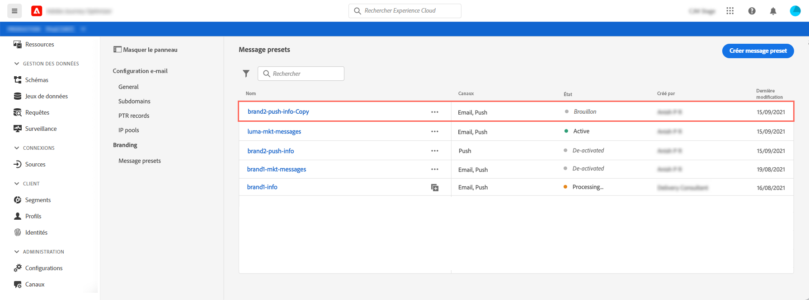

# Création de paramètres prédéfinis de message

Journey Optimizer vous permet de configurer des paramètres prédéfinis de message qui définissent tous les paramètres techniques requis pour les messages de notification par courrier électronique et push (type de courrier électronique, nom et adresse électronique de l’expéditeur, applications mobiles, etc.).

Vous pouvez configurer autant de paramètres prédéfinis de message que vous le souhaitez, en fonction des différentes marques pour lesquelles vous devez communiquer.

Une fois les paramètres prédéfinis de message configurés, vous pouvez les sélectionner lors de la création de messages à partir de la liste **[!UICONTROL Paramètres prédéfinis]**.

## Créer un paramètre prédéfini de message {#create-message-preset}

Pour créer un paramètre prédéfini de message, procédez comme suit :

1. Accédez au menu **[!UICONTROL Canaux]** / **[!UICONTROL Paramètres prédéfinis de message]**, puis cliquez sur **[!UICONTROL Créer un paramètre prédéfini de message]**.

   

1. Attribuez un nom et une description (facultatif) au paramètre prédéfini, puis spécifiez le ou les canaux à configurer.

   

1. Configurez les paramètres de notification par courrier électronique et de notification Push :

   Pour le canal de courriel, spécifiez :

   * Type de communication qui sera envoyée avec le paramètre prédéfini (messages transactionnels ou marketing),
   * Le [sous-domaine](about-subdomain-delegation.md) à utiliser pour envoyer des courriers électroniques,
   * Le [pool IP](ip-pools.md) à lier au paramètre prédéfini,
   * Paramètres d’en-tête à utiliser pour vos courriers électroniques envoyés à l’aide du paramètre prédéfini.

   

   Pour le canal de notification Push, spécifiez les applications mobiles IOS et/ou Android à utiliser pour vos messages. Pour plus d&#39;informations sur la configuration de votre environnement pour envoyer des notifications Push, consultez [cette section](../push-configuration.md).

   

1. Une fois tous les paramètres configurés, cliquez sur **[!UICONTROL Envoyer]** pour confirmer. Vous pouvez également enregistrer le paramètre prédéfini de message en tant que brouillon et reprendre sa configuration ultérieurement.

   

1. Une fois le paramètre prédéfini de message créé, il s’affiche dans la liste avec l’état **[!UICONTROL Traitement]**.

   Au cours de cette étape, plusieurs vérifications seront effectuées pour vérifier qu’il a été correctement configuré. Le temps de traitement est d&#39;environ 48h-72h, et peut prendre jusqu&#39;à 7-10 jours.

   Ces vérifications comprennent les tests de délivrabilité effectués par l&#39;équipe de délivrabilité des Adobes :

   * validation SPF,
   * Validation DKIM,
   * validation d&#39;enregistrement MX,
   * Vérifier la liste bloquée des adresses IP,
   * Vérification de l&#39;hôte d&#39;hélice,
   * vérification du pool d&#39;adresses IP,
   * Enregistrement A/PTR, vérification du sous-domaine t/m/res.

1. Une fois les vérifications effectuées, vous êtes informé par une notification **[!DNL Journey Optimizer]** et le message prédéfini obtient l’état **[!UICONTROL Principal]**. Il est maintenant prêt à être utilisé pour diffuser des messages.

   

## Surveillance des paramètres prédéfinis des messages

Tous vos paramètres prédéfinis de message s’affichent dans le menu **[!UICONTROL Canaux]** / **[!UICONTROL Paramètres prédéfinis de message]**. Des filtres sont disponibles pour vous aider à parcourir la liste (type de canal, utilisateur, état).

Les paramètres prédéfinis de message peuvent présenter les états suivants :

* **[!UICONTROL Version préliminaire]** : Le paramètre prédéfini de message a été enregistré en tant que brouillon et n’a pas encore été envoyé. Ouvrez-la pour reprendre la configuration.
* **[!UICONTROL Traitement]** : Le paramètre prédéfini de message a été envoyé et passe par plusieurs étapes de vérification.
* **[!UICONTROL Principal]** : Le paramètre prédéfini de message a été vérifié et peut être sélectionné pour créer des messages.
* **[!UICONTROL Échec]** : Une ou plusieurs vérifications ont échoué lors de la vérification des paramètres prédéfinis du message.
* **[!UICONTROL Désactivé]** : Le paramètre prédéfini de message est désactivé. Il ne peut pas être utilisé pour créer des messages.

## Modifier les paramètres prédéfinis de message

Pour modifier un paramètre prédéfini de message, vous devez d’abord le désactiver afin qu’il ne soit pas disponible pour créer de nouveaux messages (les messages publiés utilisant ce paramètre prédéfini ne seront pas affectés et continueront à fonctionner). Vous devez ensuite duplicata le paramètre prédéfini de message pour créer une nouvelle version à utiliser pour créer de nouveaux messages :

1. Accédez à la liste des paramètres prédéfinis du message, puis désactivez le paramètre prédéfini du message que vous souhaitez modifier.

   

1. Duplicata du paramètre prédéfini de message désactivé. Une copie avec l&#39;état **[!UICONTROL Brouillon]** est automatiquement ajoutée à la liste.

   

1. Ouvrez le paramètre prédéfini de message dupliqué, modifiez-le en fonction de vos besoins, puis envoyez vos modifications. Le paramètre prédéfini de message passe par le même cycle de validation que lors de l’[étape de création](#create-message-preset).

1. Une fois validé, il obtient l&#39;état **[!UICONTROL Principal]** et est prêt à être utilisé pour créer de nouveaux messages.

<!--que fait-on ensuite avec l'ancienne version deactivated: reste là pour être utilisée par les anciens messages?). quand un deactivate preset est-il enlevé de la liste?-->
