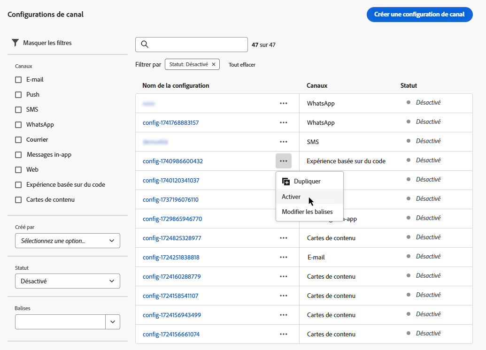

# Création de préréglages de message {#message-presets-creation}

Avec [!DNL Journey Optimizer], vous pouvez configurer des préréglages de message qui définissent tous les paramètres techniques requis pour les messages de notification par e-mail et push : type d&#39;e-mail, nom et adresse e-mail de l&#39;expéditeur, applications mobiles, etc.

>[!CAUTION]
>
> * Pour créer, modifier et supprimer des préréglages de message, vous devez disposer de l’autorisation [Gestion des préréglages de message](../administration/high-low-permissions.md#manage-message-presets).
>
> * Vous devez effectuer les étapes de [configuration du canal e-mail](#configure-email-settings) et de [configuration Push](../configuration/push-configuration.md) avant de créer des préréglages de message.

Une fois les préréglages de message configurés, vous pourrez les sélectionner dans la liste **[!UICONTROL Préréglages]** lors de la création de messages.

➡️ [Découvrez comment créer et utiliser des préréglages d’e-mail dans cette vidéo](#video-presets)

## Création d&#39;un préréglage de message {#create-message-preset}

>[!CONTEXTUALHELP]
>id="ajo_admin_message_presets"
>title="Détails et paramètres du préréglage de message"
>abstract="En configurant un préréglage de message, vous pouvez sélectionner le canal auquel il s’applique et définir tous les paramètres techniques requis pour vos messages, tels que le type d’e-mail, le sous-domaine à utiliser, le nom de l’expéditeur, les applications mobiles, etc."

Pour créer un préréglage de message, procédez comme suit :

1. Accédez au menu **[!UICONTROL Canaux]**/**[!UICONTROL Marques]**/**[!UICONTROL Préréglages de message]**, puis cliquez sur **[!UICONTROL Créer un préréglage de message]**. 

   

1. Saisissez un nom et une description (facultatif) pour le préréglage, puis sélectionnez le ou les canaux à configurer.

   

   >[!NOTE]
   >
   > Les noms doivent commencer par une lettre (A-Z). Ils ne peuvent contenir que des caractères alphanumériques. Vous pouvez également utiliser le trait de soulignement `_`, le point`.` et le trait d&#39;union `-`.

1. Configurez les paramètres d’**e-mail**. [En savoir plus](#configure-email-settings)

1. Configurez les paramètres de **notification push**. [En savoir plus](#configure-push-settings)

   <!--Configure SMS settings. [Learn more](#configure-sms-settings) -->

1. Une fois tous les paramètres configurés, cliquez sur **[!UICONTROL Envoyer]** pour confirmer. Vous pouvez également enregistrer le préréglage de message en tant que brouillon et reprendre sa configuration ultérieurement.

   

   >[!NOTE]
   >
   >Vous ne pouvez pas poursuivre la création de paramètres prédéfinis lorsque le pool IP sélectionné se trouve sous [edition](ip-pools.md#edit-ip-pool) (**[!UICONTROL Traitement]** (status) et n’a jamais été associé au sous-domaine sélectionné. [En savoir plus](#subdomains-and-ip-pools)
   >
   >Enregistrez le paramètre prédéfini en tant que brouillon et attendez que le pool IP ait la propriété **[!UICONTROL Succès]** pour reprendre la création de paramètres prédéfinis.

1. Une fois le préréglage de message créé, il s&#39;affiche dans la liste avec le statut **[!UICONTROL Traitement]**.

   Au cours de cette étape, plusieurs vérifications seront effectuées afin de vérifier qu&#39;il a été correctement configuré. Le temps de traitement est d’environ **48 h à 72 h** et peut prendre jusqu’à **7 à 10 jours ouvrables**. 

   Ces vérifications comprennent des tests de configuration et des tests techniques effectués par l’équipe dʼAdobe :

   * Validation SPF
   * Validation DKIM
   * Validation des enregistrements MX
   * Vérification de la liste bloquée des adresses IP
   * Vérification de l&#39;hôte Helo
   * Vérification du pool d&#39;adresses IP
   * Enregistrement A/PTR, vérification du sous-domaine t/m/res

   >[!NOTE]
   >
   >Si les vérifications ne réussissent pas, découvrez les raisons possibles de l’échec dans [cette section](#monitor-message-presets).

1. Une fois les vérifications effectuées, le préréglage de message obtient le statut **[!UICONTROL Actif]**. Il est prêt à être utilisé pour diffuser des messages.

   

## Configurer les paramètres d’e-mail {#configure-email-settings}

Les paramètres dʼe-mail sont définis dans une section dédiée de la configuration des préréglages de messages.

Configurez vos paramètres comme décrit ci-après.

### Type d’e-mail {#email-type}

>[!CONTEXTUALHELP]
>id="ajo_admin_presets_emailtype"
>title="Définition de la catégorie d’e-mail"
>abstract="Sélectionnez le type de messages qui sera envoyé lors de l&#39;utilisation de ce préréglage : Marketing pour les messages promotionnels, qui nécessitent un consentement de l’utilisateur, ou Transactionnel pour les messages non commerciaux, qui peuvent également être envoyés aux profils désabonnés dans des contextes spécifiques."

Dans la section **TYPE DʼE-MAIL**, sélectionnez le type de message à envoyer grâce au préréglage : **Marketing** ou **Transactionnel**.

* Choisissez **Marketing** pour les messages promotionnels : ces messages nécessitent le consentement de l’utilisateur.

* Choisissez **Transactionnel** pour les messages non commerciaux tels que la confirmation de commande, les notifications de réinitialisation de mot de passe ou les informations de diffusion, par exemple.

>[!CAUTION]
>
>Les messages **transactionnels** peuvent être envoyés aux profils qui se sont désabonnés des communications marketing. Ces messages ne peuvent être envoyés que dans des contextes spécifiques.

Lors de la [création d’un message](../messages/get-started-content.md#create-new-message), vous devez choisir un préréglage de message valide correspondant à la catégorie que vous avez sélectionnée pour votre message.

### Sous-domaine et groupes d’adresses IP {#subdomains-and-ip-pools}

Dans la section **DÉTAILS DU SOUS-DOMAINE ET DU GROUPE DʼADRESSES IP**, vous devez effectuer les actions suivantes :

1. Sélectionnez le sous-domaine à utiliser pour envoyer les e-mails. [En savoir plus](about-subdomain-delegation.md)

1. Sélectionnez le pool d&#39;adresses IP à associer au préréglage. [En savoir plus](ip-pools.md)

Vous ne pouvez pas poursuivre la création de paramètres prédéfinis lorsque le pool IP sélectionné se trouve sous [edition](ip-pools.md#edit-ip-pool) (**[!UICONTROL Traitement]** (status) et n’a jamais été associé au sous-domaine sélectionné. Sinon, la version la plus ancienne de l’association pool/sous-domaine d’IP sera toujours utilisée. Si c’est le cas, enregistrez le paramètre prédéfini en tant que brouillon, puis réessayez une fois que le pool IP a la valeur **[!UICONTROL Succès]** statut.

>[!NOTE]
>
>Pour les environnements hors production, Adobe ne crée pas de sous-domaines de test d’usine et n’accorde pas l’accès à un groupe d’adresses IP d’envoi partagé. Vous devez [déléguer vos propres sous-domaines](delegate-subdomain.md) et utiliser les adresses IP du groupe affecté à votre organisation.

### List-Unsubscribe {#list-unsubscribe}

Si vous choisissez [sélection d&#39;un sous-domaine](#subdomains-and-ip-pools) dans la liste, l&#39;option **[!UICONTROL Activer List-Unsubscribe]** s&#39;affiche.

Cette option est affichée par défaut.

Si vous la laissez activée, un lien de désabonnement sera automatiquement inclus dans l&#39;en-tête de l&#39;e-mail, par exemple :

Si vous désactivez cette option, aucun lien de désabonnement ne s&#39;affichera dans l&#39;en-tête de l&#39;e-mail.

Le lien de désabonnement se compose de deux éléments :

* Une **adresse e-mail de désabonnement**, à laquelle toutes les requêtes de désabonnement sont envoyées.

   Dans [!DNL Journey Optimizer], l&#39;adresse e-mail de désabonnement est l&#39;adresse par défaut **[!UICONTROL Mailto (unsubscribe)]** affichée dans le paramètre prédéfini du message, en fonction du [sous-domaine sélectionné](#subdomains-and-ip-pools).

   

* L&#39;**URL de désabonnement**, qui est l&#39;URL de la page de destination vers laquelle l&#39;utilisateur sera redirigé une fois désabonné.

   Si vous ajoutez un [lien de désinscription en un clic](../messages/consent.md#one-click-opt-out) pour un message créé à l&#39;aide de ce paramètre prédéfini, l&#39;URL de désabonnement sera l&#39;URL définie pour le lien de désinscrptioni en un clic.

   

   >[!NOTE]
   >
   >Si vous n&#39;ajoutez pas de lien de désinscription en un clic dans le contenu de votre message, aucune page de destination ne sera affichée pour l&#39;utilisateur.

Apprenez-en davantage sur l&#39;ajout d’un lien de désinscription dans l&#39;en-tête de vos messages dans [cette section](../messages/consent.md#unsubscribe-header).

<!--Select the **[!UICONTROL Custom List-Unsubscribe]** option to enter your own Unsubscribe URL and/or your own Unsubscribe email address.(to add later)-->

### Paramètres d’en-tête{#email-header}

Dans la section **[!UICONTROL PARAMÈTRES D&#39;EN-TÊTE]**, saisissez les noms et adresses e-mail de l&#39;expéditeur associés au type de messages envoyés à l&#39;aide de ce paramètre prédéfini.

>[!CAUTION]
>
>Les adresses e-mail doivent utiliser le [sous-domaine délégué](about-subdomain-delegation.md) actuellement sélectionné.

* **[!UICONTROL Nom de l’expéditeur]** : le nom de l&#39;expéditeur, tel que le nom de votre marque.

* **[!UICONTROL E-mail de l&#39;expéditeur]** : adresse e-mail que vous souhaitez utiliser pour vos communications. Par exemple, si le sous-domaine délégué est *marketing.luma.com*, vous pouvez utiliser *contact@marketing.luma.com*.

* **[!UICONTROL Répondre à (nom)]** : le nom qui sera utilisé lorsque le destinataire clique sur le bouton **Répondre** de son logiciel de messagerie.

* **[!UICONTROL Répondre à (e-mail)]** : adresse e-mail qui sera utilisée lorsque le destinataire clique sur le bouton **Répondre** de son logiciel de messagerie. Vous devez utiliser une adresse définie sur le sous-domaine délégué (par exemple, *reply@marketing.luma.com*), sinon les e-mails seront ignorés.

* **[!UICONTROL Message d’erreur]** : toutes les erreurs générées par les FAI après quelques jours de diffusion de l’e-mail (bounces asynchrones) sont reçues sur cette adresse.

>[!NOTE]
>
>Les adresses doivent commencer par une lettre (A-Z) et ne peuvent contenir que des caractères alphanumériques. Vous pouvez également utiliser le trait de soulignement `_`, le point`.` et le trait dʼunion `-`.

### Paramètres de reprise de lʼe-mail {#email-retry}

>[!CONTEXTUALHELP]
>id="ajo_admin_presets_retryperiod"
>title="Réglage de la période de reprise"
>abstract="Les reprises sont effectuées pendant 3,5 jours (84 heures) lorsqu’un e-mail échoue en raison d’une erreur de soft bounce temporaire. Vous pouvez ajuster cette période de reprise par défaut en fonction de vos besoins."
>additional-url="https://experienceleague.adobe.com/docs/journey-optimizer/using/configuration/configuration-message/email-configuration/monitor-reputation/retries.html?lang=fr" text="À propos des reprises"

Vous pouvez configurer les **Paramètres de reprise de lʼe-mail**.

Par défaut, la [période de reprise](retries.md#retry-duration) est définie sur 84 heures, mais vous pouvez ajuster ce paramètre pour mieux l’adapter à vos besoins.

Vous devez saisir une valeur entière (en heures ou minutes) dans la plage suivante :

* Pour les e-mails marketing, la période de reprise minimale est de 6 heures.
* Pour les e-mails transactionnels, la période de reprise minimale est de 10 minutes.
* Pour les deux types d’e-mail, la période de reprise maximale est de 84 heures (soit 5 040 minutes).

En savoir plus sur les reprises dans [cette section](retries.md).

### Tracking des URL{#url-tracking}

>[!CONTEXTUALHELP]
>id="ajo_admin_preset_utm"
>title="Paramètres UTM"
>abstract="Utilisez cette section pour ajouter automatiquement des paramètres de tracking aux URL de campagne présentes dans le contenu de l&#39;email."

Pour identifier où et pourquoi une personne a cliqué sur votre lien, vous pouvez éventuellement ajouter des paramètres UTM pour le suivi des URL dans la variable  **[!UICONTROL Paramètres de suivi d’URL]** .

En fonction des paramètres que vous définissez, un code UTM est appliqué à la fin de l’URL incluse dans le contenu de votre message. Vous pourrez ensuite comparer les résultats dans un outil Web Analytics, tel que Google Analytics.

Trois paramètres UTM sont disponibles par défaut. Vous pouvez ajouter jusqu’à 10 paramètres de tracking. Pour ajouter un paramètre UTM, sélectionnez la variable **[!UICONTROL Ajouter un nouveau paramètre]** bouton .

Pour configurer un paramètre UTM, vous pouvez saisir directement les valeurs souhaitées dans les champs **[!UICONTROL Nom]** et **[!UICONTROL Valeur]** ou choisir parmi une liste de valeurs prédéfinies en accédant aux objets suivants :

* Attributs de parcours : **ID source**, **Nom de la source**, **Identifiant de version source**
* Attributs de message : **Action id**, **Nom de l’action**
* Attributs d’Offer decisioning : **Identifiant de l’offre**, **Nom de l’offre**

>[!CAUTION]
>
>Ne sélectionnez pas de dossier : assurez-vous d’accéder au dossier nécessaire et de sélectionner un attribut de profil à utiliser comme valeur UTM.

Vous pouvez combiner des valeurs de saisie de texte et la sélection de valeurs prédéfinies. Chaque **[!UICONTROL Valeur]** peut contenir jusqu’à 255 caractères au total.

## Configurer les paramètres des notifications push {#configure-push-settings}

Les paramètres des notifications push sont définis dans une section dédiée de la configuration des préréglages de messages.

Pour définir les paramètres des notifications push associés au préréglage de message, procédez comme suit :

1. Sélectionnez au moins une plateforme : **iOS** et/ou **Android**.

1. Sélectionnez les applications mobiles à utiliser pour chaque plateforme.

Pour plus d&#39;informations sur la configuration de votre environnement pour envoyer des notifications push, consultez [cette section](../configuration/push-gs.md).

<!--
## Configure SMS settings {#configure-sms-settings}

1. Select the **[!UICONTROL SMS Type]** that will be sent with the preset: **[!UICONTROL Transactional]** or **[!UICONTROL Marketing]**.

    
    
1. Select the **[!UICONTROL SMS configuration]** to associate with the preset.
        
    For more on how to configure your environment to send SMS messages, refer to [this section](sms-configuration.md).

1. Enter the **[!UICONTROL Sender number]** ​you want to use for your communications.
-->

## Surveiller les préréglages de message {#monitor-message-presets}

Tous vos préréglages de message s’affichent dans le menu **[!UICONTROL Canaux]**/**[!UICONTROL Préréglages de message]**. Des filtres sont disponibles pour vous aider à parcourir la liste (type de canal, utilisateur et statut).

Une fois créés, les préréglages de message peuvent avoir les statuts suivants :

* **[!UICONTROL Brouillon]** : le préréglage de message a été enregistré en tant que brouillon et n&#39;a pas encore été envoyé.
Ouvrez-le pour reprendre la configuration.
* **[!UICONTROL Traitement]** : le préréglage de message a été envoyé et passe par plusieurs étapes de vérification.
* **[!UICONTROL Actif]** : le préréglage de message a été vérifié et peut être sélectionné pour créer des messages.
* **[!UICONTROL Échec]** : une ou plusieurs vérifications ont échoué lors de la vérification du préréglage de message.
* **[!UICONTROL Désactivé]** : le préréglage de message est désactivé. Il ne peut pas être utilisé pour créer de nouveaux messages. 

En cas d’échec de la création d’un préréglage de message, les détails de chaque raison d’échec possible sont décrits ci-dessous.

Si l’une de ces erreurs se produit, contactez l’[assistance clientèle d’Adobe](https://helpx.adobe.com/fr/enterprise/admin-guide.html/enterprise/using/support-for-experience-cloud.ug.html){target=&quot;_blank&quot;} pour obtenir de l’aide.

* **Échec de la validation SPF** : SPF (Sender Policy Framework) est un protocole d’authentification d’e-mail qui permet de spécifier des adresses IP autorisées pouvant envoyer des e-mails à partir d’un sous-domaine donné. L’échec de validation SPF signifie que les adresses IP contenues dans l’enregistrement SPF ne correspondent pas aux adresses IP utilisées pour envoyer les e-mails aux fournisseurs de messagerie.

* **Échec de la validation DKIM** : DKIM (DomainKeys Identified Mail) permet au serveur destinataire de vérifier que le message reçu a été envoyé par l’expéditeur véritable du domaine associé et que le contenu du message d’origine n’a pas été modifié en cours de route. L’échec de validation DKIM signifie que les serveurs de messagerie de réception ne peuvent pas vérifier l’authenticité du contenu du message et son association avec le domaine d’envoi.:

* **Échec de la validation des enregistrements MX** : l’échec de la validation des enregistrements MX (Mail eXchange) signifie que les serveurs de messagerie chargés d’accepter les e-mails entrants pour le compte d’un sous-domaine donné ne sont pas correctement configurés.

* **Échec des configurations de délivrabilité** : l’échec des configurations de délivrabilité peut être dû à l’une des raisons suivantes :
   * Placement sur liste bloquée des adresses IP allouées
   * Nom `helo` non valide
   * E-mails envoyés à partir d’adresses IP autres que celles spécifiées dans le groupe d’adresses IP du préréglage correspondant
   * Impossibilité de diffuser des e-mails vers les boîtes de réception des principaux FAI tels que Gmail et Yahoo

## Modification d’un préréglage de message {#edit-message-preset}

Pour modifier un préréglage de message, procédez comme suit. 

>[!NOTE]
>
>Vous ne pouvez pas modifier les **[!UICONTROL Paramètres des notifications push]**. Si un préréglage de message est uniquement configuré pour le canal Notification push, il n’est pas modifiable. 

1. Dans la liste, cliquez sur le nom d’un préréglage de message pour l’ouvrir. 

   

1. Modifiez ses propriétés selon vos besoins.

   >[!NOTE]
   >
   >Si un préréglage de message affiche le statut **[!UICONTROL Principal]**, les champs **[!UICONTROL Nom]**, **[!UICONTROL Sélectionner le canal]** et **[!UICONTROL Sous-domaine]** sont grisés et ne peuvent pas être modifiés. 

1. Cliquez sur **[!UICONTROL Soumettre]** pour confirmer vos modifications.

   

   >[!NOTE]
   >
   >Vous pouvez également enregistrer le préréglage de message en tant que brouillon et reprendre sa mise à jour ultérieurement. 

Une fois les modifications soumises, le préréglage de message passera par un cycle de validation similaire à celui mis en place lors de la [création d’un préréglage](#create-message-preset). 

>[!NOTE]
>
>Si vous modifiez uniquement les champs **[!UICONTROL Description]**, **[!UICONTROL Type d’e-mail]** et/ou **[!UICONTROL Paramètres de relance de l’e-mail]**, la mise à jour est instantanée. 

Pour les préréglages de message affichant le statut **[!UICONTROL Actif]**, vous pouvez vérifier les détails de la mise à jour. Pour ce faire :

* Cliquez sur l’icône **[!UICONTROL Mise à jour récente]** qui s’affiche en regard du nom du préréglage actif. 

   

* Vous pouvez également accéder aux détails de la mise à jour à partir d’un préréglage de message actif pendant que la mise à jour est en cours. 

   

Sur l’écran **[!UICONTROL Mise à jour récente]**, vous pouvez voir des informations telles que le statut de la mise à jour et la liste des modifications demandées. 

### Statuts de mise à jour {#update-statuses}

Une mise à jour de préréglage de message peut afficher les statuts suivants :

* **[!UICONTROL Traitement]** : la mise à jour de préréglage du message a été soumise et passe par plusieurs étapes de vérification. 
* **[!UICONTROL Réussite]** : le préréglage de message mis à jour a été vérifié et peut être sélectionné pour créer des messages. 
* **[!UICONTROL Échec]** : une ou plusieurs vérifications ont échoué lors de la vérification de la mise à jour de préréglage du message. 

Chaque statut est présenté ci-dessous.

### En cours de traitement

Plusieurs contrôles de délivrabilité seront effectués pour vérifier que le préréglage a été correctement mis à jour. 

>[!NOTE]
>
>Si vous modifiez uniquement les champs **[!UICONTROL Description]**, **[!UICONTROL Type d’e-mail]** et/ou **[!UICONTROL Paramètres de relance de l’e-mail]**, la mise à jour est instantanée. 

Le temps de traitement est d’environ **48 h à 72 h** et peut prendre jusqu’à **7 à 10 jours ouvrables**. En savoir plus sur les contrôles effectués lors du cycle de validation dans [cette section](#create-message-preset).

Si vous modifiez un préréglage qui était déjà actif :

* Son statut reste **[!UICONTROL Actif]** pendant que le processus de validation est en cours. 

* L’icône **[!UICONTROL Mise à jour récente]** s’affiche en regard du nom du préréglage dans la liste des préréglages de message. 

* Pendant le processus de validation, les messages configurés à l’aide de ce préréglage utilisent toujours l’ancienne version du préréglage. 

>[!NOTE]
>
>Vous ne pouvez pas modifier un préréglage de message pendant que la mise à jour est en cours. Vous pouvez toujours cliquer sur son nom, mais tous les champs sont grisés. Les modifications ne seront pas répercutées tant que la mise à jour n’aura pas réussi. 

### Réussite {#success}

Une fois le processus de validation réussi, la nouvelle version du préréglage est automatiquement utilisée dans tous les messages utilisant ce préréglage. Cependant, vous devrez peut-être attendre :
* quelques minutes avant qu’il soit consommé par les messages unitaires, 
* jusqu’au lot suivant pour que le préréglage soit effectif dans les messages par lots. 

### Échec {#failed}

Si le processus de validation échoue, l’ancienne version du préréglage sera toujours utilisée. 

Pour en savoir plus sur les causes possibles d’échec, consultez [cette section](#monitor-message-presets). 

En cas d’échec de la mise à jour, le préréglage est à nouveau modifiable. Vous pouvez cliquer sur son nom et mettre à jour les paramètres à corriger. 

## Désactivation d’un préréglage de message {#deactivate-preset}

Pour empêcher la création de nouveaux messages à partir d’un préréglage de message **[!UICONTROL actif]**, vous pouvez le désactiver. Toutefois, les messages publiés utilisant ce préréglage ne seront pas affectés et continueront à fonctionner. 

>[!NOTE]
>
>Vous ne pouvez pas désactiver un préréglage de message pendant qu’une mise à jour est en cours. Vous devez attendre que la mise à jour soit réussie ou qu’elle ait échoué. En savoir plus sur la [modification des préréglages de message](#edit-message-preset) et sur les [status de mise à jour](#update-statuses). 

1. Accédez à la liste des préréglages de message. 

1. Pour le préréglage actif de votre choix, cliquez sur le bouton **[!UICONTROL Plus d’actions]**.

1. Sélectionnez **[!UICONTROL Désactiver]**.

   

>[!NOTE]
>
>Les préréglages de message désactivés ne peuvent pas être supprimés afin d’éviter tout problème dans les parcours les utilisant pour envoyer des messages. 

Vous ne pouvez pas modifier directement un préréglage de message désactivé. Cependant, vous pouvez le dupliquer et modifier la copie pour créer une nouvelle version que vous utiliserez pour créer de nouveaux messages. Vous pouvez également l’activer à nouveau et attendre que la mise à jour soit réussie pour le modifier. 

## Vidéo pratique{#video-presets}

Découvrez comment créer des préréglages de message et les utiliser. Apprenez également comment déléguer un sous-domaine et créer un pool d’adresses IP.

>[!VIDEO](https://video.tv.adobe.com/v/334343?quality=12)
