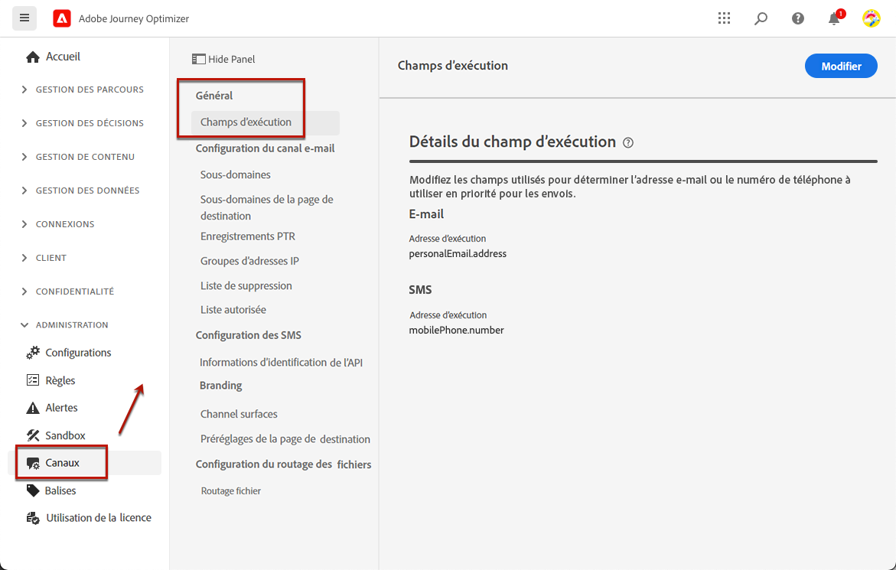
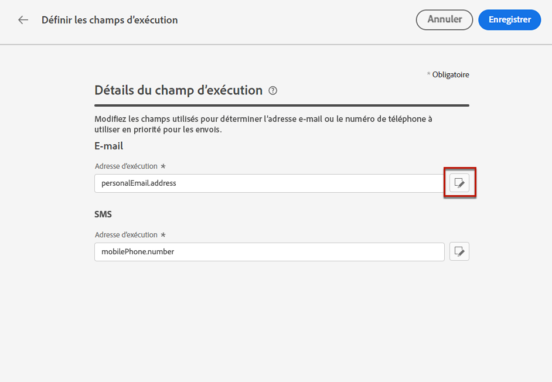
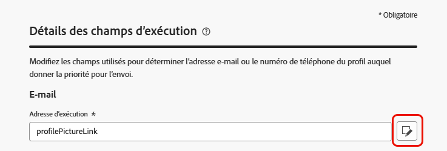
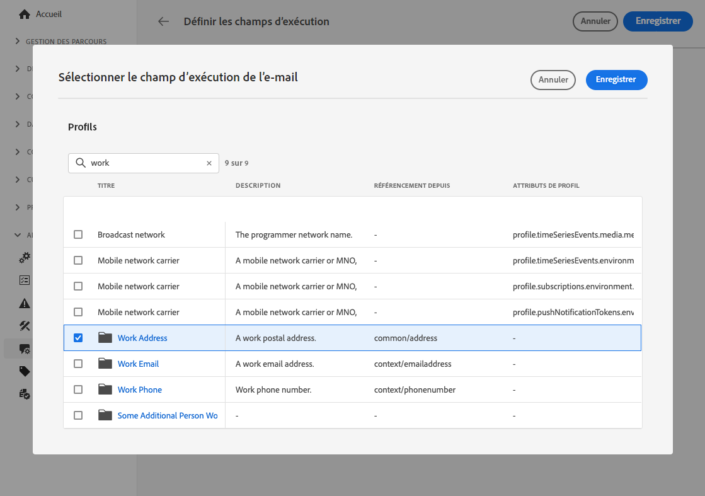
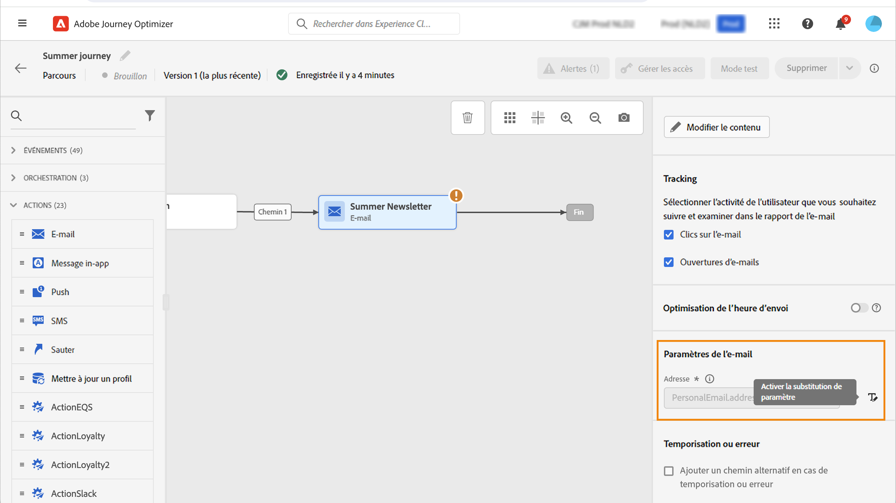
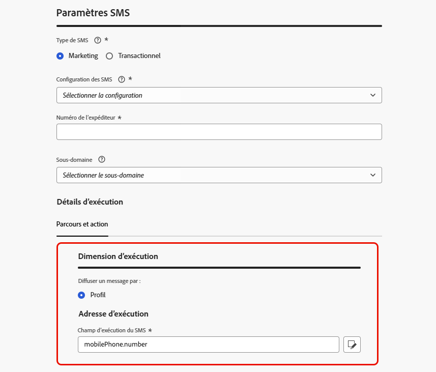
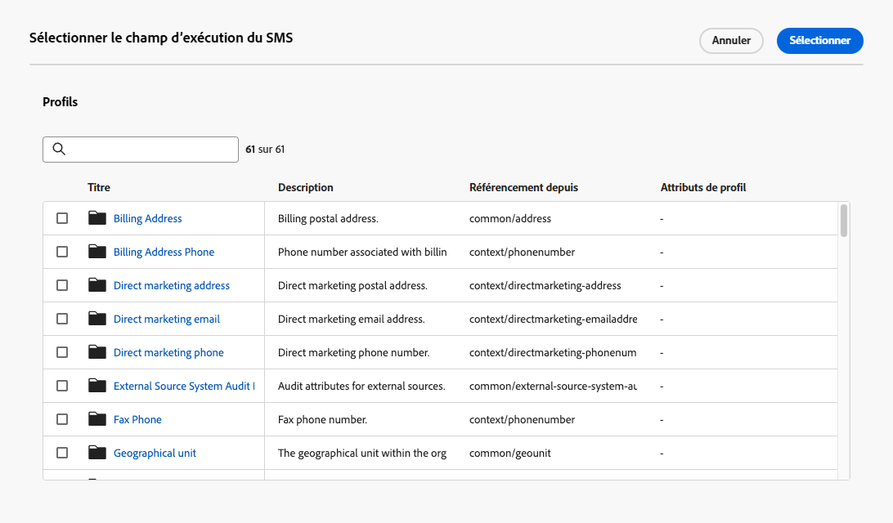

# Gérer les champs d’exécution par défaut {#change-primary-email}

>[!CONTEXTUALHELP]
>id="ajo_admin_execution_address"
>title="Définir l’adresse à utiliser"
>abstract="Lorsque plusieurs adresses e-mail ou numéros de téléphone sont disponibles dans la base de données (personnel, professionnel, etc.), vous pouvez choisir l’adresse ou le numéro auquel donner la priorité pour l’envoi."

>[!CONTEXTUALHELP]
>id="ajo_admin_execution_address_header"
>title="Définir l’adresse à utiliser"
>abstract="Modifiez les champs utilisés pour déterminer l’adresse e-mail ou le numéro de téléphone du profil auquel donner la priorité pour l’envoi."

Lorsque vous ciblez un profil, plusieurs adresses e-mail ou numéros de téléphone peuvent être disponibles dans la base de données (adresse e-mail professionnelle, numéro de téléphone personnel, etc.).

Dans ce cas, [!DNL Journey Optimizer] utilise des **[!UICONTROL champs d’exécution]** pour déterminer l’adresse e-mail ou le numéro de téléphone à utiliser en priorité à partir du service de profil.

Pour vérifier les champs actuellement utilisés par défaut, accédez au menu **[!UICONTROL Administration]** > **[!UICONTROL Canaux]** > **[!UICONTROL Paramètres généraux]** > **[!UICONTROL Champs d’exécution]**.

{width=90%}

>[!NOTE]
>
>Les champs d’exécution sont disponibles pour les canaux E-mail, SMS et WhatsApp.

Les valeurs actuelles sont utilisées pour toutes les diffusions au niveau de la sandbox. Vous pouvez mettre à jour ces champs si nécessaire.

Dans la plupart des cas, vous modifiez globalement un champ d’exécution et définissez une valeur qui doit être utilisée pour tous les e-mails, SMS, messages WhatsApp.

## Mettre à jour les paramètres d’administration {#admin-settings}

Pour modifier globalement les champs d’exécution au niveau de la sandbox, procédez comme suit :

1. Accédez au menu **[!UICONTROL Canaux]** > **[!UICONTROL Paramètres généraux]** > **[!UICONTROL Champs d’exécution]**.

1. Cliquez sur **[!UICONTROL Modifier]** pour modifier les valeurs par défaut.

   {width=70%}

1. Cliquez sur le champ actif ou sur l’icône de modification pour sélectionner un nouveau champ.

   {width=70%}

1. La liste des champs XDM de type e-mail disponibles s&#39;affiche. Sélectionnez le champ à utiliser.

   {width=90%}

1. Cliquez sur **[!UICONTROL Enregistrer]** pour confirmer votre choix.

Le champ d&#39;exécution est mis à jour et sera désormais utilisé comme adresse principale.

<!--1. You can also select an additional field to use as secondary email address. This allows you to determine which field to use if the primary field is empty for a profile. -->

## Remplacer le champ d’exécution par défaut dans les paramètres de parcours {#override-execution-address-journey}

>[!CONTEXTUALHELP]
>id="ajo_journey_execution_address"
>title="Définir une valeur personnalisée"
>abstract="Dans certains cas particuliers, vous pouvez remplacer la valeur de champ d’exécution par défaut. Utilisez l’icône **Activer le remplacement du paramètre** à droite de ce champ pour définir une adresse e-mail ou un numéro de téléphone personnalisé à prioriser pour l’envoi."

Pour des cas d’utilisation spécifiques, vous pouvez remplacer le champ d’exécution défini globalement et définir une valeur différente au niveau du parcours.

Par exemple, cette valeur peut être utile pour effectuer les actions suivantes :

* Tester votre diffusion. Vous pouvez ajouter votre adresse e-mail ou votre numéro de téléphone : une fois que vous avez publié le parcours, l’e-mail, le SMS ou le message WhatsApp vous est envoyé.
* Envoyer un message aux personnes abonnées d’une liste. En savoir plus sur [ce cas d’utilisation](../building-journeys/message-to-subscribers-uc.md).

Lors de l’ajout d’une action **[!UICONTROL E-mail]**, **[!UICONTROL SMS]** ou **[!UICONTROL WhatsApp]** à un [parcours](../email/create-email.md#create-email), l’adresse e-mail ou le numéro de téléphone principal s’affiche sous les paramètres avancés du parcours.

Pour remplacer cette valeur, cliquez sur l’icône **[!UICONTROL Activer le remplacement de paramètre]** à droite du champ.

{width=85%}

>[!CAUTION]
>
>Le remplacement de l’adresse e-mail ou du numéro de téléphone ne doit être utilisé que pour des cas d’utilisation spécifiques. La plupart du temps, il n’est pas nécessaire d’apporter des modifications, car la valeur définie comme adresse principale dans les **[!UICONTROL Champs d’exécution]** au niveau du sandbox est celle qui doit être utilisée. [En savoir plus](#change-primary-email)

## Remplacer le champ d’exécution par défaut dans la configuration des canaux {#override-execution-address-channel-config}

>[!CONTEXTUALHELP]
>id="ajo_email_config_execution_address"
>title="Remplacer l’adresse d’exécution par défaut à utiliser"
>abstract="Lorsque plusieurs adresses e-mail ou numéros de téléphone sont disponibles dans la base de données (personnels, professionnels, etc.), vous pouvez choisir l’adresse ou le numéro à privilégier pour l’envoi. L’adresse principale est définie au niveau du sandbox, mais vous pouvez remplacer ici le paramètre par défaut pour cette configuration des canaux spécifique."

Vous pouvez modifier l’adresse d’exécution par défaut pour une [configuration de canal](channel-surfaces.md) E-mail, SMS ou WhatsApp spécifique.

Pour ce faire, accédez à la section **[!UICONTROL Dimension d’exécution]** et modifiez le champ dédié sous **[!UICONTROL Adresse d’exécution]**.

>[!NOTE]
>
>Pour le [canal WhatsApp](../whatsapp/whatsapp-configuration.md#whatsapp-configuration), le **[!UICONTROL champ d’exécution WhatsApp]** se trouve dans la section **[!UICONTROL Paramètres WhatsApp]**.

{width=85%}

Sélectionnez ensuite un élément dans la liste des champs XDM de type e-mail disponibles.

Le champ d’exécution est mis à jour, puis utilisé comme adresse principale pour les campagnes ou les parcours utilisant cette configuration des canaux. Il remplace le [paramètre général](#admin-settings) au niveau du sandbox.

<!--[Learn more on the execution address in the email configuration ](../email/email-settings.md#execution-address)-->
