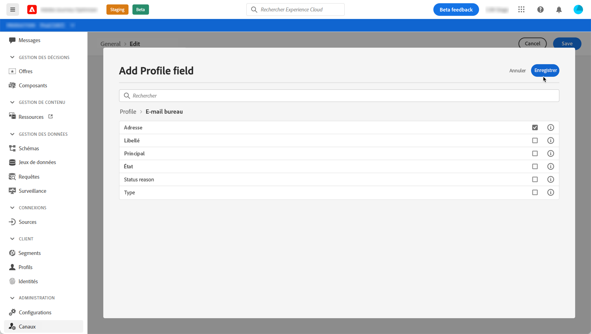

# Modifier les adresses email Principales

Lorsque vous ciblez un profil, plusieurs adresses e-mail peuvent être disponibles dans la base de données (adresse e-mail personnelle, professionnelle, etc.).

Avec Journey Optimizer, vous pouvez déterminer l&#39;adresse e-mail à utiliser à partir du service de profil et établir la priorité lorsque plusieurs adresses sont disponibles. Pour ce faire, procédez comme suit :

1. Accédez au menu **[!UICONTROL Canaux]** `>` **[!UICONTROL Général]** .
1. Le champ actuellement utilisé par défaut pour déterminer les adresses e-mail des profils s&#39;affiche dans cet écran. Cliquez sur **[!UICONTROL Modifier]** pour le modifier.

   

1. Cliquez sur le bouton de modification pour sélectionner le nouveau champ à utiliser comme adresse e-mail principale.

   

1. La liste des champs XDM de type e-mail disponibles s&#39;affiche. Sélectionnez le champ à utiliser, puis cliquez sur **[!UICONTROL Enregistrer]**.

   

<!--1. You can also select an additional field to use as secondary email address. This allows you to determine which field to use if the primary field is empty for a profile. >> will be done later on-->
