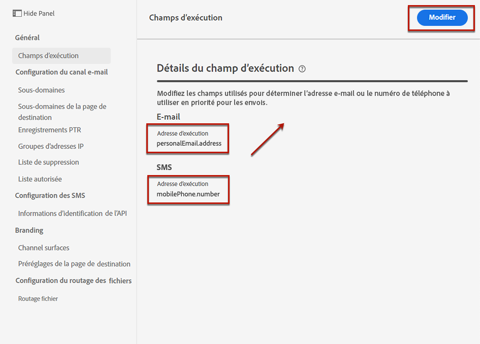

# Modifier les adresses d’exécution {#change-primary-email}

>[!CONTEXTUALHELP]
>id="ajo_admin_execution_address"
>title="Définir l’adresse à utiliser"
>abstract="Lorsque plusieurs adresses e-mail ou numéros de téléphone sont disponibles dans la base de données (personnel, professionnel, etc.), vous pouvez choisir l’adresse ou le numéro auquel donner la priorité pour l’envoi."

>[!CONTEXTUALHELP]
>id="ajo_admin_execution_address_header"
>title="Définir l’adresse à utiliser"
>abstract="Modifiez les champs utilisés pour déterminer l’adresse e-mail ou le numéro de téléphone du profil auquel donner la priorité pour l’envoi."

Lorsque vous ciblez un profil, plusieurs adresses e-mail ou numéros de téléphone peuvent être disponibles dans la base de données (adresse e-mail professionnelle, numéro de téléphone personnel, etc.).

Dans ce cas, [!DNL Journey Optimizer] utilise des **[!UICONTROL champs d’exécution]** pour déterminer l’adresse e-mail ou le numéro de téléphone à utiliser en priorité à partir du service de profil.

Pour vérifier les champs actuellement utilisés par défaut, accédez au menu **[!UICONTROL Administration]** > **[!UICONTROL Canaux]** > **[!UICONTROL Paramètres généraux]** > **[!UICONTROL Champs d’exécution]**.

Les valeurs actuelles sont utilisées pour toutes les diffusions au niveau de la sandbox. Vous pouvez mettre à jour ces champs si nécessaire.

Dans la plupart des cas, vous modifiez globalement un champ d’exécution et définissez une valeur qui doit être utilisée pour tous les e-mails ou SMS. <!--[Learn how](#admin-settings)-->

<!--In some specific use cases only, you can override the value set globally and define a different value at the journey level. [Learn more](#journey-parameters)-->

## Mettre à jour les paramètres d’administration {#admin-settings}

Pour modifier globalement les champs d’exécution au niveau de la sandbox, procédez comme suit :

1. Accédez au menu **[!UICONTROL Canaux]** > **[!UICONTROL Paramètres généraux]** > **[!UICONTROL Champs d’exécution]**.

1. Cliquez sur **[!UICONTROL Modifier]** pour modifier les valeurs par défaut.

   

1. Cliquez sur le champ actif ou sur l’icône de modification pour sélectionner un nouveau champ.

   

1. La liste des champs XDM de type e-mail disponibles s&#39;affiche. Sélectionnez le champ à utiliser.

   

1. Cliquez sur **[!UICONTROL Enregistrer]** pour confirmer votre choix.

Le champ d&#39;exécution est mis à jour et sera désormais utilisé comme adresse principale.

<!--1. You can also select an additional field to use as secondary email address. This allows you to determine which field to use if the primary field is empty for a profile. -->

## Remplacer une valeur dans les paramètres de parcours {#journey-parameters}

Pour des cas d’utilisation spécifiques uniquement, vous pouvez remplacer le champ d’exécution défini globalement et définir une valeur différente au niveau du parcours, en particulier pour le canal e-mail.

Lors de l’ajout d’une action **[!UICONTROL E-mail]** à un [parcours](../email/create-email.md#create-email-journey-campaign), l’adresse e-mail principale s’affiche sous les paramètres avancés du parcours.

Dans certains contextes spécifiques, vous pouvez remplacer cette valeur en cliquant sur l’icône **[!UICONTROL Activer le remplacement du paramètre]** à droite du champ **[!UICONTROL Adresse]**.

>[!CAUTION]
>
>Le remplacement de l’adresse e-mail ne doit être utilisé que pour des cas d’utilisation spécifiques. La plupart du temps, il n’est pas nécessaire de modifier l’adresse e-mail, car la valeur définie comme adresse principale dans les **[!UICONTROL Champs d’exécution]** est celle qui doit être utilisée.

Par exemple, cette valeur peut être utile pour effectuer les actions suivantes :

* Tesert un e-mail. Vous pouvez ajouter votre adresse e-mail : une fois que vous avez publié le parcours, l’e-mail vous est envoyé.
* Envoyer un message aux personnes abonnées à une liste. En savoir plus sur [ce cas d’utilisation](../building-journeys/message-to-subscribers-uc.md).
