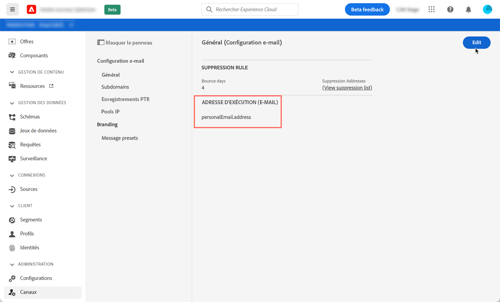
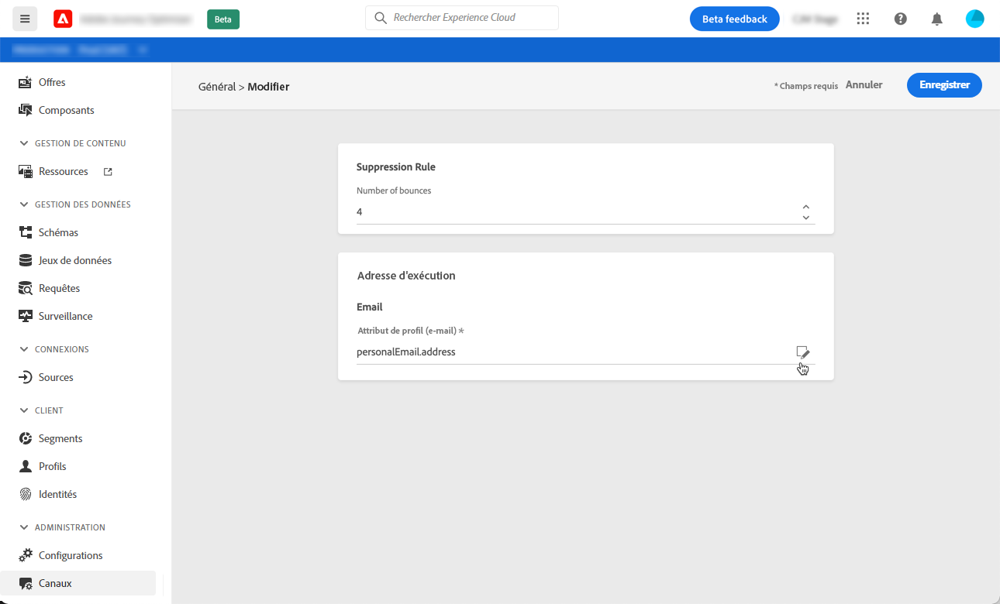

# Détermination des adresses Principales des profils

Lorsque vous cible un profil, plusieurs adresses électroniques peuvent être disponibles dans la base de données (adresse électronique personnelle, professionnelle, etc.).

Avec Journey Optimizer, vous pouvez déterminer l’adresse électronique à utiliser à partir du service de profil et établir des priorités lorsque plusieurs adresses sont disponibles. Pour ce faire, procédez comme suit :

1. Accédez au menu Paramètres / Paramètres généraux.
1. Le champ Adresses d&#39;exécution indique le champ actuellement utilisé par défaut pour déterminer les adresses électroniques des profils. Cliquez sur le bouton Modifier pour le modifier.

1. Cliquez sur le bouton Modifier pour sélectionner le nouveau champ à utiliser comme adresse de courriel Principale.

1. La liste de tous les champs XDM de type adresse électronique s&#39;affiche. Sélectionnez le champ à utiliser, puis cliquez sur Ajouter.

   -SCREENSHOT-

!aucun champ xdm disponible sur la scène

1. Vous pouvez également sélectionner un champ supplémentaire à utiliser comme adresse électronique secondaire. Cela vous permet de déterminer le champ à utiliser si le champ Principal est vide pour un profil.
